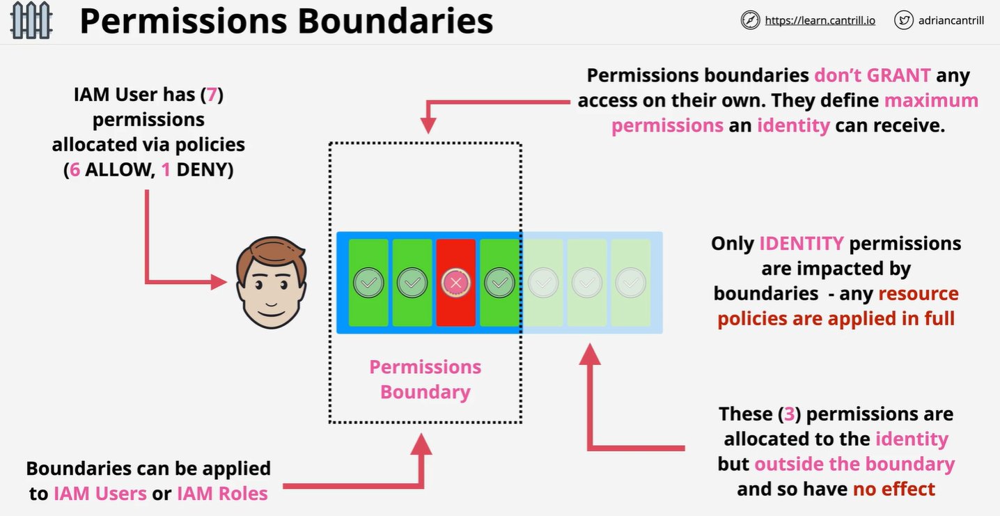
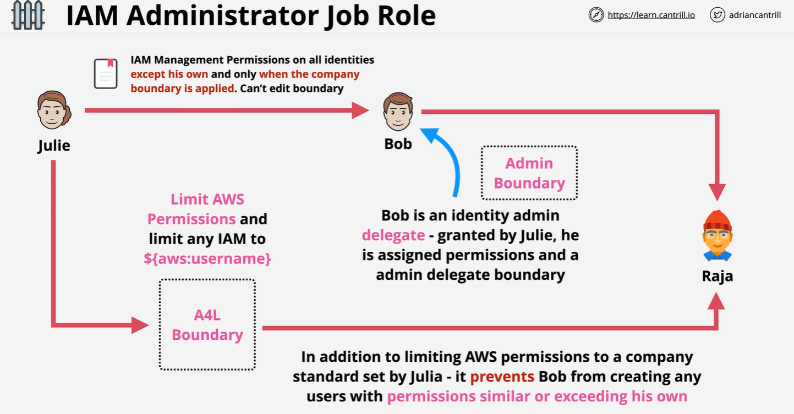

# ♉ **IAM Permissions Boundary in AWS**

_Advanced control over what users and roles are **allowed to do, even with full permissions**_

---

<div align="center" style="padding: 0 20px;">
  
</div>

---

## 🔐 **What Is a Permissions Boundary?**

A **Permissions Boundary** is an **advanced IAM feature** used to define the **maximum set of permissions** an IAM user or role can ever get—even if their identity-based policy grants more.

> 🧠 **Analogy**:  
> Think of it like a **ceiling**—no matter how high a user jumps (via permissions), they can’t go beyond the boundary.

### Key Concepts

- 🚫 **It doesn't grant permissions**  
  — it only restricts them.
- ✅ **Effective permissions** = what’s allowed by **both**:
  - Identity-based policy
  - Permissions boundary

---

## 🧰 **Use Cases for Permissions Boundaries**

| Scenario                                   | Why It's Useful                                                                |
| ------------------------------------------ | ------------------------------------------------------------------------------ |
| 🧑‍💼 Delegate IAM access to junior admins | Let them create/manage users but **enforce limits** on what those users can do |
| 🚨 Protect Production Resources            | Prevent elevated privileges in sensitive environments                          |
| 🛡️ Prevent Misuse                          | Ensure even full-access users/roles **can’t go beyond what’s allowed**         |

---

## ⚙️ **How It Works (The Math Behind It)**

```text
Effective Permissions = Identity Policy ∩ Permissions Boundary
```

Only **actions allowed by BOTH** the identity-based policy **and** the boundary are permitted.

---

## 🔎 **Simple Example: Restrict S3 Bucket Creation to `us-east-1`**

### 🎯 Goal

Limit an admin named **Hady** to only create S3 buckets in `us-east-1`.

---

### ✅ Step 1: Create a Boundary Policy

```json
{
  "Version": "2012-10-17",
  "Statement": [
    {
      "Effect": "Allow",
      "Action": "s3:CreateBucket",
      "Resource": "*",
      "Condition": {
        "StringEquals": {
          "s3:LocationConstraint": "us-east-1"
        }
      }
    }
  ]
}
```

📌 Save it as: `CreateS3BucketBoundary`

---

### ✅ Step 2: Attach the Boundary to User Hady

```bash
aws iam put-user-permissions-boundary \
  --user-name Hady \
  --permissions-boundary arn:aws:iam::AccountID:policy/CreateS3BucketBoundary
```

---

### ✅ Step 3: Assign a Broad Identity-Based Policy

```json
{
  "Version": "2012-10-17",
  "Statement": [
    {
      "Effect": "Allow",
      "Action": "s3:*",
      "Resource": "*"
    }
  ]
}
```

Even though this policy allows all S3 actions, **Hady** will only be allowed to create buckets in `us-east-1`.

✅ **Why?**  
Because the permissions boundary **filters out anything else**!

---

## 🧪 **Full Use Case: Admin + User Setup with Boundaries (Fully Explained)**

<div align="center">
  
</div>

---

Let’s walk through how you can **securely delegate IAM permissions** to a sub-admin like `bob` who can create other users (like `hady`), while ensuring:

- `bob` can't assign dangerous permissions
- `hady` stays within a safe, controlled permission set

We’ll enforce this using **IAM permissions boundaries**.

---

### 👨‍💼 Step 1: Create Admin (`bob`) with Boundaries

You, as the root or super-admin, will first create `bob`—but you will **restrict him** using a permissions boundary (`adminboundary`) so he doesn’t get out of control.

---

#### ✅ 1.1 Create `bob`

```bash
aws iam create-user --user-name bob
```

➡️ Creates the IAM user `bob`.

---

#### ✅ 1.2 Attach Admin Policy

```bash
aws iam put-user-policy --user-name bob \
--policy-name AdminPolicy \
--policy-document '{
  "Version": "2012-10-17",
  "Statement": [
    {
      "Sid": "IAM",
      "Effect": "Allow",
      "Action": "iam:*",
      "Resource": "*"
    },
    {
      "Sid": "CloudWatchLimited",
      "Effect": "Allow",
      "Action": [
        "cloudwatch:GetDashboard",
        "cloudwatch:GetMetricData",
        "cloudwatch:ListDashboards",
        "cloudwatch:GetMetricStatistics",
        "cloudwatch:ListMetrics"
      ],
      "Resource": "*"
    }
  ]
}'
```

🧠 This policy gives `bob`:

- Full IAM access: create users, attach policies, etc.
- Limited CloudWatch read access: just to monitor metrics.

But this policy **alone would make him too powerful**—so we attach a boundary next.

---

#### ✅ 1.3 Attach `adminboundary` to `bob`

```bash
aws iam put-user-permissions-boundary --user-name bob \
--permissions-boundary arn:aws:iam::MANAGEMENTACCOUNTNUMBER:policy/adminboundary
```

🧠 Now, no matter how permissive the above policy is, `bob` can **only do what’s inside the boundary below**.

---

📜 **`adminboundary` policy**  
_(Defines what `bob` is allowed to do)_

```json
{
  "Version": "2012-10-17",
  "Statement": [
    {
      "Sid": "CreateOrChangeOnlyWithBoundary",
      "Effect": "Allow",
      "Action": [
        "iam:CreateUser",
        "iam:DeleteUserPolicy",
        "iam:AttachUserPolicy",
        "iam:DetachUserPolicy",
        "iam:PutUserPermissionsBoundary",
        "iam:PutUserPolicy"
      ],
      "Resource": "*",
      "Condition": {
        "StringEquals": {
          "iam:PermissionsBoundary": "arn:aws:iam::MANAGEMENTACCOUNTNUMBER:policy/userboundary"
        }
      }
    },
    {
      "Sid": "CloudWatchAndOtherIAMTasks",
      "Effect": "Allow",
      "Action": [
        "cloudwatch:*",
        "iam:GetUser",
        "iam:ListUsers",
        "iam:DeleteUser",
        "iam:UpdateUser",
        "iam:CreateAccessKey",
        "iam:CreateLoginProfile",
        "iam:GetAccountPasswordPolicy",
        "iam:GetLoginProfile",
        "iam:ListGroups",
        "iam:ListGroupsForUser",
        "iam:CreateGroup",
        "iam:GetGroup",
        "iam:DeleteGroup",
        "iam:UpdateGroup",
        "iam:CreatePolicy",
        "iam:DeletePolicy",
        "iam:DeletePolicyVersion",
        "iam:GetPolicy",
        "iam:GetPolicyVersion",
        "iam:GetUserPolicy",
        "iam:GetRolePolicy",
        "iam:ListPolicies",
        "iam:ListPolicyVersions",
        "iam:ListEntitiesForPolicy",
        "iam:ListUserPolicies",
        "iam:ListAttachedUserPolicies",
        "iam:ListRolePolicies",
        "iam:ListAttachedRolePolicies",
        "iam:SetDefaultPolicyVersion",
        "iam:SimulatePrincipalPolicy",
        "iam:SimulateCustomPolicy"
      ],
      "NotResource": "arn:aws:iam::MANAGEMENTACCOUNTNUMBER:user/bob"
    },
    {
      "Sid": "NoBoundaryPolicyEdit",
      "Effect": "Deny",
      "Action": [
        "iam:CreatePolicyVersion",
        "iam:DeletePolicy",
        "iam:DeletePolicyVersion",
        "iam:SetDefaultPolicyVersion"
      ],
      "Resource": ["arn:aws:iam::MANAGEMENTACCOUNTNUMBER:policy/userboundary"]
    },
    {
      "Sid": "NoBoundaryUserDelete",
      "Effect": "Deny",
      "Action": "iam:DeleteUserPermissionsBoundary",
      "Resource": "*"
    }
  ]
}
```

🧠 Key behavior:

- ✅ `bob` can **create** users **only if** he attaches `userboundary`
- ❌ `bob` **cannot remove boundaries**
- ❌ `bob` **cannot modify or delete the boundary itself**
- ✅ `bob` cannot escalate his own access (`NotResource`: himself)

---

### 👨‍🔧 Step 2: `bob` Creates a User (`hady`) with a Boundary

Now, `bob` is going to:

1. Create `hady`
2. Give `hady` permissions
3. Attach `userboundary` to `hady` (required)

---

#### ✅ 2.1 Create `hady`

```bash
aws iam create-user --user-name hady
```

➡️ IAM user created by `bob`.

---

#### ✅ 2.2 Attach Policy to `hady`

```bash
aws iam put-user-policy --user-name hady \
--policy-name ManageEC2Policy \
--policy-document '{
  "Version": "2012-10-17",
  "Statement": [
    {
      "Sid": "ManageEC2",
      "Effect": "Allow",
      "Action": "ec2:*",
      "Resource": "*",
      "Condition": {
        "StringEquals": {
          "aws:RequestedRegion": "us-west-2"
        }
      }
    }
  ]
}'
```

🧠 This policy gives `hady` full EC2 access—but only in region `us-west-2`.  
But this alone doesn’t guarantee safety. That’s why we also apply a **permissions boundary** next.

---

#### ✅ 2.3 Attach `userboundary`

```bash
aws iam put-user-permissions-boundary --user-name hady \
--permissions-boundary arn:aws:iam::MANAGEMENTACCOUNTNUMBER:policy/userboundary
```

✅ This restricts `hady` to what’s inside the `userboundary` policy.

---

📜 **`userboundary` policy**

```json
{
  "Version": "2012-10-17",
  "Statement": [
    {
      "Sid": "ServicesLimitViaBoundaries",
      "Effect": "Allow",
      "Action": ["s3:*", "cloudwatch:*", "ec2:*"],
      "Resource": "*"
    },
    {
      "Sid": "AllowIAMConsoleForCredentials",
      "Effect": "Allow",
      "Action": ["iam:ListUsers", "iam:GetAccountPasswordPolicy"],
      "Resource": "*"
    },
    {
      "Sid": "AllowManageOwnPasswordAndAccessKeys",
      "Effect": "Allow",
      "Action": [
        "iam:*AccessKey*",
        "iam:ChangePassword",
        "iam:GetUser",
        "iam:*ServiceSpecificCredential*",
        "iam:*SigningCertificate*"
      ],
      "Resource": ["arn:aws:iam::*:user/${aws:username}"]
    }
  ]
}
```

🧠 What this boundary does:

- ✅ Allows only `s3`, `ec2`, and `cloudwatch` actions
- ❌ Blocks access to anything outside those services
- ✅ Lets `hady` manage his own credentials/password

---

### ✅ Final Behavior

| User   | Permissions Policy                | Boundary Applied | Final Result                                                    |
| ------ | --------------------------------- | ---------------- | --------------------------------------------------------------- |
| `bob`  | Can manage IAM users and policies | `adminboundary`  | Can only create users that have `userboundary` enforced         |
| `hady` | Can access EC2 in `us-west-2`     | `userboundary`   | Limited to only EC2, S3, and CloudWatch; only in allowed region |

---

### 🔎 **Verify Boundaries**

```bash
aws iam get-user --user-name bob
aws iam get-user-permissions-boundary --user-name bob

aws iam get-user --user-name hady
aws iam get-user-policy --user-name hady --policy-name ManageEC2Policy
aws iam get-user-permissions-boundary --user-name hady
```

---

## 📚 Final Takeaways

- ✅ **Permissions Boundaries** are like safety nets for roles and users.
- 🎯 They help prevent **over-permissioning**, especially in delegated environments.
- 🔐 Powerful for **multi-account**, **delegation**, or **MFA-required scenarios**.
- 🧠 **Effective permissions** = Identity policy ∩ boundary
