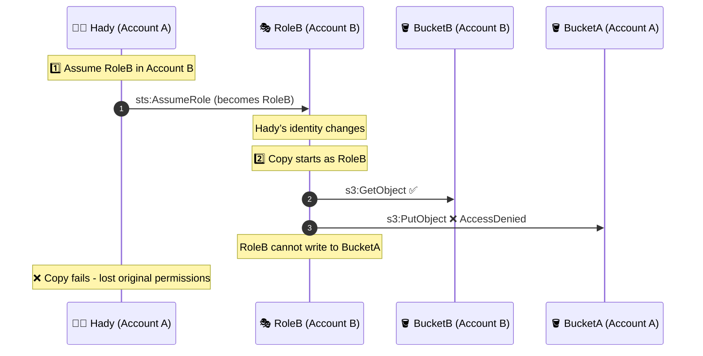
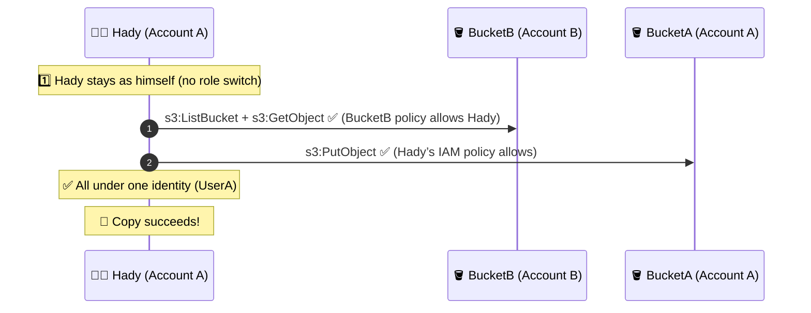

# 🧠 The Scenario

Hady works in **Account A**.
He has full permissions to manage **BucketA** in his own account.
So his IAM policy in Account A looks like this 👇

```json
{
  "Effect": "Allow",
  "Action": ["s3:*"],
  "Resource": "arn:aws:s3:::BucketA/*"
}
```

That means he can **upload, list, delete — everything in BucketA** ✅.
Now his PM says:

> “Copy everything from **BucketB** in Account B → to **BucketA** in Account A.”

So Hady runs:

```bash
aws s3 cp s3://BucketB/reports/ s3://BucketA/inbox/ --recursive
```

---

## ❌ Solution 1: The “Naïve Role Switch” — **Fails**

### 🔹 What Hady Does

1. He **assumes a role** in Account B (called `RoleB`) because BucketB belongs there.
2. `RoleB` only has permission to **read** from `BucketB`.

```bash
aws sts assume-role \
  --role-arn arn:aws:iam::B_ACCOUNT_ID:role/RoleB \
  --role-session-name copySession
```

Then he runs:

```bash
aws s3 cp s3://BucketB/reports/ s3://BucketA/inbox/ --recursive
```

---

### 🔹 What Happens Internally

As soon as Hady assumes the role, his **identity changes** from:

> 👤 `arn:aws:iam::A_ACCOUNT_ID:user/Hady`
> ➜ to
> 🎭 `arn:aws:sts::B_ACCOUNT_ID:assumed-role/RoleB/session-name`

So even though Hady had permissions on **BucketA**,
he temporarily becomes **RoleB** — and **RoleB has zero access** to BucketA.

When AWS processes the copy:

| Step | Bucket  | Check                            | Result                        |
| ---- | ------- | -------------------------------- | ----------------------------- |
| 1    | BucketB | `s3:GetObject` allowed for RoleB | ✅ OK                         |
| 2    | BucketA | `s3:PutObject` for RoleB?        | ❌ Denied (RoleB not allowed) |

Result → `AccessDenied` on **BucketA** ❌

---

### 🔹 Why It Fails

> Because **after assuming RoleB**, Hady is no longer “Hady.”
> The entire copy operation happens as **RoleB**, not as Hady.
>
> → So he **loses his original permissions** on BucketA during the copy.

### 🧭 Visual Diagram



### 🧩 Summary

| Principal during copy | Read BucketB | Write BucketA       | Result  |
| --------------------- | ------------ | ------------------- | ------- |
| **RoleB**             | ✅ Yes       | ❌ No (not allowed) | ❌ FAIL |

---

## ✅ Solution 2: Stay as Yourself (Resource Policy Way) — **Works**

### 🔹 What Hady Does

Instead of assuming any role, Hady stays as **himself (UserA)** in Account A.

So the copy runs as:

> 👤 `arn:aws:iam::A_ACCOUNT_ID:user/Hady`

He already has permission to **write to BucketA** ✅
Now we just need to let him **read from BucketB** (cross-account).

---

### 🔹 Step-by-Step Setup

#### 🧱 Step 1: In Account B → Allow Hady to read BucketB

Update **BucketB’s bucket policy** to grant him access:

```json
{
  "Version": "2012-10-17",
  "Statement": [
    {
      "Effect": "Allow",
      "Principal": { "AWS": "arn:aws:iam::A_ACCOUNT_ID:user/Hady" },
      "Action": ["s3:ListBucket"],
      "Resource": "arn:aws:s3:::BucketB"
    },
    {
      "Effect": "Allow",
      "Principal": { "AWS": "arn:aws:iam::A_ACCOUNT_ID:user/Hady" },
      "Action": ["s3:GetObject"],
      "Resource": "arn:aws:s3:::BucketB/*"
    }
  ]
}
```

Now **BucketB** trusts **Hady** to read.

---

#### 🧱 Step 2: In Account A → Keep existing permissions on BucketA

No changes needed — Hady already has his identity policy to manage BucketA:

```json
{
  "Effect": "Allow",
  "Action": ["s3:PutObject"],
  "Resource": "arn:aws:s3:::BucketA/inbox/*"
}
```

---

#### 🧱 Step 3: Run the command as yourself

No role switching, no temporary credentials:

```bash
aws s3 cp s3://BucketB/reports/ s3://BucketA/inbox/ --recursive
```

✅ Works perfectly!

---

### 🧩 Why It Works

Everything happens under **one identity (Hady)**:

- **BucketB** allows Hady to read (via bucket policy).
- **BucketA** allows Hady to write (via his IAM policy).

No role switch = no lost permissions.

| Principal during copy | Read BucketB            | Write BucketA       | Result     |
| --------------------- | ----------------------- | ------------------- | ---------- |
| **UserA (Hady)**      | ✅ Yes (BucketB policy) | ✅ Yes (IAM policy) | ✅ SUCCESS |

---

### 🧭 Visual Diagram



## 🧭 Final Comparison

| #   | What Hady Did   | Who He Is During Copy | Source Access          | Destination Access    | Result     |
| --- | --------------- | --------------------- | ---------------------- | --------------------- | ---------- |
| 1   | Assumed RoleB   | RoleB (Account B)     | ✅ Can read            | ❌ No write           | ❌ FAIL    |
| 3   | Stayed as UserA | Hady (Account A)      | ✅ BucketB allows Hady | ✅ Already has access | ✅ SUCCESS |

---

## 💡 Key Takeaway

> 👉 When you **assume a role**, AWS replaces your identity.
>
> So even if you had full control over your own bucket,
> you **lose** those permissions until you return to your original identity.
