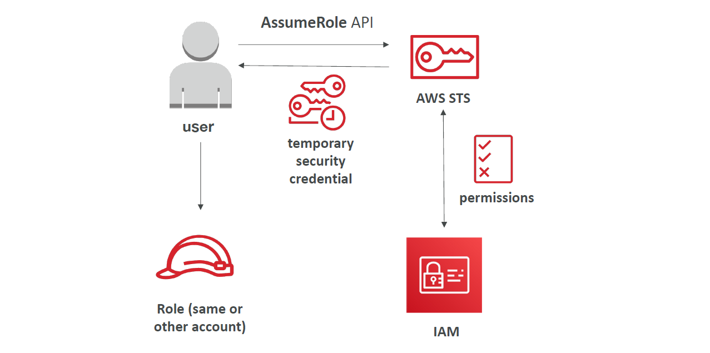
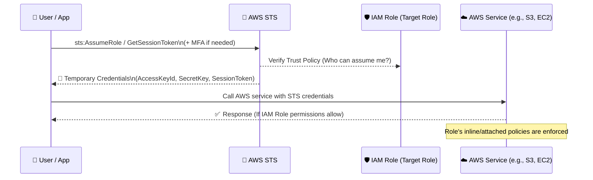

# 🔐 **AWS Security Token Service (STS)**

> _“Secure, short-lived, on-demand credentials—without long-term exposure.”_

---

<div style="text-align: center;">
  
</div>

---

## 📘 **What is AWS STS?**

**AWS Security Token Service (STS)** is a global AWS service that enables you to request **temporary, limited-privilege credentials** for **IAM users**, **federated identities**, or **applications**. These credentials are issued on-demand and **automatically expire**, making them ideal for short-lived operations.

---

## 🌟 **Key Features of STS**

| Feature                             | Description                                                          |
| ----------------------------------- | -------------------------------------------------------------------- |
| 🕒 **Temporary Credentials**        | Valid for 15 minutes to 12 hours (default: 1 hour)                   |
| 🔄 **No Credential Rotation**       | Temporary credentials expire automatically—no manual rotation needed |
| 🌐 **Global Service**               | Can be called from any region using the **global endpoint**          |
| 🔐 **Supports Identity Federation** | External users (Google, AD, etc.) can securely access AWS            |
| ⚙️ **Role-Based Access**            | Easily assume roles across AWS services and accounts                 |

---

## 🎯 **When to Use STS?**

| Use Case                    | Description                                                                   |
| --------------------------- | ----------------------------------------------------------------------------- |
| ✅ **Assume IAM Role**      | Allow a user or service to temporarily take on a different set of permissions |
| 🔁 **Cross-Account Access** | Let users/services in Account A assume roles in Account B                     |
| 🌍 **Federated Identity**   | Allow external users (via SAML, Google, etc.) to temporarily access AWS       |
| 🛠️ **CI/CD or Automation**  | Provide scripts, pipelines, or apps temporary secure access                   |

---

## 🧱 STS APIs Overview

| **API**                      | **Purpose**                                                            |
| ---------------------------- | ---------------------------------------------------------------------- |
| `AssumeRole`                 | Temporarily assume another IAM role (same or cross-account)            |
| `AssumeRoleWithSAML`         | Return credentials for SAML-authenticated users                        |
| `AssumeRoleWithWebIdentity`  | Return credentials from identity providers like Google, Facebook, OIDC |
| `GetSessionToken`            | Get temporary credentials for MFA-authenticated users                  |
| `GetFederationToken`         | For temporary access via federation with inline policy                 |
| `GetCallerIdentity`          | Returns identity info about current caller                             |
| `DecodeAuthorizationMessage` | Decodes encoded Access Denied messages for debugging                   |

---

## 🖼️ How STS Works (Behind the Scenes)



---

## 🔧 **🔁 Step-by-Step: How STS Issues Temporary Credentials**

The process involves **two IAM components**:

1. ✅ The **caller (IAM user, role, federated identity)** must have **an identity-based policy** allowing them to call `sts:AssumeRole` to assume the target role.
2. ✅ The **target IAM role** must have a **trust policy** that explicitly allows the caller to assume it.

### 1️⃣ **Caller Sends `sts:AssumeRole` Request**

The calling entity (an IAM user, Lambda, EC2 role, or external identity) sends a request to STS to assume a specific IAM role.

> this done via the `sts:AssumeRole` API call or `aws sts assume-role` CLI command.

### 2️⃣ **STS Verifies Identity-Based Permissions on the Caller**

The **caller** (e.g., `arn:aws:iam::111111111111:user/John`) must have a policy that **grants permission to call `sts:AssumeRole` on the target role**:

✅ **Caller’s identity-based policy** (attached to user or calling role):

```json
// John's identity-based policy
{
  "Version": "2012-10-17",
  "Statement": [
    {
      "Effect": "Allow",
      "Action": "sts:AssumeRole",
      "Resource": "arn:aws:iam::222222222222:role/AdminRole"
    }
    // ... other statements
  ]
}
```

> This does **not** give them access to what the role _can do_ — it only allows them to **assume it**.

### 3️⃣ **STS Verifies the Trust Policy on the Target Role**

The **target role** must **trust the caller** — this is defined in the role’s **trust policy**.

✅ **Role’s trust policy** (resource-based):

```json
// AdminRole's trust policy
{
  "Version": "2012-10-17",
  "Statement": [
    {
      "Effect": "Allow",
      "Principal": {
        "AWS": "arn:aws:iam::111111111111:user/John"
      },
      "Action": "sts:AssumeRole"
    }
  ]
}
```

> 📌 This is where **the role says who is allowed to assume it**.  
> 📌 If this doesn’t match, the assume role request is denied **even if the caller has `sts:AssumeRole` allowed in their policy**.

### 4️⃣ **STS Issues Temporary Security Credentials**

If both previous checks pass:

- ✅ The caller is **authorized to call `sts:AssumeRole`**
- ✅ The target role **trusts the caller**

Then **STS returns temporary credentials**:

```json
{
  "AccessKeyId": "ASIA...",
  "SecretAccessKey": "abc...",
  "SessionToken": "IQoJb...",
  "Expiration": "2025-06-04T13:00:00Z"
}
```

### 5️⃣ **Caller Uses Temporary Credentials**

The caller can now interact with AWS services, but **only based on the permissions attached to the role they assumed** (i.e., the **permissions policy of the target role**).

---

## 🔐 Enforcing MFA with STS (Using `GetSessionToken`)

Use MFA to make role assumption more secure:

### 🧾 IAM Policy to Enforce MFA

```json
{
  "Version": "2012-10-17",
  "Statement": [
    {
      "Effect": "Allow",
      "Action": ["ec2:StopInstances", "ec2:TerminateInstances"],
      "Resource": "*",
      "Condition": {
        "Bool": {
          "aws:MultiFactorAuthPresent": "true"
        }
      }
    }
  ]
}
```

### 🔐 GetSessionToken CLI Example

```bash
aws sts get-session-token \
  --serial-number arn:aws:iam::111111111111:mfa/alice \
  --token-code 123456
```

Returns:

```json
{
  "Credentials": {
    "AccessKeyId": "...",
    "SecretAccessKey": "...",
    "SessionToken": "...",
    "Expiration": "2025-06-03T15:00:00Z"
  }
}
```

---

## 🔁 STS Use Cases

### ✅ Cross-Account Role Assumption

- **Scenario**: Account A user needs access to Account B resources.
- Use `AssumeRole` + Trust policy in Account B.

### 🔒 MFA-Protected Access

- Require MFA for sensitive actions like EC2 shutdown.
- Use `GetSessionToken` to obtain temp credentials only after MFA validation.

### 🌍 Identity Federation

- Use **SAML** or **OpenID Connect (OIDC)** for federated logins.
- Ideal for integrating **SSO from Google, Azure AD, Facebook**, etc.

### 🧪 CI/CD Pipelines

- Use STS to inject short-lived credentials into **GitHub Actions**, **CodeBuild**, etc.
- Prevents long-term key exposure in automation environments.

---

## ⏱️ STS Duration Limits

| **API**                     | **Min–Max Duration**  |
| --------------------------- | --------------------- |
| `AssumeRole`                | 15 minutes – 12 hours |
| `AssumeRoleWithSAML`        | 15 minutes – 12 hours |
| `AssumeRoleWithWebIdentity` | 15 minutes – 1 hour   |
| `GetSessionToken`           | 15 minutes – 36 hours |

> ⚠️ Duration must be **explicitly allowed** in the IAM role definition (`"DurationSeconds"`).

---

## 🔑 Sample Code – Assume Role (Python boto3)

```python
import boto3

sts_client = boto3.client('sts')

response = sts_client.assume_role(
    RoleArn='arn:aws:iam::222222222222:role/AdminRole',
    RoleSessionName='DevOpsSession'
)

credentials = response['Credentials']

print("AccessKeyId:", credentials['AccessKeyId'])
print("SecretAccessKey:", credentials['SecretAccessKey'])
print("SessionToken:", credentials['SessionToken'])
```

---

## 🧠 Best Practices with STS

| Practice                          | Description                                             |
| --------------------------------- | ------------------------------------------------------- |
| 🕒 Prefer short session durations | Use the lowest duration possible (e.g. 15–30 min)       |
| 🔐 Always enforce MFA             | Especially for roles with high privilege                |
| 📜 Use session tags               | Improve audit trail and traceability                    |
| 🔍 Monitor via CloudTrail         | Track `sts:AssumeRole` events and anomalies             |
| ❌ Avoid hardcoded credentials    | Never embed STS keys into code or config files          |
| 🔄 Rotate roles per application   | Use **role-per-function** model to isolate blast radius |

---

## 🚨 IAM Security Reminders

- ❌ **Never use root credentials**
- ✅ Enable **MFA** on all user accounts and root account
- 🧼 Grant **least privilege**—never `Action: "*"` unless strictly necessary
- 🕵️‍♂️ Log and audit with **CloudTrail**
- 🛡️ Use **IAM Roles for EC2, Lambda, ECS Tasks, CodeBuild**
- 🧼 **Do NOT reuse roles across applications**. One role = One purpose.

---

## 📚 Summary Table

| Feature                | STS Capability                         |
| ---------------------- | -------------------------------------- |
| Credential Type        | Temporary                              |
| Rotation Required      | ❌ No                                  |
| Duration Control       | ✅ 15 mins to 12+ hours                |
| Supported Integrations | IAM, Cognito, OIDC, SAML, Web Identity |
| Security Level         | 🔐 High (with MFA & short duration)    |
| Best For               | Cross-account access, SSO, CI/CD, MFA  |
