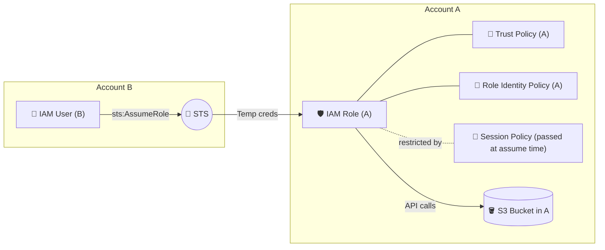
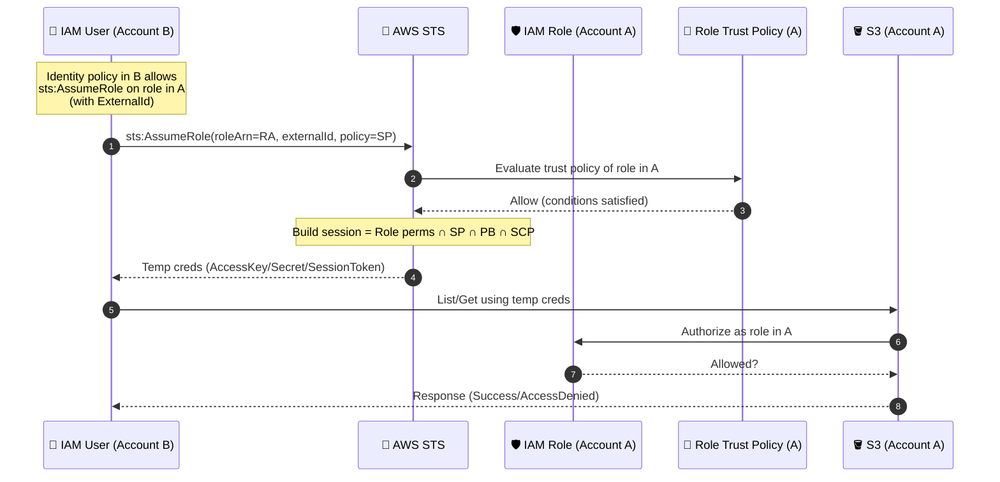

# 🏗️ What you’ll build



---

## 🧩 Prerequisites

- Two AWS accounts:

  - **Account A (target)** → hosts the **IAM role** + **S3 bucket**
  - **Account B (caller)** → has the **IAM user**

- AWS CLI v2 installed and configured with **two named profiles**:

  - `acctA` → credentials for **Account A**
  - `acctB` → credentials for **Account B**

- Choose a **region** (e.g., `eu-central-1`) and a **globally unique** bucket name.

> Tip: If you don’t have profiles yet, run `aws configure --profile acctA` and `aws configure --profile acctB`.

---

## 🛠️ Step 0 — Export variables (for copy/paste comfort)

```bash
# 👉 Edit these four lines:
export AID="111111111111"            # Account A ID
export BID="222222222222"            # Account B ID
export REGION="eu-central-1"         # Choose your region
export BUCKET="prod-a-data-bucket-$(date +%s)"  # unique bucket name

# Optional names
export ROLE_NAME="CrossAccountAccessRoleA"
export USER_NAME="Hady"
```

---

## 🪣 Step 1 — In Account A: Create an S3 bucket + sample data

```bash
# Create bucket (variant for non-us-east-1)
aws s3api create-bucket \
  --profile acctA \
  --bucket "$BUCKET" \
  --region "$REGION" \
  --create-bucket-configuration LocationConstraint="$REGION"

# If REGION=us-east-1, use this instead:
# aws s3api create-bucket --profile acctA --bucket "$BUCKET"

# Put some sample objects
aws s3 cp /dev/null "s3://${BUCKET}/reports/ok.txt" --profile acctA
aws s3 cp /dev/null "s3://${BUCKET}/private/secret.txt" --profile acctA
```

---

## 🛡️ Step 2 — In Account A: Create the IAM role + trust policy + role permissions

### 🔹 2.1 Create **trust policy** (A) that allows B to assume

```bash
cat > a-role-trust-policy.json <<'JSON'
{
  "Version": "2012-10-17",
  "Statement": [
    {
      "Sid": "TrustAccountBToAssume",
      "Effect": "Allow",
      "Principal": { "AWS": "arn:aws:iam::BID:root" },
      "Action": "sts:AssumeRole",
      "Condition": {
        "StringEquals": { "sts:ExternalId": "my-external-id" }
      }
    }
  ]
}
JSON
sed -i.bak "s/BID/$BID/g" a-role-trust-policy.json
```

> ✅ You can narrow `Principal` to a **specific user/role** in B later for least privilege.

### 🔹 2.2 Create the **role** with that trust policy

```bash
aws iam create-role \
  --profile acctA \
  --role-name "$ROLE_NAME" \
  --assume-role-policy-document file://a-role-trust-policy.json
```

### 🔹 2.3 Attach a **role identity policy** (A) giving S3 access (baseline)

We’ll allow list + get on the bucket, but only under `reports/` (good baseline).

```bash
cat > a-role-inline-policy.json <<JSON
{
  "Version": "2012-10-17",
  "Statement": [
    {
      "Sid": "AllowListBucket",
      "Effect": "Allow",
      "Action": "s3:ListBucket",
      "Resource": "arn:aws:s3:::$BUCKET",
      "Condition": { "StringLike": { "s3:prefix": ["reports/*"] } }
    },
    {
      "Sid": "AllowGetReportsObjects",
      "Effect": "Allow",
      "Action": ["s3:GetObject"],
      "Resource": "arn:aws:s3:::$BUCKET/reports/*"
    }
  ]
}
JSON

aws iam put-role-policy \
  --profile acctA \
  --role-name "$ROLE_NAME" \
  --policy-name "${ROLE_NAME}-inline" \
  --policy-document file://a-role-inline-policy.json
```

---

## 👤 Step 3 — In Account B: Create the IAM user + allow `sts:AssumeRole`

```bash
# Create user (skip if you already have one)
aws iam create-user --profile acctB --user-name "$USER_NAME"

# Attach an inline policy that allows AssumeRole into A
cat > b-user-assume-role-policy.json <<'JSON'
{
  "Version": "2012-10-17",
  "Statement": [
    {
      "Sid": "AllowAssumeRoleIntoAccountA",
      "Effect": "Allow",
      "Action": "sts:AssumeRole",
      "Resource": "arn:aws:iam::AID:role/ROLE_NAME",
      "Condition": {
        "StringEquals": { "sts:ExternalId": "my-external-id" }
      }
    }
  ]
}
JSON
sed -i.bak "s/AID/$AID/g; s/ROLE_NAME/$ROLE_NAME/g" b-user-assume-role-policy.json

aws iam put-user-policy \
  --profile acctB \
  --user-name "$USER_NAME" \
  --policy-name "AllowAssumeRoleIntoAccountA" \
  --policy-document file://b-user-assume-role-policy.json
```

> 🔐 Want MFA? Add `"Bool": {"aws:MultiFactorAuthPresent": "true"}` in that policy **and** require MFA in the trust policy conditions.

---

## 🔐 Step 4 — From Account B: Assume the role (optionally pass a session policy)

We’ll pass a **session policy** to further restrict (e.g., only `reports/*`).
Remember: **Session policy can only reduce**, never expand, the role’s base permissions.

```bash
cat > a-session-policy.json <<JSON
{
  "Version": "2012-10-17",
  "Statement": [
    {
      "Sid": "SessionListBucketReportsOnly",
      "Effect": "Allow",
      "Action": "s3:ListBucket",
      "Resource": "arn:aws:s3:::$BUCKET",
      "Condition": { "StringLike": { "s3:prefix": ["reports/*"] } }
    },
    {
      "Sid": "SessionGetReportsOnly",
      "Effect": "Allow",
      "Action": ["s3:GetObject"],
      "Resource": "arn:aws:s3:::$BUCKET/reports/*"
    }
  ]
}
JSON
```

### 🔹 4.1 Call STS AssumeRole and capture creds into a new profile (`assumed-a`)

```bash
CREDS_JSON=$(aws sts assume-role \
  --profile acctB \
  --role-arn "arn:aws:iam::${AID}:role/${ROLE_NAME}" \
  --role-session-name "hady-session" \
  --external-id "my-external-id" \
  --policy file://a-session-policy.json)

AKID=$(echo "$CREDS_JSON" | jq -r '.Credentials.AccessKeyId')
SECK=$(echo "$CREDS_JSON" | jq -r '.Credentials.SecretAccessKey')
TOKEN=$(echo "$CREDS_JSON" | jq -r '.Credentials.SessionToken')

aws configure set aws_access_key_id "$AKID" --profile assumed-a
aws configure set aws_secret_access_key "$SECK" --profile assumed-a
aws configure set aws_session_token "$TOKEN" --profile assumed-a
aws configure set region "$REGION" --profile assumed-a
```

Sanity check:

```bash
aws sts get-caller-identity --profile assumed-a
```

You should see the **ARN of the role** in Account A.

---

## ✅ Step 5 — Test permissions

### 🔹 5.1 Bucket list (root)

```bash
aws s3 ls "s3://$BUCKET" --profile assumed-a
```

✅ **Should succeed**, but only list keys under `reports/` due to prefix condition when listing.

### 🔹 5.2 List allowed prefix

```bash
aws s3 ls "s3://$BUCKET/reports/" --profile assumed-a
```

✅ Should **succeed**.

### 🔹 5.3 List/Access a blocked prefix

```bash
aws s3 ls "s3://$BUCKET/private/" --profile assumed-a || true
aws s3 cp "s3://$BUCKET/private/secret.txt" - --profile assumed-a || true
```

🚫 Should **fail** (blocked by **session policy** and base role policy).

> 🧠 Remember: **Effective permissions = Role identity policy ∩ Session policy ∩ Permissions boundary (if any) ∩ SCPs (if any)**.

---

## 📊 Sequence diagram (with the entities you asked for)



---

## 🧰 Troubleshooting (DOP-C02 style)

- **`AccessDenied` from STS**
  → Trust policy principal/condition mismatch. Check `Principal`, `sts:ExternalId`, and (if used) MFA conditions on **both** sides.

- **Able to assume, but S3 denied**
  → Check **role identity policy** in A, **session policy** reductions, **permissions boundary**, and **SCPs**. Any explicit **Deny** wins.

- **Wrong bucket listing**
  → Verify your `s3:prefix` condition on `s3:ListBucket`. It limits which keys are **returned** by listing, not which bucket you can call.

- **No `jq` installed**
  → Install it or export creds manually from the JSON output.

---

## 🧹 Cleanup

```bash
# In A: Empty and delete the bucket
aws s3 rm "s3://$BUCKET" --recursive --profile acctA
aws s3api delete-bucket --bucket "$BUCKET" --profile acctA

# In A: Delete inline policy + role
aws iam delete-role-policy --profile acctA --role-name "$ROLE_NAME" --policy-name "${ROLE_NAME}-inline"
aws iam delete-role --profile acctA --role-name "$ROLE_NAME"

# In B: Remove inline policy + delete user (if created for lab)
aws iam delete-user-policy --profile acctB --user-name "$USER_NAME" --policy-name "AllowAssumeRoleIntoAccountA"
aws iam delete-user --profile acctB --user-name "$USER_NAME"
```

---

## 🎓 Exam-ready takeaways

- **Trust policy** decides _who can assume_.
- **Role identity policy** decides _what the role can do_.
- **Session policy** can only **restrict further** at assume time.
- **Effective permissions = intersection** of all of the above (+ PB + SCP).
- **Explicit Deny > Allow** (always).

If you want, I can package this as a **single CloudFormation pair** (one stack per account) so you can spin it up even faster, or add **MFA** and **permissions boundary** variants to mirror tougher DOP-C02 scenarios.
