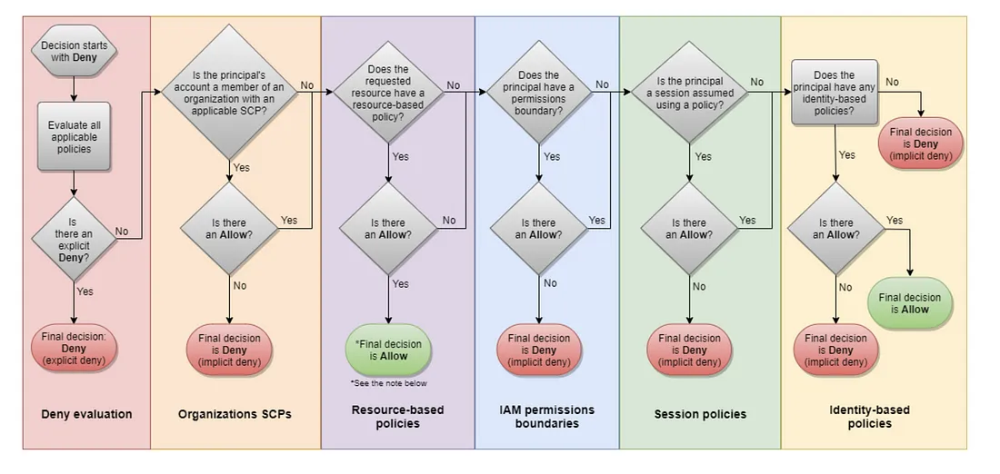
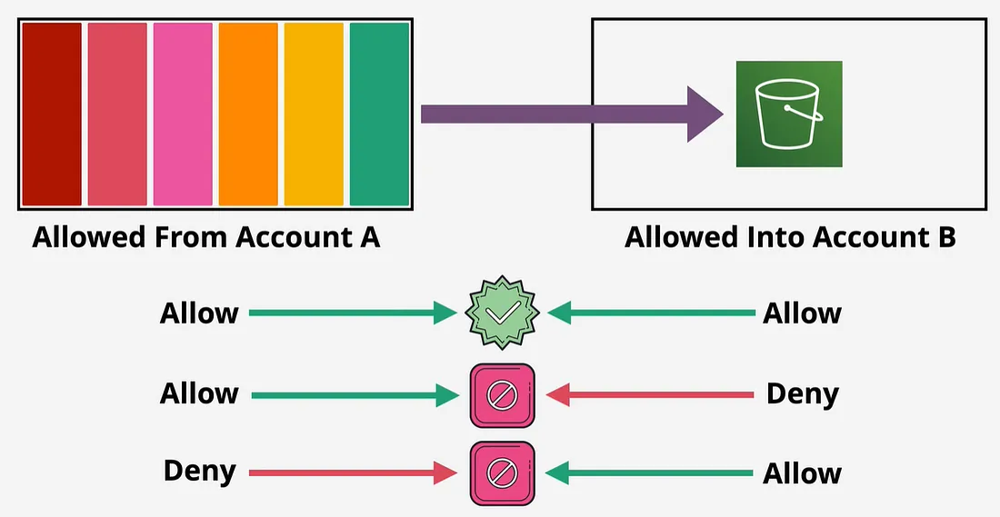
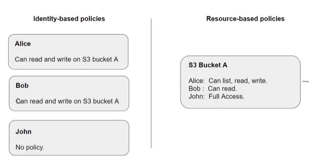
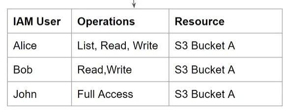
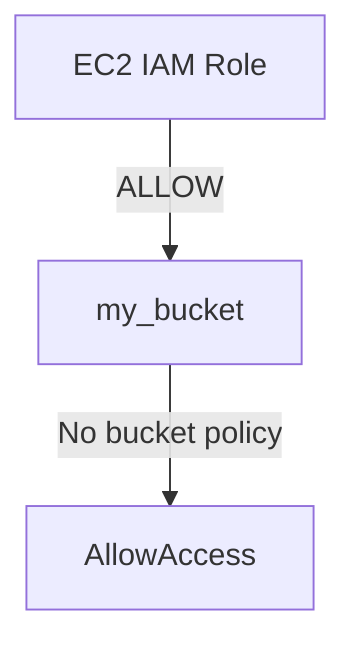
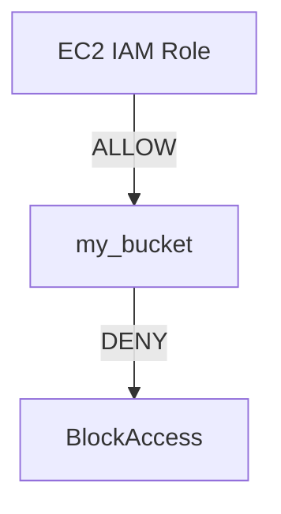
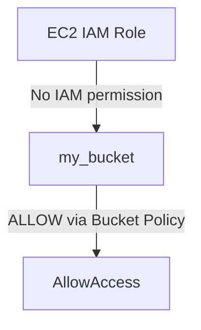
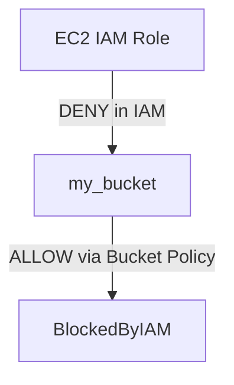

# 🔐 **IAM Policy Evaluation Logic**

<div align="center">
  
</div>

---

## 📚 **What Is Policy Evaluation in IAM?**

When a user or service makes a request to AWS (like `s3:GetObject`), AWS evaluates **all applicable policies** to determine one thing:

> ✅ **Should I allow this action on this resource in this context?**

That decision is based on **IAM policy evaluation logic**, which always follows a predictable flow.

---

## ⚙️ **Key Concepts Before the Evaluation**

| 🧩 Concept                | 🔍 Meaning                                                       |
| ------------------------- | ---------------------------------------------------------------- |
| **Identity-based policy** | Attached to users, groups, or roles                              |
| **Resource-based policy** | Attached to resources (like S3 buckets, SQS queues, etc.)        |
| **Permission boundary**   | Max limit for what an identity-based policy can grant (optional) |
| **Session policy**        | Temporary policy that further restricts the session              |
| **Explicit allow**        | A policy that directly allows an action (`"Effect": "Allow"`)    |
| **Explicit deny**         | A policy that directly blocks an action (`"Effect": "Deny"`)     |
| **Implicit deny**         | The default when nothing allows an action                        |

---

## 🔄 **IAM Policy Evaluation Process Step-by-Step**

### 🧭 Step 1: AWS Collects All Applicable Policies

AWS gathers:

- All **identity-based policies** (user, group, role)
- All **resource-based policies**
- Optional: session policies and permission boundaries

### ⛔ Step 2: Start with an **Implicit Deny**

By default, **everything is denied** unless **explicitly allowed**.

```text
Default: Deny everything
```

### ✅ Step 3: Look for Any Matching **Allow**

If any policy contains an `"Effect": "Allow"` that matches:

- the requested action
- the target resource
- and the context (conditions, IPs, MFA, etc.)

...then AWS considers allowing it.

### ❌ Step 4: Check for Any **Explicit Deny**

If **any policy** explicitly denies the action:

```json
"Effect": "Deny"
```

➡️ It **overrides all allows**.

Even if 100 policies say "Allow", **a single explicit Deny wins**.

### 📘 Step 5: Final Decision

| ✅ If there’s a matching **Allow** AND **no Deny** → **Request is allowed**  
| ❌ If there’s a matching **Deny** → **Request is denied**  
| ❌ If nothing matches → **Request is implicitly denied**

---

## 🧠 Analogy: IAM Policy Logic Is Like a Security Gate

Imagine AWS IAM as a **security guard at a gate**:

1. The gate is **closed by default** 🧱
2. If someone shows an "Allow" pass ✅, the guard **considers letting them in**
3. But if any pass says "DENY this person" ❌—they're **instantly blocked**, no questions asked

---

## 🛡️ **IAM Policies vs. S3 Bucket Policies – How Access Is Evaluated**

When working with **Amazon S3**, permissions can be controlled from **two sides**:

| Policy Type          | Attached To          | Controls Access To          |
| -------------------- | -------------------- | --------------------------- |
| **IAM Policy**       | Users, Groups, Roles | Any AWS resource (e.g., S3) |
| **S3 Bucket Policy** | S3 Buckets           | That specific bucket only   |

> ✅ **Both types of policies are evaluated together**, and the final decision is based on **explicit DENY taking precedence**.

---

<div style="text-align: center;">
    
</div>

---

### 🔍 **Evaluation Rule: IAM Policy + Bucket Policy**

When a user/role attempts an action (e.g., `s3:GetObject`), AWS evaluates the **combined effect** of:

- ✔️ **IAM policy** attached to the user or role
- ✔️ **S3 bucket policy** attached to the target bucket

The result depends on **three rules**:

1. ✅ **ALLOW + ALLOW** = Access Granted
2. ❌ **ALLOW + EXPLICIT DENY** = Access Denied
3. ❌ **No Allow anywhere** = Access Denied (implicit deny)

---

### 📘 **Examples – IAM Policy vs. Bucket Policy Scenarios**

 <div style="text-align: center;">
    

</div>

<div style="text-align: center;">
    
</div>

---

#### 🧪 **Example 1: IAM Allows, No Bucket Policy**

**Scenario**:

- IAM role on EC2 allows `s3:GetObject` and `s3:PutObject` to `my_bucket`
- No bucket policy is defined

✅ **Result**: EC2 instance **can read/write** to the bucket.



#### 🧪 **Example 2: IAM Allows, Bucket Policy Denies**

**Scenario**:

- IAM role on EC2 allows read/write to `my_bucket`
- S3 bucket policy has an **explicit DENY** for the IAM role

❌ **Result**: EC2 instance **cannot** read or write – **explicit deny wins**.



#### 🧪 **Example 3: No IAM Permission, Bucket Policy Allows**

**Scenario**:

- IAM role on EC2 has **no S3 permissions**
- S3 bucket policy allows full access to that IAM role

✅ **Result**: EC2 instance **can** read and write — **bucket policy alone is sufficient**.



#### 🧪 **Example 4: IAM Denies, Bucket Policy Allows**

**Scenario**:

- IAM role on EC2 has an **explicit deny** to S3
- S3 bucket policy **allows** read/write

❌ **Result**: EC2 instance **cannot** read or write — **explicit deny in IAM overrides allow**.



---

## 🚫 Gotchas to Watch Out For

- ❌ **Missing Allow** means Implicit Deny
- ❌ **Explicit Deny** overrides everything
- ❌ Conditions like `"aws:MultiFactorAuthPresent": "true"` can silently block requests if not met
- ✅ Combine multiple "Allow" statements to get full access, but **one Deny still ruins it**

---

## ✅ Summary

| Step | What Happens                                                          |
| ---- | --------------------------------------------------------------------- |
| 1️⃣   | AWS collects all identity-based, resource-based, and session policies |
| 2️⃣   | By default, the request is denied                                     |
| 3️⃣   | AWS looks for a matching `"Effect": "Allow"`                          |
| 4️⃣   | If any `"Effect": "Deny"` is found, it overrides the allow            |
| 5️⃣   | If no allows match, access is implicitly denied                       |
