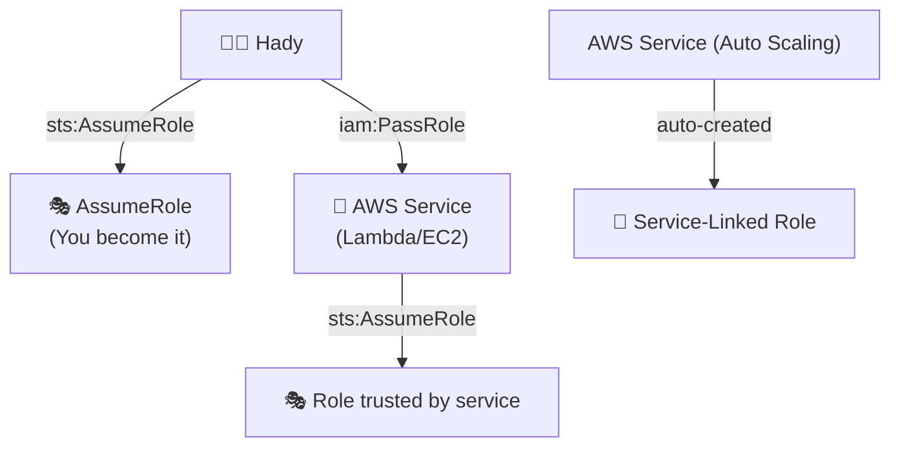
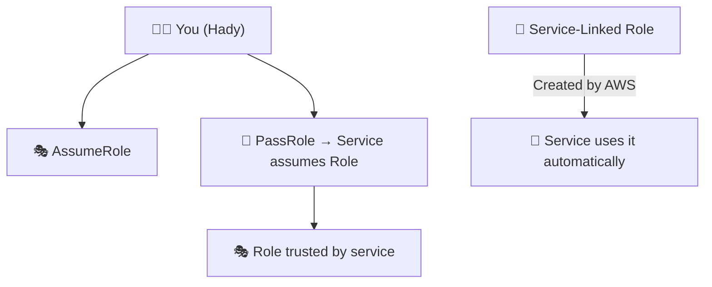

# ☁️ The Big Picture

AWS has **3 different “relationship types”** involving roles:

| Type                             | Who uses the role                                      | Who creates/controls it | Why it exists                                        |
| -------------------------------- | ------------------------------------------------------ | ----------------------- | ---------------------------------------------------- |
| 🧍‍♂️ **Assume Role**               | A person/app explicitly becomes that role              | You or admin            | Cross-account or privilege elevation                 |
| 🤖 **Pass Role**                 | You tell a service (e.g., Lambda, EC2) “use this role” | You or admin            | Service executes using that role                     |
| 🧱 **Service-Linked Role (SLR)** | AWS service _creates and owns_ it                      | AWS (auto-created)      | Service needs to manage AWS resources on your behalf |

Let’s unpack these three visually. 👇

---

## 🎭 1. Assume Role (You become that role)

🧑‍💻 **You** call `sts:AssumeRole`.

- AWS gives you **temporary credentials** as that role.
- You now act _as that role’s identity_.
- Common in **cross-account access**, e.g.:

  - Account A user assumes Account B role.

**Trust policy example:**

```json
{
  "Effect": "Allow",
  "Principal": { "AWS": "arn:aws:iam::111111111111:user/Hady" },
  "Action": "sts:AssumeRole"
}
```

**Command:**

```bash
aws sts assume-role \
  --role-arn arn:aws:iam::222222222222:role/ReadReportsRole \
  --role-session-name hadySession
```

🧠 After this, _Hady becomes_ `ReadReportsRole`.

📦 **Used for:**

- Cross-account access
- Temporary elevated privileges

---

## 🪄 2. Pass Role (You hand a role to a service)

You don’t become the role yourself —
you let **an AWS service** (Lambda, EC2, ECS, Glue, Step Functions, etc.) assume it automatically to do work on your behalf.

Example:
You create a Lambda function and attach an **execution role**:

```bash
aws lambda create-function \
  --function-name ProcessReport \
  --role arn:aws:iam::111111111111:role/LambdaExecutionRole
```

When you do this:

- Lambda needs to assume that role internally (using `sts:AssumeRole`).
- You need permission to **pass** that role to Lambda.

So AWS checks:

1️⃣ Does the role trust Lambda?
✅ Yes, via this **trust policy**:

```json
{
  "Effect": "Allow",
  "Principal": { "Service": "lambda.amazonaws.com" },
  "Action": "sts:AssumeRole"
}
```

2️⃣ Does Hady have permission to hand it to Lambda?
✅ Needs this **IAM policy**:

```json
{
  "Effect": "Allow",
  "Action": "iam:PassRole",
  "Resource": "arn:aws:iam::111111111111:role/LambdaExecutionRole"
}
```

📦 **Used for:**

- Lambda functions
- EC2 instances (instance profiles)
- ECS tasks
- Glue jobs
- SageMaker, Step Functions, etc.

🧠 Summary rule:

> “If _you_ give a role to a service, you need **PassRole**.”

---

## 🧱 3. Service-Linked Role (AWS creates it itself)

Some AWS services manage AWS resources **on your behalf** —
like CloudWatch Logs, Auto Scaling, or Elastic Load Balancer.

Instead of asking you to create or pass a role,
AWS **automatically creates** a **Service-Linked Role (SLR)** with the correct trust and permissions.

Example:
When you create an Auto Scaling group, AWS may automatically create this role:

```ini
AWSServiceRoleForAutoScaling
```

**Trust policy (auto-generated):**

```json
{
  "Effect": "Allow",
  "Principal": { "Service": "autoscaling.amazonaws.com" },
  "Action": "sts:AssumeRole"
}
```

**You didn’t create or pass it.**
AWS did, because Auto Scaling needs permission to:

- Launch or terminate EC2 instances
- Attach load balancers, etc.

📦 **Used for:**

- CloudWatch, Auto Scaling, ECS, etc.
- Always starts with `AWSServiceRoleFor...`

🧠 Summary rule:

> “If AWS service _creates its own_ role, that’s a Service-Linked Role.”

---

## 🧭 Visual Summary



---

## 🧩 Comparison Table

| Type                             | Who creates it | Who assumes it | You need `iam:PassRole`? | Example                                         |
| -------------------------------- | -------------- | -------------- | ------------------------ | ----------------------------------------------- |
| 🎭 **AssumeRole**                | You/Admin      | You            | ❌ No                    | Cross-account access                            |
| 🪄 **PassRole**                   | You/Admin      | AWS service    | ✅ Yes                   | Attach role to Lambda or EC2                    |
| 🧱 **Service-Linked Role (SLR)** | AWS            | AWS service    | ❌ No                    | Auto-created for Auto Scaling, CloudWatch, etc. |

---

## 💬 In One Sentence Each

- **AssumeRole:** “Let _me_ act as that role.”
- **PassRole:** “Let _this service_ act as that role.”
- **Service-Linked Role:** “AWS already has its own role — I don’t need to pass anything.”

---

## 🧠 Final Visual: How They All Fit Together



---

Would you like me to show a **real CLI demo** of each (AssumeRole, PassRole, and Service-Linked Role) — step by step — so you can _see when AWS checks which permission_?
It’s the fastest way to make this “click” permanently.
