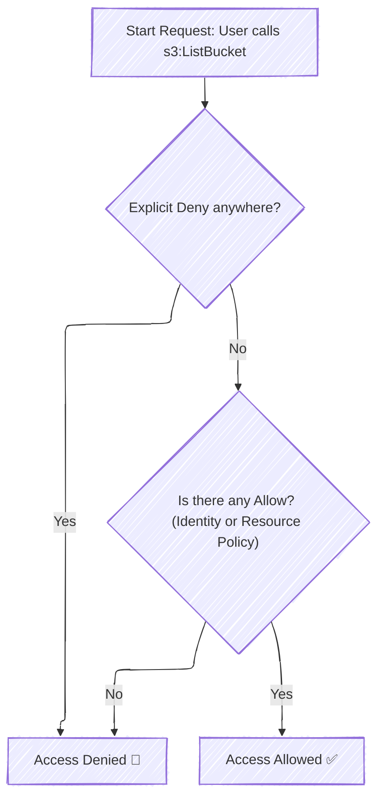
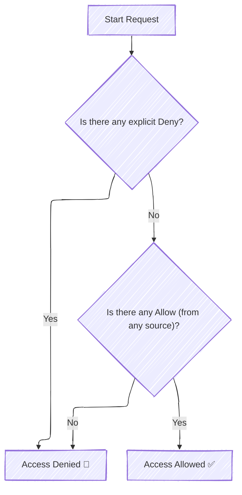

---
tags:
  - aws
  - aws/service
  - aws/domain/security
  - aws/topic/iam
  - aws/topic/policy-evaluation-logic
aliases:
  - "Hands On Policy Evaluation Logic"
---

# 🤯 Hands On Policy Evaluation Logic

Here is Some Use Cases For Policy Evaluation Logic

---

## 1️⃣ Scenario Summary

You now say:

> There is **no resource policy** on the S3 bucket.
>
> But a **specific IAM user** has an **identity policy** that allows `s3:ListBucket` for that bucket.

So we have:

| **Type**                                   | **Policy Exists?**       | **Effect**             |
| ------------------------------------------ | ------------------------ | ---------------------- |
| Identity-based policy (on the user)        | ✅ Allow `s3:ListBucket` | Grants permission      |
| Resource-based policy (on the bucket)      | ❌ None                  | No explicit grant/deny |
| SCP / Permission Boundary / Session Policy | (assume none)            | No restriction         |

---

### 🧠 Step 1: IAM Evaluation Logic (Simplified)

<div align="center">



</div>

---

### 🧩 Step 2: Identity Policy Example

Here’s what your IAM user policy might look like:

```json
{
  "Version": "2012-10-17",
  "Statement": [
    {
      "Sid": "AllowListBucket",
      "Effect": "Allow",
      "Action": "s3:ListBucket",
      "Resource": "arn:aws:s3:::my-company-bucket"
    }
  ]
}
```

This means:

- The **user** is explicitly allowed to call `s3:ListBucket` on that bucket.
- The **bucket** itself doesn’t need a resource policy because it’s in the same AWS account.
- S3 checks the user’s credentials and their **effective permissions**.
- Since there’s **no explicit Deny**, the request is **allowed**.

---

### 🧩 Step 3: Result — ✅ Access Allowed

| Step | Check                   | Result                   |
| ---- | ----------------------- | ------------------------ |
| 1    | Explicit Deny anywhere? | ❌ No                    |
| 2    | Any Allow?              | ✅ Yes (identity policy) |
| ✅   | Final Decision          | **Access Granted** ✅    |

---

### ⚙️ Step 4: Important Subtleties

#### 🧱 Case A — Same Account (default case)

✅ Works fine.  
S3 doesn’t need a bucket policy to allow users **from the same AWS account**; identity policy permissions are enough.

#### 🌍 Case B — Cross-Account Access

❌ Won’t work.  
If the user is from **another AWS account**, an **identity policy alone is not enough**.
The **resource (S3 bucket)** must also have a **resource policy** granting that external principal access.

---

### 📊 Comparison Table

| Scenario                                     | Identity Policy | Resource Policy | Can Access?               | Notes                    |
| -------------------------------------------- | --------------- | --------------- | ------------------------- | ------------------------ |
| Allow in Identity Policy, no Resource Policy | ✅ Yes          | ❌ None         | ✅ Allowed (same account) | Normal case              |
| Allow in Resource Policy, no Identity Policy | ❌ None         | ✅ Yes          | ✅ Allowed                | Resource grants access   |
| No Allow anywhere                            | ❌              | ❌              | 🚫 Denied                 | Default “implicit deny”  |
| Explicit Deny anywhere                       | 🚫              | 🚫              | 🚫 Denied                 | Deny always wins         |
| Cross-account with only Identity Allow       | ✅              | ❌              | 🚫 Denied                 | Needs Resource Allow too |

---

### 🧭 Final Answer

✅ **YES — the user can access the bucket** because:

- There’s **no explicit Deny**,
- Their **identity-based policy explicitly allows `s3:ListBucket`**,
- They are in the **same AWS account**,
- S3 will respect that Allow even if the bucket itself has no resource policy.

---

## 2️⃣ Scenario Summary

> You have a **resource** (for example, an S3 bucket) that has a **resource-based policy** allowing _all IAM users in the account_ to **list its contents**.
>
> But a **specific user’s identity policy** (the IAM user policy) does **not** grant `s3:ListBucket` — in fact, they have _no explicit Allow_.
>
> ❓ Question: Can that user **list the bucket**?

---

### 🧠 Step 1: Understand IAM Policy Evaluation Logic

IAM evaluates permissions using a **multi-step evaluation logic**:

<div align="center">



</div>

Now — what are “sources” of an **Allow**?

- ✅ Identity-based policies (attached to user, group, or role)
- ✅ Resource-based policies (like S3 bucket policies, Lambda permissions, etc.)
- ✅ Permissions boundaries, SCPs, session policies, etc. (can _limit_ access but not _grant_ beyond resource policy scope)

---

### ⚖️ Step 2: Resource Policy vs Identity Policy

| **Type**              | **Attached To**                  | **Who Defines It** | **Can Grant Cross-Account Access?** | **Example**                  |
| --------------------- | -------------------------------- | ------------------ | ----------------------------------- | ---------------------------- |
| Identity-based Policy | IAM user/group/role              | Your account admin | ❌ No                               | `arn:aws:iam::123:user/Hady` |
| Resource-based Policy | Resource (e.g., S3, Lambda, SQS) | Resource owner     | ✅ Yes                              | `arn:aws:s3:::mybucket`      |

---

### 🪄 Step 3: Apply to Your Scenario

You said:

- Resource policy: ✅ allows **all IAM users in the account** to `ListBucket`
- User policy: ❌ does **not** include any `Allow`
- There is **no explicit Deny**

So evaluation goes like this:

| Step | Check                      | Result                                  |
| ---- | -------------------------- | --------------------------------------- |
| 1    | Explicit Deny anywhere?    | ❌ No                                   |
| 2    | Any Allow from any source? | ✅ Yes (from the resource-based policy) |
| ✅   | Final Decision             | **Access Allowed** ✅                   |

---

### 🧩 Step 4: Example – Bucket Policy

```json
{
  "Version": "2012-10-17",
  "Statement": [
    {
      "Sid": "AllowAllUsersInAccount",
      "Effect": "Allow",
      "Principal": { "AWS": "arn:aws:iam::123456789012:root" },
      "Action": "s3:ListBucket",
      "Resource": "arn:aws:s3:::my-company-bucket"
    }
  ]
}
```

✅ This means:
Any IAM identity in account `123456789012` can list the bucket **even if their IAM policy doesn’t allow it** — because the **resource policy explicitly allows it**.

---

### 🚫 Step 5: When Access Would Be Denied

The user **would NOT** be able to access it if:

- There is an **explicit Deny** in their identity policy or in an SCP.
- A **permissions boundary** blocks the action.
- A **Service Control Policy (SCP)** or **Session Policy** denies or doesn’t allow it.

---

### 🧭 Final Answer

| Condition                                   | Result                                                               |
| ------------------------------------------- | -------------------------------------------------------------------- |
| Resource policy allows all users in account | ✅                                                                   |
| User has no explicit Allow                  | 🚫 (but not Deny)                                                    |
| → Combined evaluation                       | ✅ **User CAN access the resource** (because of the resource policy) |

---

## 💡 Mentor’s Tip (for DOP-C02 Exam)

In IAM evaluation questions, always remember:

> “Explicit Deny beats everything.
> At least one Allow from any policy = Access Granted.”

🧩 **Identity policies** → grant access from the user’s perspective.  
🧩 **Resource policies** → grant access from the resource’s perspective.
Either one can authorize — **unless there’s a Deny.**

For AWS IAM reasoning, always memorize this rule of thumb:

> 🔹 **Same account** → either identity-based or resource-based `Allow` works.  
> 🔹 **Cross-account** → must have resource-based `Allow` (and no explicit Deny).  
> 🔹 **Explicit Deny beats everything**.  
> 🔹 **No Allow anywhere = implicit deny**.
---

## Related Notes
- [[aws-services/2.security/1.1.iam/3.policy-evaluation-logic/1.policy-evaluation-logic|IAM Policy Evaluation Logic]] - previous lesson
- [[aws-services/5.compute/4.1.lambda/1.2.lambda-permissions|AWS Lambda Permissions]] - mentions Lambda Permissions
- [[aws-services/2.security/1.1.iam/2.2.role-based-policy/3.session-policy|Session Policy in AWS IAM]] - mentions Session Policy
- [[aws-services/2.security/1.1.iam/1.fundmmentals/1.1.aws-account|AWS Account Your Gateway to the AWS Cloud]] - mentions AWS Account
- [[aws-services/2.security/1.1.iam/1.fundmmentals/3.iam-policy|IAM Policies in AWS Control Access with Precision]] - mentions IAM Policy
- [[aws-services/7.application-integration/sqs/1.1.sqs|Amazon SQS Mastering Serverless Message Queues]] - mentions SQS
- [[aws-services/2.security/1.1.iam/1.fundmmentals/1.2.iam|AWS Identity and Access Management IAM]] - mentions IAM

---
