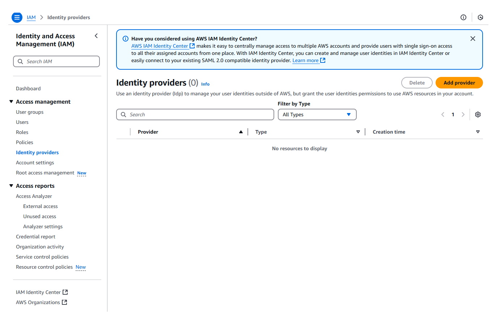
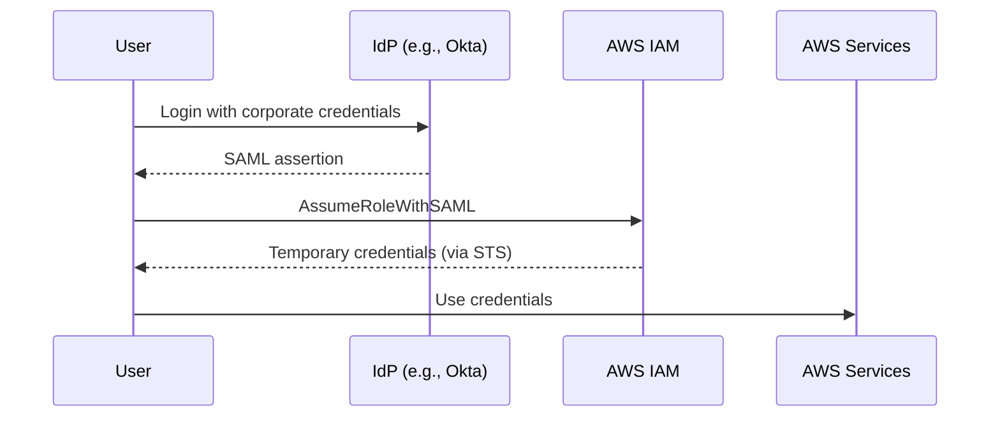
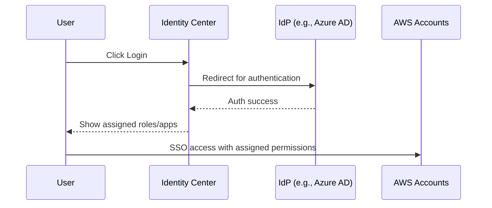

# 🔐 **What is an IAM Identity Provider in AWS?**

> _Use an identity provider (Idp) to manage your user identities outside of AWS, but grant the user identities permissions to use AWS resources in your account._

---

    

---

## 📌 **Official Definition**

> "An IAM identity provider is an entity that describes an identity provider (IdP) service — such as Microsoft Active Directory Federation Services (ADFS) or another SAML-compliant provider — that you can use to **authenticate users who want to assume IAM roles**."

---

### 🧠 **What This Means Practically:**

You set up an **IAM identity provider** to enable **federated access** from an **external IdP** (like Okta, Azure AD, or Google) using protocols like:

- **SAML 2.0**
- **OIDC (OpenID Connect)**

Once configured, users from your external IdP can **assume IAM roles**, meaning they **temporarily get AWS permissions** without having an IAM user.

---

### 🛠️ **How it Works (Simplified Flow):**

---

### ✅ Use Case Example

You want your company employees to use **Okta login** to access AWS Console **without creating IAM users**. You configure a SAML Identity Provider in IAM, create a role, and map Okta groups to it.

---

## 🧑‍💼 **Then What is IAM Identity Center (formerly AWS SSO)?**

IAM Identity Center is the **next-generation identity federation solution** in AWS.

### ➕ **It adds:**

- Central user and group management (via built-in directory or external IdP)
- Graphical UI for managing permissions across **multiple AWS accounts**
- **SSO (Single Sign-On)** to AWS Console & CLI
- Integration with **SAML 2.0 IdPs** and **SCIM provisioning**

---

### 🛠️ How IAM Identity Center Works (Simplified Flow)

---

## 🆚 IAM Identity Provider vs IAM Identity Center

| Feature                        | **IAM Identity Provider** | **IAM Identity Center** (Recommended)  |
| ------------------------------ | ------------------------- | -------------------------------------- |
| Protocols                      | SAML / OIDC               | SAML (auth), SCIM (provisioning)       |
| UI for User Management         | ❌ No                     | ✅ Yes                                 |
| Centralized Access Across Orgs | ❌ No                     | ✅ Yes (AWS Organizations integration) |
| Built-in Directory             | ❌ No                     | ✅ Yes (or connect to external)        |
| Temporary Role Assumption Only | ✅ Yes                    | ✅ But managed automatically           |
| Modern AWS Recommendation      | ⚠️ Legacy / Low-level use | ✅ Preferred for enterprises           |

---

## 💡 Why AWS Recommends IAM Identity Center?

AWS is moving toward **simplified identity and access management** across multiple accounts with fewer moving parts.

✅ IAM Identity Center:

- Supports **multi-account access** using fine-grained permission sets
- Works with **external IdPs** like Okta, Azure AD, Google Workspace
- Offers built-in **audit, logging**, and **UI for access control**
- Works well with **CLI access (via `aws sso login`)**
- Future-proof and supported by most AWS services

---

## 🧭 **TL;DR Quick Summary**

| Concept                   | What it Does                                                                                                                                                 |
| ------------------------- | ------------------------------------------------------------------------------------------------------------------------------------------------------------ |
| **IAM Identity Provider** | Lets you **federate users** from an external IdP (like SAML or OIDC) to assume IAM roles in AWS.                                                             |
| **IAM Identity Center**   | Modern **SSO solution** to centrally manage access across **multiple AWS accounts** and apps, with a **UI**, **directory**, and **integrated provisioning**. |

> ✅ **Use IAM Identity Center** unless you have a specific legacy or low-level use case that needs direct role assumption via SAML or OIDC federation.

---

## 🏁 Final Recommendation

Use **IAM Identity Center** if:

- You have more than one AWS account
- You need SSO and role-based access control
- You want to avoid managing low-level IAM configurations

Use **IAM Identity Provider** only if:

- You have a **specific custom federated login** use case
- You need fine-grained control at the protocol level (SAML/OIDC)
- You are integrating directly with STS or building custom federation flows
