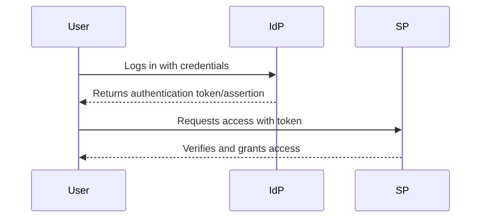

# 🏢 **Identity Federation**

> _Authenticate once. Access everywhere._  
> Identity federation enables users to use a **single identity** to access **multiple systems or applications** securely — across platforms, clouds, and organizations.

---

## 🔍 **What Is Identity Federation?**

**Identity federation** is a **trust-based identity architecture** that allows users to log in with credentials from a **trusted identity provider (IdP)** and access **multiple service providers (SPs)** without managing separate usernames and passwords.

✅ It enables **cross-domain authentication**  
✅ Without the need to replicate identity stores across services.

---

## 🧠 **Simple Analogy**

Imagine having **one keycard** that opens the doors to your **gym, office, and coworking space**. That’s identity federation — you authenticate once, and you’re trusted everywhere else.

---

## 🏗️ **Core Components of Identity Federation**

| Component                      | Role                                                                                                |
| :----------------------------- | :-------------------------------------------------------------------------------------------------- |
| 🏢 **Identity Provider (IdP)** | Authenticates users and issues trusted tokens or assertions.                                        |
| 🛒 **Service Provider (SP)**   | Relies on the IdP to verify user identity and grants access accordingly.                            |
| 🔐 **Trust Relationship**      | A secure agreement between IdP and SP that defines how authentication data is trusted and accepted. |

✅ The IdP **proves who you are**  
✅ The SP **trusts the IdP’s proof**

---

## 🔄 **How Identity Federation Works (Simplified Flow)**

✅ No need to re-authenticate at each service — just **pass the trusted token**!

---

## 📦 **Federation Protocols**

| Protocol                                         | Purpose                                                                         |
| :----------------------------------------------- | :------------------------------------------------------------------------------ |
| 🔐 **SAML (Security Assertion Markup Language)** | Common in enterprises; uses XML to exchange identity assertions.                |
| 🔓 **OAuth 2.0**                                 | Grants limited access to resources without sharing credentials.                 |
| 🪪 **OpenID Connect (OIDC)**                      | Authentication layer built on OAuth 2.0 — returns ID token + user profile data. |

✅ Choose **SAML for enterprise apps**,  
✅ **OIDC/OAuth** for **modern web/mobile integrations**.

---

## 🔑 **Feature Spotlight: Single Sign-On (SSO)**

**SSO** allows users to log in **once** and access **multiple applications** without re-entering credentials.

✅ Reduces friction  
✅ Minimizes password fatigue  
✅ Centralizes login audit trails for security

---

## 🤔 Does AWS Has it is own IDP Solution?

AWS does have its own identity provider (IdP) capabilities, but it primarily focuses on **identity and access management within AWS environments** rather than acting as a general IdP like Microsoft Entra ID or Okta.

Here’s how AWS handles identity:

| AWS Service                    | Role                                                                                             |
| :----------------------------- | :----------------------------------------------------------------------------------------------- |
| ✅ **Amazon Cognito**          | **App-facing IdP** for user sign-up/sign-in, SSO, and federation with social or enterprise IdPs. |
| ✅ **AWS IAM Identity Center** | **SSO across AWS accounts**, integrates with external IdPs (like Entra ID, Okta, Google).        |
| ✅ **AWS IAM**                 | Provides IAM roles that can be assumed via federation for AWS Console/API access.                |
| ✅ **AWS Directory Service**   | Managed Active Directory — supports SAML federation and AD trust models.                         |

So, **Amazon Cognito** can be considered an IdP for applications, but AWS does not provide a full-fledged IdP for external identity management like Entra ID or Okta. Instead, it integrates with other IdPs for federated authentication.

> 📌 **Amazon Cognito** = app-level IdP  
> 📌 **IAM Identity Center** = AWS-level SSO hub

---

## 🎯 **Benefits of Identity Federation**

| Benefit                       | Description                                                    |
| :---------------------------- | :------------------------------------------------------------- |
| ✅ **Improved UX**            | Seamless access across apps after a single login.              |
| ✅ **Centralized Security**   | Users are authenticated at one source of truth.                |
| ✅ **Less Credential Sprawl** | No need for managing separate logins per app.                  |
| ✅ **Cross-Org Access**       | Secure collaboration between business partners or departments. |

---

## ✅ **When Should You Use Identity Federation?**

| Scenario                                                          | Federation Helps                                               |
| :---------------------------------------------------------------- | :------------------------------------------------------------- |
| 🧑‍💼 **Enterprise users accessing SaaS apps**                    | Log in once with Entra ID and use Office 365, Salesforce, etc. |
| 🛠️ **Developers managing AWS and GitHub**                         | Use Okta or Google as IdP for both platforms.                  |
| 🛡️ **Security teams enforcing MFA and access policies centrally** | Use a central IdP to control who can access what and when.     |
| 🌐 **Multi-cloud environments**                                   | Log in once and federate identity across AWS, GCP, and Azure.  |

---

## 🏆 **Conclusion**

Identity federation lets users **authenticate once** with a trusted identity provider and gain access to **multiple applications securely**, using **standard protocols** like **SAML**, **OIDC**, or **OAuth**.

🔐 It reduces password fatigue, simplifies access control, and boosts security by centralizing trust.

---

### 📌 TL;DR

- 💡 **Identity Federation** = Use your identity from one system (e.g., Google, Okta) to access others.
- 💡 **Key Benefit** = Centralized login, enhanced security, better UX.
- 💡 **Key Tools in AWS** = Amazon Cognito, IAM Identity Center, IAM Federation Roles.
