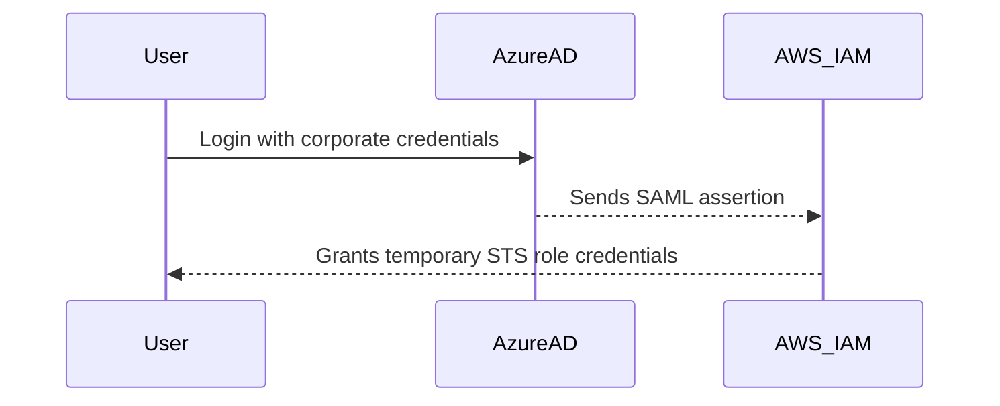
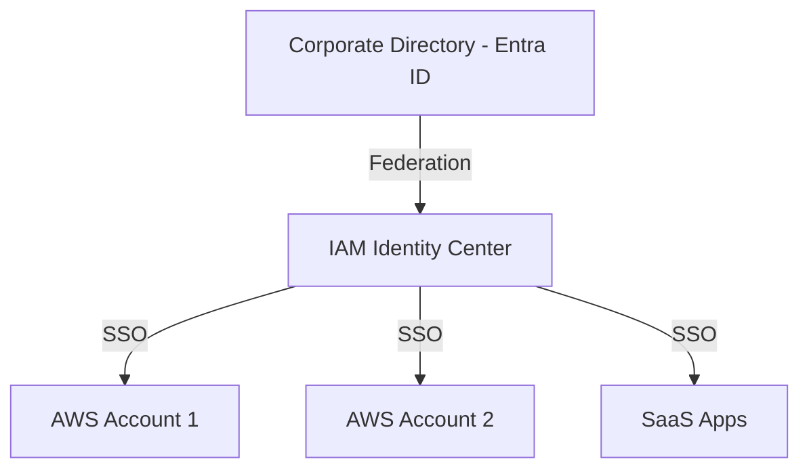
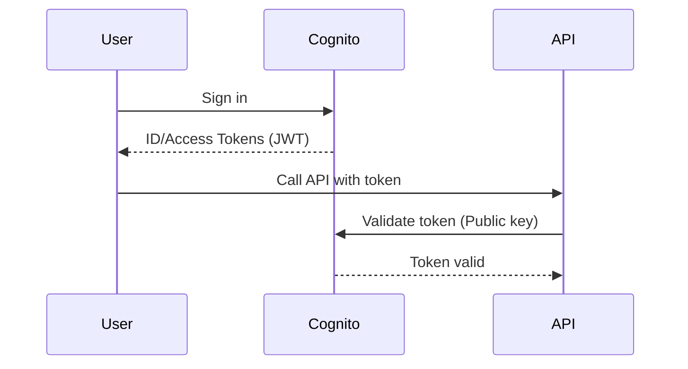
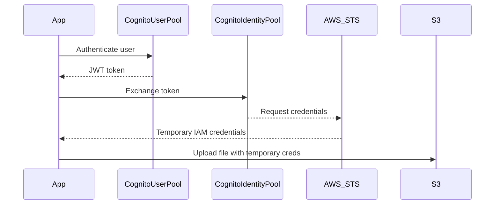

# 🔐 AWS Identity Solutions — Complete Guide (IAM vs. Identity Center vs. Cognito)

Managing **who can access what** in AWS can get confusing because AWS has **multiple identity services** — each solving a different kind of problem.
Let’s unpack them clearly, layer by layer.

---

## 🧩 1. AWS IAM (Identity and Access Management)

### 💡 What it is:

AWS IAM is the **core service** for managing **access to AWS resources**.
It controls **who (user, role, service)** can perform **what action (API, CLI, Console)** on **which resource (S3, EC2, etc.)** under **what conditions**.

### 🧠 Think of it as:

> “The security guard of your AWS account — managing AWS-native identities like users, groups, and roles.”

### 🧱 Main Components:

| Component  | Description                                                                            |
| ---------- | -------------------------------------------------------------------------------------- |
| **User**   | Represents a person or application with long-term credentials (Access key / Password). |
| **Group**  | Logical collection of users to attach the same policy.                                 |
| **Role**   | Temporary credentials given to apps, services, or users (great for EC2 or Lambda).     |
| **Policy** | JSON document defining permissions (Allow/Deny actions).                               |

### 🧰 Common Use Cases:

- Creating users for developers or admins to log into AWS console.
- Attaching roles to EC2 or Lambda for temporary credentials.
- Defining policies to restrict access to certain buckets or services.
- Using **IAM Roles + STS AssumeRole** for cross-account access.

### 🧩 Example:

```json
{
  "Effect": "Allow",
  "Action": ["s3:ListBucket"],
  "Resource": ["arn:aws:s3:::my-bucket"]
}
```

This allows listing objects in the S3 bucket.

---

## 🌐 2. IAM Identity Provider (IdP)

### 💡 What it is:

An **IAM Identity Provider** connects your AWS account with an **external identity system** like **Microsoft Entra ID (Azure AD)**, **Okta**, **Google Workspace**, or **SAML-based systems**.

It **does not store users** — it **trusts another system** to authenticate them.

### 🧠 Think of it as:

> “A bridge between AWS IAM and your company’s login system.”

### 🧰 Common Use Cases:

- Enable **Single Sign-On (SSO)** from your corporate directory to AWS console.
- Let **federated users** assume roles in AWS without creating IAM users.
- Integrate with identity providers via:

  - **SAML 2.0** (for enterprise directories)
  - **OIDC** (for apps, e.g., GitHub Actions or Kubernetes service accounts)

### 🔗 Example Flow:



✅ Result: User logs into AWS Console **without** an IAM user account.

---

## 🏢 3. AWS IAM Identity Center (formerly AWS SSO)

### 💡 What it is:

A **centralized identity management service** for **multiple AWS accounts and applications**.
It simplifies user access across AWS Organizations.

### 🧠 Think of it as:

> “The control tower for user access across all your AWS accounts.”

### 🧱 Features:

- Integrates with **your existing directory** (e.g., Microsoft Entra ID or Okta).
- Provides a **user portal** (AWS access portal).
- Assigns users and groups to specific **AWS accounts** or **roles**.
- Works with both **workforce identities** (people) and **applications**.

### 🧰 Common Use Cases:

- Manage access for employees across many AWS accounts in an Organization.
- Federate login from Entra ID to all AWS accounts.
- Provide one dashboard for users to access AWS Management Console or CLI.

### 🧩 Architecture Example:



### 🚀 Bonus:

With **IAM Identity Center + SCIM**, user provisioning and group sync can be automated from Azure AD → AWS.

---

## 👥 4. Amazon Cognito User Pools

### 💡 What it is:

Cognito **User Pools** are **user directories for your applications** (like Firebase Auth).
It manages sign-up, sign-in, MFA, and password recovery for your **app users**, not AWS admins.

### 🧠 Think of it as:

> “An identity system for your end-users, not AWS developers.”

### 🧱 Features:

- User registration and login (username, email, social, or enterprise IdP).
- MFA, password reset, account recovery.
- OAuth2.0, OpenID Connect, and SAML support.
- Hosted UI for login.
- Generates **JWT tokens** (ID, Access, Refresh) for app authentication.

### 🧰 Common Use Cases:

- Web or mobile apps that require user authentication.
- Integrating Google, Facebook, Apple login.
- Backend APIs verifying tokens from Cognito.

### 🧩 Example:

Your app → Cognito Hosted UI → Cognito verifies → Returns JWT tokens → Your backend verifies token.



---

## 🪪 5. Amazon Cognito Identity Pools

### 💡 What it is:

Cognito **Identity Pools** provide **temporary AWS credentials** (via STS) to your app users — authenticated or guest.

It links **Cognito User Pool users** (or other IdPs like Google, Facebook) to **IAM roles** so they can access AWS resources directly (like S3, DynamoDB).

### 🧠 Think of it as:

> “A way for app users to get temporary AWS credentials securely.”

### 🧩 Example Use Case:

- A mobile app where logged-in users upload photos to an S3 bucket.
- You don’t want to store AWS access keys in the app — so you use **Cognito Identity Pool** to exchange tokens for **temporary IAM credentials**.



---

## ⚖️ Summary Comparison

| Feature              | IAM                          | IAM Identity Provider          | IAM Identity Center                   | Cognito User Pool              | Cognito Identity Pool                |
| -------------------- | ---------------------------- | ------------------------------ | ------------------------------------- | ------------------------------ | ------------------------------------ |
| **Main Purpose**     | Manage AWS-native identities | Federate external users to AWS | Centralized SSO for AWS accounts/apps | Manage app user authentication | Provide AWS credentials to app users |
| **Used For**         | AWS console & service access | Enterprise SSO (SAML/OIDC)     | Workforce SSO across accounts         | Web/mobile app login           | Access AWS resources (e.g., S3)      |
| **Stores Users?**    | Yes                          | ❌ No                          | ✅ Optional                           | ✅ Yes                         | ❌ No                                |
| **Auth Protocols**   | N/A                          | SAML/OIDC                      | SAML/OIDC                             | OAuth2, OIDC, SAML             | STS                                  |
| **Integrates With**  | AWS resources                | External IdPs                  | Entra ID, Okta                        | Google, Facebook, etc.         | Cognito User Pool / Federated IdPs   |
| **Example Use Case** | EC2 access for developers    | Login to AWS via Azure AD      | Manage all AWS account logins         | App user login system          | Give temporary AWS creds to users    |

---

## 💬 Quick Real-World Analogy

| Scenario                                     | Best AWS Identity Solution               |
| -------------------------------------------- | ---------------------------------------- |
| Developer logging into AWS Console           | IAM / Identity Center                    |
| Corporate users using Azure AD to access AWS | IAM Identity Provider or Identity Center |
| Web app users signing up & logging in        | Cognito User Pool                        |
| Mobile app users uploading to S3             | Cognito Identity Pool                    |
| Lambda assuming permissions to access S3     | IAM Role                                 |

---

## 🧠 Exam Tip (for DOP-C02)

- **IAM** → For AWS users, roles, and policies.
- **IAM Identity Provider** → For external directory federation (SAML/OIDC).
- **IAM Identity Center** → For central SSO across AWS Organization accounts.
- **Cognito User Pools** → For **app authentication**.
- **Cognito Identity Pools** → For **temporary AWS credentials** for app users.
