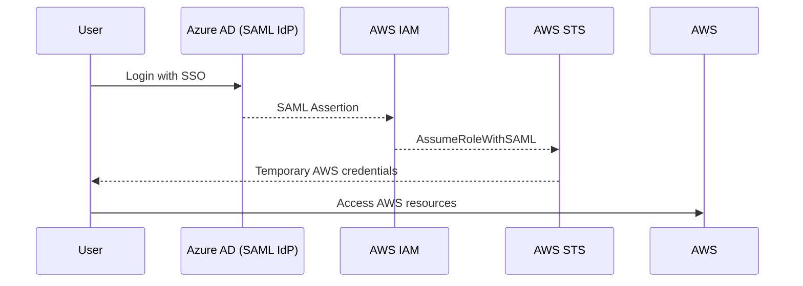
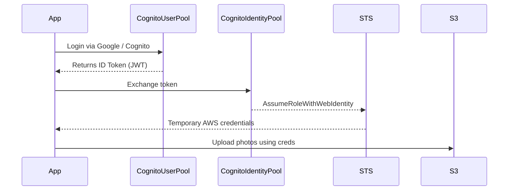

---
tags:
  - aws
  - aws/service
  - aws/domain/security
  - aws/topic/identity-federation-solutions
  - aws/topic/core
aliases:
  - "IAM Identity Provider vs Cognito Identity Pool"
  - "IAM Identity Provider Vs Cognito Identity Pools"
---

# 🎭 IAM Identity Provider vs Cognito Identity Pool

> 💡 “Both can issue temporary AWS credentials — but _why_ and _for whom_ they do it is totally different.”

---

## 🧩 1. Common Ground

| Common Behavior              | Explanation                                                                                            |
| ---------------------------- | ------------------------------------------------------------------------------------------------------ |
| 🧠 **No permanent AWS user** | Neither creates long-term IAM users — both rely on _federation_ to get temporary credentials.          |
| 🔑 **Use AWS STS**           | Both use **AWS Security Token Service (STS)** to issue short-lived credentials.                        |
| 🧱 **Assume IAM Role**       | Both systems map users → IAM Roles to control what AWS resources they can access.                      |
| ⏳ **Temporary credentials** | They generate `AccessKeyId`, `SecretAccessKey`, and `SessionToken` that expire (usually after 1 hour). |

So yes — **mechanically, both perform federation + STS AssumeRole**.
But the **context** (who is the “user”) and **integration model** are _very different_ 👇

---

## 🧠 2. IAM Identity Provider — For **Workforce or Enterprise Federation**

### 🔍 Use Case:

Let’s say you work at **Orchida Company** with 500 engineers using **Azure AD** or **Okta**.
You want them to log into the **AWS Console or CLI** using corporate credentials — not separate IAM users.

That’s where **IAM Identity Provider** comes in.

### 🔐 Flow:

1. User signs in to **external IdP** (e.g., Azure AD, Okta).
2. IdP sends a **SAML or OIDC assertion** to AWS IAM.
3. AWS IAM trusts the IdP → maps the assertion to an IAM Role.
4. STS issues temporary AWS credentials.
5. User accesses AWS console or APIs with those credentials.

### 🧭 Example Diagram:

### 🧱 Key Characteristics:

| Property               | IAM Identity Provider                         |
| ---------------------- | --------------------------------------------- |
| **Audience**           | Company employees, developers, or contractors |
| **Login Source**       | External IdP (e.g., Entra ID, Okta)           |
| **Protocol**           | SAML 2.0 or OIDC                              |
| **Purpose**            | Access AWS Console / CLI securely             |
| **Role Mapping**       | SAML Assertion → IAM Role                     |
| **Token Lifetime**     | Up to 12 hours                                |
| **Resources Accessed** | All AWS services (via IAM Role)               |

✅ **Used for enterprise/workforce federation**, not for end-users of your app.

---

## 🧑‍💻 3. Cognito Identity Pool — For **App Users**

### 🔍 Use Case:

Imagine you’re building a **mobile photo app** where users can log in using Google or Facebook.
After login, you want them to **upload photos to S3** or **fetch data from DynamoDB** — but securely, with least privilege.

You can’t give AWS access keys to the app directly — so you use a **Cognito Identity Pool** to **exchange their tokens for temporary AWS credentials**.

### 🔐 Flow:

1. User authenticates via **Cognito User Pool**, Google, Apple, or Facebook.
2. Cognito Identity Pool receives their identity token.
3. Cognito maps that identity to an **IAM Role** (authenticated or guest).
4. Cognito calls **STS AssumeRoleWithWebIdentity**.
5. App gets temporary credentials → access S3, DynamoDB, etc.

### 🧭 Example Diagram:

### 🧱 Key Characteristics:

| Property               | Cognito Identity Pool                               |
| ---------------------- | --------------------------------------------------- |
| **Audience**           | App users (public or private)                       |
| **Login Source**       | Cognito User Pool, Google, Facebook, Apple, etc.    |
| **Protocol**           | OIDC / Web Identity Federation                      |
| **Purpose**            | Allow app users to access AWS resources temporarily |
| **Role Mapping**       | Token → Authenticated / Unauthenticated Role        |
| **Token Lifetime**     | Typically 1 hour                                    |
| **Resources Accessed** | Usually S3, DynamoDB, API Gateway, etc.             |

✅ **Used for customer-facing apps**, not for AWS console access.

---

## ⚖️ 4. Side-by-Side Comparison

| Feature                 | **IAM Identity Provider**                           | **Cognito Identity Pool**                                   |
| ----------------------- | --------------------------------------------------- | ----------------------------------------------------------- |
| **Audience**            | Employees / internal users                          | App end-users                                               |
| **User Directory**      | External (SAML/OIDC) like Entra ID, Okta            | Cognito User Pool / Google / Facebook / Guest               |
| **Protocol**            | SAML 2.0 / OIDC                                     | OIDC / Web Identity                                         |
| **Access Scope**        | AWS Console, CLI, SDK                               | Limited AWS resources (S3, DynamoDB, etc.)                  |
| **Role Mapping**        | Based on SAML/OIDC claims                           | Based on “authenticated” vs “unauthenticated”               |
| **STS API**             | `AssumeRoleWithSAML` or `AssumeRoleWithWebIdentity` | `GetId` + `GetCredentialsForIdentity` (internally uses STS) |
| **Use Case Example**    | Azure AD users logging into AWS Console             | Mobile app users uploading files to S3                      |
| **Management Location** | IAM Console                                         | Cognito Console                                             |

---

## 💬 Simple Summary

| Question                                 | Answer                                                                                                  |
| ---------------------------------------- | ------------------------------------------------------------------------------------------------------- |
| Both issue temporary credentials?        | ✅ Yes                                                                                                  |
| Both use STS AssumeRole under the hood?  | ✅ Yes                                                                                                  |
| Main difference?                         | 👔 **IAM IdP** → for **workforce** (admins, devs)   📱 **Cognito Identity Pool** → for **app users** |
| IAM IdP authenticates via?               | SAML / OIDC enterprise IdPs                                                                             |
| Cognito Identity Pool authenticates via? | Cognito User Pool, social logins, guest users                                                           |
| IAM IdP users log into?                  | AWS Console / CLI                                                                                       |
| Cognito users access?                    | AWS services (S3, DynamoDB, etc.) through SDK                                                           |

---

## 🧠 TL;DR (Remember for Exams & Interviews)

> **IAM Identity Provider** = Federation for **your employees** > **Cognito Identity Pool** = Federation for **your customers**
---

## Related Notes
- [[aws-services/2.security/1.2.identity-federation-solutions/.core/2.aws-identity-solutions|AWS Identity Solutions Complete Guide IAM vs. Identity Center vs. Cognito]] - previous lesson
- [[aws-services/2.security/1.2.identity-federation-solutions/1.iam-identity-provider/1.iam-identity-provider|What is an IAM Identity Provider in AWS]] - mentions IAM Identity Provider
- [[aws-services/2.security/1.2.identity-federation-solutions/.core/1.what-is-identity-federation|Identity Federation]] - mentions Identity Federation
- [[aws-services/2.security/1.1.iam/1.fundmmentals/2.1.access-keys|Programmatic Access to AWS Services]] - mentions Access Keys
- [[aws-services/3.network/4.api-gateway/x.api-gateway|Amazon API Gateway Streamlining API Management]] - mentions API Gateway
- [[aws-services/3.network/4.api-gateway/1.1.api-gateway|AWS API Gateway The Front Door for Your APIs]] - mentions API Gateway
- [[aws-services/8.database/dynamodb/ddb-in-depth/1.1.ddb|Deep Dive into AWS DynamoDB]] - mentions DynamoDB
- [[aws-services/8.database/dynamodb/1.1.dynamodb|AWS DynamoDB]] - mentions Dynamodb
- [[aws-services/2.security/1.1.iam/1.fundmmentals/1.2.iam|AWS Identity and Access Management IAM]] - mentions IAM

---
