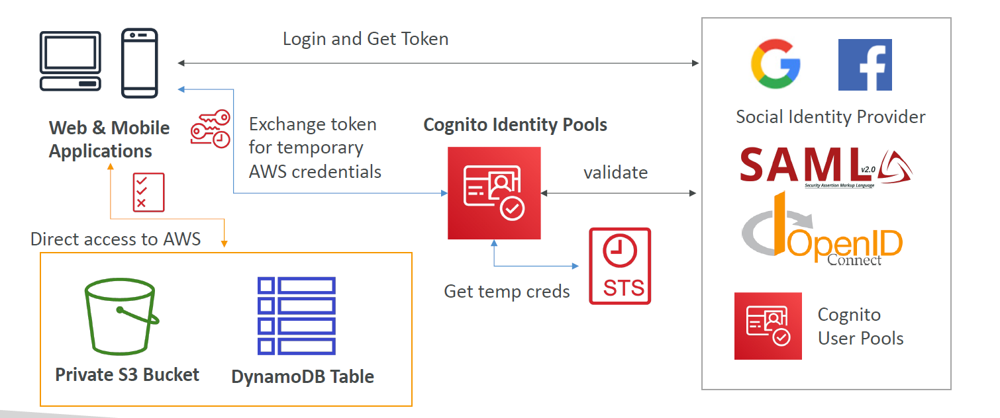
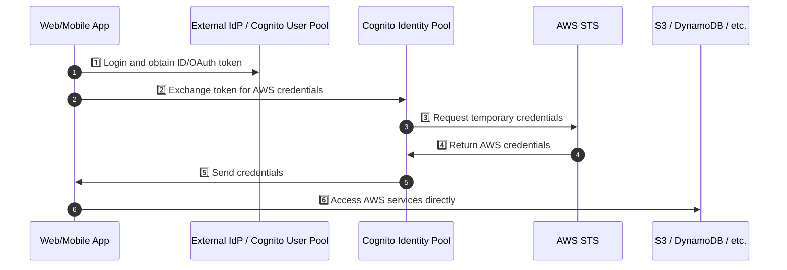
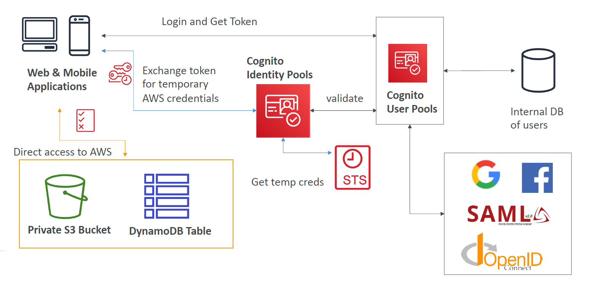
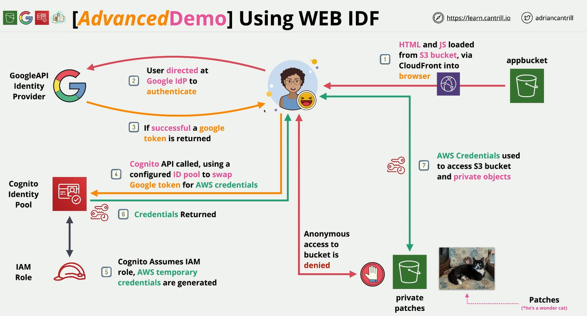

---
tags:
  - aws
  - aws/service
  - aws/domain/security
  - aws/topic/identity-federation-solutions
  - aws/topic/cognito
aliases:
  - "Cognito Identity Pools CIP Federated Access to AWS Services"
  - "Cip Coginto Identity Pools"
---

# 🧠 **Cognito Identity Pools (CIP) – Federated Access to AWS Services**

Cognito **Identity Pools** enable **federated identities** to obtain **temporary AWS credentials** and access AWS services **securely and directly** from client apps — **without managing permanent IAM credentials**.

---

<div align="center" style="background-color: #ffff; border-radius: 20px; ">
  
</div>

---

## 🔍 **What Are Identity Pools?**

An **Identity Pool** provides **temporary AWS credentials** to users who are:

<div align="center" style="background-color: #0c2230ff; border-radius: 20px; border: solid">

| Source                                | Description                                             |
| ------------------------------------- | ------------------------------------------------------- |
| 🔐 Cognito User Pool                  | Authenticated users from your own AWS Cognito user base |
| 🌐 OpenID Connect (OIDC)              | Any OIDC-compliant identity provider                    |
| 📱 Social IdPs                        | Facebook, Google, Amazon, Apple                         |
| 🏢 SAML                               | Enterprise IdPs (e.g., Okta, AD FS, Azure AD)           |
| 🧪 Developer Authenticated Identities | Custom login systems generating JWTs                    |
| 👤 Guest Access                       | Unauthenticated, anonymous users                        |

</div>

---

## 🧰 **Key Features of Identity Pools**

<div align="center" style="background-color: #0c2230ff; border-radius: 20px; border: solid">

| Feature                            | Description                                                              |
| ---------------------------------- | ------------------------------------------------------------------------ |
| 🎯 **STS Integration**             | Uses **AWS STS** to generate short-lived, scoped credentials             |
| 🧑‍⚖️ **IAM Role Mapping**         | Assign IAM roles to users (authenticated or guest) based on login method |
| 🔐 **Authorization (not authN)**   | Does not verify identity — that’s the job of the IdP                     |
| 🔑 **Fine-grained Access Control** | Use IAM policy variables like `${cognito-identity.amazonaws.com:sub}`    |
| ✅ **Built-in Guest Support**      | Allow users to access public resources without logging in                |

</div>

---

## 🧭 **CIP Flow – Architecture Diagram**

<div align="center" style="background-color: #0c2230ff; border-radius: 20px; border: solid">



</div>

---

## 🛡️ **IAM Role Mapping in CIP**

CIP uses IAM roles and **trust policies** to map **user identities to specific permissions**.

### 🔐 **Default Roles**

- **Authenticated role**: Assigned to users who signed in via any IdP
- **Unauthenticated role**: For guest users

---

### 🧩 **Sample Trust Policy for Role**

```json
{
  "Effect": "Allow",
  "Principal": {
    "Federated": "cognito-identity.amazonaws.com"
  },
  "Action": "sts:AssumeRoleWithWebIdentity",
  "Condition": {
    "StringEquals": {
      "cognito-identity.amazonaws.com:aud": "<identity-pool-id>"
    },
    "ForAnyValue:StringLike": {
      "cognito-identity.amazonaws.com:amr": "authenticated"
    }
  }
}
```

---

## 🔐 **Example 1 – S3 Bucket Scoped Access**

Let each user access their **own folder** in an S3 bucket:

```json
{
  "Version": "2012-10-17",
  "Statement": [
    {
      "Action": ["s3:ListBucket"],
      "Effect": "Allow",
      "Resource": ["arn:aws:s3:::mybucket"],
      "Condition": {
        "StringLike": {
          "s3:prefix": ["${cognito-identity.amazonaws.com:sub}/*"]
        }
      }
    },
    {
      "Action": ["s3:GetObject", "s3:PutObject"],
      "Effect": "Allow",
      "Resource": ["arn:aws:s3:::mybucket/${cognito-identity.amazonaws.com:sub}/*"]
    }
  ]
}
```

---

## 📦 **Example 2 – Scoped DynamoDB Row-Level Access**

Allow users access to **only their own rows** using partition key:

```json
{
  "Version": "2012-10-17",
  "Statement": [
    {
      "Effect": "Allow",
      "Action": ["dynamodb:GetItem", "dynamodb:PutItem", "dynamodb:Query", "dynamodb:UpdateItem"],
      "Resource": "arn:aws:dynamodb:us-east-1:123456789012:table/MyTable",
      "Condition": {
        "ForAllValues:StringEquals": {
          "dynamodb:LeadingKeys": ["${cognito-identity.amazonaws.com:sub}"]
        }
      }
    }
  ]
}
```

---

## 🌐 **CIP + CUP: Full Federated Architecture**

When you **combine User Pools and Identity Pools**, you get full **authentication + authorization**:

---

<div align="center" style="background-color: #ffff; border-radius: 20px; ">
  
</div>

---

> CUP = Sign-in experience (OAuth2, Email/Password, Social)  
> CIP = Maps token → STS → IAM roles → AWS resource access

---

## ✍🏻 **Full Example**

<div align="center" style="background-color: #f3ececff; border-radius: 20px; ">
    
</div>

---

## 📌 **CIP Summary Table**

<div align="center" style="background-color: #0c2230ff; border-radius: 20px; border: solid">

| Cognito Feature        | Identity Pools                     |
| ---------------------- | ---------------------------------- |
| 🔐 AuthN Source        | External IdPs, CUP, or custom      |
| 🎫 Token Used          | OIDC / OAuth / SAML tokens         |
| 🧭 Goal                | Temporary AWS credentials (STS)    |
| 📜 IAM Policy Support  | ✅ Yes (with fine-grained control) |
| 👤 Guest User Support  | ✅ Yes                             |
| 🪪 Federated Identities | ✅ OIDC, SAML, Facebook, Google    |

</div>

---

## 🏁 **Final Thoughts**

- ✅ Use **Identity Pools** when you want **temporary AWS access** for frontend users.
- ✅ Combine with **User Pools** for secure and user-friendly authentication.
- ✅ Always map IAM roles carefully and use **policy variables** for secure, per-user access.
- ✅ Enable **CloudWatch Logs** to track STS credential usage and access.
---

## Related Notes
- [[aws-services/2.security/1.2.identity-federation-solutions/3.cognito/2.2.cup-with-alb|Application Load Balancer Authenticate Users via Cognito or OIDC]] - previous lesson
- [[aws-services/2.security/1.2.identity-federation-solutions/3.cognito/questions|Questions]] - next lesson
- [[aws-services/1.management-governance/3.1.cloud-watch/3.1.cw-logs|Amazon CloudWatch Logs]] - mentions CloudWatch Logs
- [[aws-services/2.security/1.2.identity-federation-solutions/3.cognito/1.1.cognito-overview|AWS Cognito]] - mentions AWS Cognito
- [[aws-services/2.security/1.1.iam/1.fundmmentals/3.iam-policy|IAM Policies in AWS Control Access with Precision]] - mentions IAM Policy
- [[aws-services/8.database/dynamodb/ddb-in-depth/1.1.ddb|Deep Dive into AWS DynamoDB]] - mentions DynamoDB
- [[aws-services/8.database/dynamodb/1.1.dynamodb|AWS DynamoDB]] - mentions Dynamodb
- [[aws-services/2.security/1.1.iam/1.fundmmentals/1.2.iam|AWS Identity and Access Management IAM]] - mentions IAM

---
