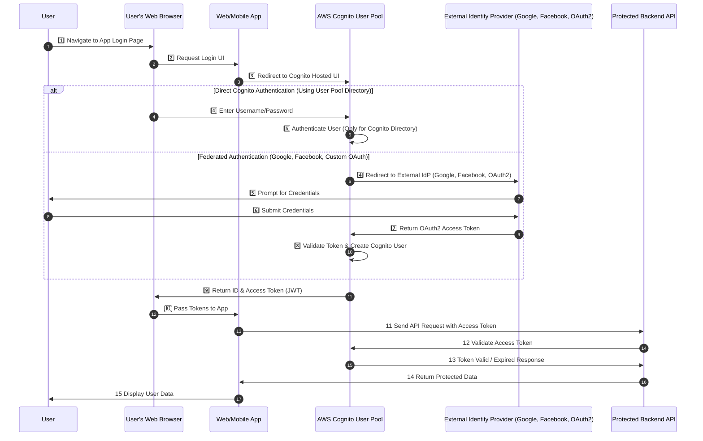
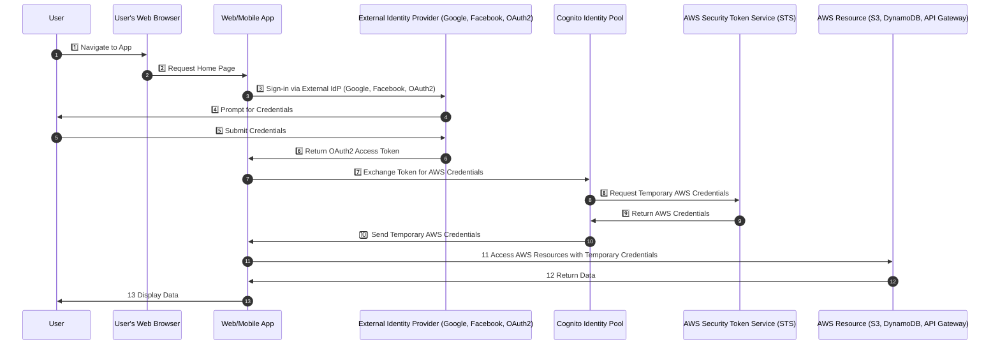
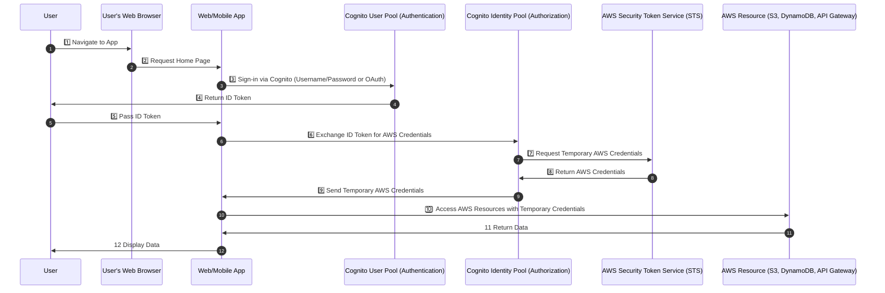

# 🔐 **AWS Cognito: User Pools & Identity Pools Architecture & Flow**

  

---

AWS Cognito provides **two main services**:

| **Component**     | **Purpose**                                                                                           | **Use Case**                                              |
| ----------------- | ----------------------------------------------------------------------------------------------------- | --------------------------------------------------------- |
| **User Pool**     | Manages **user authentication** (Sign-in, Sign-up, MFA, OAuth, Social Logins)                         | Secure authentication for applications                    |
| **Identity Pool** | Provides **temporary AWS credentials** to users from **any identity provider (including User Pools)** | Secure access to AWS services (S3, DynamoDB, API Gateway) |

> 💡 **They can be used separately or together!**

---

## **1️⃣ AWS Cognito User Pool Architecture & Flow**

### **📌 What is a User Pool?**

A **User Pool** is an authentication directory that provides:

- ✅ **Sign-in & Sign-up (Email, Username, Phone)**
- ✅ **OAuth2, OpenID Connect, SAML Authentication (Google, Facebook, Apple, Custom OAuth)**
- ✅ **Multi-Factor Authentication (MFA)**
- ✅ **JWT Tokens (ID Token, Access Token, Refresh Token)**

---

### **🛠️ How to Configure a Cognito User Pool in AWS**

1. **Go to AWS Cognito Console** → Click **Create User Pool**.
2. **Sign-in Options**:
   - Choose **Username, Email, or Phone Number**.
   - Enable **Multi-Factor Authentication (MFA)** if required.
3. **OAuth2 / Federated Authentication**:
   - Navigate to **App Integration** → **Identity Providers**.
   - Configure **Google, Facebook, Apple, or Custom OAuth Provider**.
4. **Enable Hosted UI for Authentication**.
5. **Create App Clients**:
   - **Disable Client Secret** for web/mobile apps.
   - Enable **ID, Access, and Refresh Tokens**.
6. **Save & Copy User Pool ID & App Client ID**.

---

### **🖼️ Workflow**

    

---

---

## **2️⃣ AWS Cognito Identity Pool Architecture & Flow**

### **📌 What is an Identity Pool?**

An **Identity Pool** is NOT an authentication service! Instead, it:

- ✅ **Exchanges identity provider tokens (Google, Facebook, SAML, etc.) for AWS credentials**
- ✅ **Maps users to IAM roles & grants AWS permissions**
- ✅ **Does NOT authenticate users but relies on federated identities**

---

### **🖼️ Workflow**

    

---

---

## **3️⃣ Using Cognito User Pool & Identity Pool Together**

### 📌 **Why Combine Both?**

- ✔ **User Pools handle authentication** (OAuth, Social, Email/Password).
- ✔ **Identity Pools handle AWS IAM role management**.
- ✔ **Prevents redundant identity federation configuration**.

---

### **🖼️ Workflow**

    

---

---

## 🏆 **Final Thoughts**

AWS Cognito correctly separates:

- ✔ **Authentication (User Pools - OAuth, Social, SAML, Custom Login)**
- ✔ **Authorization (Identity Pools - IAM Role Mapping, AWS Access)**
- ✔ **Using them together simplifies AWS permissions & access control**.

🚀 **Best Practice:**

- **Use User Pools for authentication**.
- **Use Identity Pools for AWS access**.
- **Avoid reconfiguring federated login in both places—use User Pools for identity management!**
