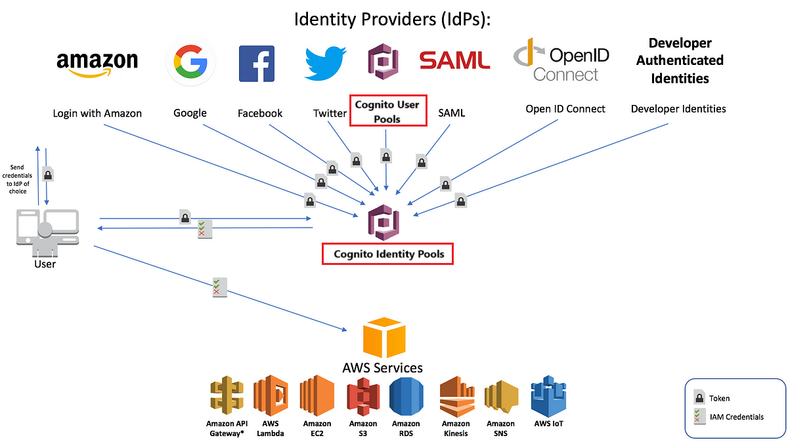

# 💳 **AWS Cognito: Comprehensive Guide to Identity and Access Management**

## 🔍 **What is AWS Cognito?**

AWS Cognito is a fully managed **identity and access management service** that enables developers to **add authentication, authorization, and user management** to web and mobile applications. It supports **user sign-up, sign-in, and access control** while allowing integration with third-party identity providers (e.g., Google, Facebook, Apple, and enterprise SAML/LDAP solutions).

> 💡 Think of AWS Cognito as a **security gate** for your applications. It verifies user identities before granting them access and ensures that only authorized users can enter.

---

  

---

## 🏗 **Key Components of AWS Cognito**

### 1️⃣ **Amazon Cognito User Pools** 🔑

A **User Pool** is a user directory that manages and authenticates users. It provides:

- ✅ **Sign-up and sign-in features**
- ✅ **Multi-Factor Authentication (MFA)**
- ✅ **OAuth, OpenID Connect (OIDC), and SAML integration**
- ✅ **Social logins (Google, Facebook, Apple, etc.)**
- ✅ **Custom authentication flows using AWS Lambda**

> 💡 Most aws services doesn't use jwt.  
> 💡 To access aws services you need actual aws credentials.  
> 💡 User pools doesn't grant access to aws services.  
> 💡 Their job is to control sign-in and deliver a jwt.  
> 💡 You can use that jwt to access to your own apps or even integrate it with identity pool to get aws temporary credential to access aws resources.

### 2️⃣ **Amazon Cognito Identity Pools** 🏢

An **Identity Pool** allows users to access AWS services **securely** after authentication. It provides:

- ✅ **Federated access** (social logins, SAML, OIDC, and custom IdPs)
- ✅ **Temporary AWS credentials using IAM roles**
- ✅ **Access to AWS services like S3, DynamoDB, and Lambda**

### **💡 Difference Between User Pools and Identity Pools:**

| Feature             | User Pool           | Identity Pool                           |
| ------------------- | ------------------- | --------------------------------------- |
| **Purpose**         | User authentication | AWS service access                      |
| **Manages Users**   | Yes                 | No (relies on authentication providers) |
| **Provides Tokens** | Yes (JWT tokens)    | No (AWS credentials via IAM roles)      |

### 3️⃣ **AWS Cognito Sync (Deprecated)** 🚫

AWS Cognito Sync was used for **offline data synchronization** but has been replaced by AWS AppSync.

---

## 🔄 **How AWS Cognito Works**

### 📝 **User Authentication Flow (User Pool)**

- 1️⃣ **User signs up** via email, phone, or social login.
- 2️⃣ **AWS Cognito verifies** user identity (optional MFA).
- 3️⃣ **Upon successful login**, AWS Cognito issues authentication tokens (**ID token, access token, refresh token**).
- 4️⃣ **User accesses application** using the token.

### 🔗 **Federated Access Flow (Identity Pool)**

- 1️⃣ **User logs in** using a user pool, social login, or enterprise IdP.
- 2️⃣ **AWS Cognito validates** credentials and generates a token.
- 3️⃣ **Cognito Identity Pool exchanges the token** for **temporary AWS credentials** using IAM roles.
- 4️⃣ **User gains secure access** to AWS services (e.g., S3, DynamoDB).

---

## 🔗 **AWS Cognito Tokens Explained**

After authentication, AWS Cognito generates:

- 🔹 **ID Token** – Contains user identity claims (name, email, phone, etc.)
- 🔹 **Access Token** – Grants access to secured resources (APIs, apps)
- 🔹 **Refresh Token** – Used to obtain new access tokens without re-authenticating

💡 **All tokens follow the JSON Web Token (JWT) format.**

---

## 🚀 **AWS Cognito Features and Capabilities**

### 🛡 **1. Multi-Factor Authentication (MFA) & Security**

- ✅ **SMS & TOTP-based MFA** for enhanced security
- ✅ **Adaptive authentication** (evaluates user risk before allowing access)
- ✅ **Compromised credential detection**

### 📡 **2. Third-Party Identity Provider (IdP) Integration**

- ✅ **Supports OAuth, OpenID Connect (OIDC), and SAML**
- ✅ **Social logins** (Google, Facebook, Apple, Amazon)
- ✅ **Enterprise authentication** (Microsoft Azure AD, Okta, Ping Identity)

### 🎨 **3. Custom Authentication Flows**

- ✅ **AWS Lambda Triggers** for custom authentication workflows
- ✅ **Customizable UI** for sign-in pages using AWS Amplify

### 🔄 **4. Token-Based Authorization**

- ✅ Uses **OAuth 2.0, OIDC, and JWT** for secure token-based authentication
- ✅ **Fine-grained access control** with IAM roles

### 🖥 **5. Serverless and Scalable**

- ✅ Fully managed, **serverless authentication**
- ✅ Scales automatically to handle millions of users

---

## 📌 **AWS Cognito Integration with Other AWS Services**

| Service          | Use Case                                               |
| ---------------- | ------------------------------------------------------ |
| **AWS Lambda**   | Custom authentication logic (e.g., passwordless login) |
| **API Gateway**  | Secure API access using Cognito tokens                 |
| **AWS IAM**      | Role-based access control for Identity Pool users      |
| **AWS S3**       | Secure file storage for authenticated users            |
| **AWS DynamoDB** | Store user profile data and preferences                |

---

## 🛠 **AWS Cognito Pricing** 💰

- ✅ **Free Tier:** 50,000 MAUs (monthly active users)
- ✅ **Pay-as-you-go:** Based on **MAUs, SMS usage, and advanced security features**

💡 **Identity Pools use AWS IAM, so pricing depends on AWS service consumption.**

---

## 🏆 **Pros and Cons of AWS Cognito**

### ✅ **Advantages**

- ✔ **Fully managed authentication** – No need to build from scratch
- ✔ **Highly scalable** – Handles millions of users
- ✔ **Secure and compliant** – Supports MFA, encryption, and adaptive authentication
- ✔ **Seamless AWS integration** – Works well with AWS services

### ❌ **Limitations**

- ⚠ **Limited customization** of login UI (without AWS Amplify)
- ⚠ **Complex IAM permissions** for Identity Pool integration
- ⚠ **Advanced security features cost extra**

---

## 📖 **Getting Started with AWS Cognito**

### 🛠 **Step 1: Create a User Pool**

- 1️⃣ Go to **AWS Cognito Console** → **User Pools** → **Create a new user pool**
- 2️⃣ Configure sign-in options (email, phone, social login)
- 3️⃣ Enable MFA (optional)
- 4️⃣ Customize attributes (name, email, custom fields)
- 5️⃣ Deploy and integrate with your application

### 🔗 **Step 2: Configure an Identity Pool (For AWS Access)**

- 1️⃣ Go to **AWS Cognito Console** → **Identity Pools** → **Create a new identity pool**
- 2️⃣ Link it to your user pool
- 3️⃣ Define IAM roles for authenticated users
- 4️⃣ Configure AWS services access

### 💻 **Step 3: Integrate AWS Cognito with Your App**

- ✅ **Using AWS SDK (JavaScript, Python, Swift, etc.)**
- ✅ **Using AWS Amplify for frontend authentication**
- ✅ **Secure APIs with Amazon API Gateway & Cognito Authorizer**

---

## 🎯 **Conclusion: Why Use AWS Cognito?**

AWS Cognito **simplifies authentication** for applications, providing **scalable, secure, and customizable** identity management. Whether you're building a **mobile app, web app, or enterprise solution**, Cognito offers seamless **user authentication, federated access, and integration with AWS services**.

> 💡 **Key Takeaway:** If you need **scalable authentication with strong security**, AWS Cognito is a **powerful, cost-effective choice**.
