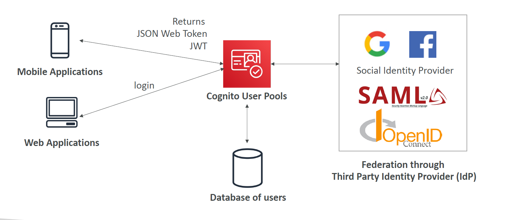
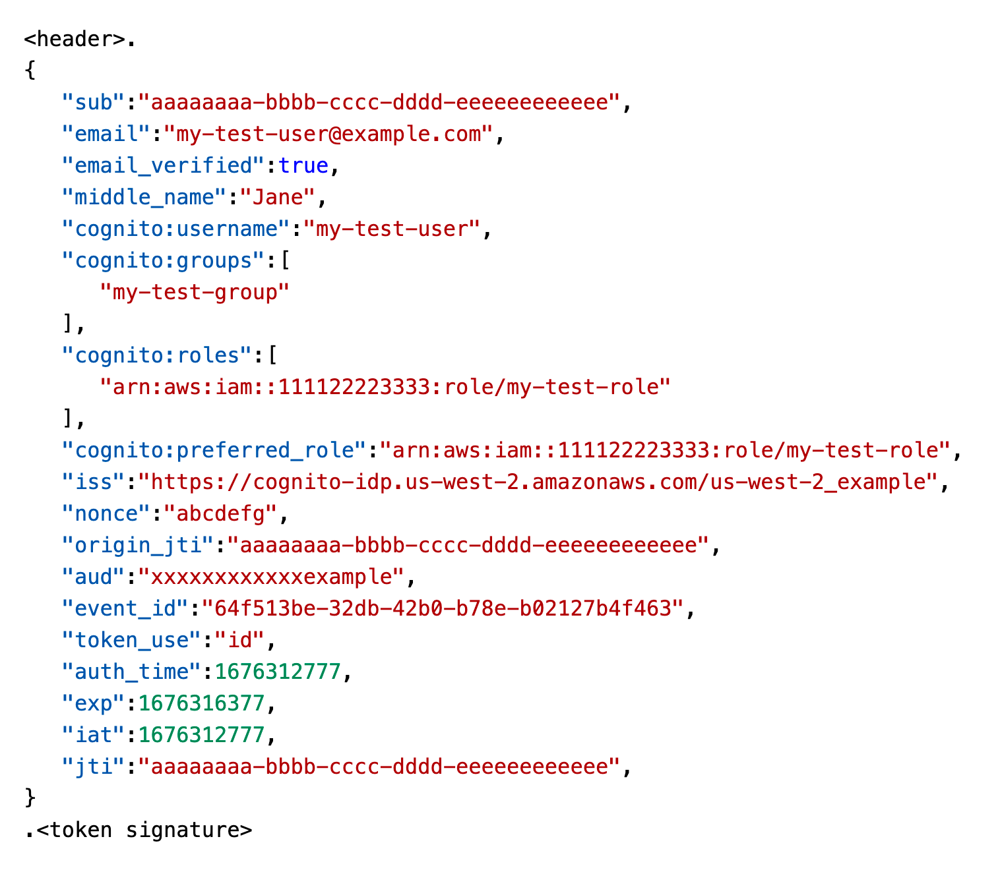
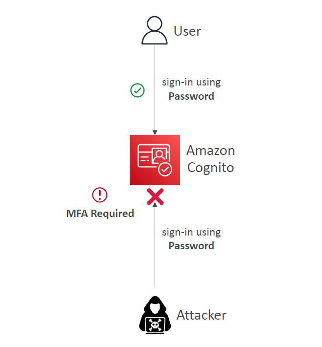
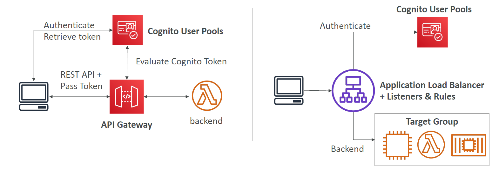
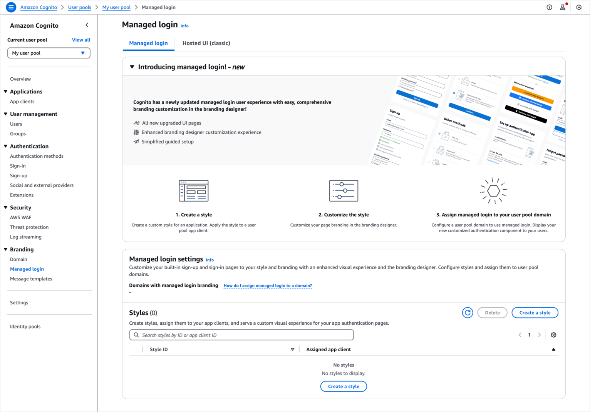
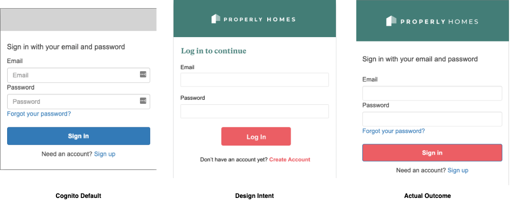
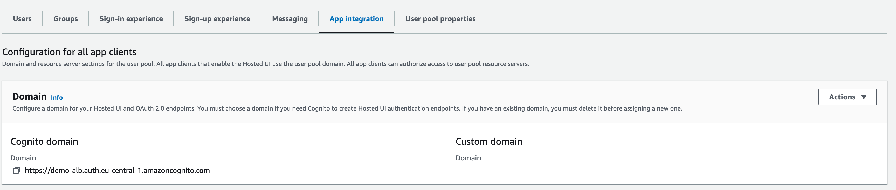

# 👤 **Cognito User Pools (CUP) – Complete Feature Deep Dive**

Amazon **Cognito User Pools (CUP)** are a **fully managed user directory** and authentication service designed for **secure, scalable identity management** in web and mobile applications. Think of CUP as your **"login system as a service"** — supporting passwords, social logins, multi-factor authentication, and more.

---

<div style="text-align: center;">
    
</div>

---

## 🛠️ **1. Core Features of Cognito User Pools**

| Feature                              | Description                                                          |
| ------------------------------------ | -------------------------------------------------------------------- |
| 👤 **Username / Password Login**     | Users authenticate using email, phone, or username                   |
| 🔁 **Password Reset**                | Secure password recovery flows with email/SMS                        |
| 📞 **Email/Phone Verification**      | Send OTP to verify phone or email during registration                |
| 🔐 **Multi-Factor Auth (MFA)**       | Time-based OTP (TOTP) or SMS-based second factor                     |
| 🌍 **Federated Identities**          | Log in using Google, Facebook, Apple, SAML, OIDC                     |
| 🚨 **Compromised Credential Checks** | Detect if a user’s password appears in public breaches               |
| 🎟️ **JWT Tokens**                    | Returns signed **ID**, **Access**, and **Refresh** tokens upon login |
| 🧠 **Adaptive Auth**                 | Dynamically prompt MFA based on sign-in risk                         |

---

## 🔄 **2. Token-Based Authentication (JWT)**

When users authenticate, CUP issues **three tokens**:

| Token Type           | Purpose                          |
| -------------------- | -------------------------------- |
| 📇 **ID Token**      | Contains user identity claims    |
| 🛂 **Access Token**  | Used to authorize API calls      |
| ♻️ **Refresh Token** | Used to get new ID/Access tokens |

### 🔍 **Structure of JWT**

Each token is a **base64-encoded string**:

---

```text
<HEADER>.<PAYLOAD>.<SIGNATURE>
```

---

<div style="text-align: center;">
    
</div>

---

- **Header**: Algorithm used to sign
- **Payload**: User claims (email, sub, etc.)
- **Signature**: Verifies authenticity

> 🔒 Use libraries like `jsonwebtoken` or AWS Amplify to validate tokens client-side.

---

## 🧠 **3. Adaptive Authentication**

> Block sign-ins or require `MFA` if the login appears suspicious.

To enhance security, **Cognito Adaptive Auth** applies **risk-based decisioning** on sign-in attempts:

| Risk Level | Action               |
| ---------- | -------------------- |
| Low        | Allow normal sign-in |
| Medium     | Prompt MFA           |
| High       | Block or force MFA   |

---

<div style="text-align: center;">
    
</div>

---

### **Risk score is based on different factors such as:**

- 🔍 Detects **new devices/IPs**
- 🔐 Considers past behavior & metadata
- 🤖 Integrates with **CloudWatch Logs** to track risks and challenges

---

## 🔌 **4. Integration Support**

> CUP integrates with API Gateway and Application Load Balancer:

---

<div style="text-align: center;">
    
</div>

---

## ⚙️ **5. Lambda Triggers – Customize the Auth Flow**

Cognito lets you **hook into lifecycle events** using **Lambda triggers**, giving full control over sign-up, sign-in, messaging, and more.

| Flow         | Trigger              | Description                                   |
| ------------ | -------------------- | --------------------------------------------- |
| 🔐 Auth      | `PreAuthentication`  | Validate login requests before password check |
| 🔐 Auth      | `PostAuthentication` | Audit logins or run analytics                 |
| 🔑 Tokens    | `PreTokenGeneration` | Add/remove claims before token is issued      |
| 🆕 Sign-Up   | `PreSignUp`          | Validate registration inputs                  |
| 🛂 Sign-Up   | `PostConfirmation`   | Send welcome emails or log user creation      |
| 🔄 Migration | `UserMigration`      | Migrate existing users during sign-in         |
| ✉️ Messaging | `CustomMessage`      | Customize MFA, verification emails/SMS        |

> ⚠️ Lambda functions are **synchronous** and must respond within **5 seconds** or the flow fails.

---

## 🔀 **6. Hosted UI (Authentication-as-a-Service)**

Cognito offers a **built-in hosted UI** for login and registration. No need to build your own frontend — just redirect users to a secure, customizable page:

- 🌐 **Social Login** : Integrate Google, Facebook, Apple, OIDC, etc.
- 🖼️ **Custom Branding** : Add logo, color themes, and CSS.
- 🔐 **Secure Hosted Auth** : All flows handled via HTTPS.

---

<div style="text-align: center;">
    
</div>

<div style="text-align: center;">
    
</div>

---

## 🌍 **7. Hosted UI Custom Domain**

> assign a **custom domain** to your Hosted UI

---

<div style="text-align: center;">
    
</div>

---

> 💡 Configured under **App Integration > Domain Name**
> 💡 You Must use **ACM certificate in `us-east-1`**

---

## 📌 **Conclusion: Cognito User Pools as a Modern Identity Engine**

CUP gives you everything you need to manage secure, scalable, and customizable user authentication — **without building your own auth stack**.

### 🎯 **Key Benefits:**

- ✅ Serverless and fully managed
- ✅ Built-in MFA, federated logins, adaptive auth
- ✅ Lambda triggers for full control
- ✅ JWT-based token flow for modern APIs
- ✅ Hosted UI and ALB/API Gateway integrations
