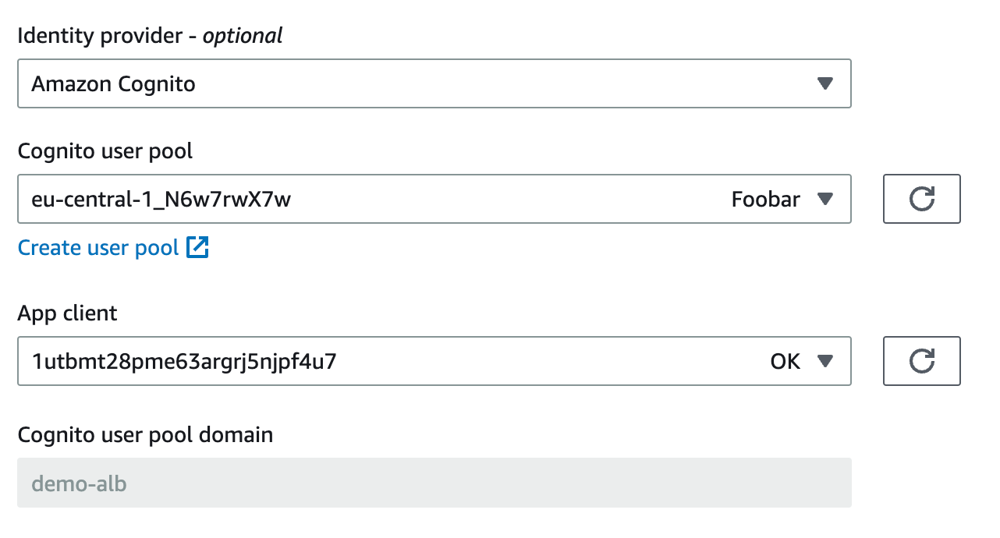
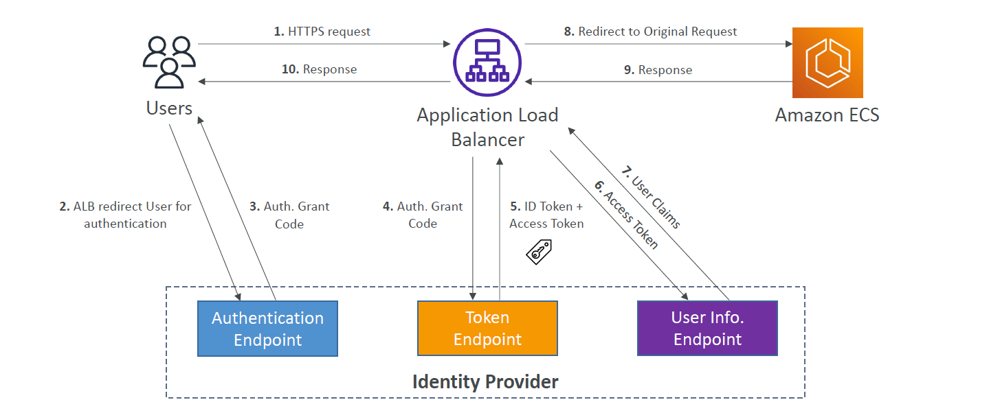
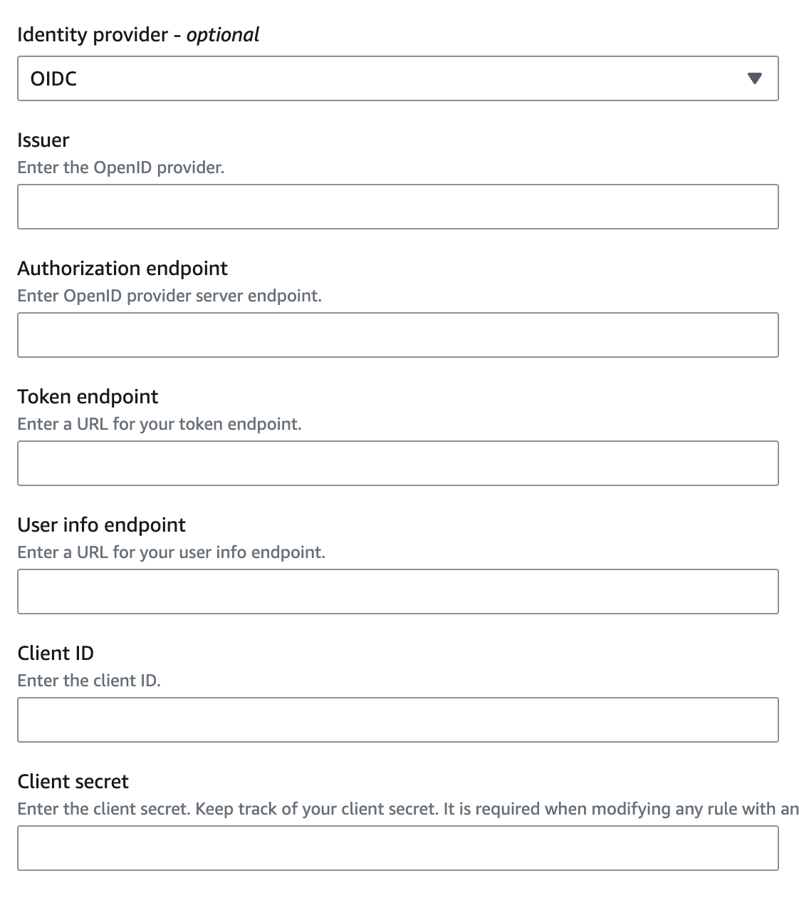
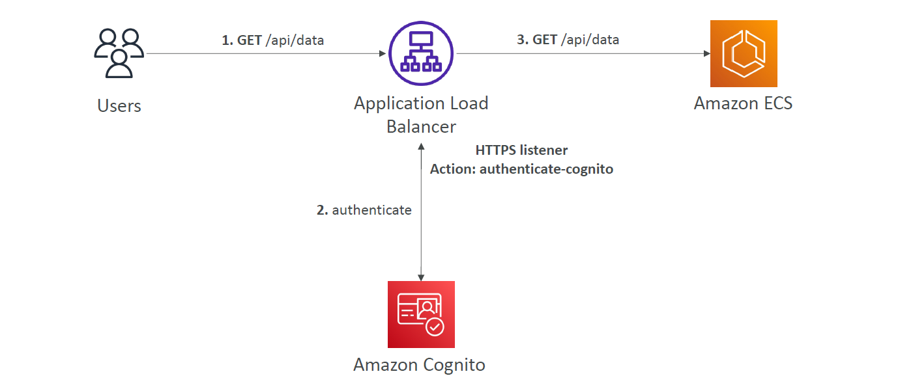

# 🔐 **Application Load Balancer – Authenticate Users via Cognito or OIDC**

Amazon **Application Load Balancer (ALB)** isn't just a traffic distributor — it can **authenticate users** before requests reach your backend (like ECS, EC2, or Lambda). This is achieved by offloading the authentication logic from your app to the **ALB listener** using **Cognito** or **OIDC-compliant identity providers**.

---

## ⚙️ **How ALB Authentication Works**

When a user makes a request to an HTTPS ALB:

1. **HTTPS Listener** intercepts the request.
2. If **authentication rules** are enabled, it:

   - Redirects unauthenticated users to
     - **1️⃣ Cognito Hosted UI** or
     - **2️⃣ OIDC Auth Endpoint**.
   - After authentication, receives a token (ID token or access token).

3. The user is then forwarded to the backend **only if authentication succeeds**.

### 🔑 Benefits

| Feature                    | Explanation                                                               |
| -------------------------- | ------------------------------------------------------------------------- |
| 🔐 Built-in Auth Layer     | ALB authenticates before backend, offloading auth logic from your app.    |
| 🌐 Supports Cognito & OIDC | Use AWS Cognito, Google, Facebook, or any OpenID Connect (OIDC) provider. |
| ⚡ Transparent to Backend  | Backend receives already authenticated traffic (JWT claims if needed).    |
| 🔁 Built-in Redirection    | Automatically handles login flows and callback redirects.                 |

---

## 1️⃣ **ALB with Amazon Cognito Integration**

    

---

### ✅ **Requirements:**

- A **Cognito User Pool** and **App Client**.
- Hosted UI must be configured.
- App Client must return **ID tokens**.

### 🛠️ **ALB Listener Setup:**

- **Protocol**: HTTPS
- **Default Actions**:

  1. **Authenticate** with Cognito
  2. **Forward** to target group (ECS/EC2/Lambda)

### 🔁 **Authentication Flow with Cognito:**

---

    

---

## 2️⃣ **ALB with OIDC Integration (e.g., Auth0, Okta)**

    

---

### ✅ **Required Fields:**

- **Issuer URL**
- **Authorization Endpoint**
- **Token Endpoint**
- **User Info Endpoint**
- **Client ID and Secret**

ALB will use these endpoints to:

- Redirect for login
- Exchange auth code for tokens
- Retrieve user claims

---

## ⚠️ **Listener Rule: `authenticate-cognito` or `authenticate-oidc`**

- **Condition**: When a path (e.g., `/api/*`) is accessed
- **Action**:

  - `authenticate-cognito` or `authenticate-oidc`
  - Then `forward` to target group

### ⚙️ **Advanced Options:**

| Setting                    | Description                                      |
| -------------------------- | ------------------------------------------------ |
| `OnUnauthenticatedRequest` | `authenticate` (default), `deny`, or `allow`     |
| Token TTLs                 | Customize session TTL, idle timeout, and max age |
| Scope                      | Specify OIDC scopes to be returned               |

---

## 🔐 **Use Cases**

| Use Case                            | How ALB Helps                                                             |
| ----------------------------------- | ------------------------------------------------------------------------- |
| Secure public-facing web apps       | No backend change required, plug-in identity protection.                  |
| External user login (social/OIDC)   | Integrate with Cognito for Google, Facebook, or with external IdP (OIDC). |
| Multi-tenant apps                   | Use JWT claims in the token to route or filter requests.                  |
| Internal authentication enforcement | Restrict access via Cognito User Pool MFA or corporate IdP with SAML.     |

---

## ✍🏻 **Example: ALB + Cognito + ECS**

    

---

### 🔄 **Step-by-Step Flow:**

1. User hits ALB → `/api/data`
2. ALB redirects user to Cognito login page
3. After successful login, Cognito sends JWT
4. ALB forwards request to ECS service with the JWT
5. ECS API validates token or simply trusts ALB

---

## 🛠️ **Security Considerations**

| Concern          | Recommendation                                          |
| ---------------- | ------------------------------------------------------- |
| Token validation | ALB doesn’t inspect token content — app must if needed. |
| Custom domains   | Use **ACM in us-east-1** for custom Cognito domain.     |
| HTTPS required   | ALB authentication **must** be used on port 443.        |

---

## 🧪 **Testing Tips**

- Enable **CloudWatch Logs** to view auth failures or token issues.
- Use tools like **JWT.io** to inspect token content returned by Cognito.
- Monitor login flows with **Cognito Analytics** or **ALB access logs**.

---

## 🚀 Summary

Application Load Balancer authentication is a **simple yet powerful** way to protect your APIs and applications without rewriting backend code.

- ✅ Supports both **Cognito** and **OIDC**
- ✅ Easily integrates with **ECS, EC2, or Lambda**
- ✅ Shifts auth logic to the ALB for simplicity and scalability
- ✅ Reduces attack surface and handles login redirects for you
