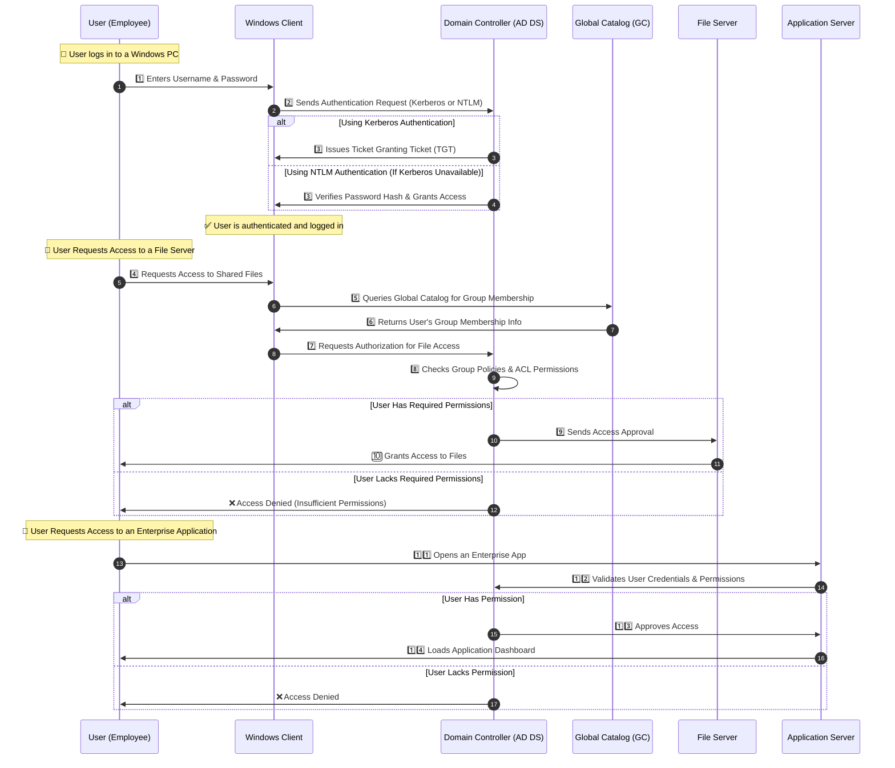

---
tags:
  - aws
  - aws/service
  - aws/domain/security
  - aws/topic/directory-service
aliases:
  - "Active Directory Authentication & Authorization Flow"
  - "Ms Ad Authentication & Authorization Flow"
---

# 💻🔐 **Active Directory Authentication & Authorization Flow**

When a user logs in to **Windows**, AD performs authentication and authorization using **Kerberos or NTLM**, then grants access to network resources.

---

## **🛠️ Step-by-Step Explanation of AD Authentication & Authorization Flow**

### **1️⃣ User Login & Authentication Process**

1. The **user enters credentials** (`Username/Password`) in Windows.
1. The **Windows client** sends an **authentication request** to a **Domain Controller (DC)**.
1. If Kerberos is used, the **DC issues a Ticket Granting Ticket (TGT)**.
1. If NTLM is used, the **DC verifies the password hash**.
1. The **user is authenticated**, and login is successful.

---

### **2️⃣ Authorization & Resource Access Process**

1. The **user requests access** to a network resource (e.g., file server, database).
1. The **Windows client contacts AD** for authorization.
1. The **Domain Controller (DC) verifies user permissions** using **Active Directory group memberships**.
1. If the user is **authorized**, the **resource server grants access**.
1. If unauthorized, access is denied.

---

### **🖥️ Detailed Sequence Diagram of AD Authentication & Authorization**

---

## **📌 Explanation of Key Components**

| **Component**                    | **Function**                                           |
| -------------------------------- | ------------------------------------------------------ |
| **User (Employee)**              | A person trying to log in and access resources         |
| **Windows Client (Workstation)** | The user's device where authentication starts          |
| **Domain Controller (DC)**       | Authenticates the user and enforces security policies  |
| **Global Catalog (GC)**          | Stores user information for multi-domain searches      |
| **File Server**                  | Hosts shared files that require authorization          |
| **Application Server**           | Provides access to enterprise apps based on user roles |

---

## **⚙️ Key Takeaways**

### **1️⃣ Authentication (Who Are You?)**

✔ Uses **Kerberos (default) or NTLM (legacy)** for secure login  
✔ **DC verifies credentials** and issues **TGT (if Kerberos is used)**  
✔ **Successful login** allows access to the local system

### **2️⃣ Authorization (What Can You Access?)**

✔ **User requests access** to network resources (file shares, applications)  
✔ **DC checks group memberships & security policies**  
✔ **If permitted**, access is granted; otherwise, it is denied

---

## 🏆 **Final Thoughts**

✔ **AD Authentication & Authorization** ensures secure **user login & access control**  
✔ **Kerberos is the preferred authentication protocol** (stronger security than NTLM)  
✔ **Group Policies & ACLs enforce access restrictions** to protect sensitive data

💡 **Active Directory centralizes authentication & authorization, making enterprise security robust and manageable!** 🚀
---

## Related Notes
- [[aws-services/2.security/1.3.directory-service/1.2.ms-ad-components|Microsoft Active Directory AD]] - previous lesson
- [[aws-services/2.security/1.3.directory-service/2.1.aws-directory-service|AWS Directory Service]] - next lesson

---
