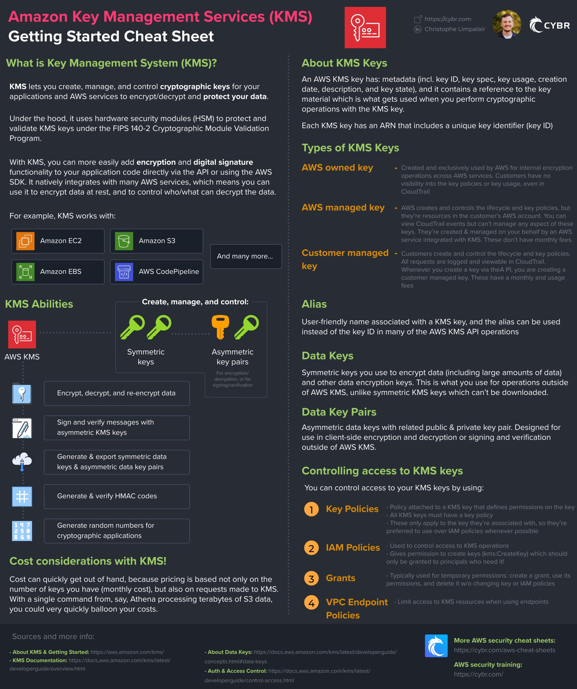
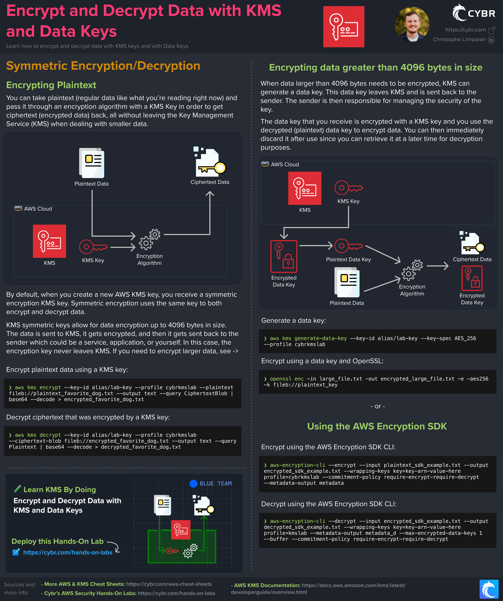
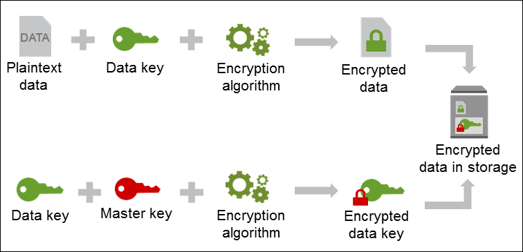
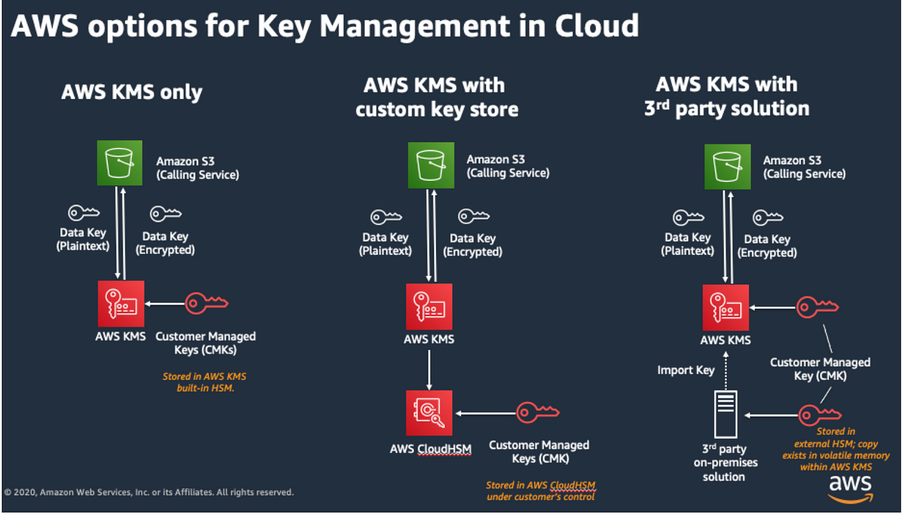

---
tags:
  - aws
  - aws/service
  - aws/domain/security
  - aws/topic/kms
aliases:
  - "KMS Summary"
---

# **🔐 KMS Summary**

    

---

    

---

    

---

    

---

## Related Notes
- [[aws-services/2.security/2.1.kms/1.1.encryption-and-decryption|Encryption Securing Your Data in the Cloud Deep Dive]] - next lesson

---
