# 🔐 **Encryption: Securing Your Data in the Cloud (Deep Dive)**

Encryption is the **mathematical shield** that protects your data from unauthorized access, tampering, and eavesdropping—whether it's traveling over a network or sitting quietly in storage. In the cloud, it's a core defense mechanism that ensures **confidentiality**, **integrity**, and **compliance**.

---

<div style="text-align: center;">
    
</div>

---

## 🛡️ **Two Key Dimensions of Cloud Encryption**

### 🔄 1. **Encryption In Transit**

> Data is encrypted **while being transferred** between systems (e.g., between browser and server or service-to-service within a VPC).

- ✅ Uses **TLS/SSL** to protect communication
- ✅ Prevents **Man-in-the-Middle (MITM)** and packet sniffing attacks
- 🔐 Relies on **asymmetric encryption for key exchange**, followed by **symmetric encryption** for performance

### 💾 2. **Encryption At Rest**

> Data is encrypted **when stored**—whether in disks, databases, or object storage (e.g., S3, EBS, RDS).

- ✅ Uses **symmetric encryption** like AES-256 to encrypt stored bits
- 🔐 Often combined with **key management systems** like AWS KMS
- ✅ Helps ensure data is unreadable even if physical storage is compromised

---

<div align="center">
  
</div>

---

## 🔑 **Core Encryption Methods**

Encryption is fundamentally about **keys and algorithms**. The two main categories are:

---

### 🧠 1. **Asymmetric Encryption** (Public/Private Key Cryptography) 🔑🔑

<div style="text-align: center;">
    
</div>

#### 📘 Definition

Uses a **key pair**:

- 🔓 **Public Key** → used to **encrypt** or **verify**
- 🔐 **Private Key** → used to **decrypt** or **sign**

Only the holder of the private key can decrypt the message encrypted with the corresponding public key.

#### 🔬 How It Works

1. Browser or client obtains the server's **public key**
2. Client encrypts a value (e.g., session key or pre-master secret)
3. Server uses its **private key** to decrypt it securely

#### 🔧 Usage

- TLS/SSL key exchange
- Digital signatures
- SSH access
- AWS KMS (for signing or encrypting small data)

#### ✅ Pros

- Safe public key distribution
- Enables **non-repudiation** via signatures
- Excellent for establishing **secure channels**

#### ❌ Cons

- **Slow** and resource-intensive
- Not suitable for large data encryption

#### 📦 Example

```bash
openssl genrsa -out private.pem 2048
openssl rsa -in private.pem -pubout -out public.pem
```

---

### 🔁 2. **Symmetric Encryption** (Shared Secret Key) 🔑

<div style="text-align: center;">
    
</div>

#### 📘 Definition

Uses **one key** for both **encryption and decryption**. Both sender and receiver must securely share this key beforehand.

#### 🔬 How It Works

1. A shared secret key is distributed
2. The sender encrypts the message with that key
3. The receiver decrypts it using the **same key**

#### 🔧 Usage

- File and disk encryption (EBS, S3)
- Databases (RDS encryption)
- VPN tunnels
- Envelope encryption (via AWS KMS)

#### ✅ Pros

- Fast and efficient
- Ideal for encrypting large files or streaming data

#### ❌ Cons

- Requires **secure key management**
- Not ideal for open/public channels without additional safeguards

#### 📦 Example (AES-256)

```bash
openssl enc -aes-256-cbc -salt -in file.txt -out file.enc
openssl enc -d -aes-256-cbc -in file.enc -out file_decrypted.txt
```

---

## 🔗 **What Is Envelope Encryption? (Used in AWS, GCP, Azure)**

> **Envelope encryption** is a hybrid model where:
>
> - 🔐 A **symmetric key (DEK)** encrypts the data
> - 🔒 That symmetric key is itself encrypted with a **master key (CMK)** stored in a secure key manager (e.g., AWS KMS)

This balances **performance** (symmetric for data) and **security** (asymmetric or managed CMK for key protection).

### 📦 Process

1. KMS generates a **DEK** (Data Encryption Key)
2. DEK encrypts your data (AES-256)
3. DEK is encrypted with your **CMK**
4. You store:

   - Encrypted data
   - Encrypted DEK

### 📥 On Retrieval

- The encrypted DEK is decrypted by KMS using the CMK
- The plaintext DEK decrypts your data

> 🔐 **Envelope encryption** does **not expose** your master keys, and supports auditing, rotation, and fine-grained access control.

---

## 🤝 TLS Encryption in Transit – Deep Dive

TLS establishes a **secure session** using asymmetric cryptography to safely negotiate a symmetric session key.

```mermaid
sequenceDiagram
    autonumber
    participant Client as 🧑‍💻 Client (Browser)
    participant Server as 🌐 Web Server
    participant CA as 🏛️ Certificate Authority

    Client->>Server: ClientHello
    Server-->>Client: ServerHello + Certificate
    Client->>CA: Validate Certificate
    Client->>Server: Encrypted Pre-Master Key
    Server->>Server: Decrypt Pre-Master Key
    Note over Client, Server: Derive Session Key
    Client->>Server: Finished (Encrypted)
    Server-->>Client: Finished (Encrypted)
    Client->>Server: HTTP Request (Encrypted)
    Server-->>Client: HTTP Response (Encrypted)
```



---

## 🧱 Encryption At Rest with AWS KMS (Real World)

> AWS KMS provides **centralized key management** for encrypting data at rest using **envelope encryption**.

### 🔐 Workflow

1. Your app asks KMS to generate a **DEK**
2. App uses **plaintext DEK** to encrypt data
3. DEK is **encrypted with a CMK** (Customer Master Key)
4. You store:

   - `ciphertext`
   - `encrypted DEK`

### ✅ Benefits

- Transparent integration with S3, RDS, EBS, Lambda, etc.
- IAM & key policies control access
- Full audit trail via CloudTrail

---

## ✅ Encryption Best Practices (Cloud & Security)

| ✅ Best Practice                          | 🔍 Why It Matters                                            |
| ----------------------------------------- | ------------------------------------------------------------ |
| Encrypt data **in transit** & **at rest** | Protects against network sniffing and physical storage theft |
| Use **TLS 1.3**                           | Stronger encryption and faster handshakes                    |
| Adopt **envelope encryption**             | Combines speed (symmetric) with security (key wrapping)      |
| Store keys in **KMS or HSM**              | Avoid app-layer key sprawl, improve control                  |
| Enforce **least privilege** on keys       | Reduce blast radius of any compromise                        |
| Enable **CloudTrail logs for KMS**        | Track who accessed which key and when                        |
| Rotate CMKs and DEKs periodically         | Minimize risk from long-lived keys                           |

---

## 📘 Key Terminology Glossary

| Term                    | Description                                                             |
| ----------------------- | ----------------------------------------------------------------------- |
| **Plaintext**           | Original readable data                                                  |
| **Ciphertext**          | Encrypted version of the data                                           |
| **Public Key**          | Used to encrypt or verify                                               |
| **Private Key**         | Used to decrypt or sign                                                 |
| **Session Key**         | Symmetric key used for a single TLS session                             |
| **DEK**                 | Data Encryption Key used to encrypt actual data                         |
| **CMK**                 | Customer Master Key used to encrypt DEKs (in KMS)                       |
| **Envelope Encryption** | A method that encrypts data with a DEK, and encrypts the DEK with a CMK |

---

## 🧠 Final Summary

| 🔒 Concept                | 💬 Description                                           |
| ------------------------- | -------------------------------------------------------- |
| **Encryption In Transit** | Protects data during communication using TLS             |
| **Encryption At Rest**    | Secures stored data using AES or envelope encryption     |
| **Asymmetric Encryption** | Uses key pairs; ideal for identity & secure key exchange |
| **Symmetric Encryption**  | Fast shared-key encryption for bulk data                 |
| **Envelope Encryption**   | Combines both methods; standard in cloud key management  |
