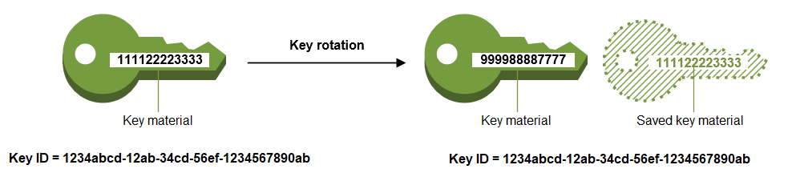
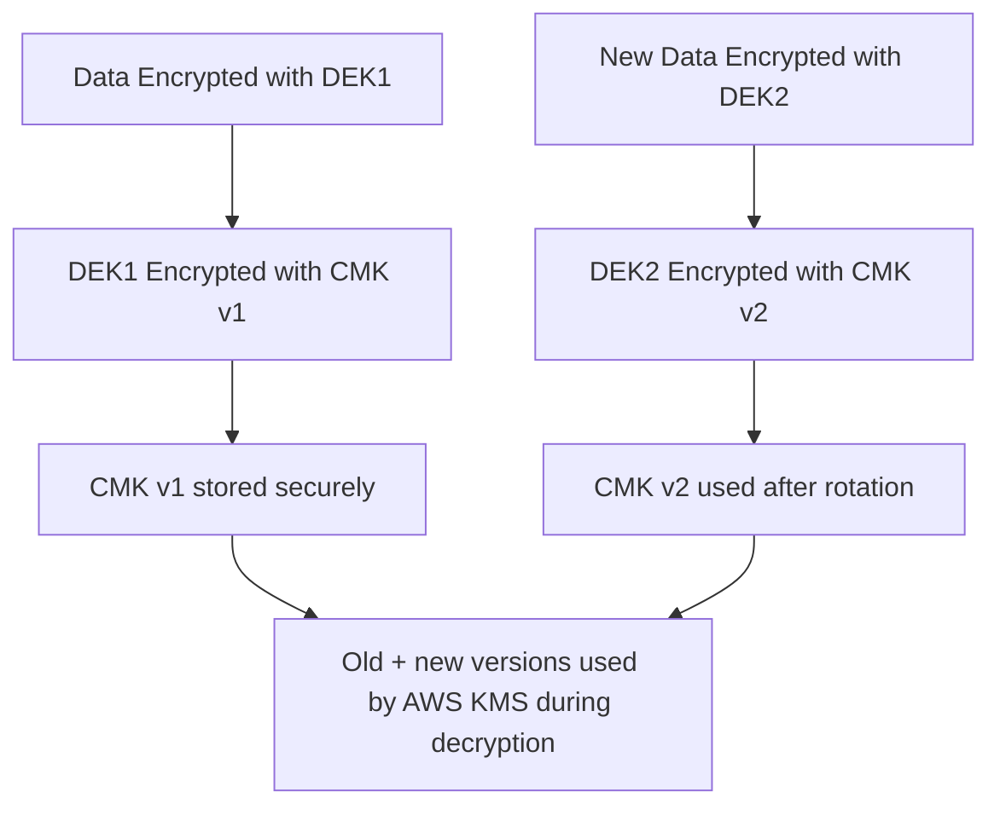

---
tags:
  - aws
  - aws/service
  - aws/domain/security
  - aws/topic/kms
aliases:
  - "AWS KMS Key Rotation"
  - "Kms Key Rotation"
---

# 🔁 🔐 **AWS KMS Key Rotation**

Key rotation is a **critical security practice** that ensures your cryptographic keys don’t stay in use too long—reducing the potential blast radius if a key is ever compromised.

In **AWS Key Management Service (KMS)**, key rotation helps maintain strong data protection by **automatically or manually rotating encryption keys** used in services like S3, EBS, RDS, Lambda, and Secrets Manager.

---

## 🔑 **What Is Key Rotation in AWS KMS?**

> Key rotation is the process of replacing an existing **Customer Master Key (CMK)** with a **new version**, ensuring cryptographic hygiene over time.

---

<div style="text-align: center;">
    
</div>

---

### 📦 In Envelope Encryption

- 🔐 Your data is encrypted using a **Data Encryption Key (DEK)**
- The DEK is encrypted using a **CMK**
- When CMK is rotated, **future DEKs** are encrypted with the **new CMK version**

> 🔁 Past encrypted data **remains safe** because AWS keeps old CMK versions to decrypt old DEKs.

---

## 🔄 **Types of Key Rotation**

### ✅ 1. **Automatic Key Rotation (Recommended for Most Use Cases)**

- Only applies to **symmetric CMKs**
- AWS **automatically rotates the key every 1 year**
- All previous key versions are **retained to decrypt old data**
- No impact on encrypted data or application logic

📌 To enable:

```bash
aws kms enable-key-rotation --key-id <your-key-id>
```

### ❗ Notes

- CMKs created in **Secrets Manager, S3, or Lambda by default use automatic rotation**
- **Only customer-managed keys** support rotation, **not AWS-managed keys**

---

### 🔁 2. **Manual Key Rotation (Custom Logic)**

- Used when **you rotate keys yourself** (e.g., to comply with special regulations)
- You create a **new CMK**, then:

  - Re-encrypt existing data using the new CMK
  - Update app logic or secrets to use the new key

📦 Often used with **asymmetric keys** (which **do not** support automatic rotation)

---

## 🛠️ **How Automatic Rotation Works (Behind the Scenes)**

<div align="center">



</div>

🧠 Key points:

- AWS stores **old CMK versions internally**
- You **don’t need to re-encrypt old data**
- The app continues working without changes

---

## 🧪 **How to Verify Rotation Status**

```bash
aws kms get-key-rotation-status --key-id <your-key-id>
```

Returns:

```json
{
  "KeyRotationEnabled": true
}
```

---

## 🔐 Best Practices for Key Rotation

| Best Practice                               | Why It Matters                                            |
| ------------------------------------------- | --------------------------------------------------------- |
| ✅ Enable automatic rotation for CMKs       | Easy, safe, and AWS handles version management            |
| 🔄 Rotate keys manually if needed by policy | Required for compliance with some security frameworks     |
| 🚫 Don't rotate AWS-managed keys            | They cannot be rotated; use customer-managed keys instead |
| 🔐 Use CMK aliases                          | Allows rotating keys without updating app references      |
| 📜 Enable CloudTrail for KMS                | Monitor who used which key and when                       |
| ♻️ Re-encrypt sensitive data periodically   | Especially if using manual rotation                       |

---

## 📦 Use Cases Where Rotation Matters

| Service             | How It Uses KMS Rotation                         |
| ------------------- | ------------------------------------------------ |
| **S3**              | Re-encrypts object keys using latest CMK version |
| **RDS**             | Uses latest CMK for snapshot encryption          |
| **Secrets Manager** | Rotates the secret & encrypts with latest CMK    |
| **Lambda**          | Uses CMK for environment variable decryption     |

---

## 🔁 Sample Rotation Use Case: Secrets Manager + Lambda

1. Secret stored in **AWS Secrets Manager**, encrypted with CMK
2. Automatic rotation is enabled (via Lambda trigger)
3. Secret is rotated periodically
4. CMK is also auto-rotated every year
5. AWS KMS ensures the old CMK version can still decrypt older secrets if needed

---

## ✅ Summary

| Topic                      | Detail                                             |
| -------------------------- | -------------------------------------------------- |
| **What is rotated**        | The **CMK version**, not the data or DEK           |
| **Automatic rotation**     | AWS rotates CMK annually for symmetric keys        |
| **Manual rotation**        | You create a new CMK and update references         |
| **Encrypted data**         | Does **not** need to be re-encrypted automatically |
| **Backward compatibility** | Maintained — AWS keeps previous CMK versions       |
---

## Related Notes
- [[aws-services/2.security/2.1.kms/2.aws-kms|AWS KMS Centralized Key Management for Secure Cloud Encryption]] - previous lesson
- [[aws-services/2.security/2.1.kms/4.kms-multi-region-keys|AWS KMS Multi-Region Keys Simplified Cross-Region Encryption]] - next lesson
- [[aws-services/2.security/2.1.kms/1.2.envelope-encryption|There are two uses of asymmetric + symmetric encryption but they are not the same thing]] - mentions Envelope Encryption
- [[aws-services/2.security/2.1.kms/1.3.key-rotation|Key Rotation]] - mentions Key Rotation
- [[aws-services/4.storage/1.s3/2.5.encryption|Amazon S3 Encryption]] - mentions Encryption
- [[aws-services/5.compute/2.ebs/4.1.snapshot|Amazon EBS Snapshots Efficient Scalable Backup for Your Volumes]] - mentions Snapshot
- [[aws-services/5.compute/2.ebs/1.1.ebs|Amazon EBS Elastic Block Store Scalable Persistent Storage for EC2]] - mentions Ebs

---
