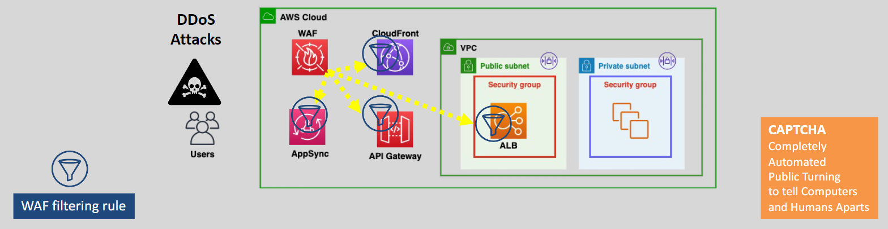

---
tags:
  - aws
  - aws/service
  - aws/domain/security
  - aws/topic/waf
aliases:
  - "AWS WAF Web ACLs Your Traffic Gatekeeper"
  - "Waf ACL"
---

# 🧱 **AWS WAF Web ACLs: Your Traffic Gatekeeper**

> _Define the security rules for your applications and APIs — inspect every request, allow the good, block the bad._

---

<div align="center" style="padding: 0 20px;">
  
</div>

---

## 🌟 **What is a Web ACL in AWS WAF?**

A **Web ACL (Web Access Control List)** is the **main building block** in AWS WAF.

✅ It’s a **set of rules** that decides:

- 📥 Which HTTP/S requests to **Allow**
- 🚫 Which requests to **Block**
- 📊 Which requests to simply **Count** (for monitoring)
- 🤖 Whether to **Challenge (CAPTCHA)** or **Verify (Challenge)** users

✅ You **attach** a Web ACL to your AWS resources like:

- **CloudFront distributions**
- **Application Load Balancers (ALB)**
- **API Gateway endpoints**
- **AWS AppSync APIs**
- **Amazon Cognito user pools**

---

## 🛠️ **How AWS WAF Web ACLs Work**

```mermaid
flowchart TD
    A[Incoming HTTP/S Request] --> B[WAF Web ACL]
    B --> C{Match any rule?}
    C -- Yes --> D["Apply matching rule action (Allow, Block, Count, CAPTCHA)"]
    C -- No --> E[Apply Default Action (Allow/Block)]
```

✅ **WAF Web ACL** acts like a **filtering gate** at the very first step before your app handles anything.

---

## 🔎 **Main Components of a Web ACL**

| Component             | Description                                                         |
| :-------------------- | :------------------------------------------------------------------ |
| 🧱 **Web ACL**        | The container that holds and orders rules                           |
| 📜 **Rules**          | Conditions that inspect parts of requests (headers, IP, body, etc.) |
| 📚 **Rule Groups**    | Bundles of rules (AWS Managed or your own)                          |
| 🔢 **Priority Order** | Rules are evaluated in order — first match wins                     |
| ⚙️ **Default Action** | What happens if no rules match (Allow or Block)                     |
| 🎯 **Rule Actions**   | Allow, Block, Count, CAPTCHA, Challenge                             |

---

## ✨ **Actions a Rule Can Perform**

| Action           | Purpose                                             |
| :--------------- | :-------------------------------------------------- |
| ✅ **Allow**     | Let the request through                             |
| 🚫 **Block**     | Reject the request with a 403 Forbidden             |
| 📊 **Count**     | Do not affect the request but log it for monitoring |
| 🤖 **CAPTCHA**   | Present a CAPTCHA challenge before allowing         |
| 🧩 **Challenge** | Advanced browser verification (beyond CAPTCHA)      |

---

## 🪜 **Web ACL Evaluation Flow (Step-by-Step)**

1. Request reaches your resource (CloudFront/ALB/API Gateway).
2. WAF evaluates request **against each rule** in Web ACL in priority order.
3. First matching rule **decides the action** (Allow/Block/Count/Challenge).
4. If no rule matches, **Default Action** (Allow or Block) applies.
5. WAF logs decision (if configured) to **S3**, **CloudWatch Logs**, or **Kinesis Data Firehose**.

---

## 🎯 **Example: Simple Web ACL Structure**

| Priority | Rule Name              | Condition                                     | Action |
| :------- | :--------------------- | :-------------------------------------------- | :----- |
| 1        | BlockBadIPs            | IP set match (blocked IP list)                | Block  |
| 2        | SQLInjectionProtection | SQLi patterns detected in body/query          | Block  |
| 3        | RateLimitAPI           | More than 1000 requests per 5 minutes from IP | Block  |
| 4        | AllowAllOthers         | Default                                       | Allow  |

✅ Requests are evaluated **top to bottom**.

---

## 📚 **Common Web ACL Rules You Can Create**

| Rule Type                   | Example Use                                                  |
| :-------------------------- | :----------------------------------------------------------- |
| 🚫 **IP Set Rules**         | Block specific IP addresses or CIDR ranges                   |
| 🛡️ **AWS Managed Rules**    | Use pre-built rules against common threats like OWASP Top 10 |
| ✍️ **String Match Rules**   | Block requests containing suspicious keywords                |
| 🐛 **SQLi/XSS Match Rules** | Block SQL Injection and Cross-Site Scripting                 |
| 🌍 **Geo Match Rules**      | Allow or block countries or regions                          |
| 🚀 **Rate-Based Rules**     | Automatically block abusive traffic                          |

---

## 🌎 **Web ACL Use Cases**

| Use Case                                    | How Web ACL Helps                          |
| :------------------------------------------ | :----------------------------------------- |
| 🔥 **Protect Against OWASP Top 10 Threats** | Use Managed Rule Groups (SQLi, XSS, etc.)  |
| 🚀 **Control API Abuse**                    | Enforce request rate limits                |
| 🌍 **Restrict Geographic Access**           | Allow/block based on user locations        |
| 🤖 **Filter Bots**                          | Apply CAPTCHA or block bad bots            |
| 🛡️ **Custom Business Logic**                | Create your own rules for specific threats |

---

## 📈 **Monitoring Web ACLs**

- **Metrics** are pushed to **Amazon CloudWatch** automatically:
  - AllowedRequests
  - BlockedRequests
  - CountedRequests
- **Detailed logs** can be sent to:
  - **S3** (archival analysis)
  - **CloudWatch Logs** (real-time dashboards)
  - **Kinesis Data Firehose** (advanced pipelines)

✅ You can **visualize** how your Web ACL protects your apps!

---

## 💰 **Pricing Overview**

| Item                          | Cost                                             |
| :---------------------------- | :----------------------------------------------- |
| **Web ACL Monthly Charge**    | Based on number of Web ACLs                      |
| **Per Rule Charge**           | Based on number of rules per Web ACL             |
| **Request Inspection Charge** | Based on the number of HTTP/S requests evaluated |

✅ **Pay for what you use** — no upfront commitment.

---

## 🏆 **Final Smart Pro Tip**

> 🧠 **Start with AWS Managed Rule Groups for fast protection. Then layer your own custom rules as you learn more about your application's traffic patterns.**

✅ Managed rules save time  
✅ Custom rules add precision  
✅ Combined = Best defense!
---

## Related Notes
- [[aws-services/2.security/3.2.waf/|Index]] - folder map
- [[aws-services/2.security/3.2.waf/2.2.waf-and-elb-integration-internal|Detailed AWS WAF + ALB Elastic Load Balancer Integration Flow]] - previous lesson
- [[aws-services/11.analytics/kinesis-trash/3.kinesis-data-firehose|Amazon Kinesis Data Firehose]] - mentions Kinesis Data Firehose
- [[aws-services/1.management-governance/3.1.cloud-watch/3.1.cw-logs|Amazon CloudWatch Logs]] - mentions CloudWatch Logs
- [[aws-services/15.front-end-web-mobile/app-sync/2.1.appsync-step-by-step|AWS AppSync]] - mentions AWS AppSync
- [[aws-services/3.network/4.api-gateway/x.api-gateway|Amazon API Gateway Streamlining API Management]] - mentions API Gateway
- [[aws-services/3.network/4.api-gateway/1.1.api-gateway|AWS API Gateway The Front Door for Your APIs]] - mentions API Gateway
- [[aws-services/11.analytics/firehose/1.1.firehose|Amazon Data Firehose The Pipeline That Never Sleeps]] - mentions Firehose
- [[aws-services/2.security/3.2.waf/2.1.aws-waf|AWS WAF Web Application Firewall global]] - mentions AWS Waf

---
