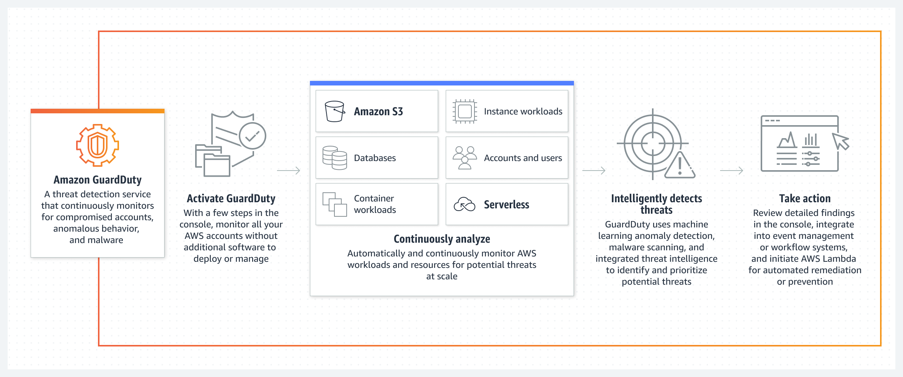

# 🤖🫸 **AWS GuardDuty: Intelligent Threat Detection for Your AWS Cloud**

> _Your always-on security detective — continuously monitoring AWS environments for threats and suspicious behavior._

---

  

---

## 🌟 **What is AWS GuardDuty?**

**AWS GuardDuty** is a **fully managed threat detection service** that continuously:

- 🔎 Monitors your AWS accounts, workloads, and data.
- 🚨 Detects **malicious activities**, **unauthorized behavior**, and **potential security breaches**.
- 🧠 Uses **machine learning**, **anomaly detection**, and **threat intelligence** to spot threats.

✅ Think of it as your **automated security analyst** — no infrastructure to deploy, no agents to install.

---

## 🛠️ **How AWS GuardDuty Works**

✅ GuardDuty **collects logs**, **analyzes patterns**, **detects anomalies**, and **generates actionable findings**.

---

## 🔍 **What Data Sources GuardDuty Monitors**

| Source                                        | What It Watches                                    |
| :-------------------------------------------- | :------------------------------------------------- |
| 📜 **AWS CloudTrail Management Events**       | API actions (e.g., creating users, changing roles) |
| 📜 **AWS CloudTrail Data Events (S3 Access)** | S3 object-level operations                         |
| 🌐 **VPC Flow Logs**                          | Network traffic going to/from EC2 instances        |
| 🌐 **Route 53 DNS Logs**                      | Domain name lookups from resources                 |
| 💾 **EBS Volume Data**                        | Malware scans on attached EBS volumes              |
| 🛠️ **EKS Audit Logs**                         | Kubernetes API activities (for EKS clusters)       |

✅ Multiple layers of monitoring = Broad, deep threat detection.

---

## 🚨 **What AWS GuardDuty Can Detect**

| Threat Type                   | Example                                                                  |
| :---------------------------- | :----------------------------------------------------------------------- |
| 🧑‍💻 **Account Compromise**  | Stolen IAM credentials being used                                        |
| 🌍 **Infrastructure Threats** | EC2 instances talking to known bad IPs/domains (e.g., botnet C2 servers) |
| 💻 **Malware Detection**      | Malware found on EBS volumes or suspicious runtime behavior              |
| 🐍 **Insider Threats**        | Unusual API activity suggesting insider risk                             |
| 🛡️ **Policy Violations**      | Dangerous API calls modifying IAM policies, opening ports unnecessarily  |
| 🪤 **Data Exfiltration**       | Strange S3 access patterns, DNS tunneling detection                      |

✅ GuardDuty is **not only signature-based** — it can **catch unknown attacks** based on behavior!

---

## ✨ **Key Features of AWS GuardDuty**

| Feature                                 | Description                                                           |
| :-------------------------------------- | :-------------------------------------------------------------------- |
| 📈 **Continuous Monitoring**            | Always on, real-time detection                                        |
| 🧠 **Machine Learning Based Detection** | Learns what's normal and spots deviations                             |
| 🔗 **Threat Intelligence Feeds**        | Includes AWS, CrowdStrike, Proofpoint threat intel                    |
| 🔒 **Multi-Account Support**            | Manage findings across all accounts in AWS Organizations              |
| 🛡️ **Malware Scanning**                 | Inspects Amazon EBS volumes for malware                               |
| 🛠️ **Automation Ready**                 | Integrates with AWS Lambda, CloudWatch Events for automated responses |
| ✅ **No Infrastructure to Manage**      | Serverless, fully managed by AWS                                      |

---

## 🧩 **Handling Findings**

| Step                              | What You Can Do                                                      |
| :-------------------------------- | :------------------------------------------------------------------- |
| 🔎 **View Findings**              | See detailed descriptions in AWS Console or via CLI/API              |
| 🚨 **Classify Severity**          | Findings are tagged as Low, Medium, or High                          |
| 🔔 **Generate CloudWatch Events** | Trigger automatic alerts or response actions                         |
| 🔧 **Automate Response**          | Use Lambda to isolate instances, revoke credentials, or notify teams |

✅ Example:  
If GuardDuty finds a compromised EC2 talking to a malicious server, you can trigger Lambda to **shut down** the instance immediately!

---

## 📚 **Example Finding**

| Finding                                   | Example Details                                 |
| :---------------------------------------- | :---------------------------------------------- |
| **Credential Compromise**                 | Root credentials used from a foreign IP address |
| **Outbound Connection to Blacklisted IP** | EC2 instance connecting to known botnet server  |
| **Port Scanning Activity**                | Unauthorized internal port scans detected       |
| **Unusual S3 Access Patterns**            | Potential data exfiltration from S3 buckets     |

---

## 🌍 **Multi-Region and Multi-Account Management**

- **GuardDuty must be enabled in every AWS Region**.
- Use **AWS Organizations integration** to manage GuardDuty **centrally** across accounts.
- **Findings are region-specific** but can be aggregated centrally.

✅ Best practice = Enable GuardDuty **in all regions**, even if you're only operating in a few.

---

## 💰 **Pricing Overview**

| What You Pay For                 | Pricing Basis                             |
| :------------------------------- | :---------------------------------------- |
| **CloudTrail Management Events** | Number of events analyzed                 |
| **CloudTrail Data Events**       | Number of events analyzed (for S3 access) |
| **VPC Flow Logs / DNS Logs**     | GB of data analyzed                       |
| **EBS Malware Scanning**         | Per GB scanned (only triggered scans)     |
| **EKS Audit Logs**               | Per million audit logs analyzed           |

✅ **Pay-as-you-go** pricing based on the volume of data processed.

---

## 🏆 **Final Smart Pro Tip**

> 🧠 **Always connect GuardDuty findings with AWS Security Hub for centralized security visibility, and automate responses for critical threats using AWS Lambda and EventBridge.**

✅ GuardDuty + Security Hub + Automation = Modern Cloud Security SOC (Security Operations Center) 🚀

---

## 📢 **Summary: Why AWS GuardDuty Matters**

| ✅ Feature                              | 💬 Why It Matters                                 |
| :-------------------------------------- | :------------------------------------------------ |
| Fully managed, easy to enable           | No infrastructure burden                          |
| Intelligent, adaptive detection         | Catches both known and unknown threats            |
| Multi-layer threat monitoring           | Accounts, workloads, data, networking, Kubernetes |
| Integrates with automation and alerting | Fast response to threats                          |
