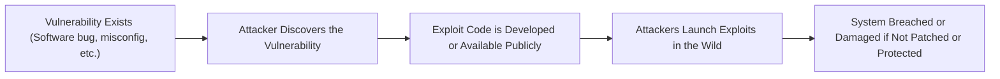

# 🛡️ **Understanding Vulnerabilities: The Hidden Weaknesses in Systems**

> _A system is only as strong as its weakest link — vulnerabilities are what attackers search for._

---

## 🌟 **What is a Vulnerability?**

A **vulnerability** is a **weakness**, **flaw**, or **misconfiguration** in a system that could be:

- 🔥 **Exploited** by an attacker.
- 🚪 **Abused** to gain unauthorized access, leak data, or disrupt operations.

✅ Think of a vulnerability as a **hidden crack in a fortress wall** —  
if an attacker finds it before you fix it, **your defenses are breached**.

---

## 🎯 **Examples of Common Vulnerabilities**

| Vulnerability Type             | Real Example                                                                                |
| :----------------------------- | :------------------------------------------------------------------------------------------ |
| 🐞 **Software Bugs**           | Buffer overflow in a web server lets an attacker run malicious code.                        |
| 🔑 **Weak Passwords**          | Using "password123" makes brute-force attacks trivial.                                      |
| 🕳️ **Unpatched Systems**       | Ignoring updates leaves servers vulnerable to known exploits (e.g., Log4Shell, Heartbleed). |
| 🛠️ **Misconfigured Resources** | S3 bucket accidentally set to public read access.                                           |
| 🚪 **Open Ports**              | Leaving unnecessary ports exposed (like SSH, RDP) to the internet.                          |
| 🧬 **Outdated Libraries**      | Using old versions of frameworks (e.g., vulnerable Django, Express.js) in apps.             |

✅ Modern vulnerabilities span **software**, **hardware**, **cloud misconfigurations**, and **human mistakes**.

---

## 🚨 **Why Vulnerabilities Are Dangerous**

| Risk                                               | Why It Matters                                                           |
| :------------------------------------------------- | :----------------------------------------------------------------------- |
| 🛡️ **Unauthorized Access**                         | Attackers can log in without permission or escalate privileges.          |
| 🔍 **Data Theft**                                  | Sensitive information (credentials, customer data) can be stolen.        |
| 🔥 **Service Disruption**                          | Systems can be shut down or corrupted (Denial of Service).               |
| 🪤 **Persistence and Lateral Movement**             | Attackers can maintain access and move deeper into networks.             |
| 🛠️ **Reputation Damage and Compliance Violations** | Data breaches can result in fines (GDPR, HIPAA) and lost customer trust. |

✅ One small flaw → Big consequences.

---

## 🛠️ **How to Protect Against Vulnerabilities**

| Strategy                            | Description                                                                                 |
| :---------------------------------- | :------------------------------------------------------------------------------------------ |
| 🔄 **Regular Updates and Patching** | Always apply latest security patches to OS, applications, libraries.                        |
| 🛡️ **Use Security Best Practices**  | Strong passwords, least privilege IAM roles, encryption everywhere.                         |
| 🧹 **Perform Vulnerability Scans**  | Regular automated scanning of EC2, ECR, Lambda, VPC networks (e.g., AWS Inspector, Nessus). |
| 🔍 **Penetration Testing**          | Simulate attacks to find vulnerabilities before real attackers do.                          |
| 🧠 **Training and Awareness**       | Educate developers, admins, and users on secure coding and safe practices.                  |
| 📜 **Configuration Management**     | Use infrastructure as code (IaC) tools + scanners to avoid drift and misconfigurations.     |

✅ **Defense-in-depth** approach — not one thing, but **layers of protection**.

---

## 📚 **Vulnerability Lifecycle (How It Becomes a Problem)**

✅ Speed of detection, patching, and mitigation **is critical** once a vulnerability is known.

---

## 🔥 **Real-World Famous Vulnerabilities**

| Name                                   | Impact                                                                     |
| :------------------------------------- | :------------------------------------------------------------------------- |
| 💥 **Heartbleed (OpenSSL bug)**        | Leaked private keys and sensitive server memory contents.                  |
| 💣 **Log4Shell (Log4j vulnerability)** | Remote code execution across millions of apps (critical 10/10 CVSS score). |
| 🛑 **Shellshock (Bash vulnerability)** | Allowed attackers to execute arbitrary commands via Bash scripts.          |
| 🔓 **S3 Bucket Misconfigurations**     | Leaked terabytes of sensitive company/customer data accidentally.          |

✅ Many major breaches started from **one overlooked vulnerability**.

---

## 📈 **Summary Table: Key Points**

| Key Concept                  | Summary                                                                     |
| :--------------------------- | :-------------------------------------------------------------------------- |
| **What is a Vulnerability?** | A weakness that can be exploited by attackers.                              |
| **Common Causes**            | Bugs, misconfigurations, outdated software, human error.                    |
| **Risks**                    | Data theft, service disruption, reputation damage, legal fines.             |
| **Protection Strategies**    | Patching, scanning, secure coding, penetration testing, awareness training. |

---

## 🏆 **Final Smart Pro Tip**

> 🧠 **Think of vulnerabilities like holes in a ship — fix small ones early, or risk sinking later.**

✅ Always combine:

- **Proactive scanning** (e.g., AWS Inspector, Nessus, Qualys)
- **Reactive patching**
- **Smart architectural practices** (e.g., least privilege, encryption)

✅ The faster you find and fix vulnerabilities, the **stronger your cloud and systems become**.
