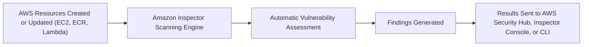

# ⛳ **AWS Inspector: Automated Security Assessment for Your Cloud Resources**

> _Continuously scan EC2 instances, ECR containers, and Lambda functions for vulnerabilities — automatically and at scale._

---

  

---

## 🌟 **What is AWS Inspector?**

**Amazon Inspector** is a **fully managed security assessment service** that:

- 🔍 Continuously scans your AWS workloads for **vulnerabilities**.
- 🛡️ Evaluates **software packages**, **operating system configurations**, and **application dependencies**.
- 🚨 Finds and prioritizes issues **before attackers exploit them**.

✅ It’s like a **vulnerability scanner** running **24/7** inside your AWS environment — **automated and agentless** (for some resources).

---

## 🧠 **What AWS Inspector Scans**

| Resource                                              | What It Checks                                            |
| :---------------------------------------------------- | :-------------------------------------------------------- |
| 🖥️ **Amazon EC2 instances**                           | Operating system vulnerabilities (CVEs), software patches |
| 🐳 **Amazon Elastic Container Registry (ECR) images** | Container vulnerabilities (OS packages, libraries)        |
| ⚡ **AWS Lambda functions**                           | Vulnerabilities in deployed function packages and layers  |
| 🏗️ **AWS Fargate tasks**                              | Scans container images used by serverless compute tasks   |

✅ Inspector focuses on **workload software vulnerabilities**, not just the network or API layer.

---

## 🔍 **How AWS Inspector Works**

✅ Inspector is **event-driven** — it scans automatically when changes happen (new deployments, updates).

---

## ✨ **Key Features of AWS Inspector**

| Feature                                  | Description                                          |
| :--------------------------------------- | :--------------------------------------------------- |
| 🚀 **Continuous Scanning**               | Automatically scan workloads without manual triggers |
| 🔍 **Deep Vulnerability Intelligence**   | Uses CVE databases and AWS internal threat feeds     |
| 🏷️ **Risk Scoring and Prioritization**   | Assigns CVSS-based scores to vulnerabilities         |
| 📜 **CIS Benchmark Scanning**            | Assesses security configuration compliance (for EC2) |
| 🔗 **Integration with AWS Security Hub** | Centralize findings into your security dashboard     |
| ⚡ **Agentless Options**                 | Lambda and ECR scanning without installing agents    |
| 🛡️ **Automated Remediation Ready**       | Trigger Lambda functions based on findings if needed |

---

## 🛡️ **What Kinds of Vulnerabilities Does Inspector Find?**

| Vulnerability Type                                       | Example                                            |
| :------------------------------------------------------- | :------------------------------------------------- |
| 🔥 **Known CVEs** (Common Vulnerabilities and Exposures) | Outdated libraries with public exploits            |
| 🛠️ **Misconfigurations**                                 | Weak OS security settings (CIS Benchmark findings) |
| 🐳 **Container vulnerabilities**                         | Unsafe packages inside Docker layers               |
| 📦 **Package manager risks**                             | Vulnerable pip/npm/yum/apk packages                |

✅ Inspector is **focused on code and system vulnerabilities** — complements network-level security services.

---

## 🪜 **Typical Workflow with AWS Inspector**

1. 🚀 **Enable Amazon Inspector** (regional activation per account).
2. 🖥️ **Install SSM Agent** (only for EC2 instances; containers and Lambda are agentless).
3. 📜 **Define Target Resources** (or use automatic coverage).
4. 🔍 **Inspector scans resources continuously** (event-driven or scheduled).
5. 📈 **View and prioritize findings**.
6. 🔧 **Remediate vulnerabilities** manually or using automation (e.g., Lambda triggered on critical findings).

---

## 📚 **Example Findings**

| Example Finding                                  | Description                                        |
| :----------------------------------------------- | :------------------------------------------------- |
| 🛡️ **CVE-2022-1234 detected in OpenSSL**         | Vulnerable OpenSSL version on EC2                  |
| 🐳 **Critical CVE in Nginx container image**     | Critical container vulnerability in Docker image   |
| ⚙️ **SSH root login enabled**                    | Security misconfiguration detected in EC2 instance |
| 🪲 **Lambda function uses vulnerable dependency** | Outdated npm package in Lambda deployment          |

✅ Findings include **risk severity** (Low, Medium, High, Critical) + **remediation suggestions**.

---

## 💰 **Pricing Overview**

| What You Pay For                 | Pricing Basis                |
| :------------------------------- | :--------------------------- |
| **EC2 instance scanning**        | Per instance per month       |
| **ECR container image scanning** | Per image scan               |
| **Lambda function scanning**     | Per function package scanned |
| **Fargate scanning**             | Per task image scanned       |

✅ **Pay-as-you-go** based on **resource coverage**, **frequency of scans**, and **data volume**.

---

## 🏆 **Final Smart Pro Tip**

> 🧠 **Use AWS Inspector alongside AWS GuardDuty and AWS Security Hub for a full cloud-native security detection and vulnerability management strategy.**

✅ GuardDuty = Threat detection (behavior)  
✅ Inspector = Vulnerability scanning (software risk)  
✅ Security Hub = Centralized security findings dashboard  
✅ Together = Complete AWS Threat Defense!

---

## 📢 **Summary: Why AWS Inspector Matters**

| ✅ Feature                           | 💬 Why It Matters                                |
| :----------------------------------- | :----------------------------------------------- |
| Continuous vulnerability scanning    | Find issues fast, before attackers do            |
| Automates risk prioritization        | Focus your efforts on the most dangerous threats |
| No manual maintenance                | Serverless, automatic, native to AWS             |
| Works across EC2, Containers, Lambda | Covers modern cloud architectures                |
