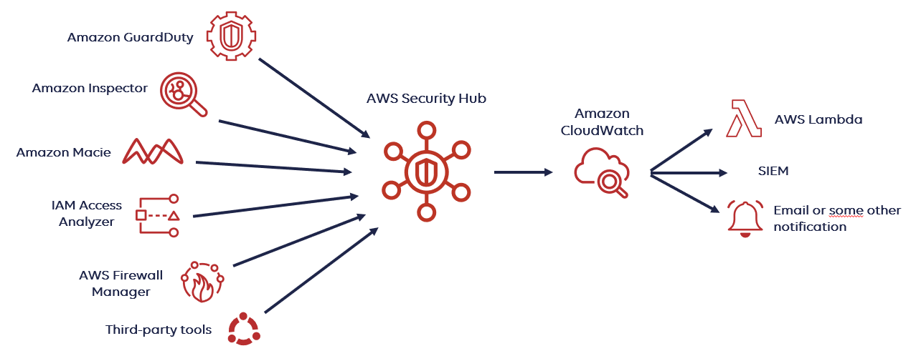

# 🛡️ **AWS Security Hub: Your Centralized Cloud Security Command Center**

> _Collect, prioritize, and act on security findings — across your entire AWS environment — from one place._

---

  

---

## 🌟 **What is AWS Security Hub?**

**AWS Security Hub** is a **cloud-native security management service** that:

- 📊 **Aggregates security findings** from AWS services and third-party tools into **one unified view**.
- 🛡️ **Evaluates** your AWS resources against **security standards** and **best practices** automatically.
- 🚀 **Enables automation** for faster and smarter responses to threats and compliance issues.

✅ Think of it as your **single security dashboard** for your AWS world —  
whether you have **1 account or 100 accounts**!

---

## 🔎 **What AWS Security Hub Does**

| Core Function                     | What It Means                                                                           |
| :-------------------------------- | :-------------------------------------------------------------------------------------- |
| 📥 **Aggregate Findings**         | Collects alerts from GuardDuty, Inspector, Macie, Config, and more.                     |
| 🛡️ **Compliance Checks**          | Continuously checks resources against CIS Benchmarks, AWS Best Practices, PCI DSS, etc. |
| 🚨 **Prioritize and Investigate** | Groups and ranks findings by severity and affected resources.                           |
| ⚡ **Automate Response Actions**  | Integrates with EventBridge and Lambda for automatic security remediation.              |

✅ **Monitor**, **analyze**, and **act** — from one place.

---

## 🧠 **How AWS Security Hub Works (Simplified)**

  

---

## ✨ **Key Features of AWS Security Hub**

| Feature                                        | Description                                                                                 |
| :--------------------------------------------- | :------------------------------------------------------------------------------------------ |
| 📥 **Security Findings Aggregation**           | Centralizes alerts from multiple AWS services and external partners.                        |
| 🛡️ **Automated Compliance Checks**             | Built-in standards: CIS AWS Foundations, AWS Best Practices, PCI DSS, NIST, GDPR, and more. |
| 📈 **Security Insights**                       | Groups findings intelligently to focus on the biggest risks.                                |
| 🔔 **EventBridge Integration**                 | Automatically trigger notifications, ticket creation, or incident response.                 |
| 🔄 **Cross-Account, Cross-Region Aggregation** | Aggregate findings across multiple AWS accounts and regions.                                |
| 📜 **Standardized Findings Format**            | Findings are normalized in AWS Security Finding Format (ASFF).                              |

---

## 🌍 **AWS Services Integrated with Security Hub**

| Integrated Service         | What It Brings                                                      |
| :------------------------- | :------------------------------------------------------------------ |
| 🛡️ **GuardDuty**           | Threat detection findings (e.g., malware communication, IAM misuse) |
| 🔎 **Inspector**           | Vulnerability scanning results (EC2, containers, Lambda)            |
| 📦 **Macie**               | Sensitive data exposure findings (S3 buckets)                       |
| 🛠️ **AWS Config**          | Compliance with resource configurations                             |
| 🔐 **IAM Access Analyzer** | Resource policy risks                                               |

✅ You can also integrate **third-party tools** (TrendMicro, Palo Alto Networks, CrowdStrike, etc.).

---

## 📚 **Common Real-World Use Cases**

| Use Case                                            | Security Hub Role                                                                      |
| :-------------------------------------------------- | :------------------------------------------------------------------------------------- |
| 🚨 Centralized Alerting                             | View and correlate findings across many AWS services easily.                           |
| 🛡️ Compliance Monitoring                            | Continuously check if your environment meets CIS Benchmarks or PCI DSS.                |
| ⚡ Automated Remediation                            | Trigger Lambda functions to quarantine instances, block IPs, or notify security teams. |
| 🔎 Incident Investigation Support                   | Quickly find root cause across services without jumping between consoles.              |
| 🛠️ Build SOC (Security Operations Center) Pipelines | Use EventBridge + Lambda to create auto-response frameworks.                           |

✅ **Security Hub is your AWS-native SIEM-lite** (Security Information and Event Management).

---

## 📈 **Security Standards Supported**

| Framework                                       | What It Checks                                              |
| :---------------------------------------------- | :---------------------------------------------------------- |
| 🛡️ **CIS AWS Foundations Benchmark**            | Secure AWS configurations                                   |
| 🛡️ **AWS Foundational Security Best Practices** | General security posture checks                             |
| 💳 **PCI DSS**                                  | Payment card security compliance                            |
| 🛡️ **NIST 800-53, ISO 27001, GDPR**             | Coming or partially available for advanced compliance needs |

✅ Helps organizations **prepare for audits** and **maintain continuous compliance**.

---

## 💰 **Pricing Overview**

| Charge Type                      | Details                                                          |
| :------------------------------- | :--------------------------------------------------------------- |
| 📜 **Security Check Charges**    | Based on the number of checks evaluated on your resources.       |
| 📦 **Finding Ingestion Charges** | Based on number of findings ingested from services and partners. |
| 🆓 **Free 30-Day Trial**         | Try Security Hub with no cost for the first month.               |

✅ Pricing is based on **checks** + **findings**, and scales **per account and region**.

---

## 🏆 **Final Smart Pro Tip**

> 🧠 **Enable AWS GuardDuty, Inspector, and Macie first, then plug them into Security Hub for full centralized visibility.**

✅ Security Hub **does not detect vulnerabilities by itself** — it **aggregates and visualizes** the results from other services!

✅ Real power =

- **GuardDuty detects threats** ➔ **Inspector detects vulnerabilities** ➔ **Security Hub shows all in one place**

✅ Then automate responses using EventBridge and Lambda!

---

## 📢 **Summary: Why AWS Security Hub Is Essential**

| ✅ Feature                           | 💬 Why It Matters                                    |
| :----------------------------------- | :--------------------------------------------------- |
| Unified view of all security risks   | Centralized console saves time and effort            |
| Continuous compliance evaluation     | Always know if you're audit-ready                    |
| Automated and fast incident response | Reduce mean time to detect (MTTD) and respond (MTTR) |
| Easy integration with many services  | Build a full cloud-native security monitoring system |

---

## 🧠 **One-Sentence Memory Trick**

> 🛡️ **AWS Security Hub = Your Centralized Control Room for Security Findings + Compliance + Automation.**
