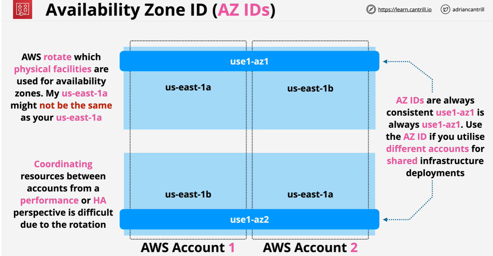

---
tags:
  - aws
  - aws/service
  - aws/domain/security
  - aws/topic/resource-access-manager
aliases:
  - "Availability Zone ID Ensuring Consistent Cloud Deployments"
  - "Availability Zone Id"
---

# 🏛️ **Availability Zone ID: Ensuring Consistent Cloud Deployments**

<div align="center" style="padding: 0 20px;">
   
</div>

---

## 🌟 **What is an Availability Zone ID?**

An **Availability Zone ID (AZ ID)** is a **globally unique and immutable identifier** for an AWS **Availability Zone (AZ)** inside a region.

✅ AZ IDs allow you to **refer to the same physical infrastructure** across AWS accounts —  
even if the **AZ names** differ per account!

| Concept                          | Example                    |
| :------------------------------- | :------------------------- |
| **Region**                       | `us-east-1`                |
| **AZ Names** (Account-Specific)  | `us-east-1a`, `us-east-1b` |
| **AZ IDs** (Globally Consistent) | `use1-az1`, `use1-az2`     |

---

## 🆚 **AZ Names vs AZ IDs**

| Feature   | AZ Name (`us-east-1a`)              | AZ ID (`use1-az1`)                    |
| :-------- | :---------------------------------- | :------------------------------------ |
| Scope     | Account-specific                    | Global and consistent across accounts |
| Stability | Can map differently across accounts | Always refers to the same physical AZ |
| Purpose   | Load balancing across customers     | Cross-account deployment consistency  |

✅ **Always use AZ IDs for multi-account designs.**

---

## 🛠️ **Why Availability Zone IDs Matter**

| Reason                                    | How It Helps                                                     |
| :---------------------------------------- | :--------------------------------------------------------------- |
| 🔗 **Cross-Account Consistency**          | Deploy resources into the same physical AZ across accounts.      |
| 🛡️ **Disaster Recovery**                  | Match physical zones for precise failover planning.              |
| ⚖️ **Load Balancing & High Availability** | Evenly distribute workloads across truly distinct AZs.           |
| 🌐 **Networking Optimization**            | Map VPC peering subnets correctly for low-latency communication. |

✅ AZ IDs = **Accurate**, **Resilient**, **Optimized** AWS architecture.

---

## 🧩 **Real-World Example: Multi-Account Deployment**

Imagine you want to deploy EC2 instances in the **same physical AZ** across **Account A** and **Account B**.

### Step 1: Get AZ Names and IDs

```bash
aws ec2 describe-availability-zones --query 'AvailabilityZones[*].[ZoneName, ZoneId]' --output table
```

🔵 **Example Output for Account A**:

| Zone Name  | Zone ID  |
| :--------- | :------- |
| us-east-1a | use1-az1 |
| us-east-1b | use1-az2 |

🟢 **Example Output for Account B**:

| Zone Name  | Zone ID  |
| :--------- | :------- |
| us-east-1b | use1-az1 |
| us-east-1c | use1-az2 |

✅ Despite different **AZ names**, `use1-az1` points to the **same physical zone** in both accounts.

---

### Step 2: Deploy Resources Based on AZ ID

- In both accounts, target **`use1-az1`** when launching EC2 instances or creating subnets.
- Guarantee that your deployments happen in **the same datacenter group**.

---

## 📜 **Best Practices for Using AZ IDs**

| Practice                                  | Why                                                              |
| :---------------------------------------- | :--------------------------------------------------------------- |
| 🔄 **Use AZ IDs, not AZ Names**           | Avoid confusion when working across accounts.                    |
| 📈 **Distribute across different AZ IDs** | Build fault-tolerant, resilient architectures.                   |
| 🤖 **Fetch AZ IDs Dynamically**           | Use scripts or automation to retrieve AZ IDs — no hardcoding.    |
| 🔍 **Confirm AZ ID before Peering VPCs**  | Align subnets across VPCs using matching AZ IDs for low latency. |

✅ **Dynamic, AZ ID-based deployments = True cloud-native resilience.**

---

## 🏆 **Final Smart Pro Tip**

> 🧠 **In multi-account, multi-region environments — always think AZ IDs first, AZ Names second.**

✅ It’s the only way to ensure:

- **High availability**
- **Consistent networking**
- **Correct disaster recovery planning**

---

## 📢 **Summary: Why You Should Care About AZ IDs**

| ✅ Feature                                | 💬 Why It Matters                                      |
| :---------------------------------------- | :----------------------------------------------------- |
| Globally consistent identifiers           | Same physical zone across AWS accounts                 |
| Critical for multi-account designs        | Prevents resource mismatch and confusion               |
| Enables true fault-tolerant architectures | Build reliable, highly available systems               |
| Vital for VPC Peering and DR Planning     | Optimize latency and ensure disaster recovery accuracy |
---

## Related Notes
- [[aws-services/2.security/7.2.resource-access-manager/|Index]] - folder map
- [[aws-services/2.security/7.2.resource-access-manager/2.aws-ram|AWS Resource Access Manager RAM]] - next lesson
- [[aws-daily/aws-cloud-Concepts/6.disaster-recovery|Disaster Recovery DR in AWS]] - mentions Disaster Recovery
- [[aws-services/3.network/1.vpc/1.fundmentals/4.1.vpc-peering|VPC Peering]] - mentions VPC Peering

---
