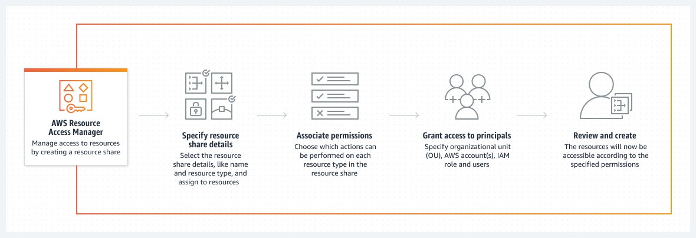

---
tags:
  - aws
  - aws/service
  - aws/domain/security
  - aws/topic/resource-access-manager
aliases:
  - "AWS Resource Access Manager RAM"
  - "AWS Ram"
---

# 🔗 AWS Resource Access Manager (RAM)

AWS RAM is like a **sharing superhero** for your AWS resources! It lets you **share resources** (like `subnets`, `transit gateways`, and more) `across multiple AWS accounts` **without creating duplicates**. Think of it as a **library** where everyone can borrow books (resources) instead of buying their own.

- **Why it’s cool**: Saves time, money, and effort!
- **Key Idea**: Share once, use everywhere!

---

    

---

## 🛠️ **Key Features of AWS RAM (The Toolbox)**

Here’s what makes AWS RAM so powerful:

1. **🔗 Resource Sharing**:

   - Share resources like:
     - **Subnets** (for VPC sharing).
     - **Transit Gateways** (for networking).
     - **Licenses** (for software).
   - Share with specific accounts, OUs, or your entire organization.

2. **📂 Centralized Management**:

   - Manage all shared resources from **one account** (the owner).
   - No more jumping between accounts!

3. **🔒 Secure Sharing**:

   - Use **IAM policies** to control who can access shared resources.
   - Keep everything safe and secure.

4. **🌐 Cross-Account Access**:

   - Share resources across accounts **without duplication**.
   - Save money and reduce complexity.

5. **🏢 Integration with AWS Organizations**:
   - Share resources with **all accounts** in your organization or specific OUs.
   - Automate sharing at scale!

---

## 🧩 **How AWS RAM Works (The Puzzle Pieces)**

Let’s break it down into simple steps:

1. **👑 Resource Owner**:

   - The account that **owns the resource** starts the sharing process.
   - Creates a **Resource Share** in AWS RAM.

2. **🎁 Resource Share**:

   - A bundle of resources you want to share.
   - Specify which accounts or OUs can access them.

3. **👥 Principal**:

   - The account or OU that **receives access** to the shared resources.
   - Can be internal (your organization) or external (other AWS accounts).

4. **🔑 Permissions**:

   - Use **IAM policies** to define what actions principals can perform.
   - Example: Allow access to a subnet but not delete it.

5. **🚪 Access**:
   - Once shared, principals can use the resources as if they were their own.

---

## 💡 **Use Cases for AWS RAM (Real-Life Scenarios)**

Here’s where AWS RAM shines:

1. **🏠 VPC Sharing**:

   - Share **subnets** across accounts.
   - Perfect for teams working on the same project.

2. **🚆 Transit Gateway Sharing**:

   - Share a **transit gateway** to connect multiple VPCs.
   - Simplify networking across accounts.

3. **📜 License Sharing**:

   - Share **software licenses** across accounts.
   - Save money by centralizing license management.

4. **🏢 Centralized Outposts**:

   - Share **AWS Outposts** resources for hybrid cloud setups.

5. **🌍 Cross-Account Resource Access**:
   - Share resources like **Route 53 Resolver Rules** or **Dedicated Hosts**.

---

## 🛠️ **How to Use AWS RAM (Step-by-Step Guide)**

Let’s make it super simple:

1. **🔓 Enable AWS RAM**:

   - Go to the AWS RAM console.
   - Make sure you have the right permissions.

2. **🎁 Create a Resource Share**:

   - Pick the resource type (e.g., subnets, transit gateways).
   - Choose who to share with (accounts or OUs).

3. **🔑 Define Permissions**:

   - Attach **IAM policies** to control access.
   - Follow the **least privilege** principle.

4. **👀 Monitor and Manage**:

   - Use the AWS RAM console to keep an eye on your shares.
   - Update or delete shares as needed.

5. **🚀 Access Shared Resources**:
   - As a principal, use the shared resources like they’re yours!

---

## 🏆 **Best Practices for AWS RAM (Pro Tips!)**

Follow these tips to become an AWS RAM pro:

1. **🏢 Use AWS Organizations**:

   - Automate sharing across accounts and OUs.

2. **🔒 Implement Least Privilege**:

   - Only give access to what’s needed.

3. **👀 Monitor Resource Usage**:

   - Use **AWS CloudTrail** and **AWS Config** to track sharing activities.

4. **📂 Centralize Resource Management**:

   - Use one account to manage all shared resources.

5. **📐 Plan for Multi-Account Architectures**:
   - Design your setup with sharing in mind to avoid duplication.

---

## 🧠 **Key Points to Remember for the AWS SAP Exam**

Here’s what to focus on:

- **📋 Supported Resources**: Subnets, transit gateways, licenses, etc.
- **🏢 AWS Organizations Integration**: Share with OUs or the entire org.
- **🏠 VPC Sharing**: Share subnets across accounts.
- **🔒 Security**: Use IAM policies for access control.
- **💰 Cost Optimization**: Avoid duplication to save money.

---

## ❓ **Practice Questions for AWS RAM**

Test your knowledge with these questions:

1. What types of resources can you share using AWS RAM?
2. How does AWS RAM work with AWS Organizations?
3. What are the security best practices for AWS RAM?
4. How can AWS RAM help reduce costs in a multi-account setup?
5. What is the process for sharing a subnet across AWS accounts?

---

## 🎉 **Final Tip: Memory Hack!**

To remember AWS RAM, think of it as a **library**:

- **Books = Resources** (subnets, transit gateways, licenses).
- **Library Card = IAM Policies** (controls who can borrow).
- **Library Owner = Resource Owner** (manages the sharing).
---

## Related Notes
- [[aws-services/2.security/7.2.resource-access-manager/|Index]] - folder map
- [[aws-services/2.security/7.2.resource-access-manager/1.availability-zone-id|Availability Zone ID Ensuring Consistent Cloud Deployments]] - previous lesson
- [[aws-services/1.management-governance/2.1.organizations/1.aws-organizations|AWS Organizations The Smart Way to Manage Multiple AWS Accounts]] - mentions AWS Organizations
- [[aws-daily/aws-waf/5.1.cost-optimization|Cost Optimization]] - mentions Cost Optimization
- [[aws-services/5.compute/7.1.aws-outposts/10.aws-outposts|AWS Outposts]] - mentions AWS Outposts
- [[aws-services/1.management-governance/4.3.config/1.aws-config|AWS Config Track Audit and Enforce Your AWS Resource Compliance]] - mentions AWS Config
- [[aws-services/1.management-governance/4.3.config/x.config|AWS Config Track Manage and Secure Your AWS Resources]] - mentions Config
- [[aws-services/2.security/1.1.iam/1.fundmmentals/1.2.iam|AWS Identity and Access Management IAM]] - mentions IAM

---
