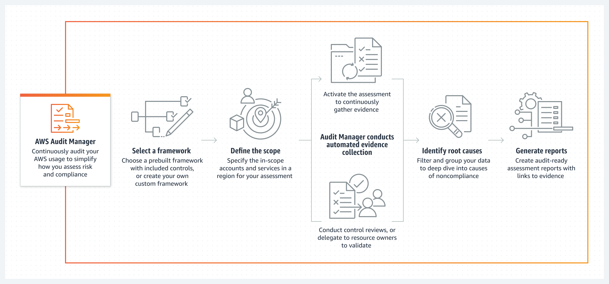
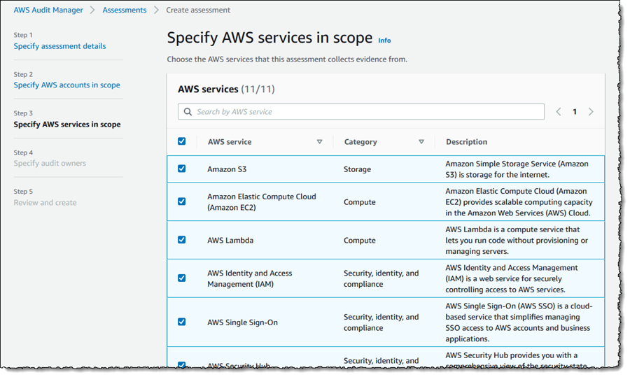

---
tags:
  - aws
  - aws/service
  - aws/domain/security
  - aws/topic/audit-manager
aliases:
  - "AWS Audit Manager Easy Compliance Checking"
  - "AWS Audit Manager"
---

# 🧾 AWS Audit Manager: Easy Compliance Checking

  

---

## 🛠️ What is AWS Audit Manager?

**AWS Audit Manager** helps you check if your AWS setup follows rules and standards. It's like having a checklist to make sure everything is done correctly.

## 🚨 How AWS Audit Manager Works

- **Automatic Evidence Collection:** It collects proof (evidence) from your AWS resources automatically.
- **Prebuilt Frameworks:** It gives you ready-made checklists for common standards like GDPR, PCI DSS, and HIPAA.
- **Custom Checklists:** You can make your own checklists for internal checks.
- **Continuous Monitoring:** It keeps an eye on your AWS usage and collects evidence continuously.

---

  

---

## 🌟 Why Use AWS Audit Manager

- **Simplifies Compliance:** Makes it easier to follow rules and standards.
- **Saves Time:** Reduces the manual work needed to collect and organize proof.
- **Centralized Management:** Keeps all your audit data in one place for easy access and teamwork.

---

## 🤝 Services Related to AWS Audit Manager

AWS Audit Manager integrates with several other AWS services to provide comprehensive compliance and auditing capabilities:

- **AWS Config:** Tracks configuration changes and compliance across your AWS resources.
- **AWS Security Hub:** Centralizes security findings and integrates with Audit Manager to provide a unified view of your compliance status.
- **AWS CloudTrail:** Provides logs of user activities and API calls, which are used as evidence in Audit Manager.
- **Amazon S3:** Stores evidence collected by Audit Manager.
- **AWS IAM (Identity and Access Management):** Manages access to Audit Manager and related services.
---

## Related Notes
- [[aws-services/2.security/7.3.audit-manager/|Index]] - folder map
- [[aws-services/2.security/6.security-hub/aws-security-hub|AWS Security Hub Your Centralized Cloud Security Command Center]] - mentions AWS Security Hub
- [[aws-services/1.management-governance/4.3.config/1.aws-config|AWS Config Track Audit and Enforce Your AWS Resource Compliance]] - mentions AWS Config
- [[aws-services/1.management-governance/4.3.config/x.config|AWS Config Track Manage and Secure Your AWS Resources]] - mentions Config
- [[aws-services/2.security/1.1.iam/1.fundmmentals/1.2.iam|AWS Identity and Access Management IAM]] - mentions IAM

---
