---
tags:
  - aws
  - aws/service
  - aws/domain/networking
  - aws/topic/vpc
  - aws/topic/fundmentals
aliases:
  - "AWS Virtual Private Cloud VPC"
  - "VPC Basics"
---

# 🌐 AWS Virtual Private Cloud (VPC)

## 📖 **What is a VPC? (Official Definition)**

**AWS Virtual Private Cloud (VPC)** lets you provision a logically isolated network in the AWS cloud, giving you complete control over IP address ranges, subnets, route tables, gateways, and security settings.

Simply put, think of a VPC as your private playground inside AWS’s giant public park 🌳—secure and entirely yours!

---

## 🚧 **VPC Basic Rules**

- ✅ A default VPC exists automatically in every AWS region.
- ❌ You can’t stretch a VPC across multiple regions.
- 🌍 Each VPC covers multiple Availability Zones (AZs) within one region.

---

## ⚙️ **Essential VPC Components**

### 📐 **1. CIDR Blocks**

- A CIDR (Classless Inter-Domain Routing) block defines IP ranges.
- Default CIDR can’t change after creation.
- We can expand the VPC address pool by adding up to 4 additional secondary CIDRs Blocks.
    - [Limitation Can Be Found Here](https://docs.aws.amazon.com/vpc/latest/userguide/configure-your-vpc.html#vpc-cidr-blocks)

> Example: `10.0.0.0/16`

---

### 📂 **2. Subnets**

- we can configure multiple subnets per VPC
- in each AZ we can have one or more subnets
- A subnet `cannot` stretch between AZs
- Subnet in a VPC cannot overlap

  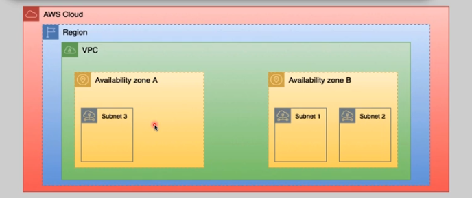

**Example Structure**:

- `10.0.1.0/24` (Subnet-AZ1)
- `10.0.2.0/24` (Subnet-AZ2)

---

### 🚦 **3. Implied Router**

- The implied router is used to communicate among the subnets in a VPC and between the VPC and the outside world (inside/outside of AWS).
- We cannot access or login to implied router, it is fully managed by AWS. (but we can add route table to it)
- Routing among VPC subnets is guaranteed by default.
- **Automatic routing between VPC subnets is guaranteed**.

  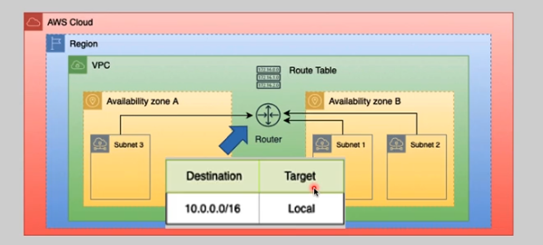

---

### 📑 **4. Route Tables**

- It is created for implied router and It is apply on **subnet level**
- Each VPC includes a default "main" route table.
- A subnet can only associate with **one route table** at a time, but one route table can **serve multiple subnets**.
- Custom route tables can be created as needed.
- Routing among VPC subnets is guaranteed by default.

  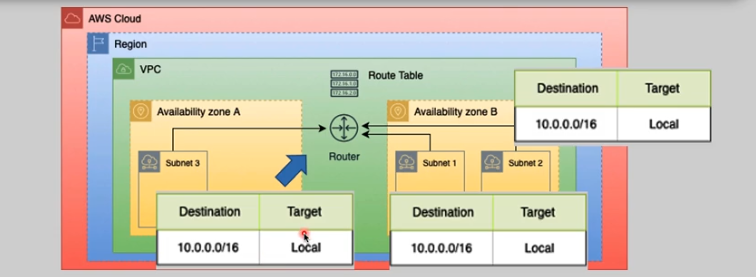

---

### 🌉 **5. Internet Gateway (IGW)**

- `Only one IGW` can be attached to a VPC at a time.
- Enables internet access.
- Highly available and horizontally scalable.
- Managed entirely by AWS.
- It will never become a traffic bottleneck.
- supporting both **IPv4** and **IPv6**.

  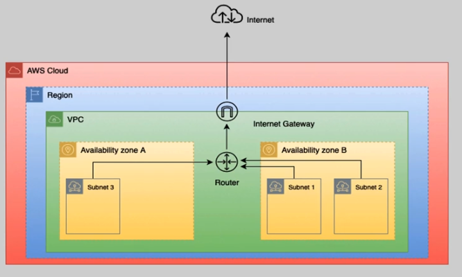

---

### 🔏 **6. Virtual Private Gateway (VGW)**

- `Only one VGW` can be attached to a VPC at a time.
- It is used for Hybrid Cloud Connectivity
- IGW is hz scaled, redundant and highly available.
- Fully managed by AWS
- supporting both IPv4 and IPv6.

  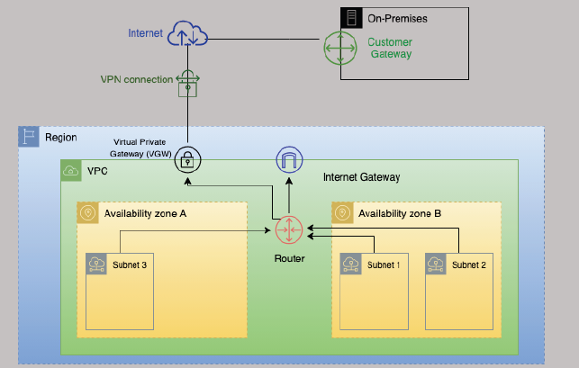

---

### 🔒 **7. Security Groups (SGs)**

- **Stateful** firewall attached to instances (Acts as a virtual firewall at the **instance (ENI) level**).
- **Allow-rules only (_implicit deny_)**.
- **whitelist-based** (no deny rules).
- Evaluates all rules; changes apply instantly.
- Supports multiple SGs per EC2 instance ENI.
- **Inbound** is traffic that comes from outside to the instance
- **Outbound** is traffic that goes from the instance to outside.

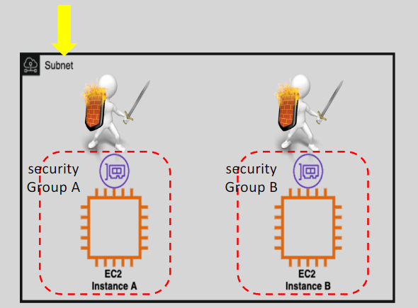

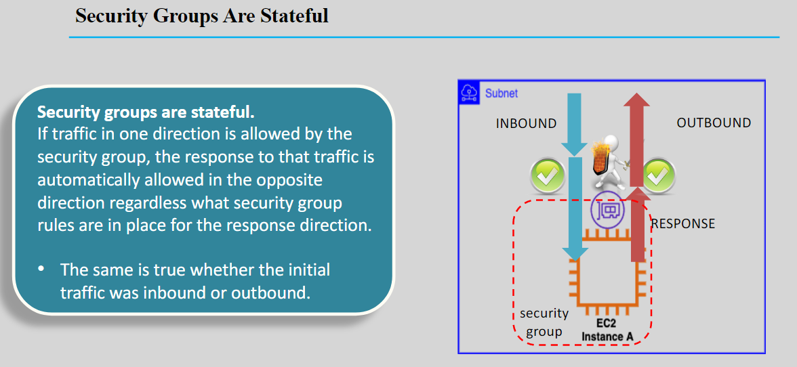

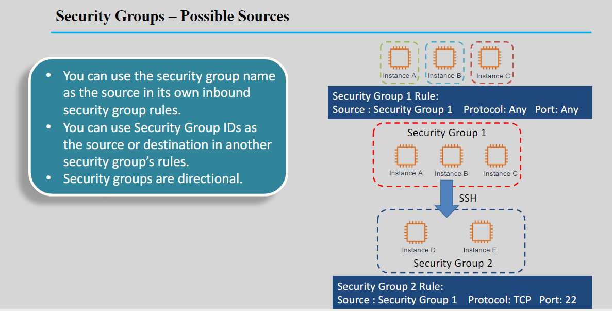

---

### 🛡️ **8. Network ACLs (NACLs)**

- **Stateless** firewall applied at the **subnet level**.
- Supports **explicit allow/deny rules**.
- Rules evaluated sequentially.
- To make it act like whitelisting add **Default explicit deny at the end**.

  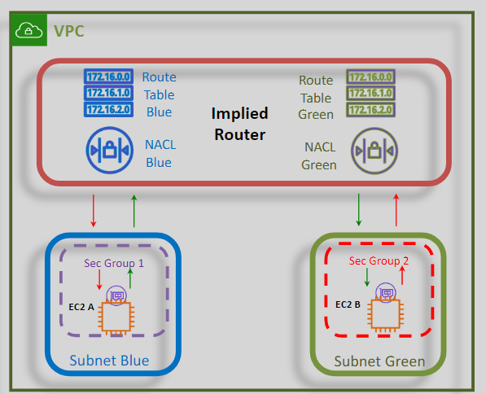

---

## 🌐 **VPC Connectivity Options**

  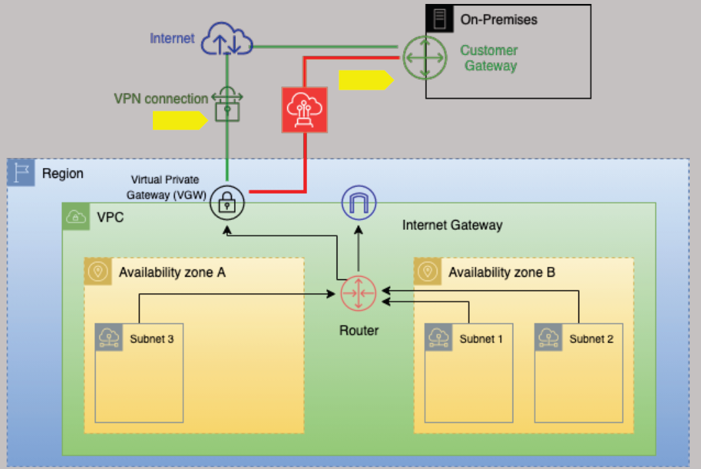

### ☁️ **1. Internet Connectivity**

1. **🌐 Public subnets via IGW**.
2. **🔒 Private subnets via NAT**.

### 🏢 **2. Hybrid Cloud Connectivity**

Combine AWS with your on-premises environment through:

1. **🔏 VPN (Virtual Private Network)**
    - Over the internet
    - Quick to deploy
    - Cost effective
    - Secure
    - Not reliable (some times be slow)

2. **🪈 Direct Connect (DX)**
    - Over fiber cable
    - Long lead times
    - Low latency and high bandwidth
    - Private but not secure

---

## 🕵️ **Hidden Availability Zones (AZs)**

Sometimes AWS temporarily hides AZs due to:

- 🔧 _Capacity Management_: AWS may hide certain AZs to manage capacity and ensure optimal performance.
- 🚨 _Maintenance or Issues_: AZs might be hidden due to ongoing maintenance or issues.

**How to Enable/Disable AZs:**

- From **AWS Management Console**: Go to the **VPC Dashboard > Settings > Zones**.

**⚠️ Considerations:**

- You can enable it by `opt-in`
- if you want disable a enabled az you must call aws support.
- Opting in to hidden AZs may <u title="يتطلب">incur</u> additional costs.

---

## 🎯 **Security Groups vs. NACLs Quick Reference**

| 🔑 Feature      | 🟢 Security Groups | 🟡 Network ACLs |
| --------------- | ------------------ | --------------- |
| Level           | Instance (ENI)     | Subnet          |
| Rule Type       | Allow Only         | Allow & Deny    |
| Stateful        | ✅ Yes             | ❌ No           |
| Rule Evaluation | All at once        | Sequential      |

---

## 🪪 **IAM Identity Center**

AWS Identity Center, also known as **AWS IAM Identity Center**, is a service that helps you **manage workforce access to AWS applications and resources**. It allows you to connect your existing identity provider (like Okta, Google Workspace, or Microsoft Active Directory) to AWS, providing a **single sign-on (SSO) experience** for your users.

Here are some key features:

- **Centralized Management**: Manage user access to multiple AWS accounts and applications from a single place.
- **Single Sign-On**: Users can access AWS services with one set of credentials.
- **Integration with AWS Applications**: Seamlessly integrates with AWS managed applications like Amazon QuickSight and Amazon SageMaker Studio.
- **Improved Security and Visibility**: Provides better control and visibility over user access, making it easier to audit and monitor activities.

We recommend that you use Identity Center to provide console access to a person. With Identity Center, you can centrally manage user access to their AWS accounts and cloud applications.

---

## 📋 **Credential Report**

- **Credential Reports**: Snapshot of IAM user credentials (available for 4 hours).
- Lists all IAM users and credential statuses (stored for up to 4 hours).

---

## 🚩 **Public vs Private Subnets**

📌 Subnet can be considered a public subnet if it satisfies two conditions:  
 1. it is in a VPC that has an IGW attached.  
 2. its associated routing table has a default route entry pointing at the VPC's IGW.

> 🔹**Public Subnet:** Connected directly to IGW for internet access.  
> 🔹**Private Subnet:** No direct IGW connectivity, requires NAT for internet access.

---

  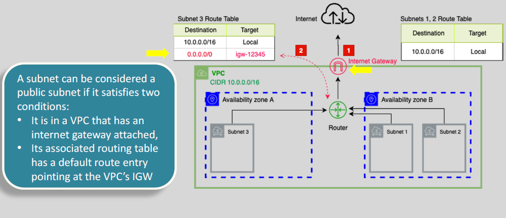

---

## 🌐 **NAT (Network Address Translation)**

**Network Address Translation (NAT)** is a method used to map private IP addresses within a network to a public IP address (or vice versa) when communicating with external networks, such as the internet. This ensures that devices in a private network can access external resources without exposing their private IP addresses to the outside world.

Think of NAT as a translator at a global conference: it ensures everyone understands each other without revealing personal details. It’s like saying, “Hey, I’ll talk to the internet for you, but I’ll keep your private IP a secret!”

---

### 🛠️ **NAT in AWS**

AWS provides two main ways to implement NAT within a Virtual Private Cloud (VPC):

1. **NAT Gateway** (Managed Service)
2. **NAT Instance** (Custom EC2 Instance)

---

### 1️⃣ **NAT Gateway**

A **NAT Gateway** is a fully managed AWS service that allows instances in private subnets to connect to the internet or other AWS services while preventing inbound connections from the internet.

**Key Features:**

- High availability and scalability.
- Minimal administrative effort.
- Supports IPv4 traffic.

**How It Works:**

1. Create a NAT Gateway in a **public subnet**.
2. Associate an **Elastic IP (EIP)** with the NAT Gateway.
3. Update the **route table** of the private subnet to direct internet-bound traffic to the NAT Gateway.

**Example Use Case:**
Imagine you have a private subnet with EC2 instances running a backend application. These instances need to download software updates from the internet. A NAT Gateway allows them to do so securely.

---

### 2️⃣ **NAT Instance**

A **NAT Instance** is an EC2 instance configured to perform NAT. While it offers more control, it requires manual setup and maintenance.

**Key Features:**

- Customizable (you can tweak it as needed).
- Requires manual scaling and monitoring.
- Less expensive than NAT Gateway for low traffic.

**How It Works:**

1. Launch an EC2 instance in a **public subnet**.
2. Assign a **public IP** or **Elastic IP** to the instance.
3. Configure the instance to act as a NAT device.
4. Update the **route table** of the private subnet to direct traffic to the NAT Instance.

**Example Use Case:**
You’re running a small-scale application with limited outbound traffic. A NAT Instance can be a cost-effective solution.

---

### 🤔 **Which One Should You Choose?**

- **NAT Gateway**: Best for production environments where reliability and scalability are critical.
- **NAT Instance**: Suitable for small-scale or cost-sensitive projects.

---

### 🖼️ Visualizing NAT in AWS

  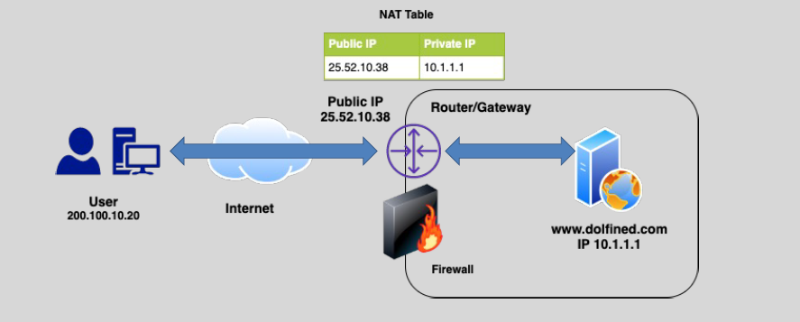

---

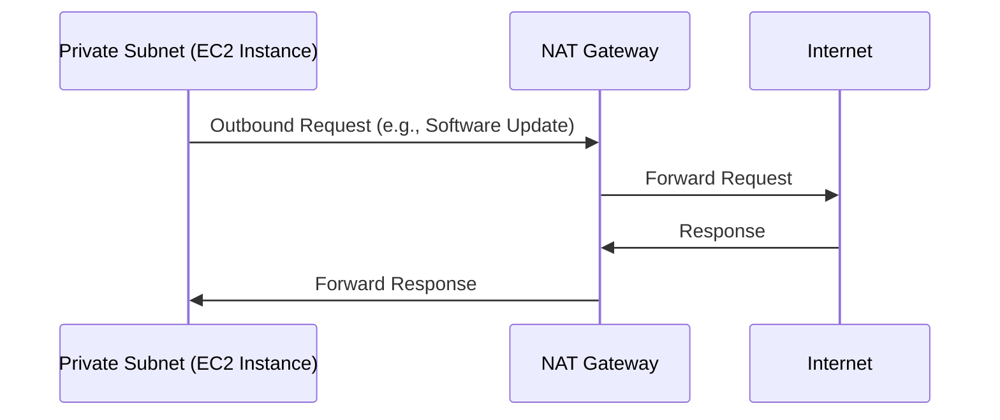

---

## 😵‍💫 **VPC Networking Extras**

### 🔖 **Autonomous System Number (ASN)**

An **Autonomous System Number (ASN)** is a unique identifier used for routing internet traffic between different networks. In AWS, ASNs are used in services like **AWS Direct Connect** and **Virtual Private Cloud (VPC)** to manage BGP (Border Gateway Protocol) routing.

ThinK of **Autonomous System Number (ASN)** as an `ID for a group of IPs range` that are managed by one organization.

**Key Points:**

- **VPC**: ASNs help in advertising your IP address ranges with your own ASN instead of AWS's default ASN.
- **AWS Direct Connect**: You can configure a private ASN for your Virtual Private Gateway or Direct Connect gateway.

### 📍 **IPAM (IP Address Manager)**

- Efficiently manages IP allocation across AWS VPCs.

---

## 🚨 Best Practices

- ✅ Always separate public-facing resources and sensitive data.
- ✅ Regularly review Security Group and NACL rules.
- ✅ Combine Direct Connect and VPN for critical applications.

---

## 📖 **Further Reading & References:**

- [Official AWS VPC Documentation](https://docs.aws.amazon.com/vpc/latest/userguide/)
- [AWS Networking Basics](https://aws.amazon.com/what-is/networking/)
- [AWS Direct Connect](https://aws.amazon.com/directconnect/)
- [AWS VPN](https://aws.amazon.com/vpn/)

---

## Related Notes

- [[aws-services/3.network/1.vpc/1.fundmentals/|Index]] - folder map
- [[aws-services/3.network/1.vpc/1.fundmentals/2.1.nat-gateway|NAT Gateway]] - next lesson
- [[aws-services/2.security/1.2.identity-federation-solutions/2.iam-identity-center/1.iam-identity-center|AWS IAM Identity Center]] - mentions AWS IAM Identity Center
- [[ا-delete-me/networking-basics|Virtual Private Cloud]] - mentions Virtual Private Cloud
- [[aws-services/3.network/1.vpc/5.1.vpn/3.aws-direct-connect|AWS Direct Connect]] - mentions AWS Direct Connect
- [[aws-services/12.machine-learning/1.1.sagemaker/3.1.sagemaker-studio|6. SageMaker Studio Unified ML Development]] - mentions Sagemaker Studio
- [[aws-daily/aws-waf/3.1.reliability|Reliability]] - mentions Reliability
- [[aws-services/11.analytics/quicksight/1.1.quicksight|Amazon QuickSight A Serverless BI Tool for Scalable and Interactive Dashboards]] - mentions Quicksight
- [[aws-services/12.machine-learning/1.1.sagemaker/1.2.sagemaker|1. Introduction to Amazon SageMaker]] - mentions Sagemaker
- [[aws-services/14.end-user-computing/workspaces/1.1.workspace|AWS WorkSpaces A Complete Guide]] - mentions Workspace
- [[aws-services/5.compute/2.ebs/4.1.snapshot|Amazon EBS Snapshots Efficient Scalable Backup for Your Volumes]] - mentions Snapshot
- [[aws-services/3.network/1.vpc/5.1.vpn/2.aws-vpn|AWS VPN]] - mentions AWS Vpn

---
