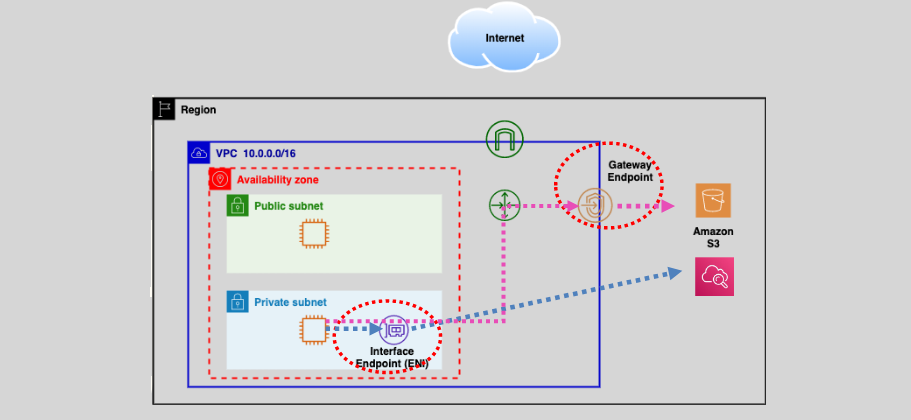
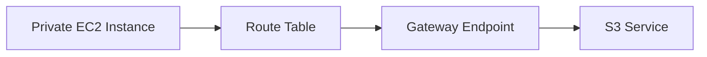
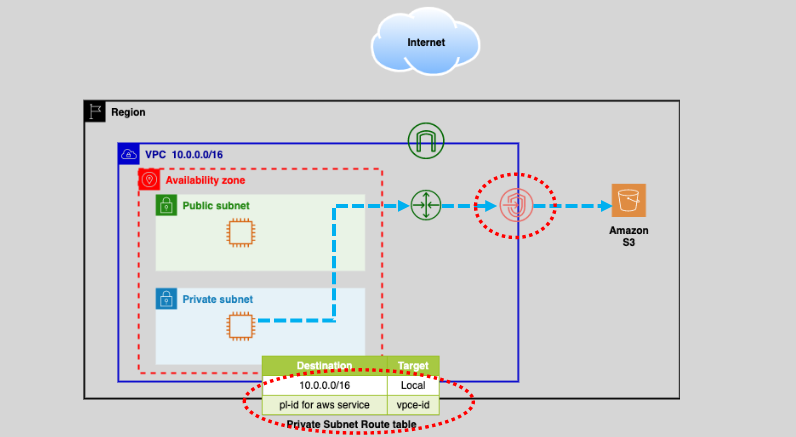
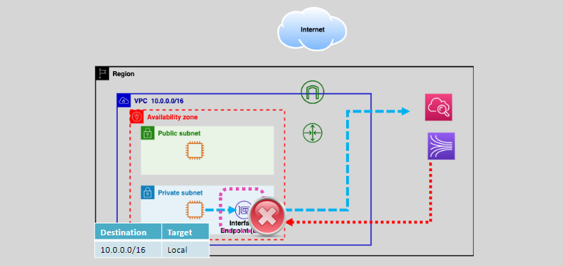
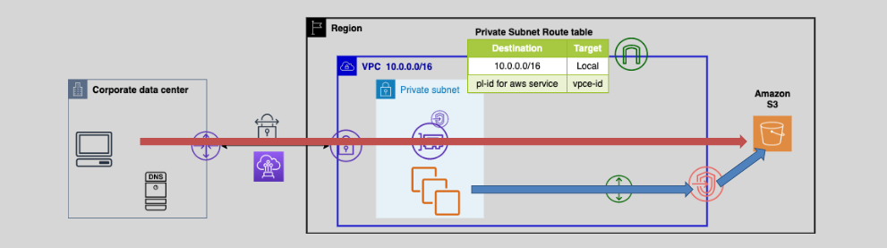

# 🔐 **AWS VPC Endpoints**

**💬 TL;DR:** VPC Endpoints allow your private AWS resources (like EC2s in private subnets) to talk to AWS services (like S3, DynamoDB, SQS, etc.) _without touching the public internet_. Say goodbye to public IPs, NAT Gateways, and egress costs. You're now inside the AWS Matrix.

---

<div style="text-align: center;">
  
</div>

---

## 🧠 **What Are VPC Endpoints, Really?**

Think of a **VPC Endpoint** as a **tunnel built directly between your private subnet and AWS services**, bypassing the internet entirely. They enable secure, private, and high-performance access to AWS services and third-party SaaS applications over **AWS's internal network**.

✅ No public IPs  
✅ No Internet Gateway or NAT  
✅ No VPN needed  
✅ Always private. Always encrypted.

---

## ⚙️ **Types of VPC Endpoints Explained**

There are **two main types** of VPC Endpoints:

| 🔌 Type                        | For Services Like                                | Network Mechanism     | Security Groups  | Route Table Required |
| ------------------------------ | ------------------------------------------------ | --------------------- | ---------------- | -------------------- |
| 🛣️ **Gateway**                 | `S3`, `DynamoDB`                                 | VPC Route Table-based | ❌ Not supported | ✅ Yes               |
| 🌐 **Interface (PrivateLink)** | `SQS`, `SNS`, `EC2 API`, `Secrets Manager`, etc. | ENI with Private IP   | ✅ Supported     | ❌ No                |

---

### 🛣️ **1. Gateway Endpoint**

Used for **S3 and DynamoDB only**.

🧱 **Architecture**:

---

<div align="center">



<div style="text-align: center;">
    
</div>

</div>

---

🔍 **How it works**:

- You create a **Gateway Endpoint** in the VPC.
- You add a **route to the VPC route table** targeting the S3/DynamoDB service.
- All traffic destined to `*.amazonaws.com` for these services is rerouted internally.

⚠️ **Caveat**: You **can’t** attach security groups.

🧪 **Request Example (S3 via Gateway Endpoint)**

```http
GET /my-bucket/photos.jpg HTTP/1.1
Host: s3.amazonaws.com
x-amz-security-token: <session-token>
Authorization: AWS4-HMAC-SHA256 ...
```

📌 **Behind the scenes**: Although the DNS (`s3.amazonaws.com`) resolves to a public IP, AWS hijacks the route using the **route table rule**, and traffic stays within AWS.

✅ **Use Cases**:

- EC2 in a private subnet uploading logs to S3
- Lambda functions writing results to DynamoDB

---

### 🌐 **2. Interface Endpoint (aka AWS PrivateLink)**

Used for **almost all other AWS services and third-party APIs**.

🧱 **Architecture**:

---

<div align="center">


<div style="text-align: center;">
    
</div>

</div>

---

💡 When you create an Interface Endpoint:

- AWS creates an **Elastic Network Interface (ENI)** in your subnet
- It receives a **private IP**
- DNS resolution for AWS services is **overridden** to that private IP

📌 **With DNS enabled**, `sqs.us-east-1.amazonaws.com` → 10.1.2.123 (the ENI)

🛡️ **Security Groups**: You can attach them to control who can reach the endpoint (very powerful for least privilege networking).

🧪 **Request Example (SQS via Interface Endpoint)**

```http
POST /123456789012/MyQueue HTTP/1.1
Host: sqs.us-east-1.amazonaws.com
Content-Type: application/x-www-form-urlencoded
Authorization: AWS4-HMAC-SHA256 ...
```

🔍 **This request** resolves `sqs.us-east-1.amazonaws.com` → ENI private IP (e.g. `10.0.4.12`), and traffic **never** leaves AWS.

✅ **Use Cases**:

- Accessing **Secrets Manager** securely from a Lambda function
- SaaS integration with **Service Catalog** via PrivateLink
- On-prem to AWS via Direct Connect or VPN (secure access via PrivateLink)

---

## 🧭 **DNS Magic Behind VPC Endpoints**

### 🔹 **Gateway Endpoint**

- DNS resolves to **public IP**, but route table sends it privately
- No DNS override needed

### 🔹 **Interface Endpoint**

- DNS is **overridden**
- AWS automatically creates a DNS hostname like:

  ```ini
  sqs.us-east-1.vpce-abc123456.vpce.amazonaws.com
  ```

You can optionally disable DNS override (`enableDnsSupport = false`) to resolve manually.

---

## 💸 **Cost Considerations**

| Feature            | Gateway Endpoint     | Interface Endpoint             |
| ------------------ | -------------------- | ------------------------------ |
| Pricing            | Free                 | \$0.01/hour per AZ + \$ per GB |
| Throughput         | Unlimited            | 10 Gbps (burstable 40 Gbps)    |
| Billing Scope      | Free for S3/DynamoDB | Billable per ENI               |
| Additional Charges | ❌ None              | ✅ Yes, per data volume        |

💡 **Tip**: Use Gateway Endpoints when possible to save \$\$\$ — especially for high-volume S3 access!

---

## 🧪 Real-World Example: EC2 Uploads to S3 from Private Subnet

### ✅ **Without Endpoint (NAT Gateway Needed)**:

- EC2 (Private Subnet) → NAT Gateway → Internet → S3

### ✅ **With Gateway Endpoint**:

- EC2 (Private Subnet) → VPC Route → Gateway Endpoint → S3
  🚀 Saves NAT Gateway cost, lower latency, improved security

---

## ⚖️ **S3: Gateway vs Interface Endpoint — Which One To Use?**

<div align="center">



---

| Criteria                     | Gateway Endpoint | Interface Endpoint    |
| ---------------------------- | ---------------- | --------------------- |
| Cost                         | ✅ Free          | 💸 \$0.01/hour + data |
| Throughput                   | Unlimited        | Up to 40Gbps per ENI  |
| Use from On-Prem / Cross-VPC | ❌ Not supported | ✅ Supported          |
| Attach Security Groups       | ❌ No            | ✅ Yes                |
| Required for PrivateLink     | ❌               | ✅                    |

</div>

---

## 📥 Sample Terraform (Create Interface Endpoint for SQS)

```hcl
resource "aws_vpc_endpoint" "sqs_endpoint" {
  vpc_id            = aws_vpc.main.id
  service_name      = "com.amazonaws.us-east-1.sqs"
  vpc_endpoint_type = "Interface"
  subnet_ids        = [aws_subnet.private_1.id, aws_subnet.private_2.id]
  security_group_ids = [aws_security_group.endpoint_sg.id]

  private_dns_enabled = true
}
```

---

## 📦 Sample HTTP Header Behavior (Via Interface Endpoint)

If you sniff traffic locally, you’ll still see:

```http
Host: sqs.us-east-1.amazonaws.com
User-Agent: aws-sdk-java/1.12.0
```

But the actual request **never leaves AWS** — the DNS resolution routes to the ENI inside your VPC.

---

## 🧼 Summary (Key Takeaways)

- **Gateway Endpoints**: Best for **S3** and **DynamoDB**, **free**, fast, no security group support, **route table required**.
- **Interface Endpoints**: For all other services via **PrivateLink**, **ENI-based**, **costs apply**, security groups supported, **no route table config needed**.
- 💸 Use Gateway when possible — Interface for advanced, cross-service, or cross-network scenarios.

---

## 🔍 Related Topics to Explore

- [🔐 AWS PrivateLink for SaaS Integration](https://docs.aws.amazon.com/vpc/latest/privatelink/)
- [🚀 NAT Gateway vs VPC Endpoints — Deep Cost Analysis](https://aws.amazon.com/blogs/networking-and-content-delivery/)
- [🛠️ Monitoring Interface Endpoints via CloudWatch](https://docs.aws.amazon.com/vpc/latest/privatelink/monitoring.html)
