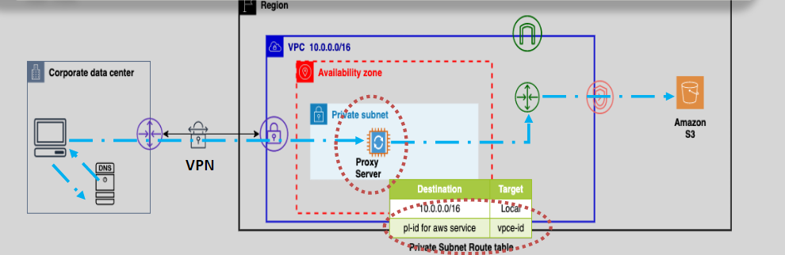
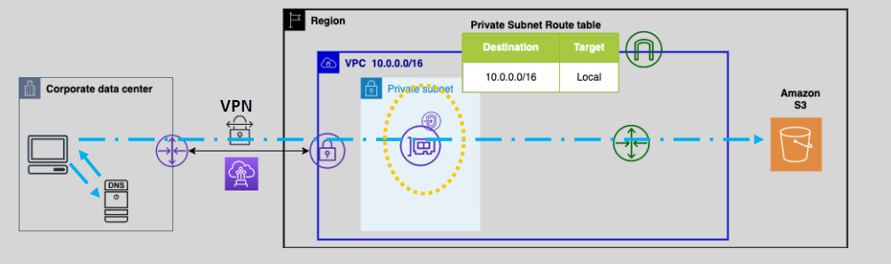
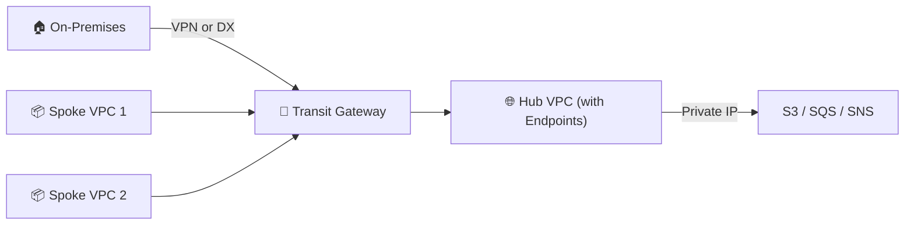

# 🔐🛒 **Hybrid Access to AWS Services via VPC Endpoints — From On-Prem to Cloud**

Welcome to the advanced world of **hybrid networking with VPC Endpoints** — where your **on-premises** workloads, branch offices, or third-party networks can privately and securely access **AWS services** like **S3**, **DynamoDB**, **SQS**, and more — all **without using the public internet**.

Whether you're connecting through **Direct Connect**, **VPN**, or **Transit Gateway**, AWS gives you private access tunnels into its services using **VPC Endpoints**, backed by **PrivateLink**.

---

## 🚀 What’s the Goal Here?

Enable **secure, scalable, and cost-effective communication** from **remote networks** to **AWS services** via:

- ✅ **Gateway Endpoints** (for S3, DynamoDB)
- ✅ **Interface Endpoints** (for most AWS services)
- ✅ **Cross-VPC shared endpoints (hub-and-spoke)**

---

## 🛣️ 1. Accessing Amazon S3 via Gateway Endpoint — From Remote Network

<div style="text-align: center;">
  
</div>

### ❓ Why You Need a Workaround

A **Gateway Endpoint** only works **inside the VPC** — it doesn’t expose an IP address that remote networks can route to directly.

🧩 **Solution**: Deploy a **proxy farm (like NGINX or Squid)** inside the VPC behind an **Internal NLB (Network Load Balancer)**. Remote clients access S3 indirectly by hitting the proxy, which forwards requests through the Gateway Endpoint.

---

### 🧪 Sample Setup:

1. **Remote client** (via VPN/DX) sends:

   ```http
   GET http://proxy.internal/s3/my-bucket/file.jpg
   Host: s3.amazonaws.com
   ```

2. Proxy running in VPC sends:

   ```http
   GET /my-bucket/file.jpg HTTP/1.1
   Host: s3.amazonaws.com
   Authorization: AWS4-HMAC-SHA256 ...
   ```

3. Traffic hits **Gateway Endpoint**, which routes internally to S3.

---

### ✅ Benefits

- **Cost-efficient**: Gateway Endpoints are **free**
- **Secure**: No public IPs used
- **Resilient**: Use **auto-scaling proxies** + **ELB** for HA

---

## 🌉 2. Accessing AWS Services via Interface Endpoints — The PrivateLink Way

<div style="text-align: center;">
  
</div>

### ✅ Why It Works Seamlessly

**Interface Endpoints** create **ENIs (Elastic Network Interfaces)** inside your VPC, each with a **private IP** address that can be reached from **on-premises** or other networks via **VPN** or **Direct Connect**.

DNS for services like `s3.us-east-1.amazonaws.com` will resolve to **the private IP of the ENI**, meaning you can directly reach AWS without proxies.

---

### 🧪 Example Flow: Access S3 from On-Prem

1. From on-premises client via VPN or DX:

   ```http
   GET /my-bucket/backup.tar.gz HTTP/1.1
   Host: s3.us-east-1.amazonaws.com
   ```

2. DNS resolves:

   ```ini
   s3.us-east-1.amazonaws.com ➜ 10.1.12.25 (ENI inside VPC)
   ```

3. Client hits ENI IP directly ➜ routed internally to S3.

---

### ✅ Benefits

- **No proxies or load balancers needed**
- **Security Group** controls for granular access
- **Supports all services** with PrivateLink (S3, SQS, Secrets Manager, etc.)
- **Scalable** to 40 Gbps per ENI (burstable)

---

## 🧭 3. Centralized Access Using Interface Endpoints (Hub-and-Spoke) 🌐

### 💡 Architecture: Shared Interface Endpoints for Many VPCs

<div align="center">



</div>

---

### 🧰 Components

| Component           | Role                                                  |
| ------------------- | ----------------------------------------------------- |
| **Hub VPC**         | Hosts Interface Endpoints (S3, Secrets Manager, etc.) |
| **Spoke VPCs**      | Connected via **Transit Gateway** or **VPC Peering**  |
| **Route Tables**    | Direct all traffic to services through the **hub**    |
| **Security Groups** | Secure the Interface Endpoint access                  |

---

### ✅ Benefits of Centralization

- **🔐 Security**: Only one VPC needs to be hardened and audited
- **💸 Cost-Efficient**: Fewer Interface Endpoints = lower cost
- **🧹 Simplified Ops**: Centralize logging, monitoring, and IAM controls

---

### 🧪 DNS Consideration (Multi-VPC)

Enable **Private DNS** on the Interface Endpoint. From any VPC, accessing `s3.us-east-1.amazonaws.com` resolves to the **hub ENI IP** — no config change needed on apps.

---

## 📋 Summary — VPC Endpoints with Remote Networks

| Method                       | Works with Remote? | Needs Proxy? | Supports Security Group | Notes                                  |
| ---------------------------- | ------------------ | ------------ | ----------------------- | -------------------------------------- |
| **Gateway Endpoint + Proxy** | ✅ Yes             | ✅ Yes       | ❌ No                   | Cost-effective workaround              |
| **Interface Endpoint**       | ✅ Yes             | ❌ No        | ✅ Yes                  | Best practice for secure hybrid access |
| **Shared Endpoints (Hub)**   | ✅ Yes             | ❌ No        | ✅ Yes                  | Great for multi-VPC org setups         |

---

## 📌 Best Practices

- Always use **Interface Endpoints** for remote or hybrid access
- Use **Transit Gateway** for scalable multi-VPC architectures
- **Enable Private DNS** for clean service access (no hostname changes)
- Apply **IAM policies** + **SG rules** to restrict access at the endpoint
- Monitor usage with **VPC Flow Logs** and **CloudWatch Metrics**
