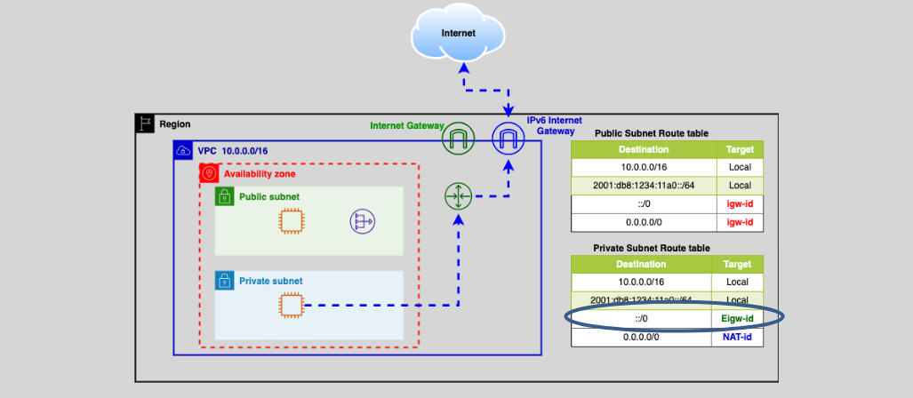
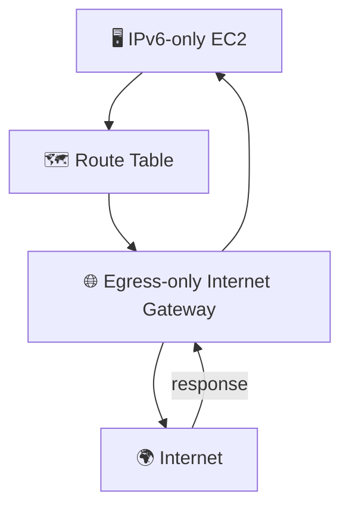

# 🌐🛡️ **AWS IPv6 Egress-only Internet Gateway (EIGW) — Outbound Security for IPv6**

Welcome to the world of **IPv6 in AWS**, where every IP is public, every subnet is globally reachable (by default), and **security must be intentional**.

The **Egress-only Internet Gateway (EIGW)** is your cloud-friendly bouncer that **lets outbound IPv6 traffic exit the party**, but **blocks unsolicited inbound guests** at the door. Think of it as the **IPv6 version of a NAT Gateway**, but exclusively for **egress only** — hence the name.

---

<div style="text-align: center;">
  
</div>

---

## 🔍 What Is an Egress-only Internet Gateway?

All **IPv6 addresses in AWS are globally routable** — meaning they are inherently public. This is both powerful and risky.

### ❓ So what if I just want:

- 🚀 **Outbound access** to install software updates or connect to external APIs
- 🚫 But **no inbound access** from the internet

That’s where **EIGW** steps in. It allows:

- ✅ **Outbound IPv6 communication**
- 🚫 **Blocks unsolicited inbound traffic**
- 🔁 **Allows response traffic (stateful)**

Think of it as a **one-way internet exit** for your IPv6 traffic, but with **a security guard who remembers who left and lets only them back in**.

---

## 🛠️ How Does It Work?

### ✨ Key Behavior:

| Direction              | Allowed? | Notes                                                 |
| ---------------------- | -------- | ----------------------------------------------------- |
| **Outbound**           | ✅ Yes   | IPv6 traffic from your VPC to the internet            |
| **Inbound (new)**      | ❌ No    | Blocks unsolicited connections                        |
| **Inbound (response)** | ✅ Yes   | Responses to outbound requests are allowed (stateful) |

---

### 🔁 Stateful Nature

Just like the Internet Gateway, EIGW is **stateful**, which means:

> You can **initiate** connections to the internet, and **responses come back in** without needing an inbound rule.

🧪 **Example: Outbound HTTPS Request**

```http
GET /latest-version HTTP/1.1
Host: api.vendor.com
```

🔄 Response will come back automatically to the same IPv6-enabled instance that made the request — no inbound rules required.

---

## 🧩 When Should You Use an EIGW?

Use **Egress-only Internet Gateway** when:

- Your VPC is **IPv6-enabled**
- You have **private subnets** (or want to treat them like private)
- You want instances to **reach the internet**, but prevent internet from reaching in
- You want to **avoid NAT Gateway costs** for IPv6 traffic

---

## 💡 Real-World Use Case

Imagine this setup:

- You have an **EC2 instance with only an IPv6 address** (no IPv4)
- It needs to:

  - Fetch patches from `yum.amazonaws.com`
  - Pull GitHub repos over HTTPS
  - Access public APIs

✅ You want **outbound access**  
🚫 But don’t want random scanners or bots hitting your IPv6 IPs directly

📦 **Solution**: Use an **Egress-only Internet Gateway** for outbound, one-way traffic.

---

## ⚙️ How to Configure EIGW in 4 Steps

### ✅ Step 1: Create the Gateway

```bash
aws ec2 create-egress-only-internet-gateway --vpc-id vpc-12345678
```

### ✅ Step 2: Attach EIGW to Your VPC

It's automatically attached when created with the VPC.

### ✅ Step 3: Update Route Table

```json
{
  "Destination": "::/0",
  "Target": "eigw-1234567890abcdef"
}
```

This tells AWS: "All **IPv6 traffic to the internet** should go through the EIGW."

### ✅ Step 4: Configure Security

- **Security Groups**: Allow outbound IPv6 on necessary ports (e.g. 443 for HTTPS)
- **NACLs**: Ensure outbound and inbound rules allow established return traffic

---

## 🔍 IPv6 vs. IPv4: Why You Need an EIGW

| Feature                          | IPv4 Private Subnet        | IPv6 Subnet                |
| -------------------------------- | -------------------------- | -------------------------- |
| Public IPs by default            | ❌ (private)               | ✅ All IPv6 are public     |
| NAT Gateway needed?              | ✅ Yes                     | ❌ Not supported           |
| EIGW needed for outbound access? | ❌ No (NAT does it)        | ✅ Yes                     |
| Inbound traffic blocked by EIGW? | ❌ NAT blocks it by nature | ✅ EIGW blocks unsolicited |

---

## 🔐 Security Tip: Defense in Layers

Even though EIGW **blocks new inbound traffic**, you should still:

- Attach **strict Security Groups** (e.g., deny all inbound)
- Set up **NACLs** as an extra control layer
- Use **VPC Flow Logs** to monitor IPv6 traffic behavior

---

## 📋 Summary

| Feature                       | Behavior                                                    |
| ----------------------------- | ----------------------------------------------------------- |
| IPv6 Outbound Allowed         | ✅ Yes — to internet                                        |
| IPv6 Inbound Blocked (new)    | ✅ Yes — unsolicited traffic blocked                        |
| IPv6 Inbound Response Allowed | ✅ Yes — return traffic from initiated outbound connections |
| Stateful                      | ✅ Yes                                                      |
| Security Group Required?      | ❌ No, not for EIGW directly (but still used on ENI level)  |
| NAT Gateway Replacement?      | ✅ For IPv6 traffic                                         |

---

## 🧪 Example Architecture

<div align="center">



</div>
