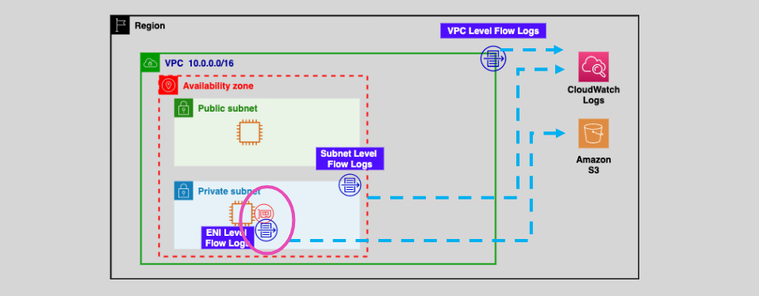

# 🕵️‍♂️📡 **AWS VPC Flow Logs — Monitor, Analyze, Secure Your Network**

Ever wonder what’s really happening inside your AWS network? Which IPs are talking to whom? Who’s getting rejected? Are packets being silently dropped?

Enter: **AWS VPC Flow Logs** — your virtual **wiretap** for capturing traffic to and from ENIs (Elastic Network Interfaces) in your VPC. Whether you're debugging a broken microservice, checking compliance, or catching suspicious activity, Flow Logs have your back.

---

<div style="text-align: center;">
  
</div>

---

## 🚀 What Are VPC Flow Logs?

**VPC Flow Logs** enable you to **capture metadata** about network traffic flowing **in and out of your VPC**, **subnets**, or **ENIs**, and store it in **Amazon CloudWatch Logs** or **Amazon S3**.

> ⚠️ Note: **VPC Flow Logs do not capture actual packet data (payloads)** — only metadata such as source/destination IP, port, protocol, action, and timestamps.

---

## 🛠️ Key Features of Flow Logs

### 🧾 What Gets Logged?

Each **flow log record** includes:

| Field          | Description                              |
| -------------- | ---------------------------------------- |
| `version`      | Log format version                       |
| `account-id`   | AWS account ID                           |
| `interface-id` | ENI where traffic was observed           |
| `srcaddr`      | Source IPv4 or IPv6 address              |
| `dstaddr`      | Destination IPv4 or IPv6 address         |
| `srcport`      | Source port number                       |
| `dstport`      | Destination port number                  |
| `protocol`     | IANA protocol number (6 = TCP, 17 = UDP) |
| `action`       | `ACCEPT` or `REJECT`                     |
| `log-status`   | Status of log (OK, NODATA, SKIPDATA)     |

🧪 **Sample Flow Log Record** (CloudWatch):

```ini
2 123456789012 eni-abc123 10.0.1.10 10.0.2.20 443 60234 6 1 64 1672445890 1672445950 ACCEPT OK
```

---

### 🎯 Levels of Logging Granularity

| Level            | Description                                             | Example Use Case                                |
| ---------------- | ------------------------------------------------------- | ----------------------------------------------- |
| **VPC-level**    | Logs traffic for all ENIs in the VPC                    | Audit entire network                            |
| **Subnet-level** | Logs traffic for ENIs in a specific subnet              | Monitor public subnet vs private subnet         |
| **ENI-level**    | Logs traffic for one specific Elastic Network Interface | Debugging traffic to/from one EC2 or Lambda ENI |

> 🎯 **Best Practice**: Use **ENI-level** logs for targeted troubleshooting, **VPC-level** for compliance or large-scale monitoring.

---

### 📦 Storage & Analytics Options

| Destination         | Description                               | Best For                                     |
| ------------------- | ----------------------------------------- | -------------------------------------------- |
| **CloudWatch Logs** | Real-time log streaming and querying      | Alerts, dashboards, live troubleshooting     |
| **S3 Bucket**       | Durable, cost-effective long-term storage | Archiving, Athena queries, ML pipeline input |

---

## 🔒 Why Use Flow Logs?

### ✅ 1. Security Visibility

- Detect suspicious activity like port scanning or unexpected egress
- Correlate rejected traffic with **Security Group/NACL misconfigurations**
- Monitor traffic from rogue IPs or misbehaving apps

### 🔧 2. Network Troubleshooting

- See **which instance is dropping packets**
- Validate **NAT Gateway**, **VPN**, or **Firewall behavior**
- Check if a **route table misconfiguration** is blocking traffic

### 📜 3. Compliance & Auditing

- Maintain audit trail of all network flows
- Archive to S3 for **governance frameworks** (e.g., PCI-DSS, ISO 27001)

---

## 🔧 How to Set Up VPC Flow Logs

### 🏗️ 1. Create Flow Log from the VPC Console

- Go to **VPC → Your VPC → Flow Logs tab → Create Flow Log**
- Choose:

  - **Resource type**: VPC, Subnet, or ENI
  - **Traffic type**: `ACCEPT`, `REJECT`, or `ALL`
  - **Destination**: CloudWatch or S3

### 📊 2. Example CloudWatch Log Group Format

Log stream naming pattern:

```ini
eni-<interface-id>-<region>-<log-group-id>
```

Use **CloudWatch Insights** to query logs:

```sql
fields @timestamp, interfaceId, srcAddr, dstAddr, action
| filter action = "REJECT"
| sort @timestamp desc
```

### 🧠 3. Example S3 Setup with Athena

- Store logs in an S3 bucket like: `s3://vpc-flow-logs-prod/`
- Set up **Glue crawler** to define schema
- Query using Athena:

```sql
SELECT srcaddr, dstaddr, action
FROM flow_logs
WHERE action = 'REJECT'
AND dstport = 22;
```

---

## 🧪 Real-Life Example: SSH Troubleshooting

### Scenario:

You can’t SSH into an EC2 instance from your corporate VPN.

1. Turn on **ENI-level Flow Logs**

2. Find this record:

   ```ini
   2 123456789012 eni-xyz 10.0.0.5 10.0.0.25 22 58921 6 1 60 1672450000 1672450020 REJECT OK
   ```

3. Conclusion: Traffic is **reaching the instance**, but being **blocked by SG or NACL** — fix security group or route table accordingly.

---

## 🛡️ Flow Log Limitations & Gotchas

- ❌ Does **not log traffic to Amazon DNS (169.254.169.253)**
- ❌ No payloads — just **metadata**
- ⚠️ Log delivery delay can vary (a few minutes latency)
- 🔄 Traffic between **ENIs within the same instance** (e.g., multi-NIC EC2) may not be logged

---

## 📋 Summary — AWS Flow Logs at a Glance

| Feature                    | Supported?            |
| -------------------------- | --------------------- |
| VPC/Subnet/ENI granularity | ✅ Yes                |
| Real-time logging          | ✅ With CloudWatch    |
| Long-term archiving        | ✅ With S3            |
| Security group validation  | ✅ Indirectly         |
| Actual packet data         | ❌ No (metadata only) |
| DNS traffic logging        | ❌ Excluded           |

---

## 🧠 Pro Tips

- Enable **CloudWatch Metric Filters** to trigger alarms for traffic anomalies
- Use **Athena** for advanced querying over S3-based flow logs
- Combine with **GuardDuty** for threat detection based on flow anomalies
