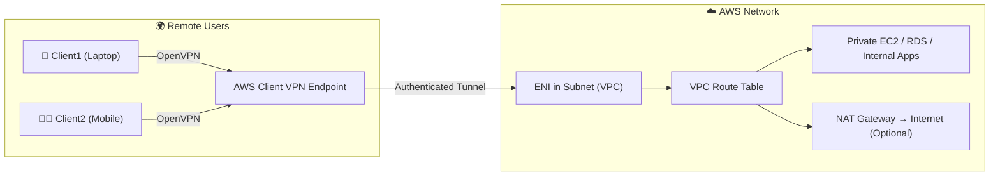
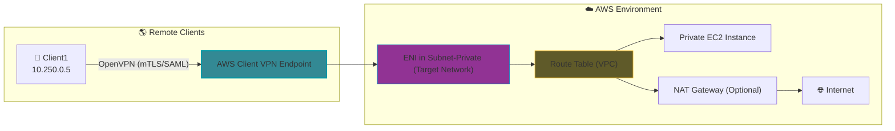

# 🌐 **AWS Client VPN**

## 🧭 **Overview**

**AWS Client VPN** is a **managed, scalable, and secure VPN service** that lets your **employees or devices connect** to your AWS network (VPC) and on-premises environment **from anywhere** using **OpenVPN-based clients**.

💡 It’s a **fully managed alternative** to deploying your own OpenVPN or IPSec VPN servers — AWS handles scaling, HA, certificates, and endpoint management.

---

## 💎 **Why Use AWS Client VPN?**

<div align="center" style="background-color: #141a19ff;color: #a8a5a5ff; border-radius: 10px; border: 2px solid">

| Benefit                     | Description                                                                                         |
| --------------------------- | --------------------------------------------------------------------------------------------------- |
| 🔒 **Managed Security**     | No need to maintain EC2-based VPN servers — AWS handles patches, scaling, and cert validation.      |
| 📈 **Elastic & Scalable**   | Automatically scales up to thousands of users — no manual tuning.                                   |
| 🔄 **Integrated with AWS**  | Tight integration with ACM (certs), CloudWatch (logs), IAM/SAML (auth), and VPC routing.            |
| 🌍 **Global Access**        | Users can connect securely from anywhere using the AWS VPN client or any OpenVPN-compatible client. |
| 🧩 **Hybrid Connectivity**  | Extend your AWS VPC securely to on-premises networks over Direct Connect or Site-to-Site VPN.       |
| 🧠 **Granular Access**      | Define precise authorization rules — which users or groups can access which subnets.                |
| 📜 **Logging and Auditing** | Integration with CloudWatch for connection and authentication logs.                                 |

</div>

---

## 🔄 **Alternatives to AWS Client VPN**

<div align="center" style="background-color: #141a19ff;color: #a8a5a5ff; border-radius: 10px; border: 2px solid">

| Option                           | Description                                                     | When to Use                                                                |
| -------------------------------- | --------------------------------------------------------------- | -------------------------------------------------------------------------- |
| 🧱 **OpenVPN on EC2**            | Manually deploy an OpenVPN Access Server EC2 instance.          | When you need advanced customization (e.g., complex ACLs or self-hosting). |
| 🔌 **AWS Site-to-Site VPN**      | IPsec-based VPN between on-premises and AWS VPC.                | For **network-to-network** connectivity (not individual users).            |
| 🧍‍♂️ **AWS Direct Connect**        | Dedicated physical connection between your data center and AWS. | For high-speed, low-latency, private connectivity.                         |
| 🌩️ **AWS PrivateLink + Bastion** | For controlled access to private resources without full VPN.    | When you want fine-grained API-level access without routing.               |

</div>

---

🧠 **Quick summary:**

- **Client VPN** → users → AWS
- **Site-to-Site VPN** → networks → AWS
- **OpenVPN EC2** → DIY version of Client VPN

---

## ⚙️ **Architecture Overview**

Here’s how AWS Client VPN fits together 👇

<div align="center" style="background-color: #141a19ff;color: #a8a5a5ff; border-radius: 10px; border: 2px solid">



</div>

### 🔍 Components

<div align="center" style="background-color: #141a19ff;color: #a8a5a5ff; border-radius: 10px; border: 2px solid">

| Component                   | Description                                                                  |
| --------------------------- | ---------------------------------------------------------------------------- |
| **Client VPN Endpoint**     | The main VPN server AWS manages. Holds configuration, auth method, and logs. |
| **Target Network (Subnet)** | The subnet where Client VPN ENI (Elastic Network Interface) is attached.     |
| **Route Table**             | Defines which destinations (CIDRs) client traffic can reach.                 |
| **Authorization Rules**     | Control which clients can access which routes.                               |
| **Client CIDR Range**       | Private IP pool assigned to VPN clients.                                     |
| **Security Group**          | Controls inbound/outbound traffic from the VPN endpoint ENI.                 |

</div>

---

## 🧩 **Components in Detail**

### 🧱 Client VPN Endpoint

- The **control plane** — manages connections, authentication, and data encryption.
- Uses OpenVPN protocol (TCP or UDP, usually UDP 443).

### 🔌 Target Network Association

- You must **associate** at least one **subnet** in a VPC.
- AWS creates an **Elastic Network Interface (ENI)** inside that subnet.
- Each connected client’s packets enter the VPC through that ENI.

### 🗺️ Route Table

- Defines what traffic (destination CIDRs) is routed through the VPN.
- You can add:

  - VPC CIDR → allows access to internal AWS resources.
  - `0.0.0.0/0` → sends all traffic (Internet) through AWS (Full Tunnel).
  - On-prem CIDRs (if using Direct Connect or Site-to-Site).

### 🛂 Authorization Rules

- Determine which users (or groups, if using SAML/IAM) can access each route.
- Example:

  - Devs → 10.0.1.0/24
  - Admins → 10.0.0.0/16
  - Default → deny

### 🔐 Security Group

- Attached to the Client VPN ENI.
- Controls what traffic can enter or leave the VPN endpoint (e.g., UDP 443 inbound).

---

## 🧾 **CIDR & IP Range Explained**

This is the **IP address pool** AWS assigns to VPN clients when they connect.

- Think of it as a virtual subnet for your developers.
- Each client gets an IP from this range (e.g., `172.31.0.6`) used to route traffic inside your VPC.
- It must be **non-overlapping** with your VPC CIDR and any client-side networks.

---

### ❌ Why `192.168.0.0/24` Is Risky

This range is **ubiquitous in home and office Wi-Fi setups**:

- Most consumer routers use `192.168.0.1` as gateway and assign IPs like `192.168.0.x`.
- If a developer connects from a network already using `192.168.0.0/24`, their OS may **treat VPN-assigned IPs as local**.
- This causes traffic to bypass the VPN tunnel, leading to:
  - DNS resolution failures
  - Unreachable internal services
  - Silent packet drops

### 🔍 Example Conflict

| Source     | IP Address           | Behavior                               |
| ---------- | -------------------- | -------------------------------------- |
| Home Wi-Fi | `192.168.0.100`      | Local IP                               |
| VPN Client | `192.168.0.101`      | Also local — OS routes traffic locally |
| Result     | ❌ VPN traffic fails | -                                      |

---

### ✅ Safer CIDR Alternatives

Choose ranges that are **still private (RFC 1918)** but **rarely used in consumer networks**:

```plaintext
172.31.0.0/22   # 1024 IPs — great for scaling
172.20.0.0/24   # 256 IPs — clean and simple
```

These CIDRs:

- Avoid overlap with home/office networks
- Are safe for routing inside your VPC
- Provide enough IPs for your developer pool

---

## 🚦 **Traffic Splitting (Split vs Full Tunnel)**

When you create the VPN endpoint, you’ll see:

> **“Enable split-tunnel”**

This setting **controls where client traffic is routed** 👇

<div align="center" style="background-color: #141a19ff;color: #a8a5a5ff; border-radius: 10px; border: 2px solid">

| Mode                          | Description                                                                                                      | Typical Use                                    |
| ----------------------------- | ---------------------------------------------------------------------------------------------------------------- | ---------------------------------------------- |
| 🟩 **Split Tunnel (Enabled)** | - Only traffic for VPC/internal CIDRs goes through VPN. </br> - Internet traffic uses client’s local connection. | Common for corporate access (saves bandwidth). |
| 🟥 **Full Tunnel (Disabled)** | All client traffic (including Internet) goes through VPN, then NAT Gateway or firewall.                          | Common for compliance or egress filtering.     |

</div>

### 🧠 Example

- Split Tunnel → access internal app (10.0.1.10) directly
  → browse Google via home Internet.
- Full Tunnel → all traffic goes through AWS → NAT Gateway → Internet.

---

## 📜 **Logging and Monitoring**

AWS integrates Client VPN with **CloudWatch Logs**.

You can enable:

- **Connection Logs** — who connected, when, from where.
- **Authentication Logs** — mTLS or SAML success/failure events.

Example setup:

```bash
--connection-log-options Enabled=true,CloudwatchLogGroup=ClientVPNLogs,CloudwatchLogStream=AuthEvents
```

---

## 🧰 **Step-by-Step Creation (High-Level)**

1. **Import Server Certificate**

   - From ACM (e.g., `vpn.orchida-einvoice.com`)

2. **Create Client VPN Endpoint**

   - CIDR: `10.250.0.0/22`
   - Auth: mTLS or SAML (already discussed)
   - Split Tunnel: enabled or disabled
   - Logs: enabled (to CloudWatch)

3. **Associate Subnet**

   - Example: `subnet-0abc123def456`
   - AWS creates ENI for VPN endpoint.

4. **Add Routes**

   - To internal VPC or on-prem CIDRs.

5. **Add Authorization Rules**

   - Define which users can access which networks.

6. **Assign Security Group**

   - Allow UDP 443 inbound; all outbound.

7. **Export Client Configuration**

   - Get `.ovpn` file for OpenVPN/AWS Client app.

8. **Connect Clients**

   - Use AWS VPN Client with their respective certs.

---

## 🧱 **Common Gotchas**

<div align="center" style="background-color: #141a19ff;color: #a8a5a5ff; border-radius: 10px; border: 2px solid">

| Problem                        | Root Cause                                | Fix                             |
| ------------------------------ | ----------------------------------------- | ------------------------------- |
| Connected but can’t reach EC2  | Missing route or authorization rule       | Add both                        |
| Auth passes, but no data flows | Security Group or NACL blocking           | Check inbound/outbound          |
| Connection rejected            | Wrong CA chain or expired cert            | Regenerate valid certs          |
| No Internet access             | Split tunnel enabled or missing NAT route | Disable split tunnel or add NAT |

</div>

---

## 🧠 **Summary Table**

<div align="center" style="background-color: #141a19ff;color: #a8a5a5ff; border-radius: 10px; border: 2px solid">

| Concept                 | Description                             |
| ----------------------- | --------------------------------------- |
| **Client VPN Endpoint** | Managed VPN server endpoint             |
| **Target Subnet (ENI)** | Entry point into VPC                    |
| **Client CIDR**         | IP pool for users                       |
| **Authorization Rules** | Who can access what                     |
| **Route Table**         | Where traffic goes                      |
| **Split Tunnel**        | Decide which traffic passes through VPN |
| **Security Group**      | Controls inbound/outbound               |
| **Logs**                | Sent to CloudWatch for auditing         |

</div>

---

## 🗺️ **Visual Summary**

<div align="center" style="background-color: #141a19ff;color: #a8a5a5ff; border-radius: 10px; border: 2px solid">



</div>

---

## ✅ **Final Recap**

<div align="center" style="background-color: #141a19ff;color: #a8a5a5ff; border-radius: 10px; border: 2px solid">

| Category                 | Summary                                                                          |
| ------------------------ | -------------------------------------------------------------------------------- |
| **Type**                 | Managed OpenVPN service by AWS                                                   |
| **Use Case**             | Secure remote access to AWS or on-prem                                           |
| **Core Components**      | Endpoint, Subnet (ENI), Route, Auth Rule, CIDR, SG                               |
| **Split vs Full Tunnel** | Control if Internet traffic goes through VPN                                     |
| **Authentication Modes** | mTLS, Active Directory, SAML                                                     |
| **Alternatives**         | OpenVPN EC2, Site-to-Site VPN, Direct Connect                                    |
| **Best For**             | Remote developers, admins, or third-party contractors who need secure VPC access |

</div>
