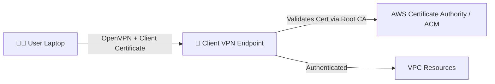
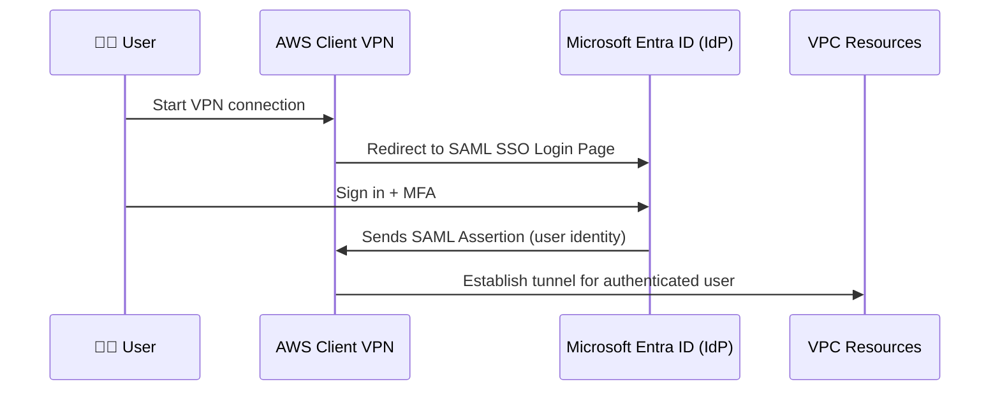

# 🧭 Understanding Authentication (AuthN) in AWS Client VPN

> **Authentication (AuthN)** = verifying identity (who is connecting)  
> **Authorization (AuthZ)** = verifying permission (what they can access)

Every VPN connection starts with **AuthN** before any authorization or routing occurs.

When a user connects:

1. AWS verifies their **identity** via AuthN (mTLS or SAML).
2. Once authenticated, AWS checks **authorization rules** for that identity.
3. Then applies **route tables** and **security groups**.

---

## 🧩 **AuthN Modes Overview**

<div align="center" style="background-color: #141a19ff;color: #a8a5a5ff; border-radius: 10px; border: 2px solid">

| Mode                    | Type              | Use Case                            | Identity Source         | Example                              |
| ----------------------- | ----------------- | ----------------------------------- | ----------------------- | ------------------------------------ |
| **Mutual TLS (mTLS)**   | Certificate-based | Simple setups, small teams          | Private CA certificates | Developers connect with client certs |
| **SAML 2.0 Federation** | Federated (SSO)   | Enterprise SSO, MFA, user lifecycle | IdP like Entra ID       | Employees sign in via company SSO    |

</div>

---

## 📑 **1. Mutual TLS (mTLS) Authentication**

### 📘 Concept

**Mutual TLS** means _both sides_ of the VPN handshake present certificates:

- The **server** (AWS Client VPN endpoint) presents its server certificate.
- The **client** (user device) presents its client certificate.

AWS verifies both using a **trusted root CA** (certificate authority).

So, if the client’s certificate is signed by the trusted CA, authentication succeeds.

---

### 🧠 Analogy

Think of it like a **door lock with two keys**:

- One key (server cert) proves that the door belongs to AWS.
- The other key (client cert) proves the user is an authorized employee.

---

### 🏗️ Architecture Overview



---

### ⚙️ Step-by-Step Setup

#### 1️⃣ Generate Certificates

You can use AWS Certificate Manager (ACM) or OpenVPN’s `easy-rsa` tool.

Example (using OpenVPN’s `easy-rsa`):

```bash
# Create a new PKI
easyrsa init-pki
easyrsa build-ca nopass

# Create a server certificate
easyrsa build-server-full server nopass

# Create a client certificate for a user
easyrsa build-client-full user1 nopass
```

---

#### 2️⃣ Import Certificates into AWS Certificate Manager (ACM)

Upload:

- **Server certificate** → Used by Client VPN endpoint
- **Client certificate & CA** → Used for client verification

In ACM:

- **Server cert** (for the VPN endpoint):
  ARN: `arn:aws:acm:region:account:certificate/xxxx`
- **Client root cert** (for verifying client certs):
  ARN: `arn:aws:acm:region:account:certificate/yyyy`

---

#### 3️⃣ Create Client VPN Endpoint (mTLS)

Example using AWS CLI:

```bash
aws ec2 create-client-vpn-endpoint \
  --client-cidr-block 10.250.0.0/22 \
  --server-certificate-arn arn:aws:acm:region:account:certificate/xxxx \
  --authentication-options Type=certificate-authentication,RootCertificateChainArn=arn:aws:acm:region:account:certificate/yyyy \
  --connection-log-options Enabled=true,CloudwatchLogGroup=ClientVPNLogs,CloudwatchLogStream=AuthEvents \
  --transport-protocol udp
```

---

#### 4️⃣ Connect Using OpenVPN Client

Export the configuration from AWS:

```bash
aws ec2 export-client-vpn-client-configuration \
  --client-vpn-endpoint-id cvpn-endpoint-1234abcd \
  --output text > client.ovpn
```

Then include:

```bash
<cert>
(client certificate content)
</cert>
<key>
(private key content)
</key>
```

Connect using OpenVPN client:

> You’ll authenticate automatically via your client certificate.

---

### ✅ Pros and Cons

| ✅ Pros                                         | ❌ Cons                                        |
| ----------------------------------------------- | ---------------------------------------------- |
| Simple setup                                    | No user identity awareness (just certs)        |
| Offline-friendly                                | Certificate revocation requires manual updates |
| No dependency on IdP                            | Harder to manage large user bases              |
| Works well for small teams or automated devices | No MFA or SSO support                          |

---

### 🧑‍💻 Example Use Case

> Your DevOps team of 10 needs VPN access to AWS private subnets.
> You don’t want to integrate Entra ID or manage user passwords.

✅ Use **mTLS**

- Generate 10 client certificates.
- Each developer imports their cert into their OpenVPN client.
- Access is granted automatically based on certificate trust.

---

## 🪪 **2. SAML 2.0 Authentication**

### 📘 Concept

SAML 2.0 (Security Assertion Markup Language) allows your users to sign in using **corporate credentials** from an Identity Provider (IdP) like **Microsoft Entra ID (Azure AD)**.

With this, AWS **delegates authentication** to your IdP.

👉 Instead of using certificates, users log in via the Entra ID portal (browser-based MFA, SSO).

---

### 🧠 Analogy

Think of this as **guest list at a nightclub**:

- AWS is the bouncer (Client VPN Endpoint).
- Entra ID is the receptionist with the official guest list (SSO login).
- The bouncer only lets in guests who show the “admission ticket” (SAML assertion).

---

### 🏗️ Architecture Overview



---

### ⚙️ Step-by-Step Setup with Entra ID (Azure AD)

#### 1️⃣ In AWS — Create a SAML Provider

Go to **IAM → Identity Providers → Add Provider**

- Provider type: `SAML`
- Name: `EntraID`
- Upload the Entra ID Federation Metadata XML file.

You’ll get an ARN like:

```ini
arn:aws:iam::123456789012:saml-provider/EntraID
```

---

#### 2️⃣ In Entra ID — Create an Enterprise Application

Go to **Entra ID → Enterprise Applications → New Application → Create your own application**

- Name: `AWS Client VPN`
- Type: “Integrate any other application you don't find in the gallery (Non-gallery app)”

---

#### 3️⃣ Configure SAML Settings in Entra ID

In the app’s **Single sign-on → SAML** section:

| Field                                          | Value                                                            |
| ---------------------------------------------- | ---------------------------------------------------------------- |
| **Identifier (Entity ID)**                     | `urn:amazon:webservices:clientvpn`                               |
| **Reply URL (Assertion Consumer Service URL)** | `https://self-service.clientvpn.amazonaws.com/api/auth/sso/saml` |
| **Name ID format**                             | `EmailAddress`                                                   |
| **Name ID value**                              | `user.userprincipalname`                                         |

💡 This tells Entra ID how to respond when AWS requests identity confirmation.

---

#### 4️⃣ Download Federation Metadata XML

Click **Download** under “Federation Metadata XML”.
You’ll upload this file to AWS when creating the SAML provider.

---

#### 5️⃣ Configure AWS Client VPN for SAML Auth

Use AWS CLI:

```bash
aws ec2 create-client-vpn-endpoint \
  --client-cidr-block 10.250.0.0/22 \
  --server-certificate-arn arn:aws:acm:region:account:certificate/xxxx \
  --authentication-options Type=federated-authentication, SAMLProviderArn=arn:aws:iam::123456789012:saml-provider/EntraID \
  --connection-log-options Enabled=true,CloudwatchLogGroup=ClientVPNLogs,CloudwatchLogStream=AuthEvents
```

---

#### 6️⃣ Assign Users in Entra ID

In the Enterprise App:

- Go to **Users and Groups**.
- Assign users or groups who can access the VPN.
- These users will appear in AWS authorization checks later (e.g., AuthZ rules).

---

#### 7️⃣ Connect Using OpenVPN Client

When users connect:

- OpenVPN client will open a browser to Entra ID.
- Users sign in (and possibly use MFA).
- Entra ID sends a **SAML assertion** back to AWS.
- AWS establishes the VPN session.

---

### ✅ Pros and Cons

| ✅ Pros                                    | ❌ Cons                                                |
| ------------------------------------------ | ------------------------------------------------------ |
| Centralized user management (Entra ID)     | Slightly more setup                                    |
| Supports MFA & conditional access          | Requires browser-based SAML flow                       |
| Integrates with SSO and corporate policies | Depends on Internet access for IdP                     |
| Ideal for large enterprises                | Cannot be used for headless devices (needs user login) |

---

### 🧠 Real-World Example

> Your company has 500 employees in Entra ID.
> You want them to connect to AWS Client VPN using their Microsoft credentials, with MFA enforced.

✅ Use **SAML Authentication**:

- Employees log in using `user@company.com`
- Entra ID performs MFA.
- AWS Client VPN verifies the signed SAML assertion.
- Authorization rules in AWS can now filter by Entra ID groups.

---

## ⚖️ **Comparison: mTLS vs SAML**

<div align="center" style="background-color: #141a19ff;color: #a8a5a5ff; border-radius: 10px; border: 2px solid">

| Feature                   | **mTLS**                    | **SAML 2.0 (Entra ID)**               |
| ------------------------- | --------------------------- | ------------------------------------- |
| **Identity Source**       | Certificates                | Entra ID users                        |
| **Authentication Type**   | Mutual TLS handshake        | Federated (browser-based)             |
| **MFA Support**           | ❌ No                       | ✅ Yes                                |
| **User Awareness in AWS** | Certificate CN only         | Full user identity (email, group)     |
| **Ease of Management**    | Manual                      | Centralized (IdP)                     |
| **Best For**              | Small teams, static devices | Enterprises, corporate SSO            |
| **Connection Type**       | Command-line/OpenVPN only   | Browser-based + OpenVPN               |
| **Revocation**            | Manual revoke certs         | Disable user in Entra ID              |
| **Auditing**              | Certificate-based logs      | User-based logs with identity context |

</div>

---

## 🧠 **Pro Tip — Combine AuthN with AuthZ**

Once users authenticate via mTLS or SAML, AWS uses **authorization rules** to decide _what they can access_.

Example:

```bash
# For SAML user group "Developers"
Authorization Rule:
Destination CIDR: 10.0.1.0/24
Access Group: Developers (from Entra ID)
```

This way, you can restrict specific **Entra ID groups** to certain subnet ranges in AWS.

---

## 🧾 **TL;DR Summary**

<div align="center" style="background-color: #141a19ff;color: #a8a5a5ff; border-radius: 10px; border: 2px solid">

| Concept                    | Description                             | Example                                      |
| -------------------------- | --------------------------------------- | -------------------------------------------- |
| **AuthN (Authentication)** | Verifies identity (who you are)         | Login via cert (mTLS) or Entra ID (SAML)     |
| **AuthZ (Authorization)**  | Verifies access (what you can do)       | Allow Entra ID “Developers” to `10.0.1.0/24` |
| **Route Table**            | Decides where to send packets           | `0.0.0.0/0` → NAT Gateway                    |
| **Security Group**         | Decides what type of traffic is allowed | Allow TCP 443                                |

</div>

---

## 🧭 **Choosing the Right Authentication Method**

<div align="center" style="background-color: #141a19ff;color: #a8a5a5ff; border-radius: 10px; border: 2px solid">

| Company Type                           | Recommended Method           |
| -------------------------------------- | ---------------------------- |
| Small DevOps team, no SSO              | **mTLS (certificate-based)** |
| Medium–large org with Entra ID or Okta | **SAML Federation**          |
| Automation / machine-to-machine VPN    | **mTLS**                     |
| Remote workforce with MFA & SSO        | **SAML (with Entra ID)**     |

</div>

---

## 🧠 **Final Thought**

> 🧩 **mTLS gives you secure certificates. SAML gives you secure identities.**  
> Both are valid — but SAML integrates your AWS VPN with your existing user ecosystem, policies, and MFA — making it the **enterprise-grade approach**.
