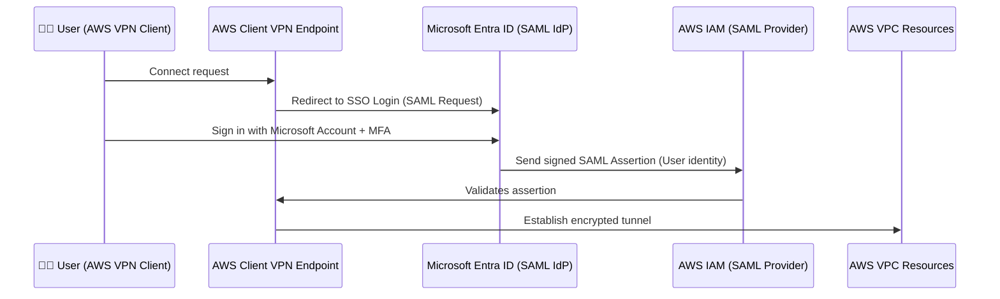
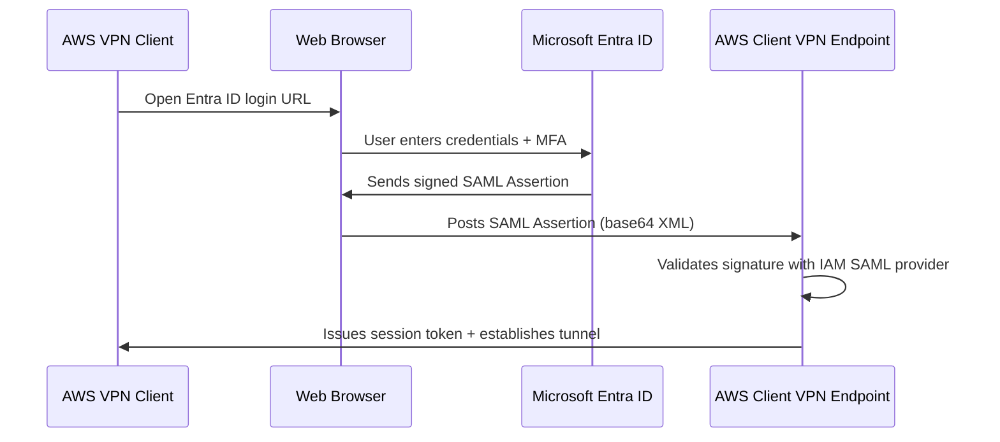

---
tags:
  - aws
  - aws/service
  - aws/domain/networking
  - aws/topic/vpc
  - aws/topic/client-to-site-vpn
aliases:
  - "Hands-on federation setup between AWS Client VPN and Microsoft Entra ID Azure AD using SAML 2.0 authentication."
  - "Hands On Saml"
---

# ✍🏻 **Hands-on federation setup** between **AWS Client VPN** and **Microsoft Entra ID (Azure AD)** using **SAML 2.0 authentication**.

This is the **enterprise-grade integration** method — it allows your users to connect to the AWS VPN using their **Microsoft 365 / Entra ID corporate accounts**, including **MFA**, **SSO**, and **conditional access** policies.

We’ll go end-to-end 👇

---

## 🎯 Goal Overview

You’ll set up:

1. A **SAML-based Enterprise Application** in Entra ID (Azure AD).
2. A **SAML Provider** in AWS IAM.
3. An **AWS Client VPN Endpoint** using that SAML provider.
4. Assign users in Entra ID to control who can log in.
5. Test the connection using the **AWS VPN client**.

---

## 🧱 Architecture Diagram

<div align="center" style="background-color: #141a19ff;color: #a8a5a5ff; border-radius: 10px; border: 2px solid">



</div>

---

## ⚙️ Step-by-Step Configuration

### Step 1️⃣ — Create an Enterprise Application in Microsoft Entra ID

#### 🔹 In Azure Portal:

1. Navigate to
   **Microsoft Entra ID → Enterprise Applications → New application**
2. Choose
   **Create your own application**
3. Name it, e.g.
   👉 `AWS Client VPN`
4. Choose
   **Integrate any other application you don’t find in the gallery (Non-gallery app)**
5. Click **Create**

---

### Step 2️⃣ — Configure SAML-based SSO in Entra ID

Once the app is created:

1. Open the new app → **Single sign-on → SAML**

2. Under **Basic SAML Configuration**, click **Edit** and fill in:

   <div align="center" style="background-color: #141a19ff;color: #a8a5a5ff; border-radius: 10px; border: 2px solid">

   | Field                      | Value                                                            |
   | -------------------------- | ---------------------------------------------------------------- |
   | **Identifier (Entity ID)** | `urn:amazon:webservices:clientvpn`                               |
   | **Reply URL (ACS URL)**    | `https://self-service.clientvpn.amazonaws.com/api/auth/sso/saml` |
   | **Sign-on URL**            | _(Optional)_ Leave blank                                         |
   | **Relay State**            | _(Optional)_ Leave blank                                         |

   </div>

3. Click **Save**

---

> 💡 The **ACS URL (Assertion Consumer Service)** is where Entra ID sends the login response to AWS.

---

### Step 3️⃣ — Configure User Attributes and Claims

Scroll to **User Attributes & Claims**, and ensure you have:

<div align="center" style="background-color: #141a19ff;color: #a8a5a5ff; border-radius: 10px; border: 2px solid">

| Name                                                                 | Value                    | Notes                                                 |
| -------------------------------------------------------------------- | ------------------------ | ----------------------------------------------------- |
| `http://schemas.xmlsoap.org/ws/2005/05/identity/claims/name`         | `user.userprincipalname` | This will be the username in AWS                      |
| `http://schemas.xmlsoap.org/ws/2005/05/identity/claims/emailaddress` | `user.mail`              | For email display                                     |
| `http://schemas.xmlsoap.org/ws/2005/05/identity/claims/groups`       | `user.groups`            | For group-based authorization (optional but powerful) |

</div>

---

> 💡 Group claims will allow you to define **authorization rules** in AWS later based on Entra ID group names.

---

### Step 4️⃣ — Download Federation Metadata XML

Still in the same SAML SSO page:

- Scroll to **SAML Signing Certificate**
- Download the **Federation Metadata XML**

You’ll upload this file to AWS next.

---

### Step 5️⃣ — Create a SAML Provider in AWS IAM

1. Open **AWS Management Console → IAM → Identity Providers → Add provider**
2. Choose:

   - **Provider Type:** SAML
   - **Provider Name:** `EntraID`
   - **Metadata Document:** upload the XML file you downloaded from Azure

3. Click **Add Provider**

✅ You’ll now get an IAM ARN like:

```ini
arn:aws:iam::123456789012:saml-provider/EntraID
```

---

### Step 6️⃣ — Create the AWS Client VPN Endpoint (Federated Authentication)

#### Option 🅰️ — Using AWS Console

1. Go to **VPC → Client VPN Endpoints → Create Client VPN Endpoint**
2. Enter:

   - **Name:** `ClientVPN-EntraID`
   - **Client CIDR:** e.g. `10.250.0.0/22`
   - **Server Certificate:** choose from ACM
   - **Authentication Options:**
     → Select **SAML-based authentication**
     → Choose your IAM SAML Provider (`EntraID`)
   - **Connection Logging:** Enable (for auditing)
   - **Transport Protocol:** UDP

3. Click **Create**

---

#### Option 🅱️ — Using AWS CLI

```bash
aws ec2 create-client-vpn-endpoint \
  --client-cidr-block 10.250.0.0/22 \
  --server-certificate-arn arn:aws:acm:region:account:certificate/abcd1234 \
  --authentication-options Type=federated-authentication,SAMLProviderArn=arn:aws:iam::123456789012:saml-provider/EntraID \
  --connection-log-options Enabled=true,CloudwatchLogGroup=ClientVPNLogs,CloudwatchLogStream=AuthEvents \
  --transport-protocol udp
```

---

### Step 7️⃣ — Associate a Target VPC Subnet

Associate at least one subnet with your Client VPN endpoint:

```bash
aws ec2 associate-client-vpn-target-network \
  --client-vpn-endpoint-id cvpn-endpoint-1234abcd \
  --subnet-id subnet-0a12b34cd56ef78gh
```

This subnet becomes the **entry point** for VPN traffic into your VPC.

---

### Step 8️⃣ — Add Routes and Authorization Rules

#### Add Routes

```bash
aws ec2 create-client-vpn-route \
  --client-vpn-endpoint-id cvpn-endpoint-1234abcd \
  --destination-cidr-block 10.0.0.0/16 \
  --target-vpc-subnet-id subnet-0a12b34cd56ef78gh
```

#### Add Authorization Rules

For example — only Entra ID group “Developers” can access 10.0.0.0/16:

```bash
aws ec2 authorize-client-vpn-ingress \
  --client-vpn-endpoint-id cvpn-endpoint-1234abcd \
  --target-network-cidr 10.0.0.0/16 \
  --access-group-id "Developers" \
  --authorize-all-groups false
```

💡 The `--access-group-id` matches the **group claim** value sent from Entra ID.

---

### Step 9️⃣ — Assign Users and Groups in Entra ID

Back in your Azure portal:

1. Open the **AWS Client VPN** app
2. Go to **Users and Groups**
3. Click **Add user/group**
4. Assign users or Entra ID groups (e.g. `Developers`, `Admins`)

Only these users/groups can sign in via SAML SSO.

---

### Step 🔟 — Test with AWS VPN Client

1. Download and install **AWS VPN Client**:

   - [AWS VPN Client Download](https://aws.amazon.com/vpn/client-vpn-download/)

2. In AWS Console, open your **Client VPN Endpoint** → **Download Client Configuration**
3. Import that `.ovpn` file into AWS VPN Client
4. Click **Connect**

What happens:

- The AWS VPN Client launches your browser.
- You’ll see Microsoft Entra ID login.
- Enter credentials → MFA if enabled.
- Browser closes → VPN establishes.
- You’re now connected to AWS!

---

## 🧠 **Understanding the SAML Flow** (Behind the Scenes)

<div align="center" style="background-color: #141a19ff;color: #a8a5a5ff; border-radius: 10px; border: 2px solid">



</div>

---

Each step ensures:

- The **SAML assertion** is cryptographically signed.
- AWS trusts only **the registered IdP (Entra ID)**.
- Users can be mapped to **authorization rules** based on their groups.

---

## 📝 **Example SAML Assertion**

```xml
<saml:Attribute Name="https://aws.amazon.com/SAML/Attributes/Role">
  <saml:AttributeValue>Developers</saml:AttributeValue>
</saml:Attribute>
<saml:Attribute Name="https://aws.amazon.com/SAML/Attributes/RoleSessionName">
  <saml:AttributeValue>john@company.com</saml:AttributeValue>
</saml:Attribute>
```

AWS uses this to identify user and group for authorization rules.

---

## 🔐 **Optional — Enable Conditional Access and MFA in Entra ID**

To add extra security:

1. Go to **Entra ID → Security → Conditional Access**
2. Create a new policy:

   - **Target app:** AWS Client VPN
   - **Require MFA**
   - (Optional) Restrict by device compliance or IP location

3. Save and enforce

✅ Now your users must verify MFA before connecting to VPN.

---

## 🧩 **Final Verification Checklist**

<div align="center" style="background-color: #141a19ff;color: #a8a5a5ff; border-radius: 10px; border: 2px solid">

| Step | Check                                                 | Status |
| ---- | ----------------------------------------------------- | ------ |
| ✅   | Entra ID app created with correct Entity ID & ACS URL |        |
| ✅   | Federation Metadata XML uploaded to AWS IAM           |        |
| ✅   | Client VPN endpoint created with SAML provider        |        |
| ✅   | Subnet associated                                     |        |
| ✅   | Routes & authorization rules added                    |        |
| ✅   | Users/groups assigned in Entra ID                     |        |
| ✅   | AWS VPN Client connects via browser SSO               |        |

</div>

---

## ⚖️ **Comparison: Entra ID SSO vs mTLS**

<div align="center" style="background-color: #141a19ff;color: #a8a5a5ff; border-radius: 10px; border: 2px solid">

| Feature          | **SAML (Entra ID)**      | **mTLS**             |
| ---------------- | ------------------------ | -------------------- |
| Identity Type    | User identity            | Certificate identity |
| MFA Support      | ✅ Yes                   | ❌ No                |
| Revocation       | Disable user in Entra ID | Revoke cert manually |
| Authorization    | Group-based              | Cert CN-based        |
| Ideal For        | Enterprises              | Small teams or IoT   |
| Browser Flow     | Yes                      | No                   |
| Certificate Mgmt | None                     | Required             |

</div>

---

## 🧠 **Pro Tip — Hybrid Setup (mTLS + SAML)**

You can **combine both** methods:

- mTLS for system accounts or CI/CD agents.
- SAML for human users (SSO, MFA).

Example:

```bash
--authentication-options Type=certificate-authentication,...
--authentication-options Type=federated-authentication,SAMLProviderArn=...
```

AWS will prompt for either, depending on the client.

---

## 🏁 **Summary** — End-to-End Flow

<div align="center" style="background-color: #141a19ff;color: #a8a5a5ff; border-radius: 10px; border: 2px solid">

| Phase | Component               | Responsibility                    |
| ----- | ----------------------- | --------------------------------- |
| 1️⃣    | Entra ID Enterprise App | Authenticates user (SSO + MFA)    |
| 2️⃣    | AWS IAM SAML Provider   | Validates IdP’s signature         |
| 3️⃣    | AWS Client VPN Endpoint | Establishes encrypted tunnel      |
| 4️⃣    | Authorization Rules     | Defines network access for groups |
| 5️⃣    | Route Table             | Directs traffic                   |
| 6️⃣    | Security Group          | Enforces ports/protocols          |

</div>

---

✅ Result:

> “John from Entra ID’s ‘Developers’ group connects to AWS VPN, passes MFA,  
> and automatically gets routed to only the 10.0.1.0/24 subnet as defined in AuthZ rules.”

---

## 💬 **TL;DR — The Story in One Sentence**

> **mTLS** proves you _own the right key_,  
> **SAML** proves you _are the right person_.
>
> Together, they make AWS Client VPN both **secure and enterprise-ready**.
---

## Related Notes
- [[aws-services/3.network/1.vpc/5.2.client-to-site-vpn/2.1.hands-on-mtls|AWS Client VPN with mTLS Authentication]] - previous lesson
- [[aws-services/3.network/1.vpc/5.2.client-to-site-vpn/3.client-vpn-authZ|Understanding Authorization Rules Route Tables and Security Groups in AWS Client VPN]] - next lesson
- [[aws-services/3.network/1.vpc/5.2.client-to-site-vpn/1.aws-client-vpn|AWS Client VPN]] - mentions AWS Client VPN
- [[aws-services/10.developer/1.1.aws-cli/aws-cli|AWS Cli]] - mentions AWS Cli
- [[aws-services/3.network/1.vpc/5.1.vpn/2.aws-vpn|AWS VPN]] - mentions AWS Vpn
- [[aws-services/2.security/1.1.iam/1.fundmmentals/1.2.iam|AWS Identity and Access Management IAM]] - mentions IAM

---
