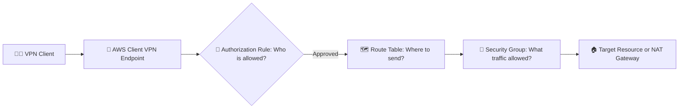
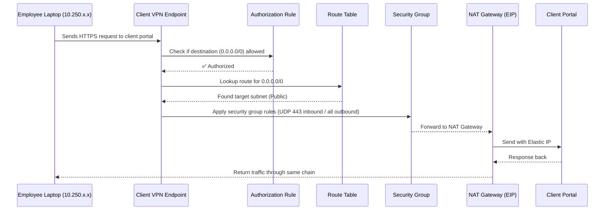

---
tags:
  - aws
  - aws/service
  - aws/domain/networking
  - aws/topic/vpc
  - aws/topic/client-to-site-vpn
aliases:
  - "Understanding Authorization Rules Route Tables and Security Groups in AWS Client VPN"
  - "Client Vpn Authz"
---

# 🧭 Understanding Authorization Rules, Route Tables, and Security Groups in AWS Client VPN

> These three — **Authorization Rules**, **Route Tables**, and **Security Groups** —
> are the “triple lock” 🔒 of AWS Client VPN.
> They control **who** can access, **where** they can go, and **what** type of traffic can pass through.

When you build a Client VPN Endpoint, AWS doesn’t just rely on the connection itself —
it enforces multiple layers of access control and routing logic so your users don’t accidentally get full VPC or Internet access.

---

## 🌐 Big Picture Overview

<div align="center" style="background-color: #141a19ff;color: #a8a5a5ff; border-radius: 10px; border: 2px solid">



</div>

👉 Conceptual flow (human logic order):

1. **Authorization Rule:** Who is allowed to access which network?
2. **Route Table:** Where should AWS send the traffic?
3. **Security Group:** What kind of traffic is allowed through?

---

## 📜 **1. Authorization Rules** — The “Who Can Access What” Layer

Authorization rules decide which **users** or **groups** can access specific **destination networks (CIDRs)** in your VPC.

Think of this as the **bouncer at the VPN door**:

> “Hey, this user wants to enter the 10.0.0.0/16 network — should I let them in?”

If the user isn’t authorized for that CIDR, the traffic is dropped **before** it even touches your VPC.

---

### 🗝️ Key Concepts

<div align="center" style="background-color: #141a19ff;color: #a8a5a5ff; border-radius: 10px; border: 2px solid">

| Term                         | Description                                                                                           |
| ---------------------------- | ----------------------------------------------------------------------------------------------------- |
| **Destination Network CIDR** | The subnet or range of IPs the client wants to reach (e.g., 10.0.0.0/16 or 0.0.0.0/0).                |
| **Access Group / All Users** | You can restrict rules by Active Directory or mutual TLS client certificate (depending on auth type). |
| **Effect**                   | “Allow” – the only option in AWS Client VPN authorization rules.                                      |
| **Evaluation Point**         | Happens at the Client VPN service level _before_ traffic hits the VPC ENI.                            |

</div>

---

### ⚙️ Example Rules

<div align="center" style="background-color: #141a19ff;color: #a8a5a5ff; border-radius: 10px; border: 2px solid">

| Destination Network | Access    | Description                                                       |
| ------------------- | --------- | ----------------------------------------------------------------- |
| `10.0.0.0/16`       | All Users | Allow access to all internal VPC subnets                          |
| `10.0.1.0/24`       | Dev Group | Restrict access to only the Dev subnet                            |
| `0.0.0.0/0`         | All Users | Allow access to all networks (including Internet via NAT Gateway) |

</div>

---

### 🚦 Important Notes

1. **Mandatory Rule:** Without an authorization rule, traffic is silently dropped.
   Even if the route table is correct and the SG is open, nothing passes.
2. **CIDR Matching:** The destination CIDR in the rule must match the CIDR in your route table.
3. **Least Privilege:** Use narrow CIDRs (e.g., `/24`) if you want granular network segmentation.
4. **`0.0.0.0/0` Rule:** Grants access to all networks. Usually used for Internet access via NAT Gateway.

   - Combine it with careful security group controls or network ACLs.

---

### 🧠 Real-World Example

> You want your employees (all users) to access your internal private subnet (`10.0.0.0/16`) and also browse the Internet through the VPN’s Elastic IP.

Then you’ll create:

- **Rule 1:** Allow `10.0.0.0/16` to All Users
- **Rule 2:** Allow `0.0.0.0/0` to All Users

---

## 🗺️ **2. Route Tables** — The “Where to Send Traffic” Layer

Once the VPN connection is authorized, AWS needs to know **where** to deliver the packets.

This is the **GPS** 🗺️ of your Client VPN — it maps destination networks to **target subnets** (inside your VPC).

---

### 🗝️ Key Concepts

<div align="center" style="background-color: #141a19ff;color: #a8a5a5ff; border-radius: 10px; border: 2px solid">

| Term                 | Description                                                                                    |
| -------------------- | ---------------------------------------------------------------------------------------------- |
| **Destination CIDR** | The IP range that the route applies to (same as used in authorization rules).                  |
| **Target Subnet**    | The VPC subnet associated with your Client VPN endpoint. Traffic to this CIDR is routed there. |
| **Direction**        | Always outbound from the VPN client toward your VPC resources or Internet.                     |
| **Association**      | You must associate at least one VPC subnet (one per AZ) with your Client VPN endpoint.         |

</div>

---

### ⚙️ Example Route Table Entries

<div align="center" style="background-color: #141a19ff;color: #a8a5a5ff; border-radius: 10px; border: 2px solid">

| Destination CIDR  | Target Subnet     | Description                           |
| ----------------- | ----------------- | ------------------------------------- |
| `10.0.0.0/16`     | Private Subnet    | Internal AWS resources                |
| `0.0.0.0/0`       | Public Subnet     | Send Internet traffic via NAT Gateway |
| `192.168.10.0/24` | Peered VPC Subnet | Allow access to another VPC           |

</div>

---

### 🔄 How It Works

When a VPN user sends traffic:

1. The **Authorization Rule** confirms if access is allowed.
2. The **Route Table** checks for a matching destination CIDR.
3. The **Target Subnet** handles the packet.

If there’s **no route** for a CIDR, traffic is dropped, even if the user is authorized.

---

### 🧠 Example: Internet Access Route

| Destination | Target        | Behavior                                           |
| ----------- | ------------- | -------------------------------------------------- |
| `0.0.0.0/0` | Public Subnet | All non-VPC traffic goes out via NAT Gateway → EIP |

💡 Combine with a `0.0.0.0/0` **Authorization Rule** to enable full Internet access through your AWS EIP.

---

## 🔐 **3. Security Groups** — The “What Traffic Is Allowed” Layer

Finally, after traffic reaches your **Client VPN Endpoint ENI**, the **Security Group (SG)** acts as the **firewall** 🔒 —
deciding which types of packets (ports/protocols) can pass.

---

### 🗝️ Key Concepts

<div align="center" style="background-color: #141a19ff;color: #a8a5a5ff; border-radius: 10px; border: 2px solid">

| Term                | Description                                                                          |
| ------------------- | ------------------------------------------------------------------------------------ |
| **Associated With** | The ENI (elastic network interface) of the Client VPN endpoint.                      |
| **Inbound Rules**   | Control what traffic can enter the VPN endpoint.                                     |
| **Outbound Rules**  | Control what traffic can exit the VPN endpoint toward the target subnet or Internet. |
| **Granularity**     | Works at port/protocol level (e.g., TCP 443, UDP 53).                                |

</div>

---

### ⚙️ Example Security Group Rules

<div align="center" style="background-color: #141a19ff;color: #a8a5a5ff; border-radius: 10px; border: 2px solid">

| Direction    | Protocol | Port | Source / Destination | Description                              |
| ------------ | -------- | ---- | -------------------- | ---------------------------------------- |
| **Inbound**  | UDP      | 443  | 0.0.0.0/0            | Allow VPN tunnel connections             |
| **Inbound**  | All      | All  | `10.250.0.0/22`      | Allow traffic from connected VPN clients |
| **Outbound** | All      | All  | 0.0.0.0/0            | Allow outgoing traffic everywhere        |

</div>

---

> 💡 The SG applies **after authorization and routing**, but it can still block traffic if ports or protocols are restricted.

---

### 🧠 Example: Adding Internal EC2 Access

If you have EC2 instances inside the VPC that VPN clients need to reach:

- Their **EC2 Security Group** must allow inbound traffic **from the Client VPN CIDR** (e.g., `10.250.0.0/22`).
- The VPN **ENI Security Group** must allow that same traffic **outbound**.

```plaintext
Client (10.250.x.x) → VPN ENI → EC2 (10.0.x.x)
```

If either SG blocks the packet, access fails.

---

## 🧩 Comparing the Three Layers

<div align="center" style="background-color: #141a19ff;color: #a8a5a5ff; border-radius: 10px; border: 2px solid">

| Layer                  | Type     | Controls                                        | Example                           | Enforced By        |
| ---------------------- | -------- | ----------------------------------------------- | --------------------------------- | ------------------ |
| **Authorization Rule** | Logical  | Who can access which network (CIDR)             | Allow `0.0.0.0/0` to All Users    | Client VPN Service |
| **Route Table**        | Network  | Where to forward traffic (target subnet)        | Route `0.0.0.0/0` → Public Subnet | VPN Endpoint       |
| **Security Group**     | Firewall | What type of traffic is allowed (port/protocol) | Allow TCP 443, UDP 53             | ENI (VPC Layer)    |

</div>

---

## 🧠 Example: End-to-End Packet Flow

<div align="center" style="background-color: #141a19ff;color: #a8a5a5ff; border-radius: 10px; border: 2px solid">



</div>

---

## ⚖️ 0.0.0.0/0 — Common Source of Confusion

Let’s clarify this once and for all 👇

<div align="center" style="background-color: #141a19ff;color: #a8a5a5ff; border-radius: 10px; border: 2px solid">

| Where It Appears          | Meaning                                                      |
| ------------------------- | ------------------------------------------------------------ |
| **In Route Table**        | “Send all non-local traffic to this subnet” (pathing logic). |
| **In Authorization Rule** | “Allow users to access any destination” (permission logic).  |
| **In Security Group**     | “Allow traffic from or to anywhere” (firewall logic).        |

</div>

💡 They look the same (`0.0.0.0/0`) but serve **completely different purposes**:

- Route Table: _destination-based routing_
- Auth Rule: _access-based permission_
- SG: _port-based filtering_

---

## 🧠 Putting It All Together — Real-World Use Case

### Scenario

You want employees working from home to access:

1. Internal company systems in `10.0.0.0/16`
2. External Internet sites (client portal) via NAT Gateway (EIP)

### Configuration Summary

<div align="center" style="background-color: #141a19ff;color: #a8a5a5ff; border-radius: 10px; border: 2px solid">

| Layer                        | Example Configuration                                             |
| ---------------------------- | ----------------------------------------------------------------- |
| **Authorization Rules**      | `10.0.0.0/16` (internal access) and `0.0.0.0/0` (Internet access) |
| **Route Table**              | `10.0.0.0/16` → Private Subnet, `0.0.0.0/0` → Public Subnet (NAT) |
| **Security Group (VPN ENI)** | Allow UDP 443 from Internet, allow all from VPN CIDR outbound     |
| **EC2 SG (optional)**        | Allow inbound from `10.250.0.0/22`                                |

</div>

---

Result:

> Employees connect to VPN →  
> Authorization rules confirm access →  
> Route table directs traffic →  
> Security groups enforce allowed ports →  
> NAT Gateway sends Internet traffic through your EIP.  
> ✅ Client sees requests only from your whitelisted IP.

---

## 🧾 TL;DR Summary Table

<div align="center" style="background-color: #141a19ff;color: #a8a5a5ff; border-radius: 10px; border: 2px solid">

| Layer                  | What It Controls | Example                               | Analogy                            |
| ---------------------- | ---------------- | ------------------------------------- | ---------------------------------- |
| **Authorization Rule** | Who can go       | Allow all users to access 10.0.0.0/16 | “Do you have permission?”          |
| **Route Table**        | Where to go      | Route 0.0.0.0/0 → Public Subnet       | “Which road should I take?”        |
| **Security Group**     | What can go      | Allow TCP 443 from VPN CIDR           | “Is this kind of traffic allowed?” |

</div>

---

🧩 Together they form:

> **Who → Where → What** > **Authorization → Route → Security**

---

## 🧠 Troubleshooting Tips

<div align="center" style="background-color: #141a19ff;color: #a8a5a5ff; border-radius: 10px; border: 2px solid">

| Symptom                                      | Possible Cause                               | Fix                                     |
| -------------------------------------------- | -------------------------------------------- | --------------------------------------- |
| Client connects but can’t reach internal EC2 | Missing authorization rule for `10.0.0.0/16` | Add rule for internal network           |
| Client connects but can’t reach Internet     | Missing route or NAT gateway                 | Add `0.0.0.0/0` route and authorization |
| Connection times out                         | SG not allowing UDP 443                      | Fix VPN ENI security group              |
| Access denied to EC2                         | EC2 SG not allowing VPN CIDR                 | Add `10.250.0.0/22` inbound rule        |

</div>

---

## 🏁 Final Thought

> In AWS Client VPN, **connection ≠ access**.  
> You can connect all day, but until these three layers align —  
> Authorization Rules (who), Route Tables (where), and Security Groups (what) —  
> nothing meaningful happens.

When you understand these three gates, you can design a **secure, intelligent, least-privilege VPN** that behaves exactly how your business needs — whether you’re connecting remote developers, third-party auditors, or full employee fleets.
---

## Related Notes
- [[aws-services/3.network/1.vpc/5.2.client-to-site-vpn/2.2.hands-on-saml|Hands-on federation setup between AWS Client VPN and Microsoft Entra ID Azure AD using SAML 2.0 authentication.]] - previous lesson
- [[aws-services/3.network/1.vpc/5.2.client-to-site-vpn/x|Point-to-site VPN]] - next lesson
- [[aws-services/3.network/1.vpc/5.2.client-to-site-vpn/1.aws-client-vpn|AWS Client VPN]] - mentions AWS Client VPN
- [[aws-services/3.network/1.vpc/1.fundmentals/2.1.nat-gateway|NAT Gateway]] - mentions Nat Gateway

---
