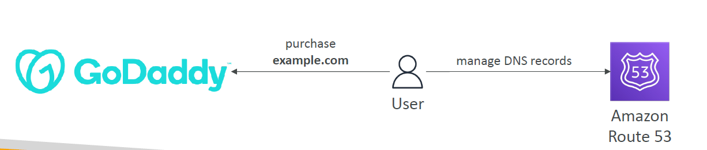
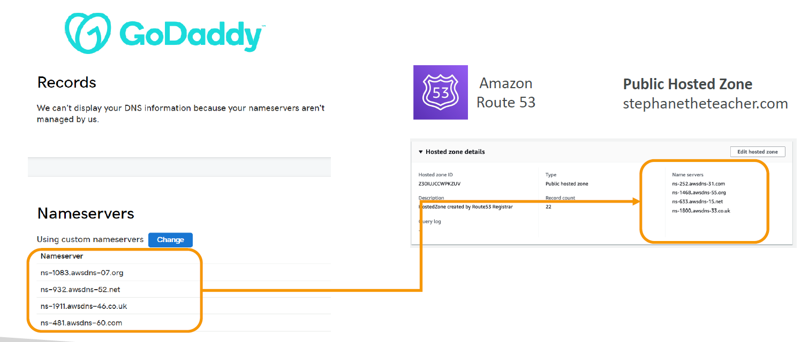

# 🌐 **Domain Registrar vs DNS Service**

When you work with domains like `mywebsite.com`, there are **two separate roles** involved:

---

## 🏷️ **1. Domain Registrar**

> ✅ A **Registrar** is where you **buy or register** your domain name.

- You pay an **annual fee** to own the domain
- Examples: **GoDaddy**, **Namecheap**, **Google Domains**, **Amazon Registrar**

🛒 Think of it like **buying a domain name** and putting it under your control.

---

## 🧭 **2. DNS Service Provider**

> ✅ A **DNS service** manages **how your domain name points to real servers** (via A records, CNAMEs, MX, etc.)

- Translates your domain name → IP addresses
- Handles DNS records like:

  - `A`, `CNAME`, `MX`, `TXT`, `NS`, etc.

- Examples: **Route 53**, **Cloudflare**, **GoDaddy DNS**, **Azure DNS**

🧠 Think of it like **configuring how traffic flows to your website or app**.

---

## 🔀 **Can You Mix Registrar and DNS Service?**

✅ YES!

- You **can buy** a domain from **GoDaddy**
- And **use Amazon Route 53** to manage its DNS records

> 🔄 These are two different roles — they don't have to be from the same company.

---

## 📦 **Example Setup: GoDaddy + Amazon Route 53**

You **buy a domain** from GoDaddy (Registrar), but you want to use **Route 53** for all DNS routing.

---

<div style="text-align: center;">
    
</div>

---

<div style="text-align: center;">
    
</div>

---

### 🪜 Steps to Set It Up

### 🔹 Step 1: Create a Hosted Zone in Route 53

- Go to **Route 53 → Hosted Zones**
- Click **“Create Hosted Zone”**
- Enter your domain name (`mywebsite.com`)
- AWS will generate **4 NS (Name Server)** records

---

### 🔹 Step 2: Update NS Records in GoDaddy

- Go to your **GoDaddy Domain Settings**
- Find **“Nameservers”**
- Choose **“Custom Nameservers”**
- Paste the **4 NS values** from Route 53

📌 These look like:

```ini
ns-2048.awsdns-64.com
ns-2049.awsdns-65.net
ns-2050.awsdns-66.org
ns-2051.awsdns-67.co.uk
```

---

### 🔹 Step 3: Done! 🎉

Now **GoDaddy still owns your domain**, but **DNS resolution is handled by Route 53**.

You can now:

- Add `A` record for `www.mywebsite.com` → your server’s IP
- Add `MX` records for email
- Add `TXT` records for verification (e.g., with Google or AWS)

---

## 📌 Summary Table

| Role                 | What It Does                               | Examples                          |
| -------------------- | ------------------------------------------ | --------------------------------- |
| **Domain Registrar** | Sells and registers domain names           | GoDaddy, Namecheap, Google        |
| **DNS Service**      | Controls how domain resolves (DNS records) | Route 53, Cloudflare, GoDaddy DNS |
