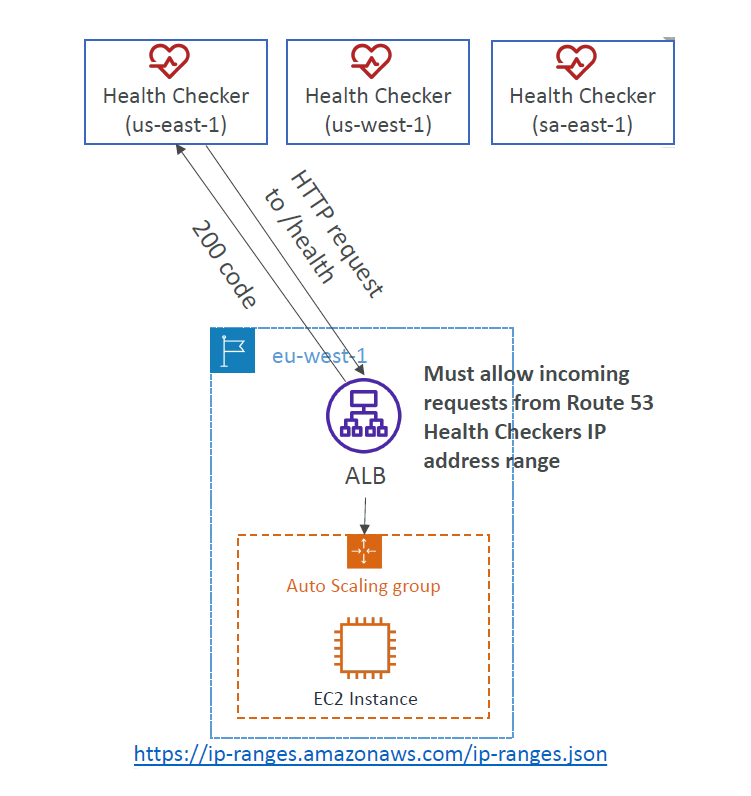
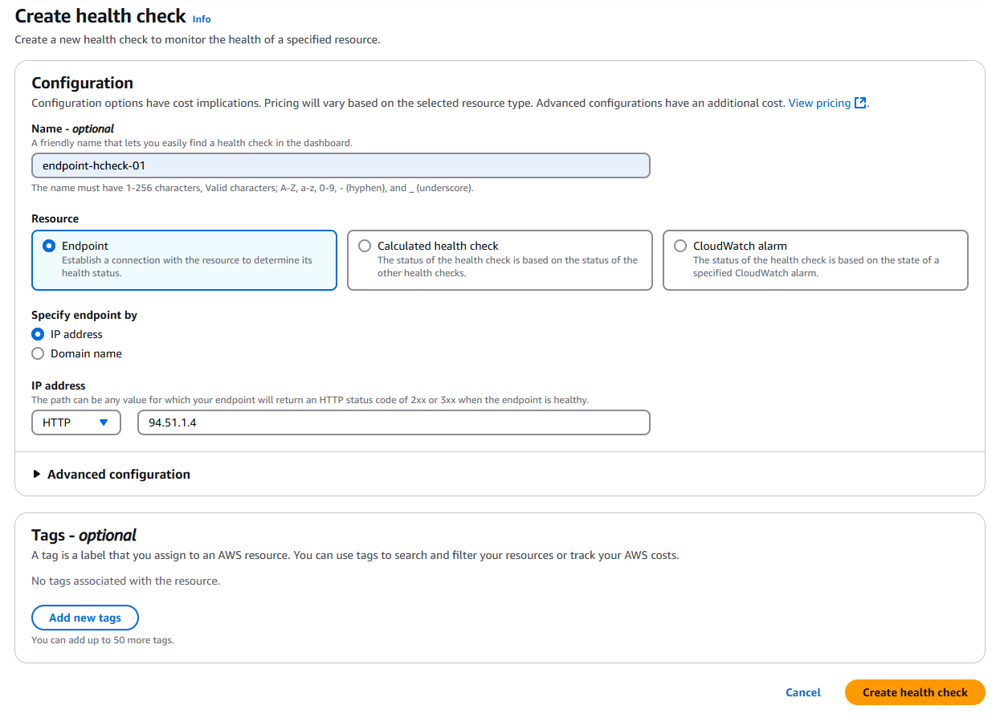
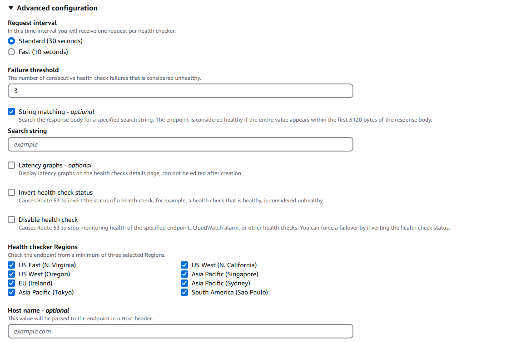
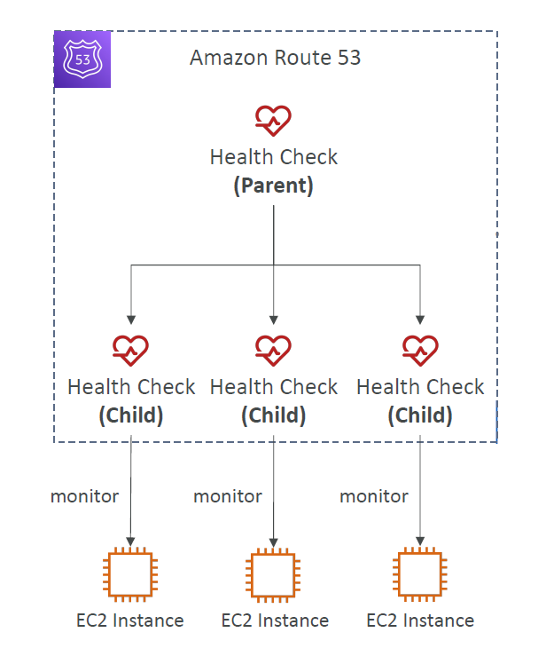
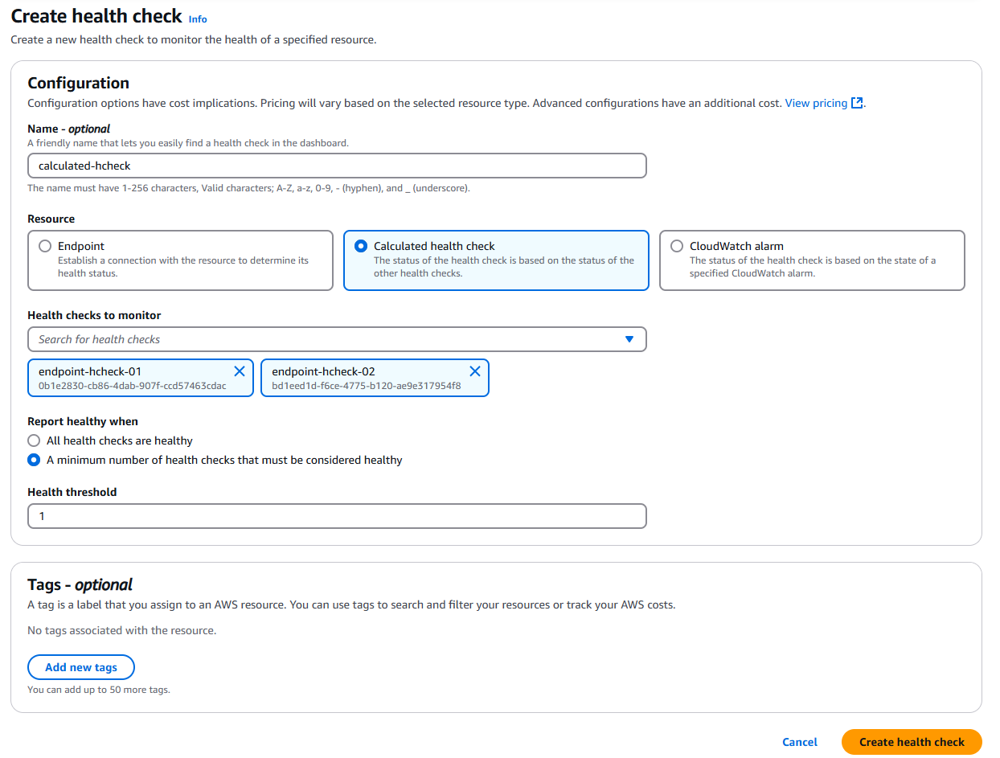
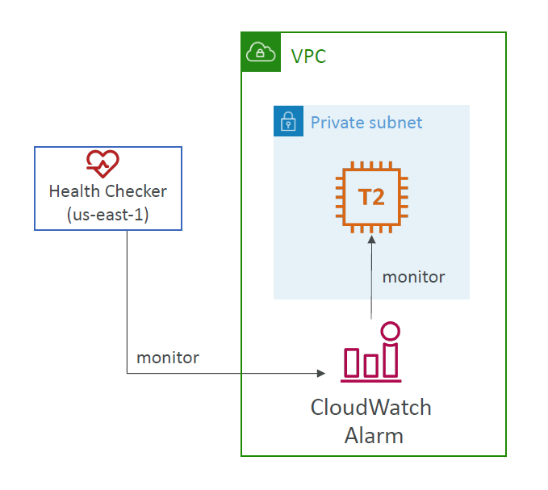
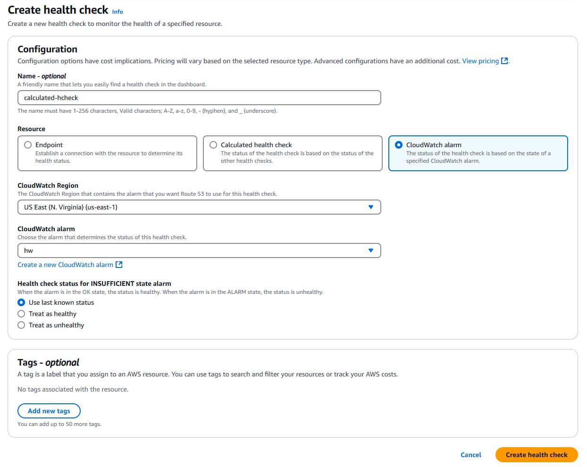

# 🩺 **Route 53 Health Check Types**

Amazon Route 53 offers **three health check types** — each for different use cases.

> 🧠 All of them help Route 53 **automatically detect issues and reroute traffic**.

---

## 🧭 **1. Endpoint Health Check**

> 🔍 Route 53 probes a public IP or domain to check if it’s healthy (web server, API, etc.)

---

<div style="text-align: center;">
    
</div>

---

### ✅ When to Use

- Monitor public services (like a website or API)
- Use HTTP, HTTPS, or TCP to test availability
- Detect issues and trigger **DNS failover**

---

### 🔐 Requirements

- Endpoint **must be publicly accessible**
- You must allow [Route 53 health checker IPs](https://docs.aws.amazon.com/general/latest/gr/route53.html#route53-ip-ranges)

---

### ⚙️ Key Settings

<div align="center">

| Setting                                     | Explanation                                                          |
| ------------------------------------------- | -------------------------------------------------------------------- |
| **Protocol**                                | HTTP / HTTPS / TCP                                                   |
| **Endpoint**                                | IP address or domain name                                            |
| **Response status expected**                | HTTP 2xx or 3xx for HTTP/HTTPS                                       |
| **Request Interval**                        | 30s (Standard) or 10s (Fast – higher cost)                           |
| **Failure Threshold**                       | # of failed attempts before marking unhealthy (default: 3)           |
| **Text Match** _(optional)_                 | Searches for a specific string in response (within first 5120 bytes) |
| **Health Checker Regions**                  | Choose which AWS regions send requests (minimum 3 required)          |
| **Host Header** _(optional)_                | Send a custom Host header if needed by the endpoint                  |
| **Latency Graphs** _(optional)_             | Shows response time in the Route 53 console (can’t change later)     |
| **Invert Health Check Status** _(optional)_ | Flips healthy ↔️ unhealthy (used to simulate failover)               |
| **Disable Health Check** _(optional)_       | Temporarily pauses this check (useful during testing/maintenance)    |

</div>

---

<div style="display: flex; gap: 10px;">

<div style="text-align: left;">
    
</div>

<div style="text-align: left;">
    
</div>

</div>

---

## 📊 **2. CloudWatch Alarm Health Check**

> 📡 Route 53 checks the status of a **CloudWatch Alarm**, not a network service.

---

<div style="text-align: center;">
    
</div>

---

### ✅ When to Use

- Monitor **private/internal** resources (in VPC or on-prem)
- Define your own **custom health logic** using metrics (CPU, memory, DB load)
- Works without exposing the resource to the internet

---

### ⚙️ Key Settings

<div align="center">

| Setting                      | Explanation                                                       |
| ---------------------------- | ----------------------------------------------------------------- |
| CloudWatch Region            | Where your CloudWatch Alarm exists                                |
| CloudWatch Alarm             | Select an existing alarm or create a new one                      |
| `INSUFFICIENT_DATA` Behavior | Choose to treat as: `healthy`, `unhealthy`, or `last known state` |

</div>

---

<div style="text-align: center;">
    
</div>

---

### 🔁 Alarm State Mapping

| Alarm State         | Health Status     |
| ------------------- | ----------------- |
| `OK`                | ✅ Healthy        |
| `ALARM`             | ❌ Unhealthy      |
| `INSUFFICIENT_DATA` | Depends on config |

---

## 🧮 **3. Calculated Health Check**

> 🧠 Combines multiple other health checks using **Boolean logic**.

---

<div style="text-align: center;">
    
</div>

---

### ✅ When to Use

- Combine endpoint checks logically (AND / OR)
- Route traffic only if **X out of Y** services are healthy
- Ignore temporary issues with one service

---

### ⚙️ Key Settings

<div align="center">

| Setting             | Explanation                                               |
| ------------------- | --------------------------------------------------------- |
| Child Health Checks | Add up to 256 existing health checks                      |
| Logic               | Choose between “All must pass” or set a minimum threshold |
| Health Threshold    | Minimum # of checks that must pass (if not using “All”)   |

</div>

---

<div style="text-align: center;">
    
</div>

---

### 📌 Example Use Case

```text
Route 53 will only consider the system healthy if:
(endpoint-hcheck-01 ✅) AND (endpoint-hcheck-02 ✅)
```

---

## 🔁 **Summary Table**

| Health Check Type | Probes Target | Works with Private Resources | Logic Support | Metric-Based |
| ----------------- | ------------- | ---------------------------- | ------------- | ------------ |
| Endpoint          | ✅ Yes        | ❌ No                        | ❌ No         | ❌ No        |
| CloudWatch Alarm  | ❌ No         | ✅ Yes                       | ❌ No         | ✅ Yes       |
| Calculated        | ❌ No         | ❌ No                        | ✅ Yes        | ❌ No        |

---

## ✅ **Quick When-to-Use Guide**

| Scenario                                     | Use This Type           |
| -------------------------------------------- | ----------------------- |
| Monitor a public website                     | Endpoint Health Check   |
| Monitor CPU usage or app readiness (private) | CloudWatch Alarm Check  |
| Combine multiple service checks              | Calculated Health Check |
