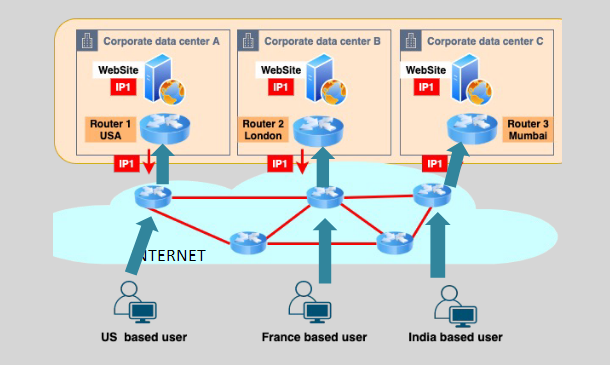
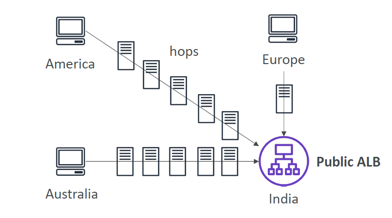
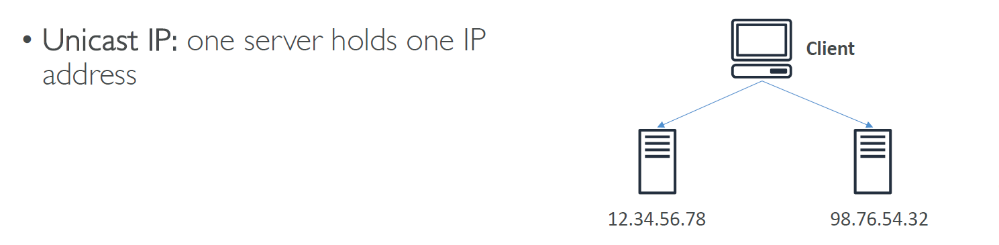
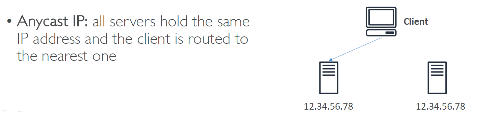
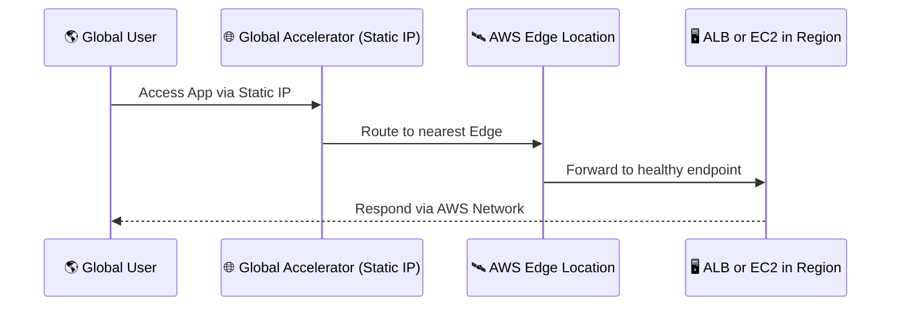

---
tags:
  - aws
  - aws/service
  - aws/domain/networking
  - aws/topic/global-accelerator
aliases:
  - "AWS Global Accelerator Lightning-Fast Global Access for Any App"
  - "Global Accelerator Simplify"
---

# 🌍 **AWS Global Accelerator – Lightning-Fast Global Access for Any App**

> _Speed up your global app by routing traffic through AWS’s private network instead of the slow public internet._

---

    

---

## 🚀 What Is AWS Global Accelerator?

**AWS Global Accelerator** is a **network traffic accelerator** that uses AWS’s **global infrastructure** to improve **latency, availability, and failover** for your apps — regardless of where users are on the planet.

✅ You get **2 static Anycast IPs** that direct traffic to the **closest healthy AWS region** running your application.

---

## 🧠 Why Global Accelerator?

    

---

Without it:

- Global users connect over the **public internet**
- Many **slow, unpredictable hops**
- Higher **latency and failure risk**

With it:

- Users connect to the **nearest AWS edge location**
- Routed through the **AWS global backbone**
- **Fewer hops**, faster response, and built-in **failover**

---

## 🆚 Anycast vs. Unicast IPs

  

---

  

---

## 🧱 Core Components

### 1️⃣ **Anycast IPs**

- You get **2 static IPs** (IPv4) or 4 for dual-stack (IPv4+IPv6)
- Clients connect via these fixed IPs (can whitelist them!)
- **No DNS caching issues**, since IPs never change

### 2️⃣ **AWS Edge Locations**

- Over 100 edge locations worldwide
- Serve as **entry points to the AWS network**
- Traffic is routed from edge to app **inside AWS**

### 3️⃣ **Global Health Checks**

- Global Accelerator checks each endpoint's health
- If a region fails, traffic is **instantly rerouted (< 60 sec)**

---

## 🛠️ Supported Origin Types

Global Accelerator supports both **public** and **private** resources:

| ✅ Resource Type     | Examples                       |
| -------------------- | ------------------------------ |
| **ALB / NLB**        | For web apps or load balancers |
| **EC2 Instance**     | Direct compute instance access |
| **Elastic IP (EIP)** | IP-attached workloads          |

---

## 🔄 How It Works (Flow)

```mermaid
sequenceDiagram
    participant User as 🌎 Global User
    participant GA as 🌐 Global Accelerator (Static IP)
    participant Edge as 🛰️ AWS Edge Location
    participant App as 🖥️ ALB or EC2 in Region

    User->>GA: Access App via Static IP
    GA->>Edge: Route to nearest Edge
    Edge->>App: Forward to healthy endpoint
    App-->>User: Respond via AWS Network
```

---

## 🎯 Real Benefits

| 🔍 Feature                  | ✅ Value                                                 |
| --------------------------- | -------------------------------------------------------- |
| 🧭 **Intelligent Routing**  | Routes to lowest latency & healthy region                |
| 🌍 **Static IPs**           | Easy whitelisting in firewalls, partners, security tools |
| ⚡ **Faster Global Access** | Uses **AWS private backbone**, not internet              |
| 💥 **DDoS Protection**      | Built-in via AWS Shield Standard                         |
| 🛠 **Failover Recovery**     | Switches to healthy region in **< 1 minute**             |
| 🎮 **UDP + TCP Support**    | Unlike CloudFront, supports gaming, VoIP, DNS            |
| 🔐 **Client IP Preserved**  | Great for logging, firewalls, and Geo-IP decisions       |
| 🧾 **Custom DNS Support**   | Use with your own DNS — just point to static IPs         |

---

## 🌐 Use Cases

| Use Case                      | Why Global Accelerator Works Best       |
| ----------------------------- | --------------------------------------- |
| 💳 IP Whitelisting for APIs   | Only 2 fixed IPs need to be allowed     |
| 🗺️ Multi-region deployments   | Auto-failover and geo-optimized routing |
| 🎮 UDP traffic apps           | Works with UDP unlike CloudFront        |
| 🎥 Live video ingest          | Low latency video streaming support     |
| 🛡️ Security-compliant systems | Static IPs + DDoS + health failover     |

---

## ⚔️ Global Accelerator vs CloudFront

| Feature                | **Global Accelerator**        | **Amazon CloudFront**             |
| ---------------------- | ----------------------------- | --------------------------------- |
| **Type**               | Network layer accelerator     | CDN for content delivery          |
| **Traffic Type**       | TCP + UDP                     | HTTP/HTTPS only                   |
| **Caching**            | ❌ No                         | ✅ Yes                            |
| **Fixed IPs**          | ✅ Static Anycast IPs         | ❌ DNS-based dynamic IPs          |
| **Preserve Client IP** | ✅ Yes                        | ❌ (unless forwarded via headers) |
| **Use Case**           | Gaming, APIs, region failover | Websites, images, streaming       |

---

## 🛠️ Quick Setup (Console)

1. **Open AWS Global Accelerator Console**
2. Click **Create Accelerator**
3. Define:

   - Accelerator name
   - IPv4 / dual-stack
   - Listener port + protocol (TCP/UDP)

4. Create **endpoint group** (region)
5. Add **endpoint** (ALB, EC2, etc.)
6. Enable **health checks**
7. Done! 🎉 Two static IPs are generated.

---

## 💡 Tips for the Exam

| 🔥 Concept                   | 📌 Note                                           |
| ---------------------------- | ------------------------------------------------- |
| Anycast IPs                  | Global IPs routed to nearest edge                 |
| BYOIP                        | You can bring your own static IP                  |
| Health Checks                | Enabled by default for regional failover          |
| Works with private resources | ✅ ALB/EC2 in **private subnet** (not exposed)    |
| vs CloudFront                | CloudFront = CDN; GA = full network accelerator   |
| Use with UDP                 | Yes (CloudFront only supports HTTP/HTTPS)         |
| Static IP whitelisting       | Simplifies access from external firewalls/devices |

---

## ✅ Summary

| 🔍 Topic             | ✅ Summary                                       |
| -------------------- | ------------------------------------------------ |
| Static IPs (Anycast) | Always the same, route to closest edge           |
| Intelligent Routing  | Based on latency + health                        |
| Private App Access   | Serve even from private ALB/EC2/NLB              |
| Failover Support     | Under 1 min reroute to healthy region            |
| Best Use Cases       | Gaming, real-time apps, API access, multi-region |
---

## Related Notes
- [[aws-services/3.network/2.2.global-accelerator/1.2.global-accelerator|AWS Global Accelerator Enhancing Application Availability and Performance]] - next lesson

---
