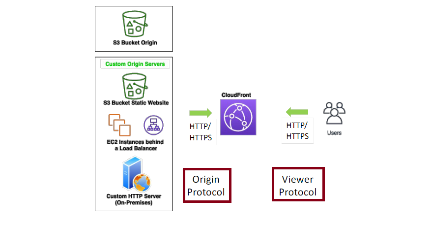

# **🌐 CloudFront - Origin Server and TTL**

CloudFront is optimized for both **static** and **dynamic** content, making it a versatile solution for a wide range of use cases.

## **🎭 Supported Content Types:**

- **Static Content**: Files like `.html`, `.js`, `.css`, images, and other resources that don’t change frequently.
- **Dynamic Content**: Content that changes frequently based on user interactions, such as personalized pages, API responses, and real-time data.
- **Video Streaming**: Both **Live Streaming** and **Video on Demand (VoD)**.
- **APIs**: CloudFront can accelerate API responses, making it ideal for API gateways and microservices.

## **💖 Key Benefits:**

- CloudFront **integrates** with AWS services like **WAF** (Web Application Firewall) and **AWS Shield** to enhance security.
- Delivering content via CloudFront is generally more **cost-effective** than serving it directly from **S3** or **EC2**.

## **⚠️ Dynamic Traffic Considerations:**

For dynamic content, CloudFront doesn't always provide the same caching benefits, but it still offers **advanced security** features such as encryption and DDoS protection for sensitive and frequently changing content.

## **🖥️ Origin Server**

The **Origin Server** is the source of content that CloudFront distributes to its edge locations around the globe.

---

  

---

### **📌 Origin Server Overview:**

- An **origin server** is the actual location where CloudFront fetches the content from when a request is made.
- CloudFront supports up to **25 origins** per distribution (soft limit), allowing for flexible content management and distribution.

### **🎭 Types of Origins:**

CloudFront can pull content from a variety of origin sources, including:

- `S3 bucket`
  - For distributing files and caching them at the edge
  - For uploading files to S3 through CloudFront
  - Secured using Origin Access Control (OAC)
- `VPC Origin`
  - **For applications hosted in VPC private subnets**
  - **Application Load Balancer** / **Network Load Balancer** / **EC2 Instances**
- `Custom Origin (HTTP)`

  - **S3 website** (must first enable the bucket as a static S3 website)
  - **Any public HTTP** backend you want

You can configure **path patterns** in CloudFront to route requests to the correct origin. For example, requests for images might go to an S3 bucket, while API requests go to an EC2 instance.

### **🛜 Protocol Support:**

- CloudFront supports **HTTP** and **HTTPS** for communication with both the **viewers** (end users) and **origins** (where the content resides).

---

## **⏳ Time to Live (TTL)**

**Time to Live (TTL)** defines how long CloudFront will cache an object before checking with the origin server to see if the object has been updated. It helps manage cache behavior for different types of content.

### **🤔 TTL Behavior:**

- **Default TTL**: The default TTL is set to **one day** (86400 seconds), meaning CloudFront will cache content for 24 hours.

  

- **TTL = 0**: When set to 0, CloudFront caches the content but checks with the origin server for updates with every new request. This is useful for **dynamic content** that changes frequently but still needs some caching.

  

### **💡 Adjusting TTL:**

- **Lower TTL**: Lowering the TTL is ideal for dynamic content where frequent updates are required. However, this increases the load on your origin server as CloudFront has to verify content on every request.
- **Higher TTL**: For static content (e.g., images, videos), a higher TTL reduces load on the origin server and improves performance.

## **😐 What Happens When TTL = 0?**

With **TTL=0**, CloudFront does **cache** the content, **but checks with the origin** on every request to see if there's an update. Instead of blindly fetching new data each time, CloudFront asks,  
_"Hey, has this content changed?"_ 👀

- **If no change** → ✅ It serves the **cached version**, saving bandwidth.
- **If changed** → 🔄 It fetches the **latest version**, keeping it fresh.

### **🤔 Why Is This Useful?**

Even though CloudFront checks the origin, **it doesn’t always download the full data**—it only does so when necessary. This can be valuable for:

- **📊 Stock Market Data** → Prices change often, but not _every second_. CloudFront keeps copies while ensuring users get the latest data.
- **👤 User Dashboards** → Profile updates may not happen instantly, so CloudFront serves cached content while checking for changes.
- **📰 Breaking News** → Headlines stay for minutes or hours. CloudFront avoids redundant fetches while ensuring fresh updates.

### **😵‍💫 When TTL=0 is NOT Useful**

- ⚠️ If the data **truly changes every request** (e.g., real-time chat, gaming stats), TTL=0 **won’t help much**—you might end up with **higher costs** and **latency** instead of speed gains.
- 👉 In those cases, you can **bypass caching** or tweak settings like short TTLs.

## **✅ Key Takeaways**

- **CloudFront** is ideal for delivering both **static** and **dynamic** content globally.
- **Origin Servers** are flexible and can include S3, EC2, ALBs, and other HTTP servers.
- **TTL settings** control how long CloudFront caches objects and when it checks for updates from the origin.
- Custom **domains** can be mapped to CloudFront distributions for a branded experience.
