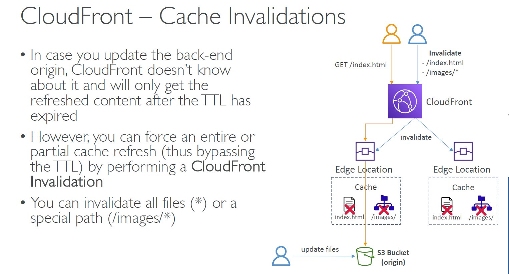

---
tags:
  - aws
  - aws/service
  - aws/domain/networking
  - aws/topic/cloud-front
aliases:
  - "CloudFront Object/File Invalidation"
  - "Object Invalidation"
---

# **🗑️ CloudFront Object/File Invalidation**

**Object/File Invalidation** in CloudFront is the process of removing content from CloudFront's edge locations before it reaches its expiration time. This ensures that outdated or modified files are no longer cached and are replaced with the latest version from the origin server.

<div align="center" style="background-color: #ffff;border-radius: 10px;">
    
</div>

---

## **⚙️ How It Works**

- **Invalidating Objects**: You can specify which objects to invalidate using their path or file name. Wildcards can also be used to invalidate multiple files at once.
- Example command for invalidation:

  ```bash
  aws cloudfront create-invalidation --distribution-id distribution_ID --paths "/*"
  ```

## 💭 **Examples**

- **Specific File**: `/images/beach.jpg`
- **Wildcard Pattern**: `/images/beac*`, `/images/*`

## **💰 Cost & Alternatives**

- **Charges**: Invalidation requests are **free** for the first 1,000 per month. After that, they are chargeable.
- **🤔 Alternative Approach**: Instead of invalidation, you can allow objects to expire naturally and rely on **object versioning**.
  - This method is **cheaper**.
  - It enables **version control**, allowing you to serve different versions of the same file without invalidating.
  - Allows for **easy rollback** if needed.

---

> Using **Object/File Invalidation** helps you ensure that CloudFront always serves up-to-date content, but it's essential to weigh the cost implications and consider versioning for cost-effective management.
---

## Related Notes
- [[aws-services/3.network/3.cloud-front/3.2.cdn-all-distribution-options|CDN Settings]] - previous lesson
- [[aws-services/3.network/3.cloud-front/3.4.cdn-field-level-encryption|Amazon CloudFront Field-Level Encryption FLE]] - next lesson

---
