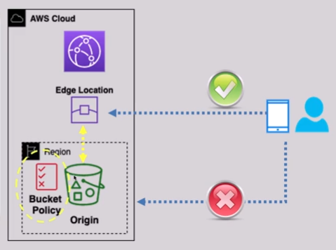
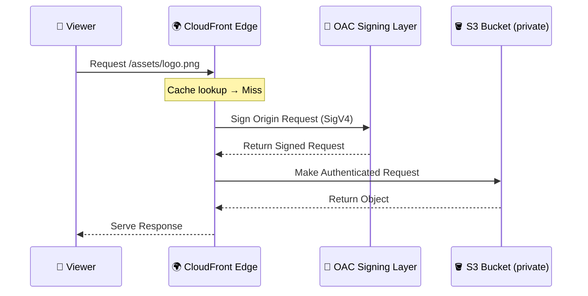
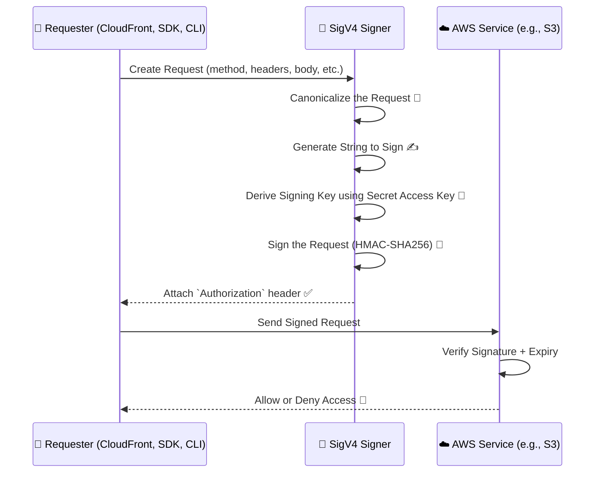

# 🛑 **Restricting S3 Bucket Access to CloudFront Only (Using Origin Access Control - OAC)**

> **OAC** is the **modern way** _(old way was OAI)_ to securely grant CloudFront access to S3 buckets **without making your bucket public**.  
> _Ensure your S3 bucket content is **served only through CloudFront**, not accessible directly over the internet._

---

## 🔐 **What Is Origin Access Control (OAC)?**

**Origin Access Control (OAC)** is the modern, more flexible replacement for Origin Access Identity (OAI). It lets **CloudFront securely access private S3 buckets** by signing requests and authenticating using IAM-style policies.

✅ Use OAC when your S3 bucket is **not a static website endpoint** (i.e., use a **REST API-style S3 bucket**).

---

## ⚙️ **How OAC Works – Behind the Scenes**

🔒 **CloudFront signs requests** to the S3 bucket on your behalf.

📜 **S3 bucket policy** allows access only if:

- The request is **signed by CloudFront**
- The request **matches the CloudFront distribution’s ARN**

❌ **No public access needed** — `Block Public Access` can stay **fully enabled**.

---

<div align="center">
  

---



</div>

---

## 🔑 **OAC Signing Behavior Options**

| Mode                        | Behavior                                                                                                 |
| --------------------------- | -------------------------------------------------------------------------------------------------------- |
| ✅ **Sign origin requests** | CloudFront **signs** each request to S3 — best for private access                                        |
| 🚫 **Do not sign requests** | CloudFront sends unsigned requests — S3 **must be public** (not recommended)                             |
| 🔄 **Pass authorization**   | CloudFront **forwards the Authorization header** from the client (used in signed URLs/cookies workflows) |

---

## 📜 **Example S3 Bucket Policy (with OAC)**

Here’s a sample policy to **allow only CloudFront** (via OAC) to get objects from the bucket:

```json
{
  "Version": "2012-10-17",
  "Statement": {
    "Sid": "AllowCloudFrontReadOnly",
    "Effect": "Allow",
    "Principal": {
      "Service": "cloudfront.amazonaws.com"
    },
    "Action": "s3:GetObject",
    "Resource": "arn:aws:s3:::my-bucket-name/*",
    "Condition": {
      "StringEquals": {
        "AWS:SourceArn": "arn:aws:cloudfront::<account-id>:distribution/<distribution-id>"
      }
    }
  }
}
```

> 📌 Replace `my-bucket-name`, `<account-id>`, and `<distribution-id>` accordingly.

---

## 📦 Sample Use Case

Let’s say you want to use CloudFront with:

- A **private S3 bucket**
- No public access at all
- Only CloudFront should access the content

### You’ll Need

1. **Create OAC in CloudFront console**
2. Attach it to your S3 Origin
3. Update the **S3 Bucket Policy** like:

```json
{
  "Version": "2012-10-17",
  "Statement": [
    {
      "Sid": "AllowCloudFrontServiceAccess",
      "Effect": "Allow",
      "Principal": {
        "Service": "cloudfront.amazonaws.com"
      },
      "Action": "s3:GetObject",
      "Resource": "arn:aws:s3:::your-bucket-name/*",
      "Condition": {
        "StringEquals": {
          "AWS:SourceArn": "arn:aws:cloudfront::YOUR-AWS-ACCOUNT-ID:distribution/YOUR-DISTRIBUTION-ID"
        }
      }
    }
  ]
}
```

> 🔐 This ensures that **only CloudFront with your specific OAC** can access the bucket.

---

## 💡 **Best Practices for OAC & CloudFront with S3**

| Best Practice                            | Why It Matters                                         |
| ---------------------------------------- | ------------------------------------------------------ |
| 🔒 **Block all public access**           | Ensures objects are **only accessible** via CloudFront |
| ✍️ **Enable request signing**            | Forces CloudFront to authenticate to S3 securely       |
| 🛡 **Avoid legacy OAI if possible**       | Use **OAC**, which is more powerful and flexible       |
| 📈 **Monitor with CloudWatch + S3 logs** | Track access patterns and potential misconfigurations  |
| 🌐 **Use HTTPS only**                    | Ensure secure communication between CloudFront and S3  |

---

## 📌 TL;DR — Quick FAQ

| ❓ Question                        | ✅ Answer                                    |
| ---------------------------------- | -------------------------------------------- |
| Does OAC use pre-signed URLs?      | ❌ No. It signs requests using SigV4 headers |
| Should S3 bucket be public?        | ❌ No. Must block all public access          |
| Who can access the S3 bucket?      | ✅ Only CloudFront using the OAC identity    |
| Is OAC needed for ALB/API origins? | ✅ Yes, OAC supports signed origin requests  |
| Is OAI still used?                 | ⚠️ Legacy only, not recommended anymore      |

---

## 🎁 **Bonus: AWS Signature Version 4 - SigV4**

### ✅ What is SigV4?

**SigV4** is AWS's method to **sign HTTP requests** using your credentials, ensuring:

- **Authentication** (you are who you say)
- **Integrity** (no tampering)
- **Authorization** (access is valid & scoped)

---

### 🔄 SigV4 Signing Workflow



---

### 🧠 Key Concepts

| Component         | Role                             |
| ----------------- | -------------------------------- |
| Canonical Request | Normalized form of HTTP request  |
| String to Sign    | SHA256-hashed payload + metadata |
| Signing Key       | Derived from your **secret key** |
| Authorization     | Header with full signature info  |

---

### 🔐 Why It’s Secure

- Uses HMAC + SHA256
- Tied to **specific date, region, service**
- Expires after short time
- **Secret key never sent**

---

### 📌 Used In

- ✅ CloudFront OAC
- ✅ S3 direct API requests
- ✅ Lambda/API Gateway
- ✅ AWS SDKs & CLI

---

### 🧭 **OAC Signing Behavior Options**

| Option                         | What It Does                                                                   |
| ------------------------------ | ------------------------------------------------------------------------------ |
| ❌ Do not sign requests        | No SigV4 → for public origins only                                             |
| ✅ Sign requests (recommended) | CloudFront adds SigV4 to origin requests                                       |
| 🔒 Do not override auth header | If a request already includes `Authorization`, don’t replace it (advanced use) |
