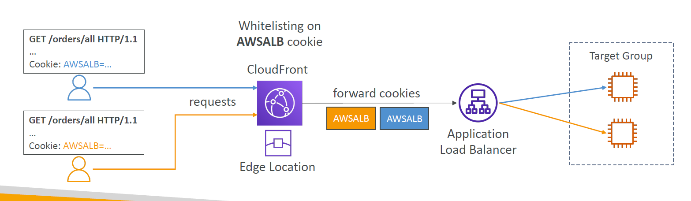
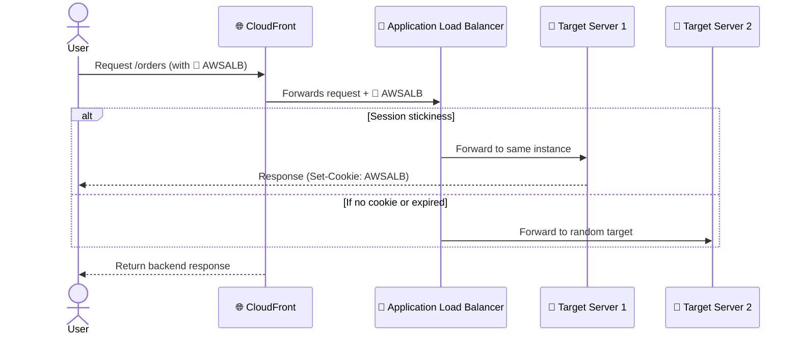

---
tags:
  - aws
  - aws/service
  - aws/domain/networking
  - aws/topic/cloud-front
aliases:
  - "CloudFront + ALB Sticky Sessions Session Affinity"
  - "Cdn Withalb Sticky Cookie"
---

# 🍪 **CloudFront + ALB Sticky Sessions (Session Affinity)**

> _Maintain user sessions across distributed edge caching while preserving backend stateful behavior._

---

<div align="center">
  
</div>

---

## 📌 What’s the Challenge?

- CloudFront is **stateless** and distributes requests across edge locations.
- But your **Application Load Balancer (ALB)** might use **session affinity** (stickiness) via the `AWSALB` cookie.
- If CloudFront doesn’t forward this cookie → stickiness fails → user bounces between targets → broken sessions.

---

## ⚙️ What Is Sticky Session (Session Affinity)?

**Sticky sessions** ensure that a user keeps interacting with the **same backend server** (target) behind an ALB, useful for:

- Logged-in users
- Shopping carts
- Multi-step forms
- Anything stateful

🧁 ALB handles this using a special cookie:

| Cookie Name | Purpose                             |
| ----------- | ----------------------------------- |
| `AWSALB`    | Classic stickiness token            |
| `AWSALBAPP` | Newer version for advanced behavior |

---

## 🧠 How CloudFront + ALB Work Together

CloudFront must **preserve the session cookie** during the entire request chain:

<div align="center">


```mermaid
sequenceDiagram
    actor User
    participant CF as 🌐 CloudFront
    participant ALB as 🔁 Application Load Balancer
    participant T1 as 🧠 Target Server 1
    participant T2 as 🧠 Target Server 2

    User->>CF: Request /orders (with 🍪 AWSALB)
    CF->>ALB: Forwards request + 🍪 AWSALB
    alt Session stickiness
        ALB->>T1: Forward to same instance
        T1-->>User: Response (Set-Cookie: AWSALB)
    else If no cookie or expired
        ALB->>T2: Forward to random target
    end
    CF-->>User: Return backend response
```

</div>

---

## 🔐 Configuring CloudFront for Sticky Sessions

To make session stickiness work **correctly**, CloudFront needs:

### ✅ Forward Cookies to ALB

- Go to **CloudFront > Behavior > Cache Policy**
- Forward **selected cookies**
- Whitelist the stickiness cookie (`AWSALB` or `AWSALBAPP`)

```json
"CookiesConfig": {
  "CookieBehavior": "whitelist",
  "Cookies": ["AWSALB"]
}
```

---

### ⏱️ Set Appropriate TTL

💡 Session cookies have an **expiration time**.

> Your **CloudFront cache TTL** must be **less than or equal to** the cookie expiration.

- Why? If CloudFront caches the response too long, it might reuse a stale cookie or bypass the ALB's intended behavior.

✅ **Recommended**:

- Set **Minimum TTL = 0**
- Set **Maximum TTL = 10–300s**
- Use **origin request policy** that forwards cookies and query strings if needed

---

## 🔍 Example Use Case

Imagine a login portal using ALB stickiness:

- User logs in and is routed to a target instance
- ALB assigns a session using `AWSALB`
- CloudFront **forwards** that cookie → keeps same target
- The user continues their session uninterrupted

Without cookie forwarding:

- 💥 CloudFront sends user to a new ALB target → session breaks

---

## ✅ Best Practices Summary

| Practice                       | Description                                    |
| ------------------------------ | ---------------------------------------------- |
| 🍪 Whitelist `AWSALB` Cookie   | Enables ALB stickiness to function             |
| ⏱️ Lower TTL                   | Avoid stale cache overriding fresh stickiness  |
| 🔐 Use Origin Request Policies | Fine-tune what CloudFront forwards to ALB      |
| 📋 Monitor Behavior via Logs   | Look for inconsistent routing or session drops |

---

## 🧪 Validation Tips

- Use browser dev tools to inspect `AWSALB` cookie
- Track target instance with custom headers for stickiness validation
- Use **CloudWatch Logs** + **ALB Target Group metrics** to observe session flow

---

## 🧠 Final Note

CloudFront can play nicely with ALB **if** you forward what matters: **cookies**.
This setup gives you **fast global caching** + **stable backend sessions**.
---

## Related Notes
- [[aws-services/3.network/3.cloud-front/6.cdn-caching-layers|CloudFront Origin Shield & Caching Layers]] - previous lesson
- [[aws-services/3.network/3.cloud-front/8.cloud-front-logs|CloudFront Access Logs]] - next lesson
- [[aws-services/1.management-governance/3.1.cloud-watch/3.1.cw-logs|Amazon CloudWatch Logs]] - mentions CloudWatch Logs

---
