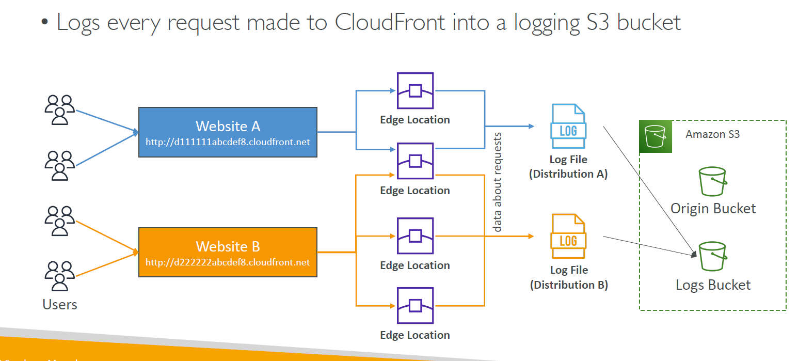
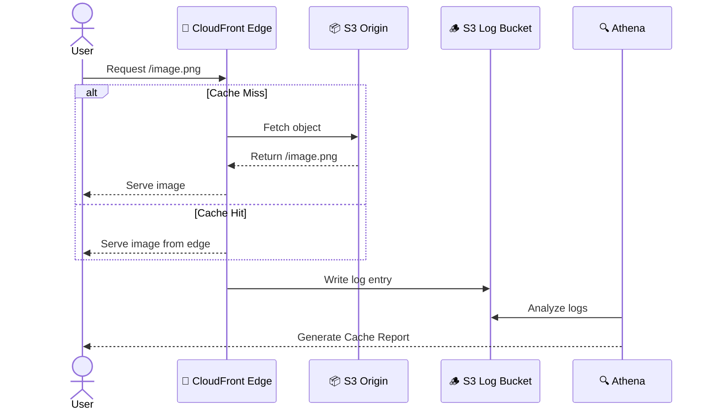

---
tags:
  - aws
  - aws/service
  - aws/domain/networking
  - aws/topic/cloud-front
aliases:
  - "CloudFront Access Logs"
  - "Cloud Front Logs"
---

# 📊 **CloudFront Access Logs**

Each request hitting CloudFront can be **logged** to an S3 bucket for full visibility.

🪵 Access Logs Include:

- Request time
- IP address
- User agent
- URL
- Edge location
- HTTP status
- Bytes served
- Referrer

---

## 📁 Access Log Flow (Visual)

<div align="center">
  
</div>

> Each distribution (A/B/...) logs independently into your **Logs S3 Bucket**.

---

## 📈 **CloudFront Reports via Access Logs**

Use **Amazon Athena**, **AWS Glue**, or **QuickSight** to generate meaningful insights.

| Report Type         | Insights You Gain                              |
| ------------------- | ---------------------------------------------- |
| 🧊 Cache Statistics | Hit/miss ratio, TTL effectiveness              |
| 📈 Popular Objects  | Top requested files, optimize caching          |
| 🔗 Top Referrers    | Who's sending traffic                          |
| 👀 Viewer Report    | IPs, countries, devices                        |
| ⚙️ Usage Reports    | Bandwidth, number of requests by time/location |

---

## 🔍 **Troubleshooting CloudFront with Logs**

> Logs are gold when it comes to debugging! 💡

### 🔎 Example Scenario: 403 Forbidden

- 🔍 Logs show:

  ```ini
  403 error, S3 origin, no referrer, user-agent: curl/7.54.0
  ```

- 🛠️ Fix:

  - Check S3 bucket policy or object ACLs
  - Make sure CloudFront **Origin Access Control (OAC)** or OAI is configured properly

### 🔎 Example Scenario: Cache Misses Too High

- Investigate `Cache-Control`, `Expires`, and query string parameters
- Use **Lambda\@Edge** to normalize headers/URLs if needed

---

## 🧪 Real Example: Log & Report Flow

<div align="center">


```mermaid
sequenceDiagram
    actor User
    participant CF as 🧊 CloudFront Edge
    participant S3 as 📦 S3 Origin
    participant Logs as 🪵 S3 Log Bucket
    participant Athena as 🔍 Athena

    User->>CF: Request /image.png
    alt Cache Miss
        CF->>S3: Fetch object
        S3-->>CF: Return /image.png
        CF-->>User: Serve image
    else Cache Hit
        CF-->>User: Serve image from edge
    end
    CF->>Logs: Write log entry
    Athena->>Logs: Analyze logs
    Athena-->>User: Generate Cache Report
```

</div>

---

## 📝 Best Practices for CloudFront Logging

- ✅ **Enable Access Logs** for critical distributions
- ✅ Store logs in **separate S3 bucket** from content
- ✅ Use **Athena** to query logs with SQL
- ✅ Set **Error TTLs** for fast recovery
- ✅ Use **cache policies** to define TTL, header/query string behavior

---

## 🔐 Bonus: Secure CloudFront Logs

- Apply **S3 Bucket Policies** to prevent public access
- Use **Object Lock** for compliance (immutability)
- Enable **default encryption** (SSE-S3 or SSE-KMS)
---

## Related Notes
- [[aws-services/3.network/3.cloud-front/7.cdn-withalb-sticky-cookie|CloudFront + ALB Sticky Sessions Session Affinity]] - previous lesson
- [[aws-services/3.network/3.cloud-front/9.cloudfront-pricing|CloudFront - Monitoring Logs Access Classes & Pricing]] - next lesson
- [[aws-services/4.storage/1.s3/2.5.encryption|Amazon S3 Encryption]] - mentions Encryption
- [[aws-services/11.analytics/quicksight/1.1.quicksight|Amazon QuickSight A Serverless BI Tool for Scalable and Interactive Dashboards]] - mentions Quicksight
- [[aws-services/11.analytics/athena/1.2.athena|AWS Athena Your Serverless SQL Tool for S3 Analytics Made Simple]] - mentions Athena

---
