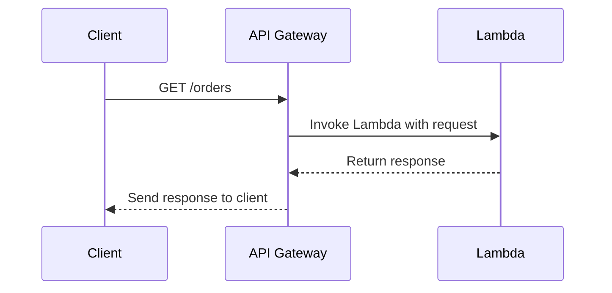
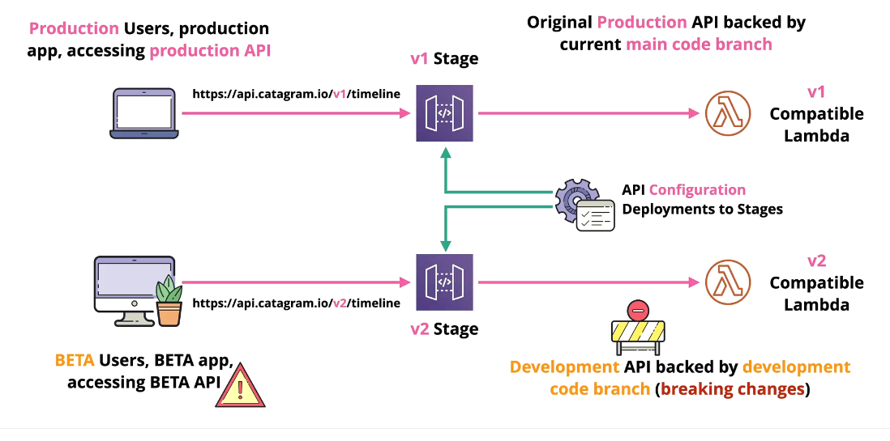
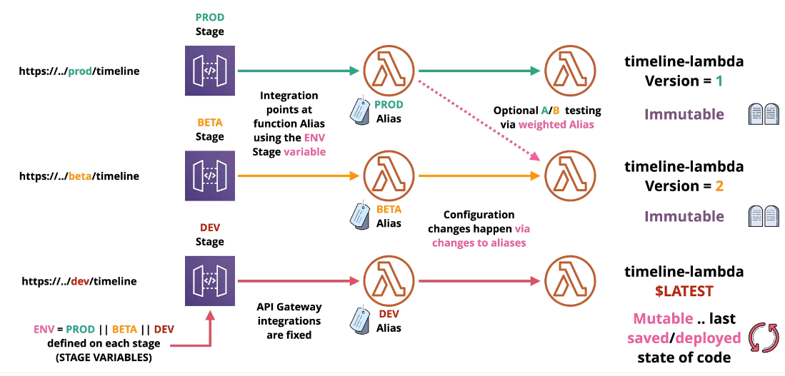

# 🚪 **AWS API Gateway**

> **Amazon API Gateway** is your app’s **front door**. It receives API calls from your users and **routes them** to the correct backend — AWS Lambda, HTTP service, or even other AWS services.

You can create **REST APIs**, **HTTP APIs**, or **WebSocket APIs**, but we’ll focus on **REST APIs**, which are most common and full-featured.

---

<div style="text-align: center;">
    
</div>

---

## 🧱 **1. Core Concepts of API Gateway**

<div align="center" >

| Component             | Description                                                           |
| --------------------- | --------------------------------------------------------------------- |
| 🔗 **Resource**       | A path like `/users`, `/orders`                                       |
| ⚙️ **Method**         | What happens when someone calls `GET`, `POST`, `DELETE` on a resource |
| 🎯 **Integration**    | Where to send the request (Lambda, HTTP endpoint, AWS service, etc.)  |
| 🔐 **Authorization**  | Who can access this method (IAM, Cognito, Lambda Auth)                |
| 🔄 **Deployment**     | A saved version of your API (like a release)                          |
| 🚦 **Stage**          | Where you deploy the API (like `dev`, `test`, `prod`)                 |
| 🧪 **Stage Variable** | Environment-specific key/value pair used in integration               |

</div>

---

## 📐 **2. How a Request Flows in API Gateway**

<div align="center">



</div>

---

## 🏗️ **3. Creating a REST API (Steps)**

You can do this from the **AWS Console**, **AWS CLI**, or **CloudFormation**, but here’s the logical flow:

### ✅ Step-by-Step

1. **Create an API** – Give it a name (e.g., `my-api`)
2. **Add Resources** – `/users`, `/orders`, etc.
3. **Add Methods** – For each resource, define what happens on `GET`, `POST`, etc.
4. **Choose Integration** – Lambda, HTTP endpoint, AWS service
5. **Set Authorization** – IAM, Cognito, or none
6. **Deploy to a Stage** – e.g., `dev`, `prod`
7. **Test your endpoint!** 🔥

---

### 📌 Example URL

```text
https://abc123.execute-api.us-east-1.amazonaws.com/dev/orders
```

Here’s what’s happening:

- `abc123` is your API Gateway ID
- `us-east-1` is your region
- `dev` is your **stage**
- `/orders` is your **resource**

---

## 🚦 **4. What Is a Stage?**

A **Stage** is like an environment (similar to dev/staging/prod).

| Stage Name | Purpose                     |
| ---------- | --------------------------- |
| `dev`      | Testing new changes         |
| `test`     | QA environment              |
| `prod`     | Real users use this version |

Each stage has:

- A **URL** (unique for the stage)
- A **deployment** (frozen copy of your API)
- Its own **throttling**, **logging**, and **stage variables**

> ⚠️ When you make changes to your API, they don’t go live until you **deploy to a stage**

---

## 📤 **5. What Is a Deployment?**

> A **deployment** is a **snapshot** of your current API config.  
> Think of deployments like Git commits, and stages like Git branches.

---

<div style="text-align: center;">
    
</div>

---

To make changes go live:

- You must **create a deployment**
- Then **associate it with a stage**

---

## 🧪 **6. What Are Stage Variables?**

> Stage Variables = **environment-specific config** (like `.env` values)

---

<div style="text-align: center;">
    
</div>

---

You define them as key/value pairs **per stage**.

| Variable Name    | Example Value                 |
| ---------------- | ----------------------------- |
| `lambdaAlias`    | `DEV` or `PROD`               |
| `backendBaseUrl` | `https://api.dev.company.com` |

---

### 🔧 How Do You Use Them?

In your **Lambda integration URI**:

```text
arn:aws:lambda:us-east-1:123456789012:function:MyLambda:${stageVariables.lambdaAlias}
```

In your **mapping templates**:

```json
{
  "env": "$stageVariables.environment",
  "token": "$input.params('token')"
}
```

> ✅ This way, the **same API** works differently per stage — without duplication.

---

## 🧪 **7. Real Example**

Let’s say:

- You have a Lambda called `OrderProcessor`
- You publish versioned aliases: `DEV`, `PROD`, `V1`
- Your API Gateway has 2 stages:

  - `dev` → uses alias `DEV`
  - `prod` → uses alias `PROD`

### ✅ Setup

- In stage `dev`, create variable `lambdaAlias=DEV`
- In stage `prod`, set `lambdaAlias=PROD`
- Integration URI:

  ```ini
  arn:aws:lambda:us-east-1:123:function:OrderProcessor:${stageVariables.lambdaAlias}
  ```

Now each stage automatically routes to the right Lambda version.

---

## 🧪 **8. Example CLI: Create Deployment and Stage Variables**

```bash
aws apigateway create-deployment \
  --rest-api-id abc123 \
  --stage-name prod \
  --stage-variables lambdaAlias=PROD env=production \
  --description "Deploy v1 to production"
```

---

## 🛑 **Without Deployment & Stages = Nothing Works!**

> People often forget this:
> **Just editing your API doesn't make it live. You MUST deploy it to a stage.**

---

## ✅ Summary: What You Now Know

| Concept                | You Understand                                     |
| ---------------------- | -------------------------------------------------- |
| What is API Gateway    | A front door for your backend services             |
| How to create an API   | Via console or CLI, add resources and methods      |
| What is a stage        | Environment/version for your API deployment        |
| Why deployment matters | Freezes your changes into something runnable       |
| Stage variables        | Like `.env` for your API — inject config per stage |
| Lambda + alias + stage | Lets you control which Lambda version runs         |
