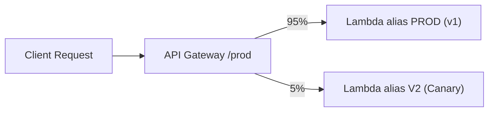
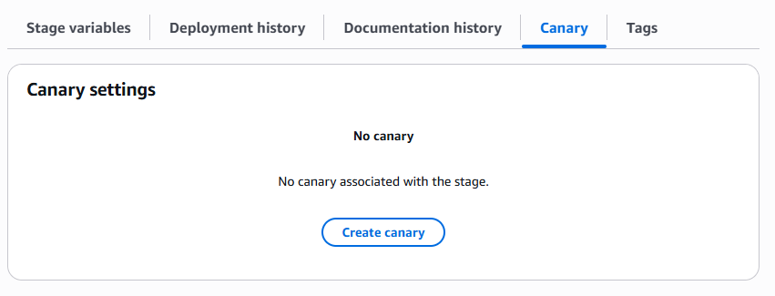
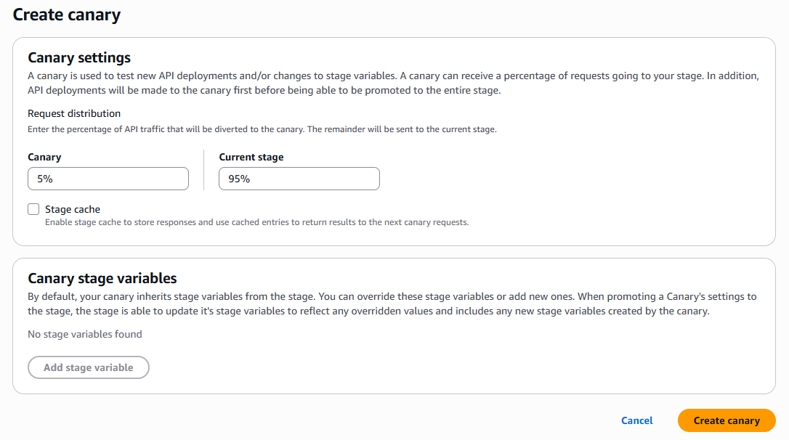
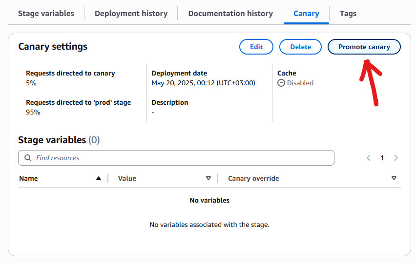
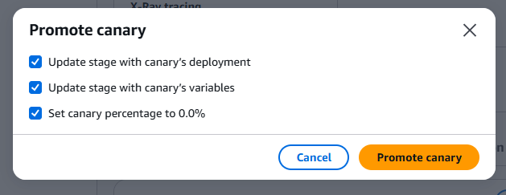
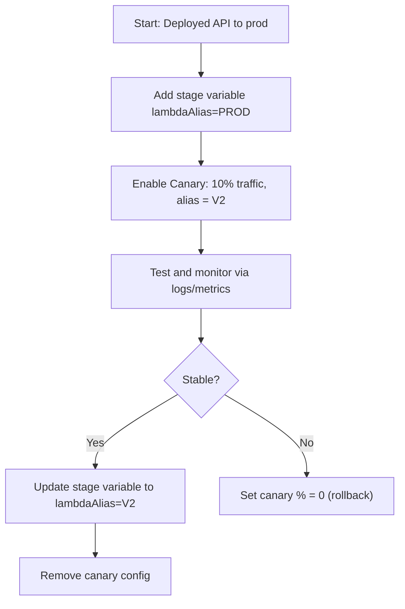

# 🐦 **API Gateway Canary Deployment – Full Guide**

> **Canary deployments** let you **safely test a new Lambda version** or backend behind your API by routing only a **small percentage of traffic** to it first.

This is a **zero-downtime deployment strategy** — ideal for production environments where you want to **avoid breaking everything**.

---

## 🧠 What Is a Canary Deployment?

> “Let’s send just 5% of our users to the new version. If it works fine, we’ll slowly increase traffic. If it fails, we roll back — safely.”

✅ Canary = Small portion of traffic  
✅ Control who sees the new code  
✅ Monitor errors, latency, logs before going full release

---

## 🏗️ How API Gateway Canary Works (Under the Hood)

<div style="text-align: center;">



</div>

---

### You have

- A **REST API Gateway stage** (e.g. `prod`)
- A Lambda function with **multiple versions** (`v1`, `v2`)
- **Stage variable** (like `lambdaAlias`) that resolves to a Lambda alias

### Then you

- Assign **95% of traffic** to stable alias (e.g., `PROD`)
- Assign **5% to Canary alias** (e.g., `V2`)

---

## 🔁 Canary vs Traditional Deployment

| Strategy             | Risk             | Visibility | Rollback Speed | Metrics                  |
| -------------------- | ---------------- | ---------- | -------------- | ------------------------ |
| Replace 100% at once | 🔥🔥🔥 High      | ❌ Low     | ⚠️ Slow        | ❌ None                  |
| Canary deployment    | ✅ Very low risk | ✅ High    | 🔄 Instant     | ✅ Separate logs/metrics |

---

## 🧪 Real-World Use Case

- You're deploying `OrderProcessor v2` (new Lambda)
- You want to test it with real users **without affecting most traffic**
- Setup canary: `prod` stage → 5% traffic → `v2`, 95% → `v1`
- Monitor: errors, latency, duration logs
- If stable → increase to 100%. If bad → set to 0% instantly.

---

## 🛠️ How to Set Up a Canary Deployment

### ✅ Requirements

- You must use **Lambda Aliases**
- You must use **Stage Variables** (to dynamically pick alias)

---

### 🎮 Console Setup (Step-by-Step)

1. Go to **API Gateway → Your REST API**
2. Click **Stages → prod**
3. Go to the **“Canary” tab**
4. Enable **Canary Settings**
5. Set:

   - **Percent traffic to canary**: 5%
   - **Override stage variables**:

     - `lambdaAlias = V2`

6. Save and deploy

> ✅ Canary now routes 5% to alias `V2`, and 95% to whatever `prod` uses (`PROD` alias)

---

<div style="text-align: center;">
    
</div>
<div style="text-align: center;">
    
</div>

---

## 🤔**When Does Canary Deployment "Start Working"?**

> As soon as you **enable canary on a deployed stage**, the routing starts immediately.

### Example

1. You already deployed your API to `prod` stage

2. `prod` stage is configured to invoke:

   ```bash
   arn:aws:lambda:us-east-1:123:function:MyLambda:${stageVariables.lambdaAlias}
   ```

3. You add:

   - `lambdaAlias = PROD` (in stage variables)
   - **Enable Canary** with:

     - 10% traffic
     - Canary override: `lambdaAlias = V2`

🎯 Now, every time someone calls:

```ini
https://abc123.execute-api.us-east-1.amazonaws.com/prod/orders
```

→ **90%** of traffic will use `PROD` alias
→ **10%** of traffic will use `V2` alias
📌 **This happens immediately after you save the canary settings** (no need to redeploy)

---

### 🧪 **Real Scenario – Canary Rollout**

Let’s say:

- You have a Lambda `MyLambda` with 3 versions:

  - `v1` (alias: `PROD`)
  - `v2` (alias: `V2`)

#### Step 1 – Create Stage with Stable Alias

```yaml
Stage: prod
StageVariable: lambdaAlias = PROD
```

→ All traffic goes to `PROD` alias (Lambda v1)

---

#### Step 2 – Enable Canary

- Traffic split: `90%` → PROD, `10%` → V2
- Canary stage variable override: `lambdaAlias = V2`

✅ Canary kicks in immediately
✅ Monitor logs, errors, latency in CloudWatch (separate logs)

---

## 🤔 **How to Promote Canary to Full Production (100%)**

Once you’re confident `V2` is working perfectly… you want to make it **the new stable backend**.

There are **2 options**:

---

### 🔁 **Option 1: Shift 100% Traffic to Canary (Temporary Promotion)**

You can update canary settings to:

```yaml
Canary %: 100%
Override lambdaAlias: V2
```

But this still **keeps your original `lambdaAlias = PROD` in stage variables**, so it’s a temporary redirect.

⚠️ Canary overrides are meant to be temporary/test paths.

---

### 🏁 **Option 2: Make V2 the new default and REMOVE canary**

✅ This is the **clean and final promotion**:

#### 1️⃣ Change the `prod` stage variable to

```yaml
lambdaAlias = V2
```

Now, your `prod` stage permanently uses the new version.

#### 2️⃣ Delete/disable the canary config

- Set traffic weight back to `0`
- Or remove canary overrides altogether

```bash
aws apigateway update-stage \
  --rest-api-id abc123 \
  --stage-name prod \
  --patch-operations op=remove,path=/canarySettings
```

🎉 Done — **100% traffic now uses V2 by default**, with **no canary** involved.

---

### 🎁 **Option 2: From Console with Single Button**

<div style="text-align: center;">
    
</div>

<div style="text-align: center;">
    
</div>

---

## 📘 Real Example – CLI Flow

Let’s assume:

- REST API ID = `abc123`
- Stage = `prod`

### ✅ Enable canary with 10%

```bash
aws apigateway update-stage \
  --rest-api-id abc123 \
  --stage-name prod \
  --patch-operations op=replace,path=/canarySettings/percentTraffic,value=0.1

aws apigateway update-stage \
  --rest-api-id abc123 \
  --stage-name prod \
  --patch-operations op=replace,path=/canarySettings/stageVariableOverrides/lambdaAlias,value=V2
```

Test it. Monitor it.

---

### ✅ Promote Canary to Default

```bash
# 1. Change stage variable to point to V2 permanently
aws apigateway update-stage \
  --rest-api-id abc123 \
  --stage-name prod \
  --patch-operations op=replace,path=/variables/lambdaAlias,value=V2

# 2. Remove canary completely
aws apigateway update-stage \
  --rest-api-id abc123 \
  --stage-name prod \
  --patch-operations op=remove,path=/canarySettings
```

Now, Canary is removed, and `prod` routes 100% to `V2`.

---

## ✅ Summary – Clear Flow

<div style="text-align: center;">



</div>
