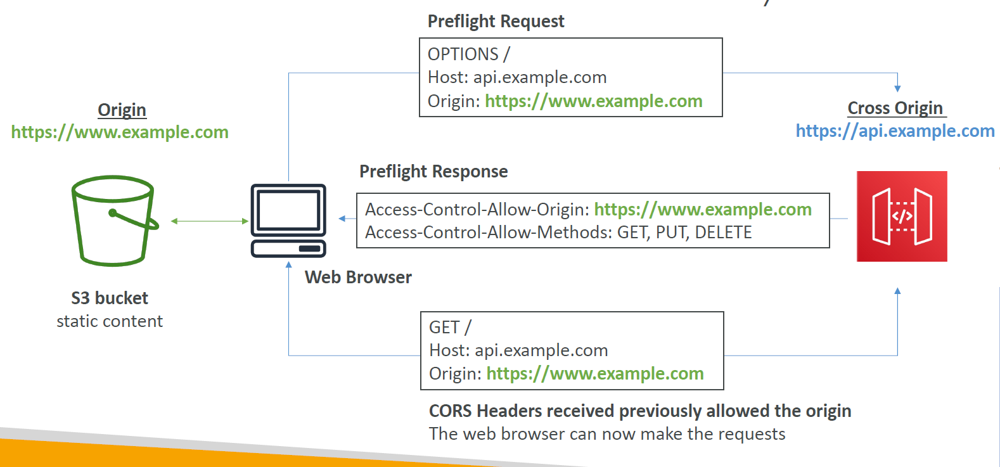

# 🌐🔓 **AWS API Gateway – CORS (Cross-Origin Resource Sharing)**

> **CORS (Cross-Origin Resource Sharing)** is a security feature implemented by browsers that blocks requests made from **one domain to another** unless explicitly allowed.

---

    

---

## ❓ Why CORS Matters

When your **frontend app (e.g. `https://myapp.com`)** tries to call an API hosted at **`https://api.mybackend.com`**, the browser blocks it **unless the backend allows it via CORS headers**.

---

## 📤 What Happens Behind the Scenes

Before sending the actual API request, the browser sends a **pre-flight OPTIONS request** asking:

> “Hey API, can I call you from this origin with these headers and methods?”

✅ If the API responds with the proper **CORS headers**, the browser proceeds.  
❌ If not, the browser blocks the call.

---

## 📦 Required CORS Headers (in OPTIONS response)

| Header                         | Purpose                               |
| ------------------------------ | ------------------------------------- |
| `Access-Control-Allow-Origin`  | Specifies which domains are allowed   |
| `Access-Control-Allow-Methods` | Allowed HTTP methods (e.g. GET, POST) |
| `Access-Control-Allow-Headers` | Allowed headers in the actual request |

---

## 🛠️ How to Enable CORS in API Gateway (Console)

1. Go to **API Gateway → Resources → \[Your Method]**
2. Click **Actions → Enable CORS**
3. It will:

   - Add an **OPTIONS method**
   - Add the necessary **response headers**
   - Deploy changes (you must redeploy stage)

---

## ✅ Summary

| Feature                   | Description                                   |
| ------------------------- | --------------------------------------------- |
| When needed               | Calling API from a **different domain**       |
| Handled by                | **Browser** (not the API client or backend)   |
| Configured in API Gateway | Via **Enable CORS** in console (adds OPTIONS) |
| Pre-flight method         | Sends `OPTIONS` request with required headers |
