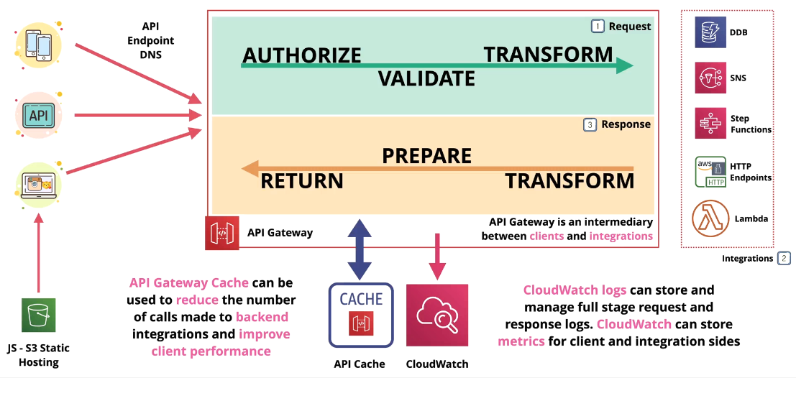
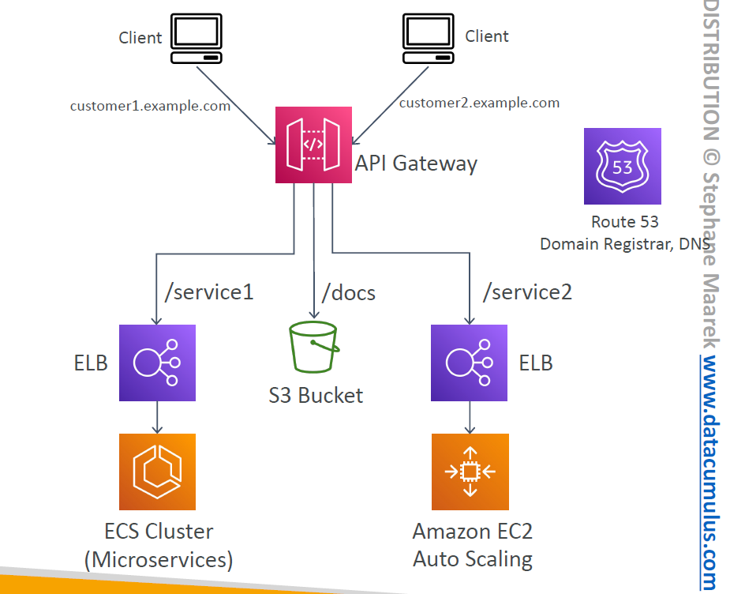
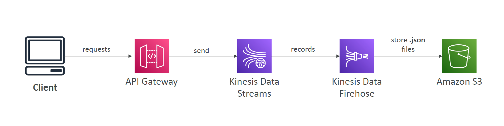

# 🚪 **AWS API Gateway – The Front Door for Your APIs**

> **Amazon API Gateway** is a **fully managed service** that lets you **create, publish, maintain, secure, and monitor APIs** at scale.  
> It acts as the **entry point** for frontend clients to access **backend services**, including AWS Lambda, EC2, SQS, Step Functions, and more.

---

<div style="text-align: center;">
    
</div>

---

## 🧠 Why Use API Gateway?

| Benefit                       | Description                                                   |
| ----------------------------- | ------------------------------------------------------------- |
| 🚫 No Infra Needed            | Integrates directly with Lambda — serverless from end to end  |
| 🌍 Global Distribution        | Supports edge-optimized delivery via CloudFront               |
| 🔁 Request/Response Transform | Modify payloads before reaching backend                       |
| 🧪 Versioning & Environments  | Manage `/v1`, `/v2`, `dev`, `prod` routes cleanly             |
| 🔐 Auth & Rate Limits         | Built-in throttling, IAM auth, API keys, Cognito              |
| ⚡ Performance                | Enable **response caching** to reduce load and latency        |
| 📚 Swagger/OpenAPI Support    | Import/export API definitions with a single file              |
| 🧰 SDK Generator              | Generate SDKs (JavaScript, iOS, Android) to consume your APIs |

---

## 🛠️ Core Integrations (High-Level)

| Integration Type   | Use Case Example                                   | Why Use It?                                          |
| ------------------ | -------------------------------------------------- | ---------------------------------------------------- |
| 🔧 **Lambda**      | REST API over AWS Lambda                           | Fully serverless; no infrastructure to manage        |
| 🌐 **HTTP**        | On-premise or internal HTTP endpoints              | Add rate limiting, caching, or authentication layers |
| 🧰 **AWS Service** | Start Step Function, publish to SQS, call DynamoDB | Expose AWS services as APIs securely + publicly      |

---

## 🧪 AWS Service Integration Example

### ❄️ Single interface for all the microservices in your company

<div style="text-align: center;">
    
</div>

---

> Create a single interface for all the microservices in your company  
> Use API endpoints with various resources  
> Apply a simple domain name and SSL certificates  
> Can apply forwarding and transformation rules at the API Gateway level

### 🌀 **Ex: Stream Ingestion Endpoint for Kinesis**

<div style="text-align: center;">
    
</div>

---

> API Gateway → AWS Service Integration → Kinesis `PutRecord`  
> Adds **auth**, **rate control**, **monitoring**, and **CORS** to raw AWS APIs

---

```json
{
  "integration": {
    "type": "AWS",
    "uri": "arn:aws:apigateway:region:kinesis:action/PutRecord",
    ...
  }
}
```

> ✅ Easier than exposing AWS APIs directly
> ✅ Ideal for SQS, SNS, Step Functions, DynamoDB, Kinesis

---

## 🔗 Endpoint Types

| Endpoint Type         | Description                                                               |
| --------------------- | ------------------------------------------------------------------------- |
| 🌎 **Edge-Optimized** | Default – Uses CloudFront for **global clients**; API Gateway in 1 region |
| 🧭 **Regional**       | For **regional use**; can manually attach CloudFront if needed            |
| 🔒 **Private**        | Accessible **only from within a VPC** via Interface VPC Endpoint (ENI)    |

📌 **Certificate Tip:**

- **Edge-Optimized** → ACM cert must be in **`us-east-1`**
- **Regional** → ACM cert must be in the **same region as API Gateway**

---

## 🔐 Security Options

| Security Option              | Use Case                               | Notes                             |
| ---------------------------- | -------------------------------------- | --------------------------------- |
| 🔐 **IAM Roles**             | Internal microservices or AWS clients  | Signed AWS requests               |
| 👥 **Cognito User Pools**    | Mobile/web users                       | External identity provider + auth |
| 🧠 **Custom Authorizers**    | Your own auth logic (JWT, OAuth, etc.) | Lambda-based; more flexibility    |
| 🔒 **Custom Domain + HTTPS** | Use your own domain name securely      | Requires Route 53 + ACM cert      |

---

## 🔧 API Design Features

| Feature                         | Description                                                           |
| ------------------------------- | --------------------------------------------------------------------- |
| 📁 **Versioning**               | Define `/v1`, `/v2`, etc. using stage variables or path-based routing |
| 🌍 **Environments**             | Use stages like `dev`, `test`, `prod`                                 |
| 💾 **Caching**                  | Cache API responses (per method/stage) to improve latency             |
| 🔑 **API Keys & Usage Plans**   | Issue keys, track usage, apply throttling and quotas                  |
| 🔁 **Request/Response Mapping** | Transform headers, paths, and body to match backend expectations      |
| ✅ **Validation Rules**         | Validate inputs using request models or schema checks                 |
| 📚 **Swagger/OpenAPI Import**   | Define APIs declaratively with OpenAPI 3.0                            |
| 📦 **SDK Generation**           | Generate client SDKs (JS, Android, iOS) for consuming your API        |

---

## 🌐 WebSocket Support

> API Gateway supports **stateful WebSocket APIs** for real-time apps like:

- 📲 Chat applications
- 📈 Live dashboards
- 📡 Event-driven microservices

Handles routing via **Route Selection Expressions** and **connection management** through Lambda or DynamoDB.

---

## 🎯 Common Use Case Patterns

| Scenario                            | How API Gateway Helps                                       |
| ----------------------------------- | ----------------------------------------------------------- |
| Serverless backend for mobile app   | API Gateway + Lambda + Cognito                              |
| Secure public API with throttling   | Custom Domain + Usage Plan + IAM or Cognito                 |
| Call on-prem backend from frontend  | API Gateway → HTTP integration                              |
| Trigger Step Function from frontend | API Gateway → AWS Service Integration                       |
| RPC-like pattern over WebSockets    | Use API Gateway WebSocket APIs                              |
| Event ingestion into Kinesis        | API Gateway → AWS Service → Kinesis (secure & rate-limited) |

---

## ✅ Summary

| Feature                | Supported? |
| ---------------------- | ---------- |
| REST + WebSocket APIs  | ✅ Yes     |
| Lambda integration     | ✅ Yes     |
| HTTP & AWS backend     | ✅ Yes     |
| Caching & Throttling   | ✅ Yes     |
| Auth (IAM, Cognito…)   | ✅ Yes     |
| SDK Generation         | ✅ Yes     |
| Swagger/OpenAPI Import | ✅ Yes     |
