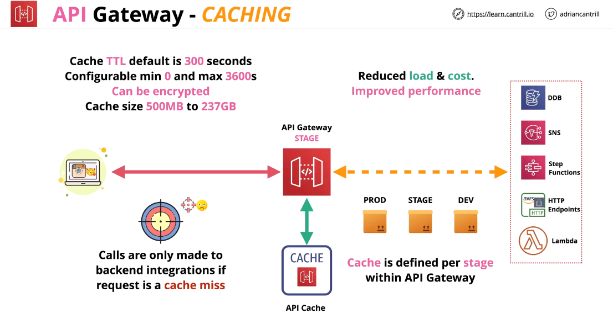
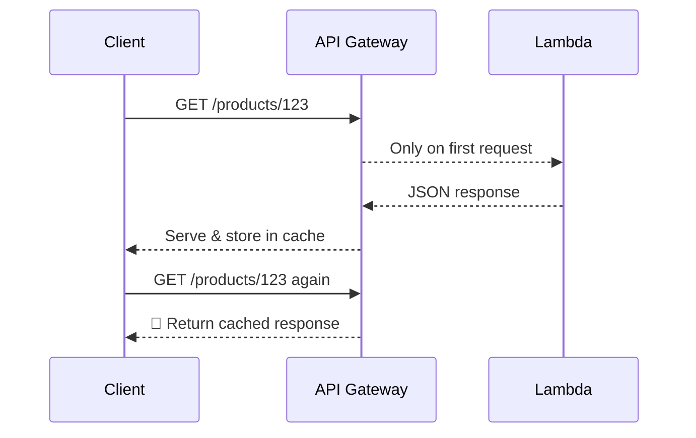

# ⚡ **Amazon API Gateway – Caching**

> **API Gateway Caching** allows you to **store API responses temporarily** at the **stage level**, so repeated requests can be **served from the cache** instead of hitting your backend every time.  
> This boosts performance, reduces cost, and improves scalability — especially in production.

---

<div style="text-align: center;">
    
</div>

---

## 🚀 **What Does API Gateway Cache Do?**

✅ It stores **responses** for a given request (e.g., a `GET /products/123`)
✅ On repeated calls with the same parameters, it returns the **cached response**
✅ No Lambda invocation or backend processing is needed

---

## 📦 **Key Cache Features**

| Setting                    | Description                                                    |
| -------------------------- | -------------------------------------------------------------- |
| ✅ **Per Stage**           | Cache is defined at the **stage level** (e.g., `/prod`)        |
| ⚙️ **Per Method Override** | You can override TTL/cache per method (e.g., `/products/{id}`) |
| 🕒 **TTL (Time to Live)**  | Default: **300 seconds** (range: 0s to 3600s)                  |
| 🔐 **Encryption**          | Optional — encrypts cached data at rest                        |
| 💾 **Capacity Range**      | Between **0.5 GB to 237 GB** (scalable)                        |
| 💸 **Cost**                | It’s paid and **should be used mostly in production**          |

---

## 🔁 **How Caching Works – Behind the Scenes**

<div align="center">



</div>

> 👉 The cache key is based on **method + query/path params + headers**  
> 👉 If anything differs → it’s a **cache miss**

---

## 🎮 **How to Enable Caching (Console)**

1. Go to **API Gateway → Stages → \[Your Stage]**
2. Scroll to **Cache Settings**
3. Enable **Caching**
4. Set **TTL**, size, encryption if needed
5. (Optional) Go to **Method Request** and override per-method settings

---

## 🧪 Example Use Case – Caching a Product Endpoint

- Endpoint: `GET /products/{id}`
- Cache TTL: `300` seconds
- If `/products/123` is called multiple times → only the first hits the backend
- All others (within 5 minutes) are **served instantly**

---

## 🧼 **Cache Invalidation (How to Clear Cache)**

Sometimes you need to refresh the cache when:

- Data has changed
- You deployed a new version
- You want immediate consistency

### ✅ 3 Ways to Invalidate Cache

| Method                             | Description                                   |
| ---------------------------------- | --------------------------------------------- |
| 🔁 **Manual flush** (console/CLI)  | Clear all cached responses instantly          |
| 🧠 **Header-based invalidation**   | Clients send: `Cache-Control: max-age=0`      |
| 🔐 **IAM-controlled invalidation** | You can **restrict who can invalidate cache** |

---

### 🔐 Example: Secure Header-Based Invalidation

To **allow clients to clear cache with a header**, you must:

- Add `Cache-Control` header
- Check the box **"Require authorization for cache invalidation"**
- Ensure the client has this IAM permission:

  ```json
  "apigateway:InvalidateCache"
  ```

📌 If you **don’t enforce it**, **any client can flush the cache**, which could be abused.

---

## ✅ Best Practices

| Practice                            | Why?                                    |
| ----------------------------------- | --------------------------------------- |
| Use in **production only**          | It costs more and adds complexity       |
| Use on **GET/HEAD methods only**    | Caching `POST`/`PUT` doesn't make sense |
| Cache only **read-heavy** endpoints | Maximize performance gains              |
| Monitor **cache hit rate**          | Find out if caching is helping          |
| Enable **encryption** if needed     | For sensitive cached data               |
